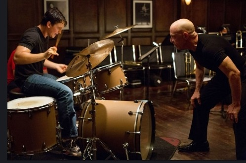
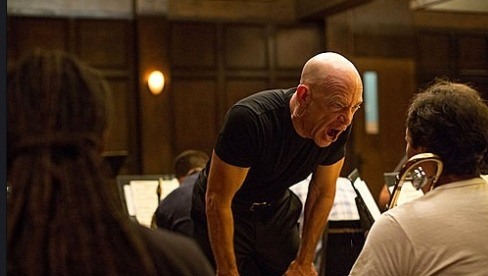
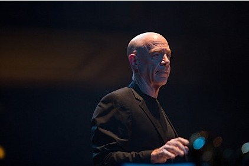
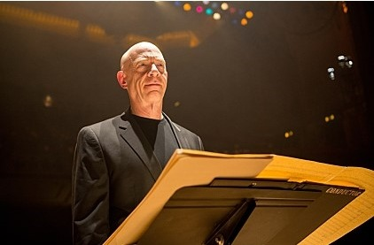
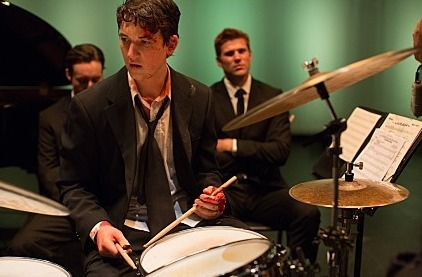

  
앤드류를 다그치는 플렛처

  
악단원에게 악을 쓰는 플렛처

  
지휘 중인 플렛처

영혼을 저미는 자학의 망치질, 허무로 끝난 전율

-영화 ‘위플래쉬(whiplash)’를 보고-

                   조규익

아내의 손에 이끌려 나간 극장 한 구석. 수영을 마친 후의 노곤함을 어둠 속의 단잠으로나 풀어볼까 하고 푹신한 의자에 몸 전체를 맡긴 채 두 다리를 뻗었다. 그 순간, 귀를 찢는 드럼 소리. 그리고 반들거리는 머리통과 형형한 눈빛의 늙은 터프가이. 고약하게도 고것들이 내 잠의 싹을 싹둑 잘라 버렸다. 첫 장면에서 나는 드럼을 사이에 둔 두 미치광이, 음악교수 플렛처(Fletcher)[J.K.Simmons 분]와 그의 제자 앤드류(Andrew)[Miles Teller  분]를 만난 것이다. 닫으려는 눈과 마음을 사정없이 두드려대는 두 시간 동안 잔인한 긴장과 전율 속에 떨어야 했다.

TV를 통해서였는가. 언제인지 기억도 가물가물하지만, 며칠 밤낮 가마에 구워낸 수십 개의 도자기를 깨버리는 장인의 엄숙한 낯빛을 본 적이 있다. ‘깨어져 나가는 도자기의 단말마 소리가 정신의 결을 저리도 시퍼렇게 벼리는구나!’라는 깨달음을 그 장인의 눈빛에서 얻은 적이 있다. 내려치는 도공의 망치 언저리엔 칼날보다 날카로운 서슬이 서릿발처럼 일어서고 있었다.

보아하니 한두 번 깬 망치질이 아니었다. 자신의 실수나 어리석음을 용납하지 못하는 수도자의 자세가 그 속엔 깃들어 있었다. 자신의 심장과 영혼을 한없이 저미는 자학의 망치질이었으나, 심장과 영혼이 한 점 한 점 저며져 날리는 듯 미세한 조각들은 눈빛에서 비쳐나는 광기를 더욱 날카롭고 엄숙하게 갈아대는 것이었다. 단 하나의 그릇을 남겨 놓더라도 제대로 된 것 아니면 모두 때려 부수리라! 아마 그는 그런 심산이었을 것이다.

내 평생 인간의 행위에서 비장함과 숭고함을 느낀 것은 그 때가 처음이었다. 내 마음으로 해석된 그의 모습은 참 슬프게도 멋져 보였다. 그 ‘슬프게 멋진 모습’을 다시 한 번 해석한 결과는 ‘프로정신’이었다. 그 때부터 나는 소박한 꿈 하나를 마음속에 갖게 되었다. 무엇을 해서 밥을 먹고 살든 저 정도의 ‘프로정신’으로 살리라. 그러나 언제부턴가 적당한 이유를 붙여 깨지고 금가고 뭉그러진 도자기도 품에 안게 되었다. 내 자신과 타협한 뒤 그 원칙을 스스로 깨버린 채, ‘좋은 게 좋다’는 편안함에 매몰되어 취한 듯 살아왔다. ‘그만 하면 잘 했어!’라는 도취(陶醉)의 잣대로 나 자신을, 내 제자들을 대하며 살아오게 된 것이다. 

앤드류를 발견한 플렛처 교수. “세상에서 가장 쓸 데 없는 말이 ‘그만 하면 잘했어’야!”라고 소리치는 그는 세상 사람들의 기준으로 보면 ‘완벽 추구’의 광기에 사로잡힌 악한이었다. 천재 드러머의 소질을 지닌 앤드류도 그에겐 사랑스런 제자이기 전에 그 광기로 다듬어 최고의 연주자로 만들어야 할 ‘미완의 대상’일 뿐이었다. 앤드류 역시 그의 광기에 전염되어 그를 제압하려는 욕망을 내 보인, 또 다른 광기의 소유자였다.

광기와 광기가 맞부딪쳐 좌절하는 듯하지만, 결국 앤드류는 ‘최고의 물건’이 되고 만다. 최고의 물건이 되는 데서 영화는 끝나지만, 관객들에게 남겨진 긴긴 여운. 감독이 노린 건 바로 그것이다. 관객들은 다들 저마다 두 광인(狂人)의 미래를 점치고 해석하는 데 당분간 몰두하리라. 해석의 짐을 관객들에게 넘긴 감독. 어쩌면 감독의 능력은 거기까지일 것이다.

\*\*\*

영화가 끝나기 직전까지 전율에 떨었다. 영화 내내 울려 퍼지는 드럼소리와 심벌즈의 파찰음 때문만이 아니었다. 영화 내내 플렛처가 크레센도(crescendo)로 끌어올리는 광기는 내 피를 덥혀 주고 생기를 불어넣는 마약이었다. 내가 그에게서 경험한 전율은 행복한 흥분이었다. 그래서 내게 플렛처는 결코 악한이 아니었다. 악한 아닌 그가 저지르는 위악(僞惡). 내게 그는 최고를 위해 멀쩡한 도자기들을 망치로 때려 부수는 도공이었다. 비로소 나는 나를 떠나간 도공을 화면으로 재회한 것이다. 앤드류가 최고의 명성을 누리는 연주가로 살아갔는지, 플렛처가 자신의 꿈을 이루어서 행복했는지, 나는 모른다. 알 필요도 없다. 다만 그 짧은 한 순간의 클라이막스가 필요했던 것이다. 도공이 최고의 한 작품만을 원했듯, 플렛처 역시 최고의 한 사람만을 원했을 것이다. 그리고 최고의 인간이라 할지라도 ‘최고’란 단 한순간의 ‘사건’인 것이다. 그래서 허무하다.

  
단원들 앞에서 지시하는 플렛처

  
마지막 부분-피를 흘린 상태에서 연주하는 앤드류

공유하기

게시글 관리

**백규서옥\_Blog ver.**

[저작자표시 비영리 변경금지
(새창열림)](https://creativecommons.org/licenses/by-nc-nd/4.0/deed.ko)