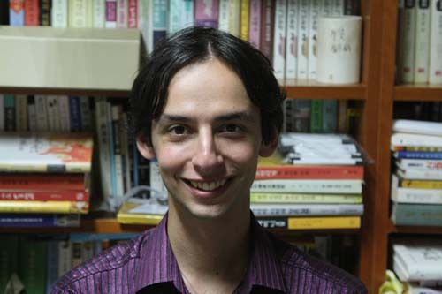
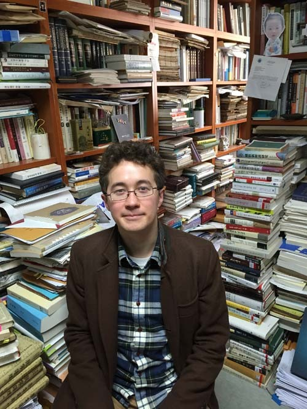
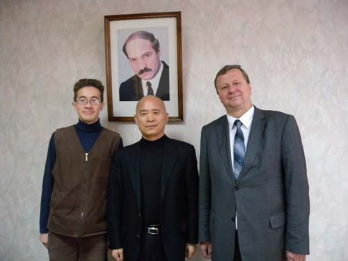
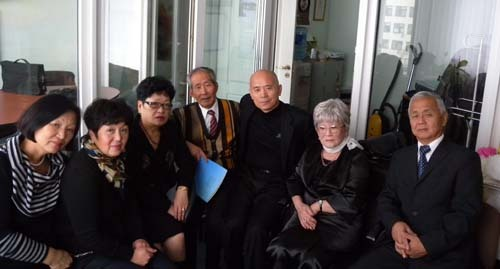
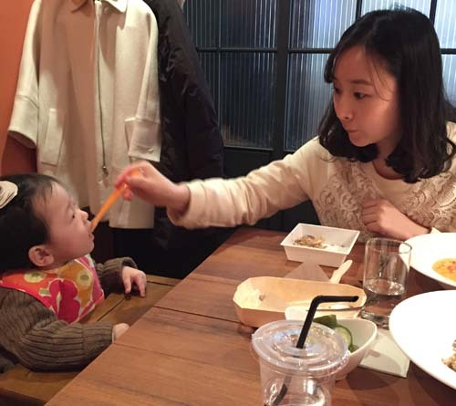
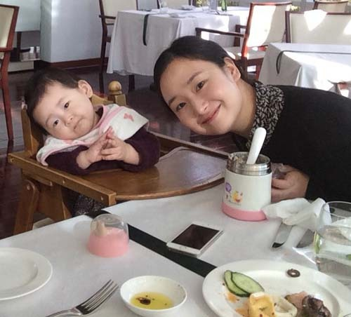
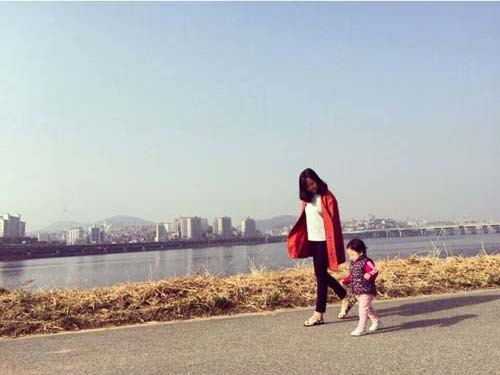

  
백규서옥을 방문한 아리안 군

  
백규서옥을 방문한 유리 군

언어구사의 천재들을 가까이에서 보며

몇 년 전 고려인들을 찾기 위해 벨라루스의 민스크에 간 적이 있다. 공항에서 호텔에 이르기까지 드넓은 들판과 자작나무 가로수 길이 인상적이었다. 벨라루스는 1922년 소련에 편입되어 1991년까지 '벨라루스 소비에트 사회주의 공화국'으로 존속하다가, 1991년 독립 선언 이후 러시아·우크라이나와 함께 독립 국가 연합(CIS: Commonwealth of Independent States)의 창설을 주도한 나라다. 당연히 공용어는 벨라루스어와 러시아어였다. 동쪽으로는 러시아, 서쪽으로는 폴란드와 리투아니아, 남쪽으로는 우크라이나, 북쪽으로는 라트비아와 경계를 이루고 있으니, 이를테면 다수의 민족국가들 속에 파묻힌 ‘육지 속의 섬’과 같은 나라였다.

민스크 도착 다음 날 벨라루스 국립대학 한국어과의 요청으로 학생들에게 강연을 하게 되었다. 내가 주목한 것은 학생들을 통해 알 수 있을지도 모르는 그곳 사람들의 혈통과 말이었다. 강의실에서 젊은 학생들을 만났다. 한국어로 이해되지 않는 부분에서는 영어를 썼는데, 소통의 정도는 기가 막힐 정도였다. 얼굴 모습들은 슬라브 계통의 백인들이었으나, 피부 한 꺼풀만 벗기면 다양한 모습들이 드러났다. 다음 날부터 학과에서 소개해준 두 명의 학생들이 민스크 곳곳을 안내해 주었다. 한 사람은 아리안(Aryan), 또 한 사람은 유리 킴(Yuri Kim)이었다.

#1 아리안의 할머니는 이란인으로서 현재 테헤란에 살고 있었다. 할아버지에 관해서는 미처 묻지 못했는데, 그의 얼굴 모습으로 보아 할아버지가 아리안족인 듯 했다. 그러니 그의 아버지는 이란과 인도계의 혼혈일 것이고, 그 혼혈 아버지와 우크라이나 출신 어머니 사이에 태어난 것이 아리안이었다. 내 관심은 그가 지닌 외국어 능력이었다. 그는 이란어, 러시아어, 벨라루스어, 우크라이나어, 영어, 프랑스어, 독일어, 한국어에 이미 능통해 있었고, 막 일본어에 손을 대고 있었음은 물론 중국어에도 관심을 갖고 있었다. 한자도 제법 알고 있는 눈치였다. 어머니로부터 젖을 받아먹듯 우크라이나어와 벨라루스어를 마더 텅(mother tongue)으로 받았고, 할머니 혹은 아버지로부터 이란어를 받았으며, 중학교~대학에 이르는 학교 교육에서 영어와 프랑스어, 독일어, 한국어를 익힌 것이었다. 대개 마더텅으로 두, 세 개의 언어를 습득한 경우, 마음만 먹으면 또 다른 언어를 배우는 일이야 ‘식은 죽 먹기’라는 것을 그들로부터 알 수 있었다. 그 후 그는 한국에 와서 모 대학의 어학코스를 최우등으로 마치고 돌아가 벨라루스 국립대학에서 대학원을 이수하면서 어학 교수로 활약하고 있다.

#2 내가 벨라루스에 머무는 동안 내게 친절을 베푼 또 하나의 벨라루스 청년이 유리였다. 워낙 한국어에 출중하여 당시 학부생의 신분임에도 한국어 강사로 활약하며 돈을 벌고 있었다. 카자흐스탄에 살고 있던 할아버지가 고려인이긴 했으나, 할아버지 자신이 고려 말을 버린 지 오랜 상태였을 뿐 아니라 그들은 서로 왕래도 없었다. 당연히 그의 아버지와 어머니도 한국어를 모르는 사람들이었다. 그러나 그는 대학에서 한국인으로부터 한국어를 배우자마자 마스터했다고 한다. 그의 언어 내력이 궁금하여 가계를 캐물었다. 할아버지는 고려인이고 할머니는 타타르인으로서 카자흐스탄 사람들이었다. 그 사이에서 태어난 아버지는 벨라루스로 이주하여 벨라루스인 여자와 결혼하여 유리를 낳은 것이었다. 화학 전공자였던 외할아버지와 프랑스어 음운론 교수였던 외할머니 사이에서 태어난 그의 어머니는 편집 기자였고, 아버지는 가구 및 건축 디자이너였다. 그러니 그가 태어나자마자부터 접했을 언어적 다양성의 실상을 짐작할 수 있었다. 어머니로부터 벨라루스어와 러시아어를, 아버지로부터 카자흐스탄어와 러시아어 및 벨라루스어를, 그리고 간혹 아버지로부터 단 몇 단어라 할지라도 할아버지에게서 물려받은 고려어의 냄새 정도는 맡았던 것 같다. 따라서 그는 태어나면서부터 3개 국어를 마더텅으로 물려받은 것이고, 그 후 자라는 과정에서 다민족 친구들과의 만남이나 학교교육을 통해 여러 외국어들을 덤으로 배우게 된 것이었다. 벨라루스어, 러시아어, 불어, 영어, 독일어, 한국어를 능숙하게 구사하고 있는 그는 지금 한국에서 공부하는 중이다.

일생을 노력해야 겨우 영어 하나를 외국어로 구사하게 되는 우리와는 달라도 너무 다른 그들이었다. 참으로 부러운 그들이었다. 간혹 외국에 나가면서 몇 개의 외국어를 구사하는 외국인들을 흔히 만난다. 그러면서 ‘외국어에 관한한 우리나라 사람들처럼 뒤처진 사람들이 또 있을까?’라는 한탄을 매번 하게 된다. 그러면서 ‘말은 혼’임을 깨닫는다. 혼은 물려받는 것일 뿐 흉내를 내거나 노력한다고 생기는 것이 아니다.

#3 최근 나에게 ‘이쁜’ 손녀가 하나 생겼다. 이제 돌을 갓 지난 녀석을 보며 나는 언어 학습의 과정과 실상을 흥미롭게 관찰하고 있다. 녀석이 말을 배워가는 과정과 방법이 참으로 신기하다. 제 어미가 젖병을 물리는 동안 녀석의 눈길 멈추는 곳이 예사롭지 않다. 바로 엄마의 얼굴인데, 그 가운데도 입에 초점이 맞춰지는 것이었다. 녀석은 무얼 보고 듣는 것일까. ‘자 이제 다 먹었네? 그럼 일어나 트림을 해야지!’라는 엄마의 말을 들으며 엄마 입술의 움직임을 유심히 보는 듯 했다. 말하자면 녀석은 엄마 입술의 움직임만으로도 그 말을 알아듣겠다는 듯 반응하는 것이었다. 참으로 오묘했다. 그러다가 엄마의 말을 흉내 내기 시작했다. 한 단어, 두 단어, 세 단어...녀석이 흉내 내는 엄마 말의 분량은 주간 단위로 늘어나는 것이었다.[나는 사실 짧으면 한 주, 길면 두 주 정도에 한 번씩 녀석을 만나기 때문에 그렇게 느끼는 것일 뿐, 사실은 매일 달라지고 있을 것이다!] 이제 세 음절짜리 단어들을 흉내 내어 구사하기 시작했고, 문장 단위의 말을 내뱉으려 할 땐 ‘아, 아’하고 소리치며 손짓을 하기에 이르렀다. 말 뿐 아니라, 행동거지도 제 부모와 우리를 흉내 내는 녀석이었다. 그래서 우리는 그를 ‘따라쟁이’라는 애칭으로 놀리기도 하는데, 바로 그 점에 언어 학습의 요체가 들어 있음을 깨닫게 된 것이다.

인류가 세상에 출현한 이래 말이란 그렇게 전승되어 온 것이다. 젖을 먹을 때 엄마로부터 자연스럽게 물려받는 것이 말이다. 그래서 ‘마더 텅’인 것이다. 그런데 만약 엄마가 ‘다중언어 구사자(multilingual speaker)’라면, 말에 따라 순위는 생기겠지만, 그 언어들이 그대로 아기에게 전수되지 않겠는가. 바이링궐(bilingual), 트라이링궐(trilingual) 등 흔한 다중언어 구사 엄마들이야 기분 내키는 대로 자유자재로 여러 언어들을 갖고 아기와 소통할 것이 아닌가. 그러니 그런 엄마의 아이들은 태어나면서 이미 다중언어 구사자가 될 소지를 확보하게 되는 것이다.

\*\*\*

우리의 실상을 보자. ‘단일 언어를 쓰는 단일민족’이란 말을 자랑처럼 달고 다니던 시절이 있었다. ‘같은 말을 쓰면 같은 생각을 하게 되고, 소통 또한 더 잘 되겠지.’라는 우리의 생각이 착각이었음을 세계화의 시대에 비로소 깨닫게 되었다. 지금 세계에서 유일하게 ‘같은 말을 쓰는’ 동족끼리 총부리를 마주대고 으르렁거리는 곳이 바로 한반도다. 사랑하는 사람들 사이에, 부모 자식 간에, 형제자매 간에, 좌파와 우파 간에 툭하면 같은 말을 무기로 죽고 죽이는 싸움판을 벌이는 곳이 바로 이 나라다. 같은 말을 쓰고 같은 모습을 한 사람들 사이에 죽고 죽이는 싸움판을 벌이는 데, 대체 ‘단일어를 쓰는 단일민족’이 무슨 자랑거리란 말인가.

눈만 뜨면, 베트남에서 필리핀에서 시집 온 새댁들을 무시하고 구박하는 이유는 또 무엇일까. 그들이 한국어를 잘 몰라서 말이 안 통하니 함부로 대해도 된다고 착각하는 사람들이 우리들이다. 우리말을 모르는 것을 차이 아닌 차별의 근거로 내세우려는 것이 바로 우리들이다. 더 고약한 것은 우리말을 모르는 백인들에 대해서는 한없이 너그러우면서도 우리말을 모르는 유색인들은 매몰차게 무시하려 드는 일이다. 바로 우리 내면에 똬리를 틀고 있는 못난 식민주의 근성 때문이다.

그들이 한국어를 잘 모르면 우리가 먼저 베트남어를 공부하고 필리핀어를 배우면 안 되나? 우리 자식들에게 시집와서 손자 손녀들을 낳아주는 베트남 필리핀 며느리들이 얼마나 고마운 존재들인가. 그러니 외국인 며느리들은 구박의 대상이기는 커녕 오히려 우리가 떠받들어야 할 보배들이다. 우리의 아이들을 낳아 이중언어 구사자로 키워줄 훌륭한 어머니요 선생님들 아닌가. 아이를 낳아 젖 먹여 키우는 과정에서 우리말과 베트남 말을 '마더 텅'으로 동시에 전해준다면, 나중에 그들은 누구도 따라 올 수 없는 우수한 국제인으로 자라게 될 것이다. 우리 아이들과 나라의 미래를 조금이라도 생각한다면, 우린 그들을 소중하게 대접해야 한다. 그들이 당장 우리말을 못하고 못 알아듣는다면, 우리가 먼저 그들의 말을 배워서라도 그들의 마음을 잡아두고 우리 사람으로 만들어야 한다. 일자리를 찾아 우리나라에 온 동남아 노동자들을 함부로 대하는 것도 그들이 우리보다 좀 더 피부색이 검다는 이유, 우리말에 서툴다는 이유 때문일 텐데, 그들 역시 우리에겐 소중한 보배들이다. 우리가 마다하는 궂은 일들을 달게 맡아하는 그들. 생각하기에 따라 그들은 우리의 훌륭한 선생님이 될 수도 있는 것이다.

참 못 말릴 정도로 무지하고 거친 사람들이 나를 포함한 오늘날의 한국인들이다. 인종의 전시장인 미국을 비롯한 외국에 나가서는 입도 뻥긋 못하면서, 좁디좁은 내 땅에만 들어오면 ‘안방 호랑이 노릇’을 잘도 하는 우리의 잘못된 습성이 바로 ‘언어능력 콤플렉스’로부터 비롯되었다고 보는 것이 내 생각인데, 이런 판단에 반론을 제기하실 분 있으면 말씀들 좀 해 보소서!

  
벨라루스 국립대학에서 유리 김, 샤두르스키 학장과 함께

  
벨라루스 고려인협회에서 만난 고려인들

  
밥을 받아먹는 YB

  
엄마를 흉내내는 YB

YB and her Mom walking on the road by the Han River

공유하기

게시글 관리

**백규서옥\_Blog ver.**

[저작자표시 비영리 변경금지
(새창열림)](https://creativecommons.org/licenses/by-nc-nd/4.0/deed.ko)