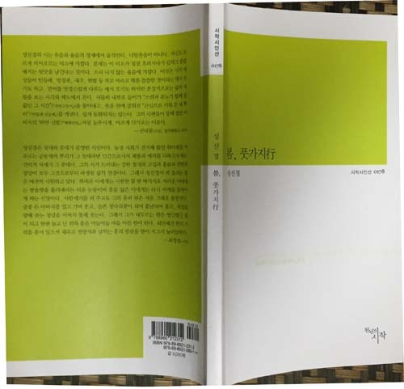
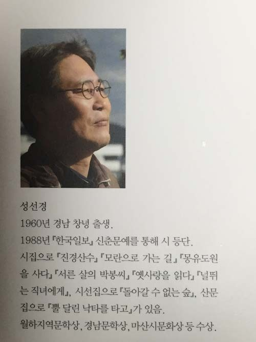

‘오십’의 깨달음

-성선경의 시집을 받고-

며칠 전, 학과 학술답사여행 중이었다.

학과장 이경재 교수의 생일을 용케도 알아낸 착한 학생들.

그들이 점심 상 앞으로 케익을 안고 왔다. 이 교수에게 나이를 물으니, ‘40’이란다.

그가 ‘나의 40’에 대해 물었다. “세상 무서운 것 없던, 참 좋은 때였소.” 내 대답이었다.

‘나의 50’을 그가 또 물었다. “참으로 초조해집디다.” 내 대답이었다.

오늘 점심 후 찻집에서 독문과 김대권 교수와 나이에 대한 그 문답을 다시 반복했다.

그는 왜 초조했냐고 물었다. “50 되기 전 몸에 돋은 가시 털과 입에 붙은 칼날을 모두 갈아 없애려 했는데, 여전히 형형한 빛을 발하는 것 같아서 초조했었소.” 내 대답이었다.

연구실에 들어오니, 함께 늙어가는 제자 성선경 시인의 새 시집이 도착되어 있었다. 책장을 넘기니 <오십>이란 시편이 실려 있었다. 그가 내 마음을 훔쳐보았던 걸까. 다음과 같은 시였다.

나이를 먹는다는 것은 둥글어진다는 것

늙음이 넓음으로 이어지지 않아도

온몸을 둥글게 둥글게 만다는 뜻

햇살이 잘 닦은 숟가락같이 빛나는 정오는

이제 절반을 지났다는 뜻도 되지만

아직 절반이 남았다는 말도 되지

나는 방금 전 오전이었고

나는 지금 금방 오후에 닿았지

어제의 꽃은 씨방을 키우는 중이고

어제의 나무는 막 붉게 물드는 중이지

천명(天命)을 안다는 지천명

아주 둥글어진 해

늙는다는 것은 둥글어진다는 뜻

오후가 나의 넉넉함과 이어지지 않아도

온몸을 둥글게 둥글게 만다는 뜻

햇살이 기울어 그림자가 동쪽으로 서는 시간

이제 절반을 지났다는 말도 되지

씨방 속에 또 싹이 나고

단풍 속에 물관이 선명하지

나는 방금 전 오전이었고

나는 지금 금방 오후에 닿았지

<66~67쪽>

그렇다. 오십을 십년 가까이 넘기고 나서야 내겐 비로소 오십이 보였다.

그 점을 콕 집어 가르쳐준 시인은 나의 선생님이다.

그래서 지금 그가 고맙다.

공유하기

게시글 관리

**백규서옥\_Blog ver.**

[저작자표시 비영리 변경금지
(새창열림)](https://creativecommons.org/licenses/by-nc-nd/4.0/deed.ko)