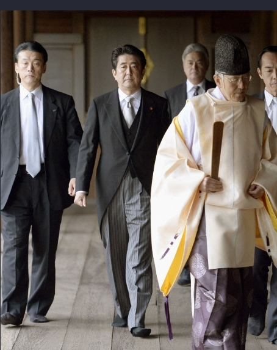

  
야스꾸니 신사 참배에 나선 아베

딱하다 아베!

태평양 전쟁을 일으킨 도조 히데키(東條英機) 내각의 상공 대신을 맡았다가 A급 전범으로 복역했고, 1957년 총리가 되어 정계의 전면에 등장한 기시 노부스케(岸信介). 패전국의 총리임에도 승전 미국의 반공논리를 충실히 따르다가 결국 1960년 미·일 안전보장조약을 개정하는 데 결정적으로 기여한 그의 외손자가 바로 아시아인들의 밉상 아베신조(安倍晋三)다. 최근 그는 ‘자신의 외할아버지 결정이 옳았음을 확인했다’고 했다. 말하자면 기시가 미일 안전보장조약을 개정했듯이, 자신도 미일 안전보장을 개정하여 ‘집단자위권’을 확보함으로써 자위대의 해외파병이 가능하도록 하겠다는 것이다. 동맹인 미국에 편승하여 일본을 ‘전쟁이 가능한 국가’로 탈바꿈시키겠다는 야욕의 표출이다. 조손(祖孫)이 대를 이어 아시아 위기의 핵으로 떠올랐고, 그것이 이웃나라들의 심기를 건드리는 데 끝나지 않고 아시아와 세계평화의 잠재적 위협 요인으로 대두되고 있는 요즈음이다.

그 아베가 지금 가증스런 혓바닥을 놀리며 어벙벙한 미국인들을 호리고 있다. ‘오바마의 푸들’이란 별명을 뒤집어씀직한 그가 미 대륙을 동서로 누비며 미국인들의 환심을 사기 위해 무진 애를 쓰는 모습이 역하긴 하지만, 역사를 ‘반면교사(反面敎師)’로 삼지 못하는 우리의 모습을 되돌아보게 한다는 점에서 전혀 무익한 일은 아니리라.

일본은 애당초 우리를 한 수 아래로 멸시해왔고, 일본을 중시해온 미국 역시 우리를 그렇게 대해 왔다. 표리부동한 미국인들의 행태는 이미 다른 글[본 블로그의 “정신 차립시다!-웬디 셔먼의 말을 듣고” 참조]에서 언급한 바 있지만, 정말로 ‘우리의 국격이나 외교역량이 이 정도밖에 되지 않는가’에 대하여 심각하게 자문(自問)하지 않을 수 없는 나날이다. 해방 70년이 지나도록 이 두 나라의 정치구조에 대한 분석이나 연구가 제대로 되지 않았고, 역대 행정부들 또한 주먹구구식으로 대응하고 있는 현실은 우리의 나태함이 어느 정도인지를 적나라하게 보여준다. 미국의 정치인들과 아베의 짝짜꿍을 바라보면서 ‘역사와 국제 현실정치’의 언밸런스를 절감하게 된다. 분명 일본은 미국의 적국이었고 음으로 양으로 많은 것들을 빼앗고 빼앗겨 온 상대방임에도, 중국과 대치하고 있는 현 상황에 두 나라의 이해관계가 일치하고 있는 현실이 우리에겐 매우 불합리하고 부당한 장벽으로 다가 선 것이다.

아직도 지속되고 있는 과거사의 상처를 치유하기 위해 잘못을 사과하라는 요구가 한국과 중국에서 봇물처럼 쏟아지고 있지만, 그에 대해서는 입도 뻥긋하지 않는 아베다. 사과를 하게 되면 지금 그들이 추구하는 현상의 변화에 분명 지장이 초래될 것이고, 군국주의의 부활이라는 철 지난 꿈이 ‘도로아미타불’로 돌아갈 것을 우려하는 소아병적 사고 때문일 것이다. 외할아버지 기시 노부스케의 뜻이 옳았다는, 개인 아베의 판단에 대하여 왈가왈부할 이유는 없다. 미국과 동맹을 맺어 집단자위권을 행사하겠다고 해서 과거의 역사가 사라지는 것은 아니고, 과거의 역사를 인정하고 사과했다 해서 그런 일을 해서 안 된다는 것도 아니다. 그러나 사과나 재발 방지의 약속 한 마디 없이 ‘불리한 역사의 수정’을 망나니 긴 칼 휘두르듯 하는 ‘총리 아베’의 행위는 결코 용납될 수 없다. 지금의 아베는 이웃집 꼬마로부터 빼앗아 손에 넣은 사탕 한 알을 돌려주지 않으려 온갖 거짓말과 얄팍한 꾀로 모면하고자 애쓰는 유치원 아동의 모습 그대로다.

미국 상하양원 합동회의장에서 떠듬거리는 일본 영어로 미국인들에게 아부를 떨었다 하여 모든 문제가 해결되는 것은 아니다. 아베가 ‘작은 것을 넘어서서 좀 더 큰 것을 지향하는 대인의 정치’를 담을만한 그릇이 아님은 세계인들이 이미 깨달은 바이지만, 우리 입장에서 볼수록 안타까운 것도 사실이다. 비록 입에 발린 수사(修辭)라 할지라도 ‘사과의 말 한 마디’가 분명 이 지역 외교의 난맥을 풀어낼 단초가 될 수 있음을 삼척동자도 알거늘, 어찌하여 아베는 ‘총리대신’이란 자의 직을 내세워 일본인들의 속 좁음을 만방에 선포하는 것인가. 지금 일본을 망치고 있는 극우세력이야말로 타일러 선도해야 할 동네 불량배들일 뿐인데, 설마 아베가 이들과 한 패란 말인가. 한 치 앞을 내다보지 못하는 아베의 궁색하고 가련한 몸부림. 그리고 이에 부화뇌동하는 일본인들. 과연 일본은 어디로 가고 있는가.

공유하기

게시글 관리

**백규서옥\_Blog ver.**

[저작자표시 비영리 변경금지
(새창열림)](https://creativecommons.org/licenses/by-nc-nd/4.0/deed.ko)