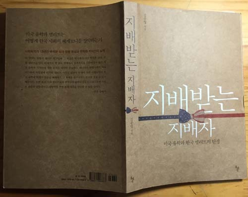
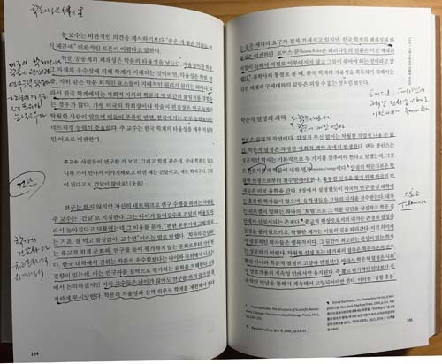

헤게모니를 장악한 미국 유학파와 학벌 공화국

-김종영의 <<지배받는 지배자>>를 읽고-

십칠 년 전쯤이었을까. 1년을 머물기 위해 처음으로 미국에 갔었다. 그 대학엔 한국인 유학생들이 아주 많았다. 어느 날, 박사과정에 재학하던 한 친구가 어처구니없다는 듯 툴툴거렸다. 한국 K대학 출신인 그는 갓 입학한 후배를 유학생 모임에 데리고 가 소개를 한 모양이었다. 그 자리에 끼어 있던 S대 출신의 한 유학생이 한숨을 내쉬며 이렇게 말하더라는 것이다.

“어중이떠중이가 다 유학을 오는구나...”

아마 들릴락 말락 혼잣소리로 중얼거렸기에, 그는 대놓고 항변을 하지 않았을 것이다. 그는 명색이 K대학 출신에게 ‘어중이떠중이’란 표현을 쓴 데 대하여 자못 분개하고 있었다. ‘그들만의 리그’에서 벗어나 있던 나로서는 ‘S대 출신이 K대 출신을 차별하는 곳’이 한국임을 생생하게 확인하는 순간이었다. 당연히 S대 출신이라는 그가 궁금했고, 그가 수강한다는 강의를 몇 번 청강하면서 자연스레 그를 관찰하게 되었다. 미국인 학생들이 다수였고, 중국인 서너 명과 그를 포함한 한국인 학생들이 두어 명 섞여 있었다. 강의와 토론으로 이루어지는 수업의 열기가 대단했다. 미국인 학생들은 교수가 제지해야할 정도였고, 중국 학생들도 나름 열정적이었다. 심리학 관련 강의였던 만큼 나로서도 관심 가질만한 이야기들이 많았다. 그런데, 그는 시종일관 조용했다. 그의 영어 발언을 듣고자 몇 번 나갔으나, 그는 끝내 입을 열지 않았다. 지친 나머지 나는 그에 대한 관찰을 그만 두었다.

교수인 내 기준으로 말하면, 그는 그 클래스 룸의 열등생이었다. 그 뒤로부터 ‘학벌 차별’의 문제를 유심히 관찰하게 되었다. 남들 보기에 ‘초라한’ 지방대학 출신이지만, 서울에서의 ‘대학원 유학’으로 세탁된 덕분이었을까. 아니면, 이른바 ‘보따리 장사’ 단계를 건너 뛴 채 일찌감치 20대 후반에 대학 전임이 된 덕분이었을까. 나는 그 때까지 그들로부터 명시적으로 차별을 받는다고 느낀 적은 없었다. 직장에서 국내의 이른바 ‘명문대학’ 출신들[특히 미국 유학파]을 관찰해보았으나, 그들 역시 그냥 ‘장삼이사(張三李四)’들일 뿐이었다. 모를 일이다. 혹 어느 구석에 뛰어난 점이 숨어 있는지! 설혹 있다 해도 그건 ‘한 끗 차이’일 것이다.

한국사회에서 늘 수그러들지 않는 이슈는 바로 학벌의 문제다. 절대 출신학부를 차별의 근거로 들지 않는 미국과 달리, 우리는 1차적 차별[다른 말로 절대적 차별]의 잣대를 출신학부에 두고 있다. 스카이(SKY)[그 중에서도 서울대학]로 대변되는 출신학부의 기득권이야말로 대한민국 사회에서 헤게모니를 잡고 있는 미국 유학파에게 덤으로 주어지는 최고ㆍ최대의 프리미엄일 것이다.

\*\*\*

최근 바쁜 틈을 타서 모처럼 좋은 책을 읽었다. 김종영 교수의 <<지배받는 지배자: 미국유학과 한국 엘리트의 탄생>>이란 책. 서구 이론들의 틀을 원용하긴 했으나 삶의 현장에서 관련자들을 만나 관찰한 사실들을 ‘설득력 있는 어조로’ 생생하게 분석ㆍ전달했다는 점이 무엇보다 좋았다. 나를 포함, 고리타분한 ‘책상물림들’의 저작과 많이 다르다는 점에서 신선했다.

‘조선시대 중인계층에 비견되는’ 중간적 소수자(middleman minority)로서의 미국 유학파가 갖는 다양한 얼굴들을 과감하게 보여 준 점이야말로 김 교수가 갖고 있는 엄정한 학자적 결기(決氣)의 발로일 것이다. ‘한국의 우등생들이 미국의 대학들로 유학을 간 뒤 열등생으로 전락했다가 다시 한국으로 돌아와 헤게모니를 쥐게 된다’는 것, ‘미국에서 열등생으로 전락하는 요인도, 한국에 돌아와서 헤게모니를 쥐게 되는 요인도 뛰어넘을 수 없는 영어의 힘에 있다’는 것 등이 이 책에서 강조되는 핵심적 요지들 가운데 하나다.

책에는 이것들을 뒷받침하는 불편한 진실들이 상세히 서술되어 있다. ‘막대한 지원, 전국적으로 퍼져 있는 우수 연구중심대학들, 탈 중심적 구조’ 등을 갖춘 수월(秀越)한 미국 대학들과 ‘모든 면에서 초라한 우리나라 대학사회’ 사이에는 뛰어 건널 수 없는 심연(深淵)이 가로놓여 있다는 진단은 누구나 수긍할만하다. 저자가 지적하듯이 미국 대학들의 우월성은 ‘도덕적ㆍ문화적 헤게모니’로부터 나오는데, 그 헤게모니는 학문 활동의 깊이와 진지함, 열정 등과 직결되는 것이다.

김 교수가 막스 베버의 ‘미들맨 마이너리티의 친족주의와 연줄에 의한 천민자본주의’를 인용하여 우리나라의 대학을 ‘천민 학문 공동체’로 규정한 것은 대학사회가 지닌 ‘합리성의 결여’라는 현실적 근거를 바탕으로 했기에 더욱 설득력이 있다. 미국 유학파는 이렇게 낙후된 ‘천민적 학문 공동체’에 미국적 합리성을 전파하면서, 동시에 ‘글로벌 문화자본의 상징폭력’을 우리나라 지식인들에게 행사하고 있다는 것이다.

미국 유학과 함께 경험하는 ‘연구중심 대학들의 실상’이나 ‘학문 대가들과의 만남’은 유학생들을 크게 고무시키지만, 그 공간에서 사회적 피라미드의 상층으로 올라갈 수 없는 근본적 한계 때문에 다시 낙후된 고국으로 돌아와야 하고, 결국은 천민공동체의 헤게모니의 장악이라는 비윤리성을 발휘하면서 매우 부정적인 존재로 안주하게 된다는 것이다.

\*\*\*

우리는 ‘할 수 없는 말을 하는 선비’를 ‘감언지사(敢言之士)’라 불러왔다. 왕조시대의 임금이나 임금 주변에 대하여 드물지만 바른 소리를 ‘아끼지 않는’ 선비들이 있었다. 정말로 무서울 것 없는, 요즘 같은 대명천지에 권력의 중심부를 향하여 바른 소리를 할 수 있는 감언지사가 없다는 사실이야말로 이해하기 어렵다. 감언지사 없는 나라가 제대로 돌아갈 리 없다. 학문권력 아니 학벌권력의 서슬이 지금처럼 세력을 부릴 때가 우리 역사상 그 언제였던가. 그 학벌권력이 낙인을 찍으면 꼼짝 없이 낙향할 수밖에 없는 게 오늘날 지식사회의 현실이다. 그런 점에서 김종영 교수는 ‘21세기 한국의 감언지사’라 할 수 있으리라.

겉으로 보기에 ‘미국 유학파’는 매우 유능하고 미래지향적이며 합리적인 ‘학문의 리더들’이다. 그러나 내면을 들여다보면, 공동체에 수시로 글로벌의 잣대를 들이대면서도 이기(利己)의 욕망으로 번들거리는 표정을 감추지 못하는 존재들이다. 남들이 보기에 그들은 ‘감추는 게 많은’ 군상이다. 그들은 과연 무엇을 감추려 하는 것일까. 사실 그 점이 못내 궁금했는데, 김종영 교수의 이 책이 그들의 실상을 적나라하게 보여 주었다. 사실 이 책에는 차마 입으로 옮기기 부끄러운 미국 유학파들의 실상과, 헤게모니 쟁탈전의 전사로 변한 학벌들의 민낯이 상세히 설명되어 있다. 책 가운데 비교적 함축적이며 온건하게 표현된 두어 단락들을 결론 삼아 옮겨 놓는다.

한국연구자들이 시류에 민감한 이유는 또 다시 이들의 트랜스 내셔널(transnational) 위치와 깊이 연관된다. 트랜스 내셔널 미들맨 지식인들의 주요 전략은 미국의 연구 센터에서 생산되는 지식을 빨리 국내에 도입하여 선점하는 것이다. 자기만의 독창적인 분야가 없기 때문에 외국의 첨단 연구에 주목해야만 한다. 분야를 막론하고 미국 유학파 교수들은 미국에서 ‘핫’한 것을 가지고 와야 주목을 받을 수 있고, 연구비를 지원받을 가능성이 커진다. 시류를 타면 이런 장점이 있지만 근본적인 질문을 던져서 답을 구하는 방식을 취해야 하는 심도 있는 연구를 수행하기는 어렵다. 석학은 유행을 타는 사람이 아니라 유행을 만드는 사람이다(⋯)학계에 진입한 신진 연구자들은 이전 세대보다 개방적이지만 이미 구조적으로 형성되어 있는 학벌 중심의 네트워크에 종속될 수밖에 없다. 왜냐하면 신진 연구자는 학계에서 파워가 없고 연구를 위해 네트워크를 만들 수밖에 없는 처지이기 때문이다. 학벌 중심의 연구 관계는 다른 학벌을 가진 사람들을 소외시킨다. 이 교수는 모 대학 중심의 학회의 회식자리에서 서로 형, 동생 하는 모습에 아연실색했다고 말한다.

이 교수: 나만 이방인인 것 같고, 그렇지만 꾹 참았죠. 더럽더라고요. 회식 자리에서 느끼는 건 솔직히 말해서 남의 동창회에 괜히 껴서 앉아 있는 듯한 느낌이 있었지만 꾹 참고 앉아 있었던 거죠.

이 교수는 결국 이 연구 모임과 거리를 두었다. 이는 그 연구 집단에게는 손해가 된다. 왜냐하면 이 교수의 전문성을 충분히 활용할 수 없기 때문이다. 즉 네트워크가 개방적일 때 연구의 전문성과 생산성이 높아진다. 연구는 지식의 교류인데, 이 교류가 폐쇄적일수록 독창적인 지식 생산은 어려워진다. [김영종 교수의 책, 190~192쪽]

⋮

문제는 미국 유학파 한국 지식인의 학문적 열정이 트랜스 내셔널(transnational) 구조를 갖는다는 것이다. 미국의 연구중심 대학에서 고양된 열정은 한국으로 돌아왔을 때 급격히 쇠락한다. 저명한 경제학자인 조인구 교수의 에피소드는 이를 잘 말해준다. 1986년 프린스턴 대학교를 졸업한 조 교수는 경제학 부문에서 가장 많은 노벨상을 배출한 시카고 대학 교수를 거쳐 서울대 교수로 부임했다. 하지만 한국에 온 지 1년 뒤인 1998년에 서울대를 그만 두고 돌연 미국 대학으로 자리를 옮긴 일은 한국 경제학계에서 오랫동안 회자되었다. 2006년에 한국을 방문한 조 교수는 왜 한국을 떠나 미국으로 갔느냐는 기자의 질문에 즉답을 피했다. 조 교수는 노벨상을 받은 제임스 헤크먼, 게리 베커, 로버트 포겔 교수 등 시카고 대학의 교수들을 언급하며, 이들은 나이가 70대, 80대가 되었음에도 불구하고 새벽까지 공부한다는 간접적인 답변을 내놓았다. 조 교수는 미국 대학 교수들의 학문적 열정에 항상 자극을 받는다고 말했다.

세계적인 수학자들과 연구해온 박 교수는 피부로 느낀, 한국 교수와 미국 교수의 차이점을 이렇게 말한다.

박 교수: 미국에서 교수하는 사람들은 교수 직책이 좋아서 하는 게 아니라 연구하는 게 좋아서⋯근데 한국은 교수라는 게 저거잖아요. 조금 기득권층, 대접 받는 게 좋아서, 그 맛에 교수를 하는 거거든요. 공부가 너무 사랑스러워서 교수를 하는 게 아니고.

박 교수는 한국 대학에서 공부를 열심히 그리고 지속적으로 하는 사람은 드물다고 말한다. 또 연구에 대한 가치를 높이 평가해주지 않는다는 점을 지적하면서 “논문을 열심히 쓴다고 알아주는 사람도 많지 않다”고 말한다. 사회학을 전공하는 남 교수도 비슷한 견해를 내놓는다. 열심히 공부하는 교수의 비율이 한국보다 미국이 훨씬 높고, 더 탁월한 연구를 하려는 욕심 역시 한국 교수들은 적다고 말한다. 한국 교수들은 다른 사람보다 나아지려는 경쟁의식도 없고 연구를 통해 “블라섬하고(꽃을 피우고) 싶다는 욕망”도 없다는 것이다.

학문적 열정은 지속적인 사회적 상호작용을 통해서만 유지된다. 학문적 전념은 고도의 감정적 에너지를 요구하는데, 한국 학계에서 이것을 지속시키기는 너무나 어렵다. 학문에 대해 점점 냉담해지는 것은 트랜스 내셔널 미들맨 지식인들의 공통적으로 갖는 집단적 감정 상태다. 한국 지식인이 미들맨인 것은 이들의 열정이 최고가 아님을 뜻한다. 학문의 길만이 최고로 가치 있는 일이라는 기이한 최면과 환상 없이는 진정한 학자가 될 수 없다. 이러한 학문에 대한 종교적 맹목성은 감정적으로 충만한 학문 공동체 속에서만 배양된다. 곧 한국 대학에서 미국 대학의 헤게모니는 이 둘 사이의 지식 격차, 윤리적 격차 뿐만 아니라 ‘열정(또는 감정)의 격차’ 속에서 발생한다. 로고스는 에토스와 파토스 없이 홀로 설 수 없다.[김종영 교수의 책, 196~197쪽]

공유하기

게시글 관리

**백규서옥\_Blog ver.**

[저작자표시 비영리 변경금지
(새창열림)](https://creativecommons.org/licenses/by-nc-nd/4.0/deed.ko)