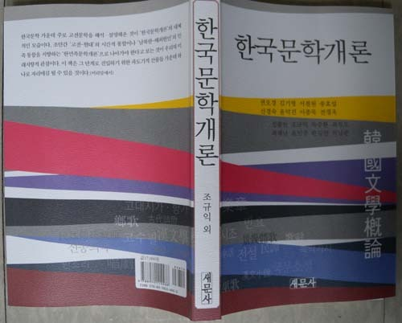
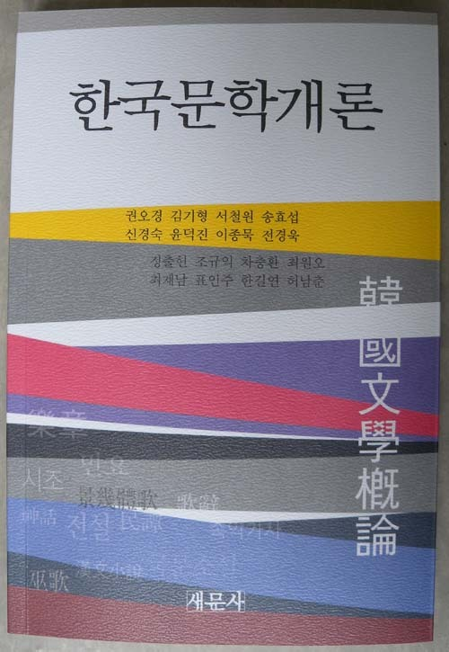
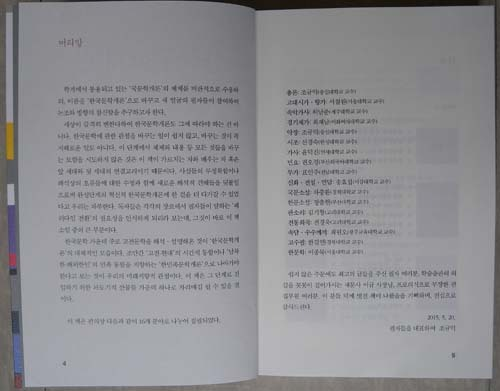

일을 추진한 지 대략 7~8개월 만에 <<한국문학개론>>(새문사)이 세상에 나왔다. 시대와 학생들이 바뀌었음에도 한국문학계 전반이 시름에 빠져 있기 때문일까. 좀처럼 새로운 한국문학개론이 나올 기미가 없었던 것이 저간의 사정이었다. 이런 갈급(渴急)의 상황에서 이 <<한국문학개론>>이 튀어나온 만큼 많은 독자들의 관심을 받을 수 있으리라 본다.

이 책의 출간 의도는 다음과 같은 머리말에 명료하게 드러난다. 그 글을 여기에 붙임으로써 이 책의 특징과 의미를 널리 공유하고자 한다.

머리말

학계에서 통용되고 있는 ‘국문학개론’의 체제를 비판적으로 수용하되, 이름을 ‘한국문학개론’으로 바꾸고 새 얼굴의 필자들이 참여하여 논조와 방향의 참신함을 추구고자 한다.

세상이 급격히 변한다하여 한국문학개론도 그에 따라야 하는 건 아니다. 한국문학에 관한 관점을 바꾸는 일이 쉽지 않고, 바꾸는 것이 꼭 지혜로운 일도 아니다. 이 단계에서 체제와 내용 등 모든 것들을 바꾸는 모험을 시도하지 않은 것은 이 책이 가르치는 자와 배우는 자 혹은 앞 세대와 뒷 세대의 연결고리이기 때문이다. 사실들의 부정확함이나 해석상의 오류들에 대한 수정과 함께 새로운 해석적 견해들을 덧붙임으로써 완성단계의 혁신적 한국문학개론에 한 걸음 더 다가갈 수 있었다고 우리는 자부한다. 독자들은 각각의 장르에서 필자들이 말하는 ‘패러다임 전환’의 필요성을 인식하게 되리라 보는데, 그것이 바로 이 책 소임 중의 큰 부분이다.

한국문학 가운데 주로 고전문학을 해석ㆍ설명해온 것이 ‘한국문학개론’의 대체적인 모습이다. 조만간 ‘고전-현대’의 시간적 통합이나 ‘남북한-해외한인’의 민족 통합을 지향하는 ‘한민족문학개론’으로 나아가야 한다고 보는 것이 우리의 미래지향적 관점이다. 이 책은 그 단계로 진입하기 위한 과도기적 산물들 가운데 하나로 자리매김 될 수 있을 것이다.

이 책은 편의상 다음과 같이 16개 분야로 나누어 집필되었다.

총론: 조규익(숭실대학교 교수)

고대시가ㆍ향가: 서철원(서울대학교 교수)

고려속악가사: 허남춘(제주대학교 교수)

경기체가: 최재남(이화여자대학교 교수)

악장: 조규익(숭실대학교 교수)

시조: 신경숙(한성대학교 교수)

가사: 윤덕진(연세대학교 교수)

민요: 권오경(부산외국어대학교 교수)

무가: 표인주(전남대학교 교수)

신화ㆍ전설ㆍ민담: 송효섭(서강대학교 교수)

국문소설: 차충환(경희대학교 교수)

한문소설: 정출헌(부산대학교 교수)

판소리와 창극: 김기형(고려대학교 교수)

전통희곡: 전경욱(고려대학교 교수)

속담ㆍ수수께끼: 최원오(광주교육대학교 교수)

고수필: 한길연(경북대학교 교수)

한문학: 이종묵(서울대학교 교수)

쉽지 않은 주문에도 최고의 글들을 주신 필자 여러분, 학술출판의 외길을 꼿꼿이 걸어가시는 새문사 이규 사장님, 프로의식으로 무장한 편집부원 여러분. 이 분들 덕에 멋진 책이 나왔음을 기뻐하며, 진심으로 감사드린다.

2015. 5. 20.

필자들을 대표하여 조규익

공유하기

게시글 관리

**백규서옥\_Blog ver.**

[저작자표시 비영리 변경금지
(새창열림)](https://creativecommons.org/licenses/by-nc-nd/4.0/deed.ko)