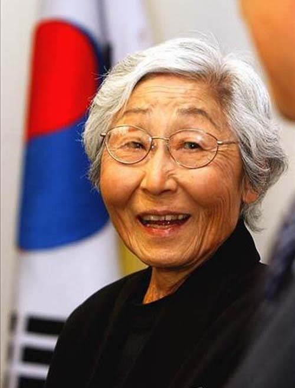
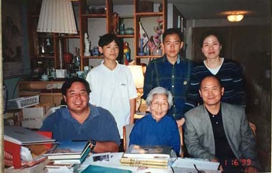
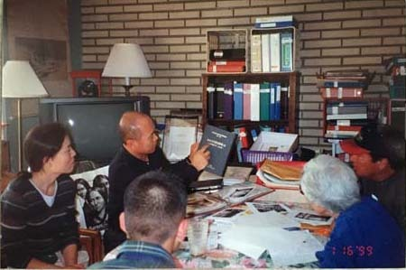
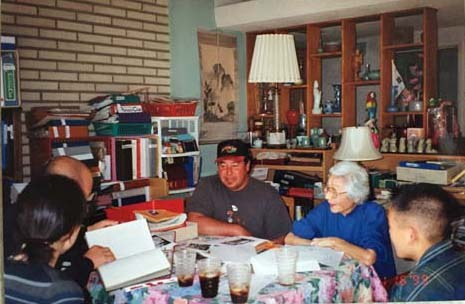
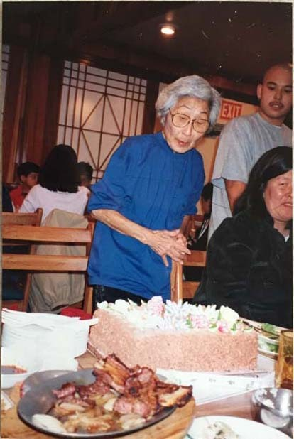
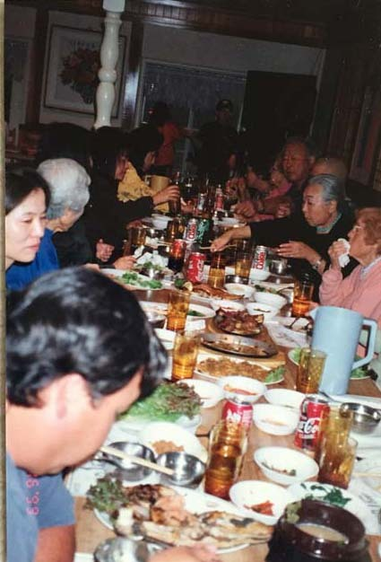
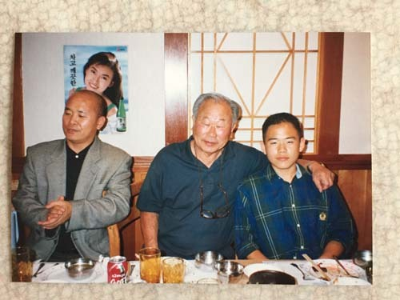
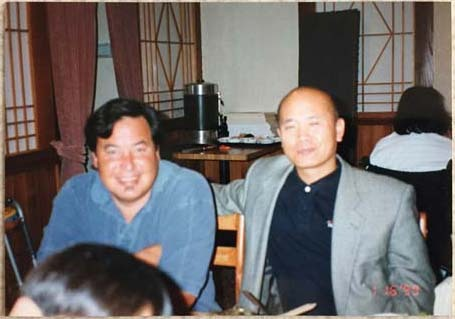
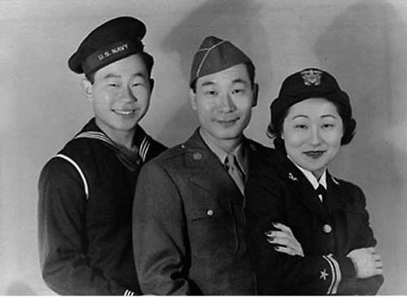

안수산 선생

노스리지(Northridge) 선생의 자택에서   
선생 모자와 백규 가족

  
자택에서 책을 중심으로 환담하는   
선생과 백규 가족

  
자택에서 환담하는 선생 모자와 백규 가족

아, 안수산(Susan Ahn Cuddy) 선생님!

1991년 1월 16일. 1월이 캘리포니아에 비가 잦은 계절이긴 하지만, 그 날은 약간 햇볕이 들었었지요. 귀국을 며칠 앞 둔 시점에 우리 가족은 미리 약속했던 대로 안수산 선생님 댁을 방문하게 되었지요. 우리가 머물고 있던 UCLA의 대학 아파트에서 자동차로 30분 거리에 있는 소도시 노스리지(Northridge). 가로수 잎이 참하게 깔린 한적한 동네 한복판의 깔끔하고 나지막한 단층집이었지요. 반색을 하며 맞아주시는 선생님과 외아들 필립(Philip Ahn Cuddy)의 표정이 정겹게 다가오더군요. 미리 연락을 하셨는지, 잠시 후 인근에서 변호사 일을 하고 있는 지성적 마스크의 따님 크리스틴(Christine Ahn Cuddy)도 도착했고요.

도산 선생의 유품들을 일일이 보여주시고 설명해 주시는 열정을 통해 도산 선생으로부터 물려받은 기질을 짐작할 수 있겠더군요. 가족 단위로 방문하는 경우가 흔치 않아서였을까요? 유독 우리 아이들을 귀여워해주시더군요. 도산 선생의 독립운동에 대한 자부심, 도산 선생과 함께 독립운동을 펼치던 당시 어른들을 추억하시며 눈시울을 적시곤 하셨지요. 감동이었습니다.

1915년 1월 16일 생. 선생님은 1942년 스물일곱의 나이로 미 해군 해군 최초의 여성 포격술 장교로 1946년까지 복무하셨지요. 전역 후 미 의회 도서관과 연방 국가안전보장국(NSA)에서 비밀정보 암호분석가로 활약하셨고, 1959년 NSA에서 은퇴할 때까지 워싱턴 D.C.에서 300여명의 학자들에게 ‘동서 냉전관련’ 지식과 정보를 교육하는 일을 맡기도 하셨지요. 은퇴 후엔 노스리지로 돌아와 가족이 운영하던 중국 식당 ‘필립 안의 문게이트(Phil Ahn's Moongate)'를 1990년까지 도우셨답니다. 우리가 만난 때는 그 일로부터 벗어나서 쉬고 있는 중이셨고요.

우리가 찾아간 그 날이 바로 선생님의 84세 생신이시더군요. 전화를 드렸을 때 이 날 만나자고 말씀하신 것도 당신의 생신날이기 때문이었음을 그 자리에서 비로소 깨닫게 되었지요. 우리와 많은 이야기를 나눈 뒤 저녁 무렵이 되자 파티에 함께 가자고 하시면서 우리를 동네의 한 레스토랑으로 인도하셨어요. 이미 그곳엔 많은 친척들과 지인들이 모여 좌정해 있데요. 우리 가족에 대한 소개가 끝나고 우리는 따뜻한 환영의 박수를 받았지요. 특히 선생님의 남동생이신 필립 선생은 파티 내내 우리 아이들을 쓰다듬으며 정을 표시하기도 하셨어요.

파티가 끝난 한밤중 재회를 약속하며 헤어졌으나, 몇 년 뒤 재외동포재단 사무원의 실수로 서울에 오신 선생님을 뵙지 못했고, 결국 오늘 선생님의 부음을 접하게 되었네요. 그 분의 외 아드님 필립은 몇 년 전 우리 집을 방문해 식사를 나누며 선생님과의 추억을 되새기도 했으나, 어찌 선생님을 친히 뵌 것만 하리오?

천만리나 떨어진 미국 땅에서 조국 사랑을 실천하시다 돌아가신 선생님의 명복을 삼가 빕니다.

2015. 6. 26.

조규익 절

  
1999년 84세 생신연에서 게잌을   
자르시는 선생님

  
하객들과 함께 한 생신연

  
생신연에서 선생님의 남동생과 백규 & 경현

  
선생님의 아드님 필립과 백규

  
젊은 시절의 선생님과 남자 형제들

공유하기

게시글 관리

**백규서옥\_Blog ver.**

[저작자표시 비영리 변경금지
(새창열림)](https://creativecommons.org/licenses/by-nc-nd/4.0/deed.ko)