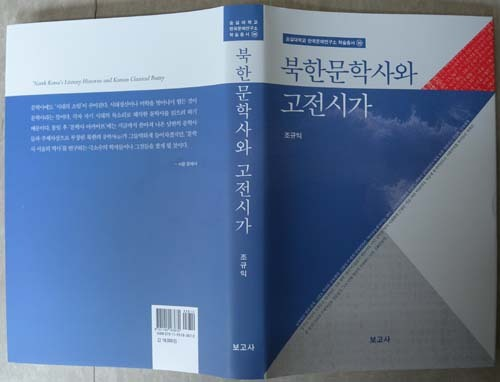
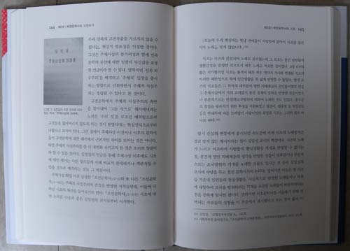
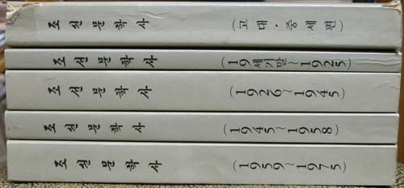
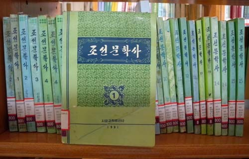
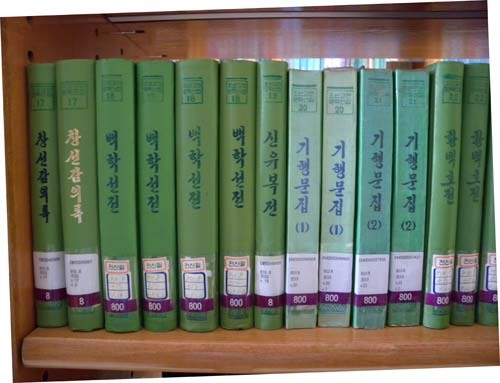
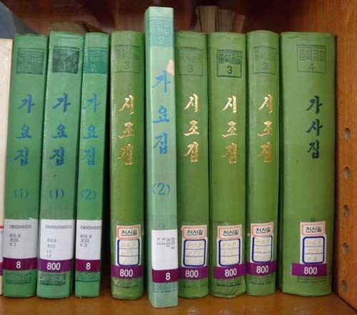

지난 몇 년 간 악장문학과 해외 한인문학을 중점적으로 공부하는 틈틈이 북한에서 나온 문학사들을 읽어 왔습니다. 그리고 간간이 그에 관한 제 생각들을 정리하게 되었고, 그 가운데 고전시가들을 중심으로 몇 편의 논문들을 발표하게 되었습니다.

책에서 강조한 것처럼 북한사람들 특히 학자들의 생각이 너무나 경직되어 ‘가뭄에 실개천 마르듯’ 문학작품의 분석이나 해석에서는 금방 바닥을 드러낸다는 점이 안타까웠습니다. 이른바 사회주의적 사실주의나 주체적 사실주의만으로 무궁무진한 문학작품의 이면적 의미를 퍼 올리기란 애당초 불가능한 일이었음을 깨닫게 된 것입니다.

그들 사유(思惟)의 정형성은 ‘침대에 키를 맞추어 발을 잘라내던’ 프로크루스테스의 침대, 바로 그것이었습니다. 몇 종 되지도 않지만, 그들의 문학사를 다 읽고 더 많은 글을 쓰다가는 수많은 ‘동어반복(同語反覆)’의 함정에 빠질지 모르겠다는 우려 때문에, 당분간 쉬어가기로 했습니다. 제 사유의 또 다른 틀이 생성되어 이전에 보이지 않던 그들 문학사의 이면적 의미들이 보일 때쯤 다시 쟁기를 들고 나설 생각입니다.

여기에 이 책의 머리말을 이곳에 옮겨 놓습니다.

머리말

남북한은 말과 글자, 그리고 역사를 공유한다. 그래서 이 땅의 단일민족은 ‘역사공동체’이기도 하다. 그러나 분단과 이질화의 세월이 길어지면서 역사 또한 양분되고 말았다. 민족에게 남겨진 역사적 사실들은 하나이되, 그에 대한 ‘해석’이 달랐기 때문이다. 이런 남북한 역사 이질화의 근원은 이념이다. 처음에 통치이념으로 사회주의를 받아들인 북한은 한 발 더 나아가 주체사상을 만들었고, 그로 인해 역사의 이질화는 더욱 심화되었다.

북한에서 이른바 사회주의적 사실주의나 주체적 사실주의의 잣대는 그런 것들이 없던 시기의 옛 문학이나 지금의 창작문학에 가리지 않고 적용되었다. 옛 문학에 대해서는 해석의 도구로, 지금의 문학에 대해서는 창작과 비평의 원리로! ‘김일성의 교시’, ‘김정일의 지적’과 함께 제시된 것이 강령으로서의 사회주의 미학 혹은 주체미학이었다. 문학작품이든 문학사이든 획일화의 감옥에 가둬버린 것이다.

우리 고전시가를 통해 그 실상의 일부나마 확인하는 과정에서 얻은 것이 이 글이고, 일부 학자들이 고창해 온 ‘통일문학사의 서술’이 허구라는 점도 이 공부를 통해 얻은 결론이다. 북한의 문학사(들)를 이 땅의 다수 문학사들 가운데 하나로 취급해주면 될 일이지, 다양성을 추구해온 남한의 문학사들까지 굳이 주체미학의 형틀에 묶인 북한식 문학사로 획일화시킬 필요야 있겠는가.

문학사에도 ‘시대의 소임’이 주어진다. 시대정신이나 미학을 벗어나기 힘든 것이 문학사라는 뜻이다. 각자 자기 시대의 목소리로 해석한 문학사를 읽으려 하기 때문이다. 통일 후 ‘문학사 아카이브’에는 지금까지 쏟아져 나온 남한의 문학사들과 주체사상으로 무장된 북한의 문학사(들)가 그들먹하게 들어차겠지만, ‘문학사 서술의 역사’를 연구하는 극소수의 학자들이나 그것들을 찾게 될 것이다.

책을 멋지게 만들어주신 보고사 김흥국 사장님과 편집부 이순민 선생께 감사드린다. 아울러, 해외에서 학업을 마치고 패기 넘치는 교수로 뉴욕대학(New York University)에 입성한 큰 아이(경현)와 현대건설에서 훌륭한 기업인의 꿈을 키우고 있는 작은 아이(원정)에게 ‘아버지의 마음’을 담아 이 책을 건넨다.

을미년 한여름

백규서옥 주인

조규익

  
북한에서 발간된 <<조선문학사>>

  
북한에서 발간된 <<조선문학사>>

  
북한에서 발간된 고전 작품들

  
북한에서 발간된 고전 작품들

공유하기

게시글 관리

**백규서옥\_Blog ver.**

[저작자표시 비영리 변경금지
(새창열림)](https://creativecommons.org/licenses/by-nc-nd/4.0/deed.ko)