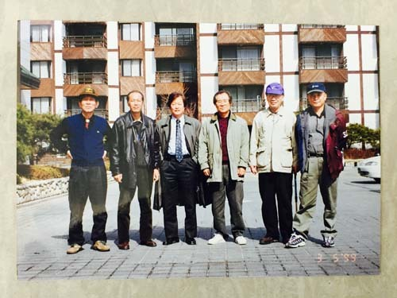
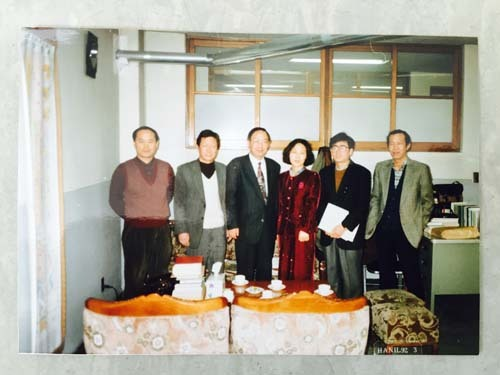

  
아, 옛날이여!

  
아, 옛날이여!

또 한 분이 우리 곁을 떠나셨다.  
‘삶과 죽음이 한 끗 차이’라고 말들 하지만,  
다리를 건너는 입장에서야 어찌 한 끗에 불과했으랴?

유쾌함보다는 불쾌함이  
개운함보다는 찝찝함이  
더 많은 세월이었으리라.  
지지고 볶으며 짜오던   
한 자락 삶을  
베틀 째 팽개치고   
이리도 홀홀히 떠나는 게  
인생인 것을.

“90 평생이 한 나절의 꿈같았노라!”고  
깨달음의 말씀을 남기시며 돌아가신  
어느 어른의 마지막 순간을   
지금 막 떠올려본다.

한 발 한 발  
가벼운 걸음으로  
떠나야 하리.  
모질게 움켜 쥔  
영욕의 짐 보따리들   
하나하나 떨구며  
상쾌한 맘으로 가야 하리.

하직인사도 없이  
떠난 그 분의 뜻이   
바로 여기에 있을 것이니...

2015. 8. 5.

백규, 한 잔 술로 그 분의 명복을 빌며

공유하기

게시글 관리

**백규서옥\_Blog ver.**

[저작자표시 비영리 변경금지
(새창열림)](https://creativecommons.org/licenses/by-nc-nd/4.0/deed.ko)