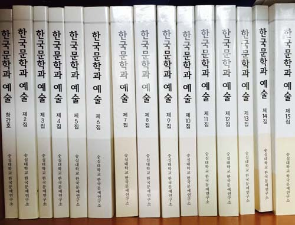

숭실대학교 한국문예연구소에서는 전문학술지인 『한국문학과 예술』 16집(2015년 9월 30일 발행)에 게재할 논문을 아래와 같이 공모하오니 사계 연구자들의 적극적인 참여를 부탁드립니다.

◈ 다음 ◈

1. 공모 분야: 한국의 문학과 예술 및 문화 전반에 관련된 분야로, 독창적인 연구결과이거나 그러한 연구에 도움이 될 수 있는 논문. (현대와 고전문학을 포함한 한국문학, 한문학, 음악ㆍ무용ㆍ미술 등 문화예술을 대상으로 하며, 학제 간 연구결과도 환영합니다.)

2. 투고 방법

① 투고하실 분은 논문투고신청서(본 공고문에 첨부), 연구 윤리 확약서(본 공고문에 첨부), 논문을 숭실대학교 한국문예연구소 편집위원회에 이메일로 제출하셔야 합니다.

o 이메일: [ktla@ssu.ac.kr](mailto:ktla@ssu.ac.kr)(숭실대학교 한국문예연구소)

② 논문은 200자 원고지 150매 이내(국문요약, 영문초록, 참고문헌 포함)로 하며, 자세한 내용은 『한국문학과 예술』의 논문 원고작성법(본 공고문에 첨부)을 참조해 주십시오.

3. 발간 일정

o 논문 투고 마감 : 2015년 8월 21일(금) 24:00   
o 『한국문학과 예술』 발간일(연 2회)   
- 제16집 : 2015년 09월 30일(발간예정)   
- 제17집 : 2016년 03월 31일(발간예정)

4. 기타

o 한국연구재단 KCI 등재후보지(『한국문학과 예술』제16집부터 온라인논문집으로 제작)   
o 연회비 없음  
o심사 및 게재비 : 5만원. 단, 교내연구비지원 논문은 10만원, 교외연구비지원 논문은  20만원의 게재비를 내셔야 함)   
o 최종투고마감일로부터 20일 안에 심사결과 공지   
o 별쇄본 무료송부

5. 『한국문학과 예술』16집의 논문투고에 관한 문의   
o 우편 (우)156-743 서울특별시 동작구 상도로 369 숭실대학교 한국문예연구소 『한국문학과 예술』 편집위원회

6. 논문관련문의 : E-mail이나 전화로 접수여부를 확인해 주세요.

o E-mail : [dull-baram@hanmail.net](mailto:dull-baram@hanmail.net)

숭실대학교 한국문예연구소  
 02-820-0326

[논문투고신청서와 연구윤리확약서.hwp](https://t1.daumcdn.net/cfile/tistory/21258A4F55CEABB531)

[원고작성법(참고).hwp](https://t1.daumcdn.net/cfile/tistory/2721134F55CEABC434)

공유하기

게시글 관리

**백규서옥\_Blog ver.**

[저작자표시 비영리 변경금지
(새창열림)](https://creativecommons.org/licenses/by-nc-nd/4.0/deed.ko)