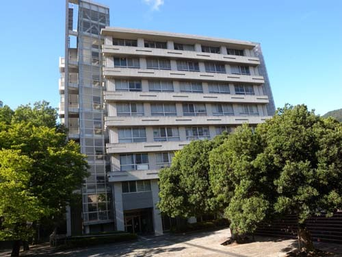
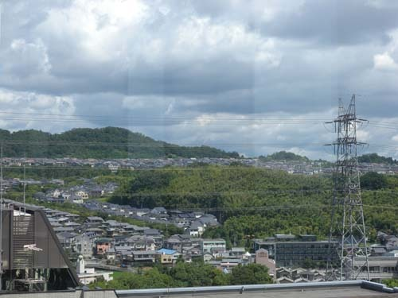
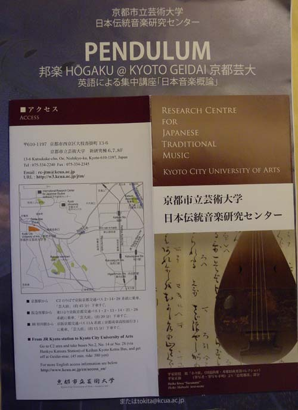
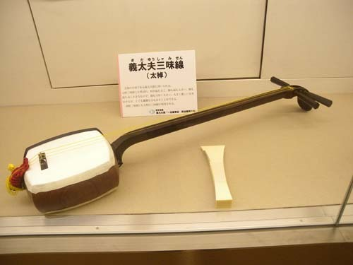
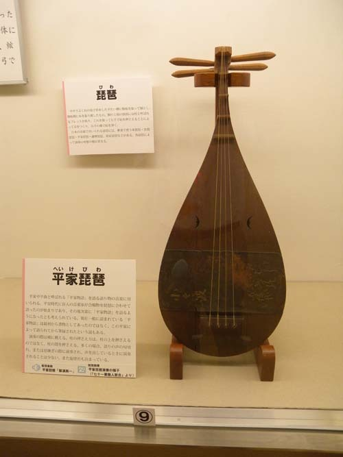
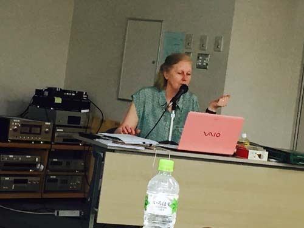
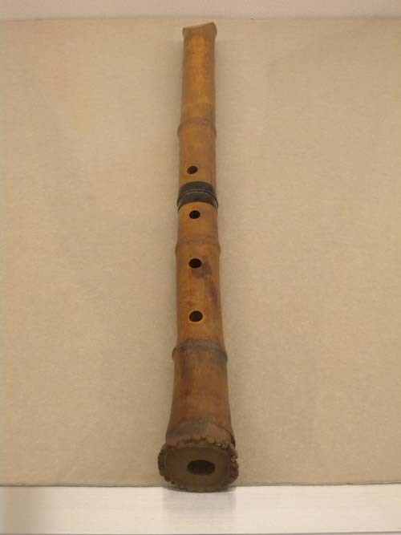
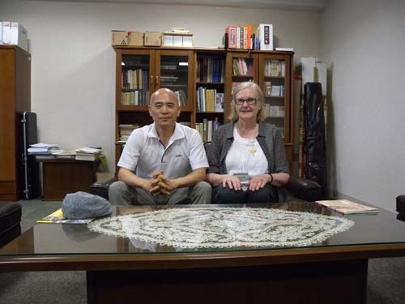
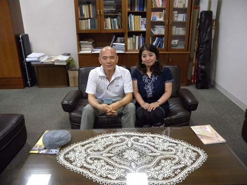

  
교토시립예술대학 일본전통음악연구센터

  
교토시립예술대학에서 내려다 본 시가지

Pendulum

  
기다유 샤미센

  
헤이케 비와

열강 중인 토키타 선생

칸사이 공항에 내린 것이 8월 17일 오전 10시 45분, 외국인 입국자들의 장사진에 끼어 입국수속과 짐 찾기를 마친 뒤 로비로 나오자 12시쯤이었다. 공항과 연결되는 JR 열차 매표소도 북적이긴 마찬가지. 간신히 13시 16분 발 열차로 신오사카 역에 닿으니 14시 5분. 다시 JR 선으로 갈아타고 가츠라가와 역에 도착하니 14시 45분이었다. 역 근처 작은 식당에서 늦은 점심을 해결한 뒤 택시로 에미넌스 호텔(Hotel Kyoto Eminence)에 당도한 시간이 15시 40분. 김포에서 칸사이까지는 1시간 반밖에 안 걸렸으나, 칸사이에서 교토의 호텔까지는 2시간 반이나 걸렸다. 그만큼 일본은 가깝고도 멀었다.

나는 진행 중인 연구 테마의 콘텍스트를 찾아 여기로 온 것이다. 우리 음악과 함께 일본음악, 중국음악은 그 핵심이었다. 그간 해오던 공부를 마무리하려니 그런 것들에 대한 무지가 나를 씁쓸하게 했다. 아무리 현란한 분석의 칼날을 들이댄들 콘텍스트를 고려하지 않은 텍스트가 무슨 의미를 가질 수 있을까. 대충 덮어 둘까 고민하던 중 국악학회에서 이메일이 날아왔다. 교토시립예술대학 일본전통음악연구센타의 ‘일본음악 집중강좌’ 소식이었다. 매력적인 내용의 강의 소식이 그 연구소의 홈피에 일목요연하게 올라 있었다. 망설일 필요가 없었다. 즉시 신청하고 센터의 디렉터이자 강의자인 앨리슨 토키타(Alison Tokita) 박사와 이메일을 주고받기 시작했다.[그는 토키타란 일본인과 결혼하여 토키타란 성을 사용하고 있었다. ‘토키타 센세이’ 혹은 ‘토키타 박사’란 명칭으로 불러주길 원했다. 이하 토키타 선생이라 부른다.] 별 반응을 기대하지 않던 한국에서 누군가가 온다 해서 그랬을까. 아니면 여러 가지의 내 물음들에서 다소간의 어떤 진지함이 느껴져서 그랬을까. 득달같은 답신 메일들로부터 갈수록 끈끈한 정이 묻어나왔다. 귀찮은 숙소 문제까지 슬쩍 떠넘기자, 학교 가까운 곳의 호텔을 찾아 예약과 확인까지 해주는 게 아닌가. ‘동양인으로 바뀐 서양인이다!’라고 나름대로 결론을 내린 것도 그 때문이었다.

만나보니 예상대로, 인자하면서도 카리스마 넘치는 여장부였다. 시종일관 변함없이 조용한 음조로 강의를 이어갔다. 까딱 졸음에 넘어갈 뻔도 했으나, 그럴 때마다 용케도 나를 불러 ‘조 센세이는 어떻게 생각하십니까?’라고 묻는 것이었다. 재미있는 것은 강의의 표제어를 ‘펜듈럼(Pendulum)’으로 달고 있는 점이었다. 펜듈럼이란 좌우로 흔들거리는 ‘진자(振子)’를 뜻하는데, 그렇게 명명한 이유를 묻자, 그는 특허 신청이라도 하려는 듯 그 말을 고안한 점에 대하여 강한 자부심을 보였다. 들어보니 그것은 바로 강의의 요지를 함축한 말이었다.

원래 진자란 하나의 기둥과 또 하나의 기둥 사이를 오가는 물건인데, ‘일본의 전통음악과 서양음악’, ‘중국음악과 일본의 토착음악’, ‘일본의 토착종교인 신도(神道)와 불교’ 등이 그러하고, 서양음악이 우월한 현대 일본에서 학교의 음악교육이 전통음악으로 회귀하거나 서양음악과 일본음악을 결합하려는 젊은 예술가들의 실험을 확인할 수 있는 점도 그러하다는 것이었다.

토키타 선생이 외국출생이긴 하지만 엄연한 일본인인 이상, 그들 음악의 뿌리나 영향의 근원을 우리에게 두지는 않을 것이라 생각한 건 사실이다. 그래서 펜듈럼의 설명을 듣는 순간 그 점을 확인할 수 있었다. 분명 우리 음악에서 찾을 수 있는 사실도 토키타 선생은 시종일관 중국에서 근원을 찾아 대곤 했다.[마지막 날 이자카야(居酒屋)의 자유로운 분위기에서 앞에 자리 한 토키타 선생에게 그 점을 물었다. “‘중국→한국→일본’으로 문화나 예술의 전달과정을 생각하는 것이 합리적이지, 시종일관 ‘중국→일본’으로 직행했다고 한다면, 너무 불합리하지 않은가요? 한국에 증거들이 꽤 많이 남아있는데요?” 하고 묻자, “일본에서는 그 점에 관하여 자유롭게 말하지 못하는 분위기가 있지요. 앞으로 언젠가는 자유로이 말할 수 있겠지요.”라고 매우 간단하면서도 함축적인 답변으로 빠져 나갔다. 시끄러운 이자카야의 분위기에서 주변의 누구도 그 말들을 듣지는 못했다. 나는 그 말을 통해 강의 내내 서양의 지식인답지 않았던 그의 진심을 알고 얼마간 안도하게 되었다!] 그러나 강의실을 가득 메우고 있는 일본인들과, 일본에서 일생을 보내며 일본식 사고로 학문을 해온 그의 생각을 단번에 바꿀 수는 없는 일. 가끔 한국에도 유사한 성향이 있음을 지적해두는 정도로 그치면서 경청하는 수밖에 없었다.

아래와 같이 강의는 강행군이었다. 하기야 몇 천 년의 일본음악사를 단 3일에 해치우는 것처럼 무모한 일도 없을 것이다.

화요일(8/18)

10:00~11:30 일본음악 개관/가가쿠(雅樂)

11:30~13:00 가가쿠와 쇼묘(聲明)

13:00~14:00 점심

14:00~15:30 지우타(地歌), 고토(箏), 샤쿠하치(尺八)

15:30~17:00 악기 연주 실습(고토 혹은 샤쿠하치)

수요일(8/19)

10:00~11:30 비파에 맞추어 노래하는 이야기: 헤이케(平家), 사츠마(薩摩)와 치쿠젠비와(筑前琵琶)

11:30~13:00 노우(能)

13:30~14:00 점심

14:00~15:30 어릿광대 극장에서의 죠우루리(淨瑠璃): 기다유부시(義太夫節)

15:30~17:00 악기 연주 실습

목요일(8/20)

10:00~11:30 가부키(歌舞伎) 극장에서의 죠우루리: 토키와즈부시(常磐津夫節)

11:30~13:00 악기 연주 실습

13:00~14:00 점심

14:00~15:30 나가우타(長歌/長唄<江戶長唄>)

15:30~17:00 나니와부시(浪花節)

18:00 연주회

샤미센(三味線)이 주 전공인 토키타 선생의 입장에서는 답답한 설명 위주의 음악사보다 실연(實演)을 바탕으로 전승되는 음악정신이나 기교를 보여주려 한 듯하다. 주로 무대에서 이루어지는 가무악(歌舞樂)의 실현태를 중심으로 일본음악의 바탕이나 줄기를 설명해 나간 것으로도 그런 점을 짐작할 수 있었다. 수강생 중 노우와 가부키의 전문 배우를 직접 나오게 하여 연기를 보여주며 기교나 의미를 설명하게 하는 등 전통 음악이 현대로 이어지는 지속의 측면을 실감나게 보여주기도 했다.

마지막 날의 연주회는 강의를 종합하는 자리이자 지금도 살아 움직이는 전통을 확인했다는 점에서 색다른 경험의 현장이었다. 각 분야의 전문배우들이 등장하여 2시간 30분 동안 이어나간 무대는 일본 음악의 힘과 음악사적 추동력을 확인할 수 있는 자리이기도 했다. 몇 명만 빼곤 모두 젊은 연주자들이나 배우들이었다는 점은 일본에서 전통음악이 아직도 힘을 바탕으로 지속되고 있음을 보여주는 증거였다. 그들이 서양음악에 젖어 전통음악을 잃어버리는 젊은이들의 짧은 생각을 개탄하고 있었지만, 그나마 우리보다 훨씬 잘 보존ㆍ지속되고 있음은 분명했다. 샤미센을 연주하면서 괴성을 지르거나 도구를 집어던지는 등 관객들의 웃음과 호응을 유발하는 연주자가 있었다. 뒤풀이 자리에서 ‘그 퍼포먼스가 당신의 즉흥적 창안이냐?’고 물으니, ‘언젠가부터 물려오는 대본에 적힌 대로 하는 것’이란 대답이 나왔다. 짐작컨대, 문서화 된 대본들은 그리 오래되지 않았을 터인데, 그렇다면 구전심수(口傳心授)되던 연기나 대사 혹은 노랫말들이 글자로 기록되면서 크게 정비되었을 것이고, 시대를 내려오면서 조금씩 달라졌을 것인데, 분명 그가 내지르던 괴성이나 함부로 지어낸 듯한 몸짓 또한 요즘의 성향에 맞는 것이었다. 쉽게 말하여 시대에 맞추어 변이시켜 오고 있는 일본예술의 모습을 짐작할 수 있었다는 것이다.

\*\*\*

그간 지속해온 연구를 정리하기 위해서라도 콘텍스트의 확충이 필요했고, 그 목적으로 낯선 이곳까지 찾아왔지만, 몇 천 년의 음악사를 뭉뚱그려 3일 만에 주파하고 나니 타임머신을 타고 먼 길을 달려 온 듯 멀미 기운이 느껴졌다. 분명 음악제도의 면에서 일본은 중국이나 우리나라와 다른 면이 많았다. 그러나 노래나 춤을 보면서 또 사이사이의 재담들을 듣고 표정이나 몸짓을 보면서 많이 유사하다는 사실을 분명 깨닫게 되었다. 중국과 한국에 비해 아악은 크게 차이를 보이고 있었으며, 쇼묘(聲明) 같은 불교음악은 이미 우리에게도 익숙한 범패(梵唄)의 일종인데, 자신들의 민속음악으로 분류해 넣고 있었다.

이어받은 것과 그것을 바탕으로 바꾸어 나온 것, 달리 말하면 ‘지속과 변이’의 원리는 다른 모든 지역들과 같은 양상을 보였겠지만, 그 중 어떤 것들을 자신들의 역사적ㆍ문화적ㆍ예술적 소산으로 내세우느냐는 연구자들의 엄정한 분석과 고찰에 달린 문제임을 확인할 수 있었다. 아무리 그들이 자신들만의 예술이라 주장해도 다른 지역에서 온 사람들이 납득할 수 없다면, 그런 주장의 의미는 없어진다. 역사를 날조하거나 공작(工作) 차원으로 분석ㆍ해명하려는 시도가 언젠가는 바로잡힐 수밖에 없는 것도 역사정신은 인간의 얄팍한 지식으로 훼손될 수 없기 때문이다. 그런 점에서 ‘삼국 간 비교 연구의 중요성’은 아무리 강조해도 지나침이 없을 것이다. 앞으로 아시아 3국이 교차로 이런 강의를 마련하고 상대국 학자들에게 들려줄 수 있다면, 조만간 역사의 왜곡문제는 자연스레 정리되어 갈 것이란 생각이 들었다. 그것만도 큰 수확 아닌가.

xml:namespace prefix = "o" /  
                                         샤쿠하치

 

  
                                   일본전통음악연구센터에서 토키타 소장과 함께

 

 

  
                           일본전통음악연구센터에서 다케노우치 교수와 함께

공유하기

게시글 관리

**백규서옥\_Blog ver.**

[저작자표시 비영리 변경금지
(새창열림)](https://creativecommons.org/licenses/by-nc-nd/4.0/deed.ko)