  
헤이안 신궁의 웅장한 도리이

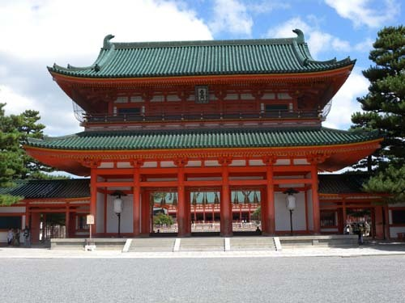  
헤이안 신궁의 응천문

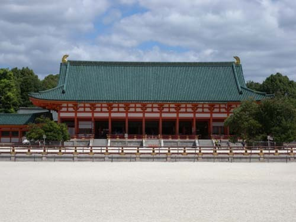  
헤이안 신궁의 본전

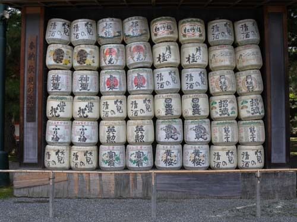  
헤이안 신궁의 봉물인 각종 술

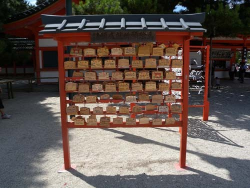  
헤이안 신궁의 뜰에 세워진 기원 팻말들

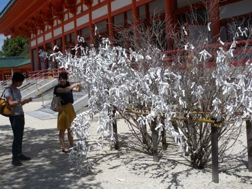  
헤이안 신궁의 본전 앞에 세워진 기원 나무들

나는 어려서부터 ‘일본인들은 귀신들과 함께 산다’는 말을 들어 왔고, 일본에 올 때마다 그 말이 빈말이 아니었음을 깨닫는다. 일제 강점기 내내 우리는 그들의 신을 모신 집(즉 신사)에 참배할 것을 강요당했고, 지금도 일본 총리 아베의 신사참배가 세계적인 이슈로 지속되고 있다. 우리나라와 중국은 한사코 일본 총리가 신사를 참배하면 안 된다고 목소리를 높인다. 그가 참배하려는 야스쿠니 신사라는 곳이 바로 우리를 괴롭힌 일본 전범들의 영혼을 모아놓은 곳이기 때문이다. 말하자면 전쟁의 책임을 자각하고 반성해야 할 일본 정치의 책임자가 오히려 전범들을 참배하다니, 어불성설이라는 것이다.

양국에서 하도 성토를 해대니 그도 어쩔 수 없는 듯 가끔 ‘봉납(奉納)’으로 대신하기도 하는 모양이다. 그러나 봉납 즉 ‘사찰(寺刹)이나 신사(神社) 등에 금품을 기부하는 행위’야말로 오히려 더 지극한 정성의 표시일 수 있다. 큰 신사들의 앞마당엔 술통들을 몇 단으로 쌓아올려 진열하고 특정 주류회사의 봉납물임을 표시해 놓고 있음을 보게 된다. 우리나라에서는 그저 술이나 만들어 떼돈을 버는 그런 회사들이 고약하게도 일본에서는 애국의 결사체임을 자랑하고 있지 않은가. 우리의 공적(公敵)이 되어 있는 아베도 아마 그런 효과를 노렸으리라. ‘주변의 국가들이 하도 성토해대는 바람에 직접 참배는 못하니, 공물로나마 지극한 마음을 표할 수밖에 없다’고 말이다. 여기엔 두 가지 노림수가 있을 것이다. 중국과 한국을 적으로 돌림으로써 자기네 국민을 단합시키겠다는 대외 정치적 노림수가 그 하나요, 일본인들이 ‘신처럼 떠받드는’ 재물을 아낌없이 봉납함으로써 자신도 신사의 귀신들에게 보통 국민들 이상의 정성을 표했다는, 대내 정치적 노림수가 다른 하나다. 그러니 그로서는 신사참배 문제로 외국에서 일어나는 논란이 하나도 손해 날 일이 없는 셈이다. 나는 오히려 그가 두 나라의 그런 반응들을 은근히 즐기고 있다고 보는데, 나만의 느낌일까.

일본에 와서 놀라는 일이 있다. 개인들의 집에는 개인의 신사가, 공동체에는 공동체의 신사가, 국가에는 국가 규모의 신사가 있다는 점이다. 말하자면 개인에서 국가에 이르기까지 그들을 하나로 묶는 정신적 결사체가 바로 신사임을 확인하게 된다. 몇 번 되지는 않으나, 일본에 오면 주택가를 돌며 개인 신사들을 구경하거나 마을 단위 혹은 국가 단위의 신사들을 구경하며 그들의 마음을 헤아리는 것이 취미의 하나가 되었다. 이번에도 역시 마찬가지. 큰맘 먹고 헤이안 신궁(平安神宮), 야사카 신사(八坂神社), 요시다 신사(吉田神社) 등을 가 보았고, 동네를 걸으며 개인 집의 신사들을 곁눈질하기도 했다. 그 뿐 아니다. 심지어 절에도 신사가 있었으니, 키요미즈 데라(淸水寺)에서 확인한 지슈신사(地主神社)가 그런 예였다. 어쩜 교회에도 있을지 모르는 일인데, 거기까진 확인하지 못했다.

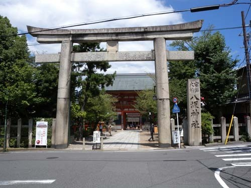  
야사카 신사 입구의 도리이

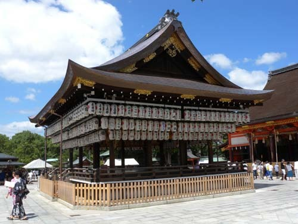  
야사카 신사의 본전

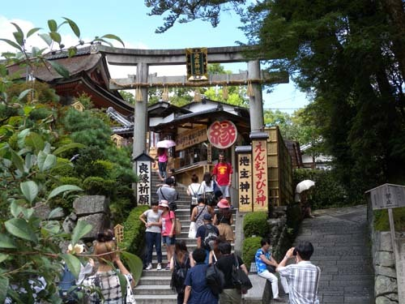  
키요미즈 데라(淸水寺) 안에 세워진 지슈신사

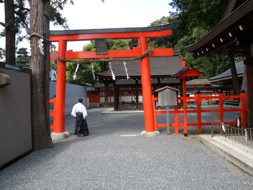  
요시다 신사

  
요시다 신사의 본전에서 기원하는 사람들

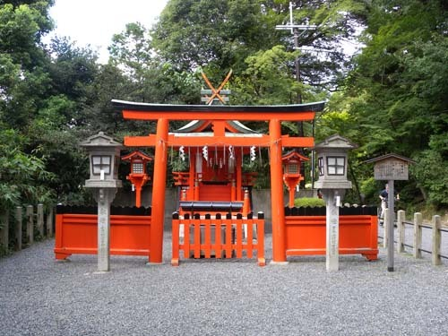  
요시다 신사에 딸린 산음신사(요리와 음식의 신을 모셨음)

그렇다면 그들은 어떤 귀신들을 모시고 사는 것일까. 마을이나 거리를 걷다 보면 작고 큰 도리이(とりい: 鳥居)들이 있고, 그것들을 통과한 안 쪽에 신전이 있었다. ‘鳥居’는 ‘鷄居(にわとりい)’로서 진언종을 설립한 구카이가 신성한 의식공간을 표시하기 위해 사용하기 시작했다고도 하고, 신도에서 닭을 신의 전령으로 생각하기에 ‘닭이 머무는 자리’라는 뜻으로 그런 말을 썼다고도 한다. 그 외에도 여러 설이 있으나, 아직 정설은 없다. 다만, 내 보기에 도리이가 성(聖)의 세계와 속(俗)의 세계를 구분하는 경계로 사용된 것만은 분명하다. 인간의 세계에서 도리이를 통과하면 신의 세계라는 것이다. 개인의 집들에 설치된 개인 신사들에는 도리이를 세울 수 없으니, 어쩌면 그 신사 자체가 외부로부터의 액(厄)을 막아주는 방책 역할을 해온 듯했다. 집안이 산 사람들의 공간이긴 하나 귀신들과 공존하면서 외부로부터의 삿된 기운을 막아 주는 신성한 공간일 수 있을 것이다. 그러나 도리이를 통과한, 이른바 성의 세계에서 이루어지는 모든 행위도 속의 세계를 상징하는 돈으로 철저히 계산되고 있었다. 기복(祈福)이나 제액(除厄), 결혼 등 모든 행위에 돈이 따르고, 돈의 액수에 따라 복의 크기가 계량되는 속의 원리가 충실히 재현되는 곳이었다. 일본인들의 자기모순의 이기적인 행태는 속의 원리로 성의 세계를 재단하려는 데서 나타나고 있었다. 이른바 카오스의 재현, 바로 그것이었다. 아니, 내 관점에서 아직 일본은 본태적 카오스를 벗어나지 못한 공간이었다.

사실상 어릴 적부터 신도에 충실한 인간상으로 길러지는 것이 일본인들이었다. 아이들은 수시로 큰 신사에서 복전을 내고 줄을 흔들어 방울소리를 내며 복을 기원하는 부모를 보았을 것이고, 성장한 뒤 그들도 그런 부모가 되었을 것이다. 그 뿐이랴. 어려서부터 집 앞에 설치한 신전에서 나지막한 목소리로 열심히 기원하는 할머니나 어머니의 모습은 일상의 큰 부분으로 마음속에 각인되었을 것이다. 장성한 뒤 짝을 만나 신사에서 결혼식을 올리는 경우가 많았던 것도 사실이다. 그러고 보면 아베를 비롯한 일본의 정치가들이 신사를 찾아 참배하는 것은 자신들이 살아온 삶의 한 부분임에 틀림없다. 다만 한사코 전범들을 모아놓은 야스쿠니에서, 그것도 패전일에 참배함으로써 무언가를 노리는, 그 정치적 야욕이 미울 뿐이다. 자신들의 순수한 종교의식을 지키는 일에만 충실하다면야 누가 딴죽을 걸 수 있겠는가. 피해자들의 속마음을 긁어놓으려는 못된 심보가 고약한 것이다.

며칠 전 길 가는 도중, 구부정한 할머니를 보았다. 골목 모서리의 빈틈에 세워진 작고 초라한 신사 앞에 꽃바구니를 든 채, 신이 좌정한 곳을 올려다보며 쉼 없이 중얼거렸다. 말뜻은 모르겠으나, 무언가를 간절하게 기구하고 있었다. 굽은 허리와 주름 진 얼굴이 많은 사연을 숨기고 있었다. 그 할머니가 기구하는 것은 ‘궂은일의 해결’일 수도, ‘좋은 일에 대한 감사’일 수도 있었다. 어느 쪽이든 경건한 그 할머니의 모습에서 신도 신앙의 긍정적인 면을 엿볼 수 있었다. 어엿한 종교이든, 개인 차원의 소박한 믿음이든, 순수하기만 하다면야 굳이 탓할 이유가 없다. 그것들이 국가주의와 결합되어 집단적 야욕 충족의 수단으로 이용될 때, 가공할 정도의 부정적인 힘을 발휘하는 것이다. 저 할머니야 야스쿠니에 합사된 전범들의 존재나 그걸 이용하려는 정치인 아베의 욕망을 어찌 알겠는가. 필시 자신이나 가족의 문제를 신에게 간구한 데 불과했으리라.

 

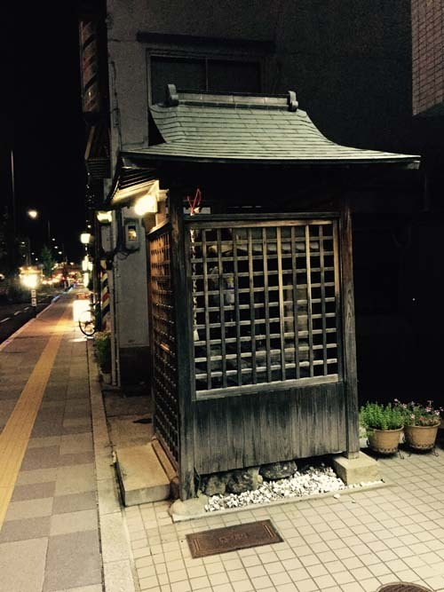  
큰 길가 가게집의 신사

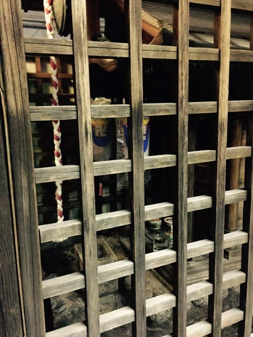  
가게집 신사 내부의 모습

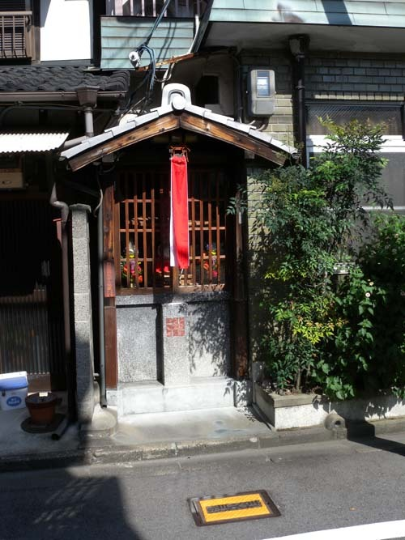  
동네의 신사

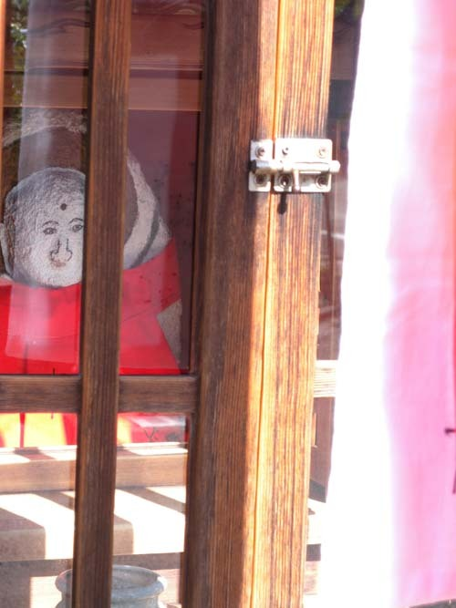  
동네집 신사 내부에 모신 신의 모습

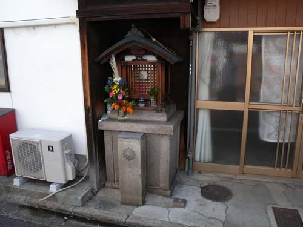

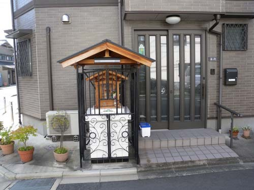  
개인 집 신사

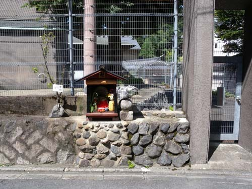  
키요미즈 데라 아랫 동네 개인 집의 신사

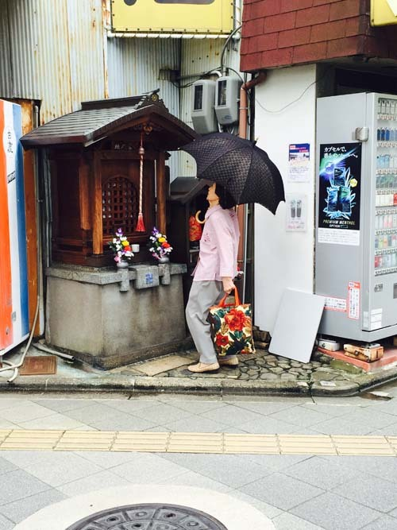  
길가 신사에 꽃을 바치러 와서 기원을 하고 있는 할머니

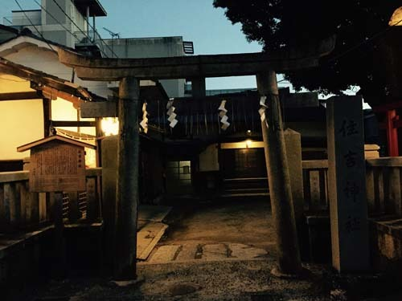  
호텔 옆에 있던 동네의 신사 '주길신사'

 

귀신은 일본 도처에 있었다. 야사카 신사에도 본전을 둘러싸고 많은 잡신들이 별도로 모셔져 있었으며, 요시다 신사에도 본전에서 멀리 떨어진 이곳저곳에 작은 신사들이 흩어져 있었다. 아마 개인들의 신사에는 그들의 조상신이 모셔져 있을 것이다. 그러나 개인들에게도 조상신이 전부는 아닌 듯했다. 여러 잡신들이 어우러진 공간이 바로 일본의 신사인 것도 그 때문이다. 그래서 일본의 신사는 로마의 판테온(Pantheon) 같은 곳이 아닌가 싶다. 사실 그들이 모신 존재들이 악한 신령들이 아닌 이상, 그 신들의 이름으로 악한 짓을 저질러선 안 된다. 온갖 귀신들에 사로잡힌 일본이 한 발 앞으로 나아가기 위해서는 아집과 편견, 이기의 굴레에서 벗어나야 한다. 아집과 편견, 이기를 보호해주는 것이 귀신들의 임무가 아니라는 점을 빨리 깨달아야 한다. 어릴 적부터 집 앞의 신사, 동네의 신사, 지방과 국가의 신사를 출입하며 꿈을 키웠을 정치인 아베도 이젠 가슴을 열어야 한다. 나 혼자만 사는 게 세상은 아니라는 점, 일본인들을 귀신들의 울타리에서 벗어나 세계시민이 되도록 하는 게 미래지향적 정치인의 의무라는 점 등을 빨리 깨달아야 미구에 닥칠 또 하나의 비극을 면하게 될 것이다.

\*\*\*

이번의 일본 행차에서 나는 신사가 일본인들의 과거, 현재, 그리고 미래를 읽을 수 있는 교과서임을 비로소 깨닫게 되었다.

공유하기

게시글 관리

**백규서옥\_Blog ver.**

[저작자표시 비영리 변경금지
(새창열림)](https://creativecommons.org/licenses/by-nc-nd/4.0/deed.ko)