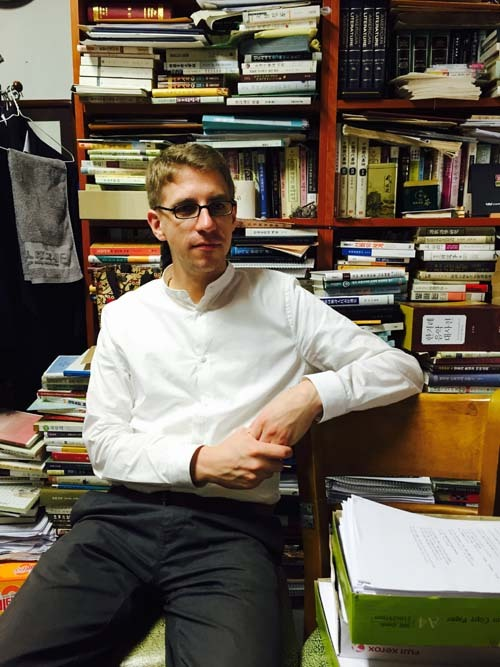
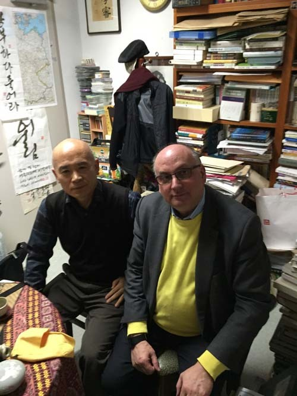
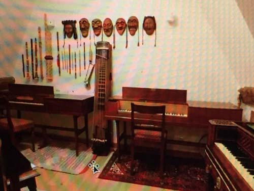
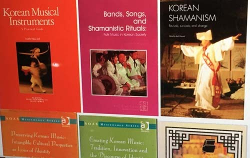
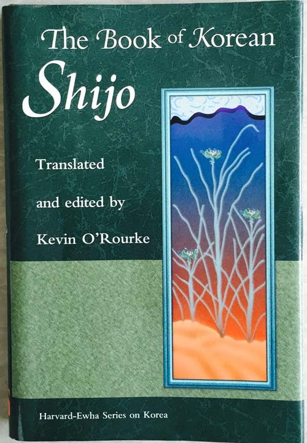
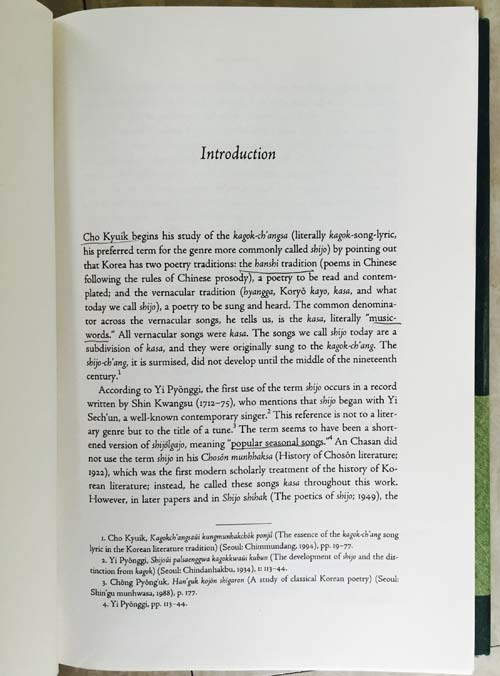
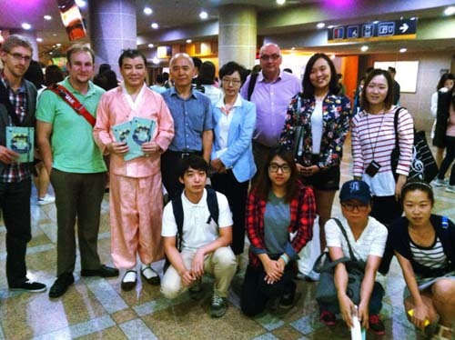
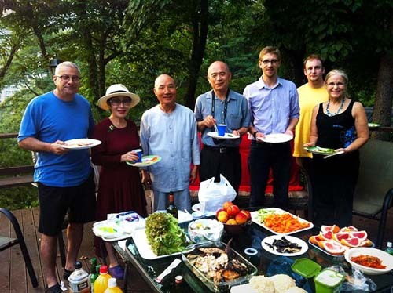

  
한국을 떠나기 전 백규서옥을 방문한 세바스티안

  
한여름날의 백규서옥에서 게리(Gary Younger), 백규, 세바스티안

  
백규서옥을 방문한 세바스티안의 지도교수 키이스 하워드(Keith Howard) 교수와 함께

  
한 겨울의 숭실 교정에서 세바스티안과 키이스 교수

  
 한국의 전통악기들과 탈들이 진열된 키이스 교수 자택 거실 모습

  
키이스 교수의 한국음악 관련 디지털 자료들

며칠 전 일본의 교토에서 세바스티안으로부터 문자 메시지를 받았다. 내가 국내에 있는 줄 알고 전화했다가 해외로밍으로 연결되자 다급하게 문자를 보낸 것. ‘연수기간이 끝나 8월 31일 런던으로 돌아가는데, 한 번 뵙고 싶다’는 내용이었다. 점심약속으로 간신히 잡아놓은 27일 12시 정각에 독일 술 한 병을 든 그가 찾아왔다. 그간 머물렀던 한국학중앙연구원에 다시 돌아가 짐 싸는 일을 마무리해야 하므로 점심 식사의 여유가 없다는 그를 잡아놓고, 겨우 30여 분 간 석별의 대화를 나누었다.

1986년생이니, 우리 나이로 스물아홉의 약관이었다. 함부르크 출생의 독일인. 이른 나이임에도 많은 학교들과 많은 나라들을 거쳐 온 점이 놀라웠다. 1997~2006년까지 미션계 김나지움에서 공부했고, 그 사이의 1년(2003~2004) 동안은 교환학생으로 남미 파라과이의 아순시온을 다녀오기도 했다. 김나지움을 졸업한 뒤  2007~2012년 함부르크 대학에서 조직음악학[혹은 과학음악학: systematic musicology]을 전공하여 ‘우수한 성적(Excellent grade)’으로 학사학위를 받았고, 그 기간 중 터키 이스탄불의 빌기대학교(Bilgi University)에서 1년간(2008~2009), 서울대학교에서 1년간(2010~2011) 교환학생으로 머물기도 했다. 2012~2013년에는 런던대학교의 동양ㆍ아프리카학 대학(SOAS: The School of Oriental and African Studies)에서 민족음악학(ethnomusicology) 석사학위를 우수한 성적으로 마쳤고, 2013년부터 같은 대학에서 민족음악학의 권위자 키이스 교수(Dr. Keith Howard)의 지도로 박사과정을 이수하는 중인데, 작년부터 지금까지 1년간 한국학중앙연구원에서 한국 시조에 관한 현장연구를 수행하다가 이번에 체류기간 만료로 떠나게 된 것이다.

그는 독일에서 태어나 유년기를 보내고, 철이 들면서 파라과이ㆍ터키ㆍ한국ㆍ영국 등 세계를 무대로 자신의 꿈을 키워가는 수재였다. 그 과정에서 모국어인 독일어 외에 영어ㆍ스페인어ㆍ터키어ㆍ프랑스어ㆍ라틴어 등을 유창하거나 능숙하게 구사했고, 한국어 실력 또한 어떤 외국인들보다 월등했다. 기필코 최단기간인 내년에 박사학위를 받겠노라는 그의 결심이야말로 모험에 가까운 그동안의 해외 편력으로부터 길러진 용기의 소산이리라.

그는 우리의 시조에 관해 큰 관심을 갖고 있었다. 그가 쓰려고 하는 박사논문 또한 시조에 관한 것이었다. 그는 시조의 음악적 본질이나 텍스트와 콘텍스트에 관하여 한국의 누구보다도 폭 넓고 깊은 통찰력을 갖고 있었다. 그것은 그가 한국에서 전통가곡이나 시조의 명창들을 만나 창법과 이론을 익히려고 애쓰면서 얻게 된 개인적 자산이기도 했다. 그의 지도교수인 키이스 교수 역시 우리 음악에 관한 몇 안 되는 외국인 전문가였다. 사실 세바스티안이 오래 전부터 나를 알게 된 데는 특별한 인연이 있었다. 경희대 영어영문학부 교수로 정년을 한 케빈 오록(Kevin O’Rouke) 교수는 탁월한 감성으로 한국문학을 꾸준히 서양에 소개해 왔는데, 키이스 교수의 오랜 친구이기도 했다. 그런데 케빈 오록 교수가 13년 전 펴낸 자신의 저서 The Book of Korean Shijo(Harvard-Ewha Series on Korea, Harvard University Asia Center, 2002)의 첫머리에 내 견해를 인용함으로써 키이스 교수도 나를 알게 되었고, 다시 그가 세바스티안에게 이 책을 사서 읽어볼 것을 권함으로써 세바스티안 또한 나를 알게 된 것이었다. 그가 한국 오는 기회에 나를 찾아온 것도 바로 그 때문이었다.

  
케빈 오록 교수의 시조 관련 저서

  
케빈 오록 교수 저서의 서론 부분

 

\*\*\*

최근 나는 일본에서 호주 출신의 토키타 박사(Dr. Alison Tokita)로부터 일본음악에 관한 강의를 들었다. 강의내용도 중요했지만, 일본음악이나 일본문화에 대하여 영어권 전문가로서의 토키타 박사가 갖는 사회적 위치나 의미가 각별함을 깨닫게 되었다. 토키타 박사 같은 자발적 외국 학자들 아니면 누가 세계에 일본음악이나 문화를 선전하고 유포시킬 것인가. 서양인이 영어로 외국의 수요자들을 상대로 한국음악이나 문화를 강의한다면, 그보다 더 귀한 일이 어디에 있을까. 내가 세바스티안을 보며 무릎을 친 것도 그런 이유 때문이었다. 그가 앞으로 더 노력한다면 한국어도 발전할 것이고, 한국음악이나 문화에 대한 조예 또한 깊어질 것이니, 그는 우리에게 일본의 토키타 박사 못지않은 소중한 존재다.

민족문화를 세계에 선양한답시고 엉뚱한 사람들을 수억원씩 주며 불러다가 1회성 돈 잔치나 벌이는 우리나라 문화 담당부서는 참으로 한심할 따름이다. 앞으로 세바스티안 같은 외국의 젊은 인재를 발굴하여 우리 음악과 문화의 전도사 역할을 하게 한다면, 큰 돈 들이지 않고도 엄청난 효과를 볼 수 있을 것이다. 세계의 민족음악학 전공자들을 불러모아 한국음악과 문화의 우수성을 외국어로 설명하게 함으로써 우리 문화의 세계화를 앞당기도록 하는 것도 그만이 할 수 있는 일이기 때문이다.

꽉 막힌 누군가는 말할 것이다. 왜 외국인에게 귀한 교수자리를 안겨주며, 왜 한국어를 놔두고 영어로 외국인들에게 강의를 해야 하느냐고. 그런 류의 답답한 사고방식 때문에 지금 우리의 전통문화나 예술은 비좁은 이 나라의 울타리를 벗어나지 못한 채 시들어가고 있다. 세계인들이 배우고 익히며 재창조ㆍ재생산을 해야 그나마 생명을 유지할 수 있을 텐데, 그러지 못한 지금의 상황이 암담하다. 우리 스스로가 민족의 전통문화이나 예술을 외면하는 현실이니 더 말해 무엇 하겠는가.

이제라도 우리 전통음악이나 문화의 외국인 전문가를 양성하는 데 깜짝 놀랄 만큼 과감한 투자를 해야 한다. 만약 우리가 세바스티안 같은 젊은 인재를 한국 전통음악과 문화의 전문가로 키운다면, 우리 전통음악과 문화의 세계화는 그 시점부터 가속화될 것이다. 우리의 정신문화를 국가와 민족의 울타리 안에 가두어 둠으로써 시들게 할 수는 없다. 문호를 개방하고 보편적 지식과 교양에 목마른 세계인들에게 들려주고 보여줄 때 우리 문화는 세계인들의 공유물이 되고, 꾸준히 발전할 수 있다. 세바스티안은 그런 점에서 무한한 잠재력을 지닌, 우리의 보배로운 인재다.

  
문현 선생의 노래 발표회가 끝나고. 국립국악원에서

  
선무 치료의 대가 이선옥 박사 자택에서의 파티

공유하기

게시글 관리

**백규서옥\_Blog ver.**

[저작자표시 비영리 변경금지
(새창열림)](https://creativecommons.org/licenses/by-nc-nd/4.0/deed.ko)