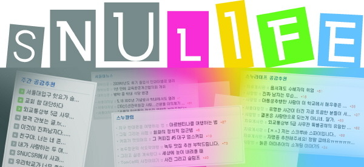

역사의 고비들을 지나며 많은 차별을 겪어 온 것이 우리 민족이다. 대외적으로는 중국, 일본, 서구세계 등이 차별을 자행했거나 하고 있고, 대내적으로는 왜곡된 권력의 지형에 의한 지역과 계층적 차별의 구도가 지속되고 있다. ‘식민 : 피 식민’은 식민주의 시대의 도식화된 차별구도였고, 그로 인한 민족적 자존심의 끔찍한 손상은 아직도 치유되지 않고 있다. 탈 식민의 조류가 거세게 소용돌이치고 있지만, 차별구조는 보다 예리하게 내면화하고 있는 작금의 상황이다. 일본인들에게서, 백인들에게서, 그토록 차별과 멸시를 받고 살아 왔으면서도 일자리를 찾아 온 동남아 사람들과 흑인들을 잔인하게 차별하는 우리 아닌가. 오랜 기간의 학습을 통한 만큼 내면에 들어앉은 차별구조의 똬리를 집어던질 법도 하건만, 우리는 ‘차별구조의 예각화’라는 폐습의 대물림을 반복하고 있다.

엊그제, 어떤 신문에 서울대생들의 인터넷 커뮤니티 ‘스누라이프’의 이야기가 보도되었다. 스누라이프란 15만여 명의 서울대 재학생과 졸업생들이 정보를 공유하고 의견을 펴는 인터넷 사이트인데, 최근 다른 대학 학부 출신 서울대 대학원생들을 커뮤니티에서 쫓아내야 한다는 주장이 이 사이트의 게시판에 빈번히 올라오고 있는 것이 문제의 핵심인 모양이다.

  
대학신문(大學新聞)(2010. 09. 05.) 기사에서

9만 평방킬로미터 남짓의 작은 나라에 올망졸망 200개가 넘는 4년제 대학들이 모여 서열화와 차별의 향연을 펼치고 있는 것이 바로 우리의 모습이다. 그 중 서울대 사람들이 떠는 위세는 참으로 가관이다. 이른바 ‘순혈주의’로 미화되는 배제의 논리, 그 연원이야말로 지독하게도 식민주의적 차별의식으로부터 나온 것일 수밖에 없다. ‘제대로 된’ 학자 하나, 사상가 하나, 정치인 하나, 기업인 하나 키워내지 못하면서, 이른바 ‘최고 학문의 전당’임을 자랑하는 모습에서 우리의 천박성은 극명하게 확인된다. 가까스로 식민주의의 터널을 빠져나와 아직도 정신을 차리지 못한 우리의 자화상이 바로 이 대학이고, 휘청대는 한국 지식사회의 민낯 또한 이 대학에서 찾을 수 있다.

물론 우리가 이 대학만 나무란다면, 너무 불공평한 일일 것이다. 무소불위의 힘을 지닌 정권과 교육정책 당국, 아니 무엇보다 이 대학에 대하여 무조건적 신뢰를 보내는 국민 전체의 맹목을 질타해야 함에도 대학만 나무라는 것은 문제의 본질을 망각하는 일일 수 있기 때문이다. 그런 맹목이 이 대학을 망치고, 지식사회를 망치며, 궁극적으로 나라까지 망치게 될 거라는 전망이 그리 어렵지 않음에도, 우리는 날만 새면 줄 세우기와 차별의 무익한 수작으로 날밤을 지새우고 있기 때문이다. 그럼에도 불구하고 ‘스누라이프에 횡행한다는’ 서울대생들의 언동은 새삼 근원을 찾아 뿌리를 뽑을 여유가 없을 정도로 다급한 ‘발등의 불’이다.

어찌 학생들만 나무랄 일인가. 자식은 부모의 거울이고, 학생은 선생의 거울이다. 부모의 입장에서, 선생의 입장에서 자신들이 잘 하는가 못하는가를 알려면 자식이나 학생을 보면 안다. 순혈주의란 지금의 학생들이 만들어낸 문화가 아니다. 식민 시대부터 서울대에 온존해 있던 ‘독점적 배타주의’의 다른 이름일 뿐이다. 대학 특히 서울대학의 교수자리는 으레 서울대 출신이 맡아야 하는 것이 상식으로 통용되어온 그간의 세월이었다. 아무리 학문적으로 특출한 업적들을 갖고 있어도, ‘서울대학도 못 나온 주제에 서울대생들을 어떻게 가르칠 수 있느냐’는 논리가 바탕에 깔려 있는 한, 순혈주의를 벗어날 수 없다. 대학 경쟁력으로 세계 최고를 자랑하는 미국의 대학들에 가보라. 자교 출신들은 아예 그 학교에 서류를 낼 엄두도 못 내도록 되어 있다. 기껏 5% 내외의 자교 출신 교수진을 갖고 있는 것이 세계 유수의 대학들이다. 어느 대학을 나왔든 ‘해당 분야에서 이룩해온 업적이나 앞으로의 가능성’이 인재를 뽑는 기준일 뿐, ‘서울대를 나온 사람만 서울대 교수가 될 수 있다’는 서울대 식(혹은 한국식)의 배타적 기준은 그들 마음속에 아예 없다. 여기서 생겨나는 대학의 경쟁력은 누구도 따라잡을 수 없는 것이다.

서울대나 그 언저리 대학들이 형성하는 ‘공고한 카르텔’에 지체되는 것은 나라와 민족의 발전이다. 열린 마음으로 모든 이들을 포용하고 경쟁해야 할 새싹들이 배타적 순혈주의로 무장하게 된 것도 이들 폐쇄된 공간에서 대물림해온 ‘못난 카르텔의 논리’ 탓이다. ‘그다지 합리적이지 못한 입시제도’와 그 제도에 의한 순간적 ‘간택(揀擇)’을 일생 지속되는 배타적 권리의 근거로 삼을 수는 없다. 그리고 그런 것을 이제 막 대학에 들어온 젊은이들의 행동지표로 삼게 해서도 안 된다. 학생들로 하여금 겸허한 마음으로 열심히 노력하여 좋은 업적을 내고, 그것을 바탕으로 공동체에 기여하는 인물이 되도록 인도하는 것이 그나마 지금의 서울대가 국가와 민족에게 기여할 수 있는 유일한 길이다. 그런 생각만이 서울대 스스로의 경쟁력을 갖추게 하고, 지식사회를 변화시킬 뿐 아니라, 궁극적으로 우리나라를 건전하게 바꾸는 출발점이 될 수 있을 것이다. 스누라이프 게시판 논란은 서울대 혹은 한국 대학사회의 민낯을 보여주는, 하나의 상징적 사건일 뿐이다.

공유하기

게시글 관리

**백규서옥\_Blog ver.**

[저작자표시 비영리 변경금지
(새창열림)](https://creativecommons.org/licenses/by-nc-nd/4.0/deed.ko)