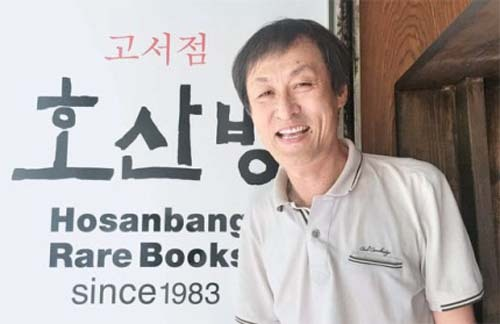
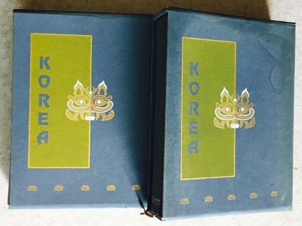
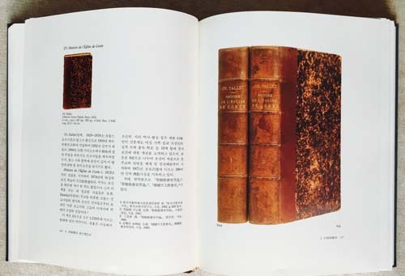
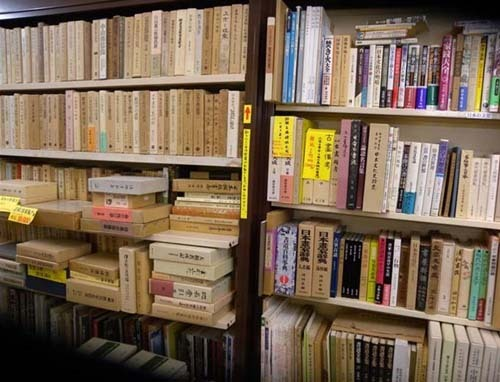
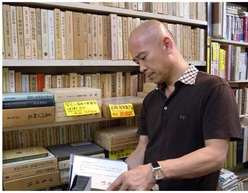

  
호산방의 박대헌 사장

고서점 호산방(壺山房).

그 호산방이 문 닫았다는 소식을

어제 날짜 신문에서 접했습니다.

바닷물에 모래성 무너지듯

수많은 점포들이 어제도 오늘도 사라지는 세상.

‘서점이 어디 일반 가게와 같은가?’라는

제 믿음도 이제 접을 때가 된 것일까요?

십 수 년 쯤 되었나요? 종로서적이 닫을 때

며칠 동안 마음이 허전했었는데,

그 때보다 더 한 허탈감입니다.

사실 책에 굶주려 지내던 대학원 재학시절엔 고서점들을 뻔질나게 찾았지요.

호주머니엔 구겨진 지전 몇 장과 동전 몇 낱이 전부였는데,

무슨 호기로 그런 책들을 탐내곤 했는지...

뒤통수에 꽂히는 주인장의 눈총을 느끼면서도

이것저것 만지작거리며 마냥 시간이나 끌기 일쑤였지요.

미련을 남겨 둔 채 서점 문을 나서는 마음은 왜 그리도 허전했을까요?

그로부터 꽤 오랜 시간이 흐른 뒤

박대헌 사장님을 제 연구실에서 뵈었지요.

박 사장께서 ‘150만원 정가의 책’을 저술ㆍ출판하여

한국 지식사회를 경동(驚動)시킨 시점.

그 책을 앞에 두고

궁핍했던 시절 고서점들에서 입은 상처를 차마 거론할 순 없었지요.

그 후로 세월은 종잡을 수 없는 방향으로 흘렀고,

고서점들 또한 많은 시련과 변신을 시도했겠지요.

결국 그 험한 물결을 되돌리지 못한 채

호산방은 장렬히 문을 닫은 것 아니겠는지요?

지금 제 나이 또래의 ‘우국지사(憂國之士)’라면

누군들 이 세월의 변화를 반길 수 있을까요?

얄팍한 매명(賣名)의 상술(商術)들을 보시나요?

‘인문학’의 두겁을 뒤집어 쓴 채 세상을 호리는 사람들을 말이지요.

세상을 뒤덮은 인터넷의 그늘 아래

자리 깔고 펼치는 개그를 ‘학문’이라 착각하고 있는 세태를 말이지요.

일본, 미국, 유럽 등 선진국에

아직도 멋진 고서점들이 즐비한 이유를 잘 모르겠어요.

할아버지 할머니들이 아이들의 손을 잡고 동네 도서관을 출입하고,

시장을 다녀오는 아주머니들의 장바구니 속에 도서관의 책이 한 두 권씩 들어 있는 모습.

그들의 멋진 건물이나 번쩍이는 거리의 모습보다 훨씬 부러운 광경이지요.

책을 찢어 벽지로 쓰고, 절구에 빻아 지공예의 재료로 쓰던 시절이 엊그젠데,

이삿짐센터의 제1 기피 대상이 책 박스라는 사실을 아시지요?

그래서 ‘노마드의 임시 공동체’인 우리네 아파트 쓰레기장,

그 공간의 단골손님이 멋진 장정의 책들이라는 사실도 잘 아시지요?

역사의 공간으로 사라진 호산방.

그 호산방을 다시 태어나게 할 순 없을까요?

발효되는 고서의 향기 그득한 옛날의 서점으로,

힘들 때면 찾아가 고서들과 대화하며

위안을 받을 수 있는 휴식의 공간으로 말이지요.

우린 자손들에게 무얼 남겨야 할까요?

날카롭게 벼린 이데올로기?

번쩍이는 빌딩?

엄청난 파괴력의 (핵)무기?

국내외의 페이퍼 컴퍼니들에 숨겨둔 천문학적 재산?

⋮

동네마다

멋진 고서점 하나만이라도

제대로 건사할 수 있다면

이보다 더 큰 선물이 어디 있을까요?

문화나 전통, 역사란 말이 매우 추상적으로 들리신다면

선진국의 멋진 고서점에 한 번 들러 보세요!

나이 먹은 책들의 숲에서 아이들과 함께

그 책들의 나지막한 음성을 들어보세요.

그 음성에 녹아있는 것이 바로 문화, 전통, 역사이지요.

그리고 그것들이 어우러져 만들어내는 것이 미래에 대한 통찰이지요.

  
박대헌 사장의 저서 <<Korea: 서양인이 본 조선 조선관계 서양서지>>(호산방, 1996)

  
<<Korea: 서양인이 본 조선 조선관계 서양서지>>의 내용

  
박대헌 사장의 헌사(<<Korea: 서양인이 본 조선 조선관계 서양서지>>)

  
일본 천리시내의 한 고서점

  
일본 천리시내의 고서점에서

공유하기

게시글 관리

**백규서옥\_Blog ver.**

[저작자표시 비영리 변경금지
(새창열림)](https://creativecommons.org/licenses/by-nc-nd/4.0/deed.ko)