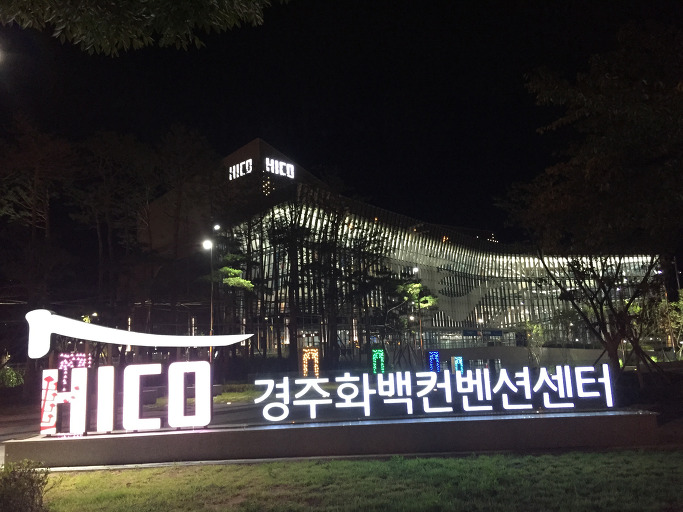  
행사가 열린 컨벤션 센터

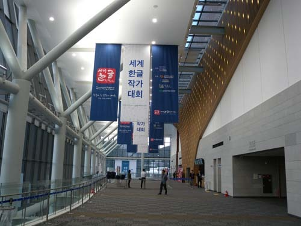  
컨벤션 센터 로비

세계 한글작가대회에 다녀와서

해외 한인문학에 대한 작은 발표를 해달라는 이명재 교수의 부탁을 받고, 첨엔 망설였다. 창작문인들의 모임에 애당초 별 흥미도 없었을 뿐 아니라, 고도(古都)를 제대로 가꾸지 못한다는 생각을 갖고 있던 터라 경주라는 지역도 별로 맘에 들지 않았기 때문이다.

개회식과 환영만찬이 열린 경주화백컨벤션센터. 약간 늦게 도착한 개회식엔 사람들이 그득했다. 간신히 자리를 잡고 앉아 둘러보니, 황우여 부총리나 김관용 지사 등 헤드테이블에 자리 한 몇몇 인사들을 빼곤 모두 문인들이어서 낯설었다. 한글 영상[위대한 한글, 위대한 한국문학]이 상영되었고, 쾌팀의 대북 공연 <직지심경의 노래>가 분위기를 돋우었으며, JL싱어즈의 한글날 노래 <내나라 내겨레, 석굴암>이 우렁차게 대회장을 울렸다. 국제 PEN 한국본부 이상문 이사장의 인사, 황우여 부총리ㆍ김관용 경북 지사ㆍ최양식 경주 시장의 축사, 김후란 대회 조직위원장의 환영사, 문정희ㆍ정현종 시인의 시낭송, 한국문화재 공연 팀의 뮤지컬 <용비어천가 ‘하늘이 열리다’>의 공연이 있었고, 환영만찬이 이어졌다.

다음 날인 16일부터 17일까지 숨 막히는 강연들과 주제발표들이 이어졌다. 각 발표의 주제와 발표자 및 토론자는 다음과 같다.

특별강연: 모국어와 문학, 한글과 문학

발표1: The Sound of Languages/르 클레지오(2008년 노벨문학상 수상자)

발표2: 모국어와 문학, 한글과 문학/김주연(숙명여대 석좌교수)

발표3: 훈민정음=한글의 탄생과 발전을 언어의 원리론에서 보다/노마 히데키(메이지가쿠인

대학 객원교수)

주제발표1: 한글, 한국문학의 세계화

첫째 마당: 세계 속의 한글문단, 한국문학(해외 한글문단의 역사와 현재에 대한 한국문학

전공자와 현지 활동가들의 논의)

좌장: 최동호(고려대 명예교수)

발표1: 고려인의 디아스포라 한글문학/장사선(홍익대 명예교수) 발표, 최석 시인 토론

발표2: 이념과 탈이념, 식민과 탈식민의 단절 혹은 지속/조규익(숭실대 교수) 발표, 리

홍규 시인 토론

발표3: 재미동포문단의 형성과 특징/장영우(동국대 교수) 발표, 명계웅 문학평론가ㆍ

허대통 시인 토론

발표4: 남미 한글문학의 현황과 전망-브라질과 아르헨티나를 중심으로/양왕용(부산대

명예교수) 발표, 최태진 작가ㆍ정재민(한국외대 교수) 토론

발표5: 호주 한인문학의 현황과 전망/윤정헌(경일대 교수) 발표, 이효정 작가 토론

발표6: 유럽지역의 한글문단/이명재(중앙대 명예교수) 발표, 쾨펠 연숙 시인 토론

발표7: 한국문학의 세계화를 꿈꾸다!/예은목 시인 발표

둘째 마당: 세계화 시대의 글쓰기(이중언어, 소수언어)(소수 언어가 소멸되는 시대에 한글

처럼 비주류 언어의 문학적 쓰임에 대한 현재와 미래를 진단)

좌장: 박양근(부경대 교수)

발표1: 재미교포 문학에 나타난 한국문화와 한국어의 정체성/최정자 시인(미동부지역

위원회) 발표, 한글은 나의 버팀목/박은주 작가 발표, 벽을 허무는 0.7% 문학/

타냐고 시인 발표

발표2: 독일에 있어서의 한국문학/서정희 시인 발표

발표3: 러시아 문화권에서의 한국어 글쓰기의 현재와 미래/니나 끄레스뜨(Nina Krest)

시인ㆍ시극배우ㆍ피아니스트

발표4: 일본 내의 한글과 한글문학의 현실과 전망/왕수영 시인

발표5: 이민 1세대 동포작가와 2세들의 한국어에 대한 인식/이정순 시인(국제PEN한국

본부 캐나다지역위원회 회장)

셋째 마당: 국내외 한국어와 한글교육 현황(한국어 사용실태와 한글교육현황에 대한 국내

외 학자, 현지 전문가들의 논의)

좌장: 이영숙(한양대 교수)

발표1: 국외 한국어 사용실태와 한글교육 현황/강현화(연세대 교수)

발표2: 한국어와 한글 교육 현황-아시아와 남미지역을 중심으로/김선정(계명대 교수)

발표3: 유럽과 미국에서의 한국어 교육/김정숙(고려대 교수)

발표4: 재외 한글학교의 한국어와 한글교육/이미혜(이화여대 교수)

발표5: 세종학당재단 사업 소개/이교택(세종학당재단 사무총장)

발표6: 베트남에서의 한국어 교육현황/도프엉투이(하노이국립외국어대학교 한국어한국

문화학과)

발표7: 중국에서의 한국어 교육현황/김성란(중국 중앙민족대학교 외국어대학 한국어학

과 교수)

발표8: Expectation and Challenge on Using Cia Cia Script Adapted From

Hanguel in Cia Cia Laporo Sorawolio Community Baubau City/아비딘(바

우바우 지역 교사)

주제발표2:

1) 세계 속의 한글문단(재외동포 한글문단)

좌장: 박덕규(단국대 교수)

발표1: 해외 한글문단과 한글문학 세계화의 길/김종회(경희대 교수)

발표2: 해외 한글문단의 과거와 현재, 그리고 미래/이승하(중앙대 교수)

2) 재외동포 한글문단

발표1: 러시아의 지역 문단 활동 및 매체/니나 끄레스뜨

발표2: 중국 조선족 문학 현황/우광훈(중국 연변작가협회, 작가)

발표3: 미국 서부지역 동포들의 현지 한글문단에 대한 보고/김영중(국제PEN한국본부

서부지역위원회 회장)

발표4: 미국 동부지역 동포들의 현지 한글문단에 대한 보고/정재옥 작가

발표5: 브라질 한글문단에 대한 보고-브라질 한인 문학의 50년 모습/안경자 작가

3) 모국어 문학 활약상

좌장: 곽효환(대산문화재단 상무이사)

발표1: 한국문학의 세계화와 과제/민용태(고려대 명예교수)

발표2: 영어권에서의 한글문학 번역 문제/정정호(중앙대 명예교수)

발표3: (미국서부)이민생활에서의 한글문학/이승희 시인

발표4: 캐나다의 한글문단/이정순 시인(국제PEN한국본부 캐나다 지역위원회 회장)

문학강연

1. The Music of Words/르 클레지오

2. 한글의 모습과 한글소설/윤후명(국민대 문창과 겸임교수)

3. Angst, Weltschmerz & Gemütlichkeit: German Krimii. How a booming genre

mirrors German National Identity-or the Lack of it/레굴라 벤스케

4. My Story: The Story of an Egyptian Woman Write/에크발 바라카(국제PEN여성위

원회회장)

한글문학축제: 편지낭송 및 시낭송(김홍신, 김일연, 김종상, 도종환, 문태준, 유안진, 윤제

림, 정호승, 최금녀, 최양식, 허영자

국내외의 많은 인사들이 참여한, 참으로 성대한 행사였다. ‘세계 한글작가 대회’라는 인상적인 타이틀에 걸맞게 한글문학의 존재와 당위가 찬연하게 진면목을 드러낸 자리였다. 지금까지 해외 한인 1세대는 그럭저럭 한글문학을 영위해 올 수 있었으나, 2세부터는 쉽지 않은 일임을 보여준 자리이기도 했다. 문학창작을 가능케 하는 것은 모어(母語)다. 아기가 어머니의 젖을 빨 듯 어머니의 입놀림을 보며 배우는 게 모어(mother tongue)라면, 해외 한인 2세 이후 세대에게 한글문학 창작을 기대할 수는 없다. 중국 조선족을 제외하고 발표에 참여한 대부분의 해외 문인들은 1세들이고, 그들은 나름대로 열심히 한글문학을 창작하고 있었으나, 힘에 부친 모습이 역력했다. 따라서 이번 행사는 한글문학 창작에 대한 욕구와 현실이 극명하게 교차한 ‘내적 갈등의 현장’이기도 했다.

\*\*\*

이번 행사의 초점은 몇 명의 외국인들이고, 그 가운데 프랑스의 작가 르 클레지오와 일본의 언어학자 노마 히데키 교수는 그 중심이었다. 이미 지난 세기 말 ‘살아있는 가장 위대한 프랑스 작가’로 선정된 르 클레지오 선생의 감동적인 강연은 발표의 서막을 장식했다. 2008년도 노벨상 수상자인 그가 어떤 연유로 서구 지성들 가운데 드물게도 지한파가 되었는지 알 수는 없지만, 우리말과 글자, 문화에 대한 애정은 강연 내내 느낄 수 있었다. 그의 강연은 엄청난 재능과 체험으로 계발된 인간의 영혼을 시현하는 이벤트였다. 강연의 말미에 그는 ‘작가들은 사회학자, 정치학자, 철학자, 경제학자 등을 뛰어넘는 식견을 갖추어야 한다. 공부해야 한다!’는 요지의 일갈을 던졌는데, 멕시코 고대사 분야의 박사로서 지적 탐구여행을 지속하는 자신의 현재 모습을 당당하게 보여주는 멘트이기도 했다. 값싼 감성에만 기대려는 일부 한국 작가들을 부끄럽게 만든, 선사(禪師)의 할(喝)과 같은 것이었다.

분야는 다르지만, 노마 히데키 교수 또한 우리에게 긴장과 부끄러움을 안겨 준 석학이었다. 일본 최고의 한글 전문가인 그는 시종 여유 있고 담담하게 언어 원리론의 입장에서 한글의 창제와 발전을 설명했다. 우리나라 언어학자나 한글학자들에겐 미안한 말이지만, 지금껏 들어온 한글 관련 강의 중 으뜸이라는 것이 좌중의 평가였고, 나도 동의할 수밖에 없었다. 언어학 이론의 탄탄한 바탕, 성실하고 근면한 학구, 뛰어난 상상력의 소산임을 짐작하게 했다. 그러나 무엇보다 ‘한국말과 글자에 대한 흥미나 사랑’이 밑바탕임을 그의 말에서 느껴 알 수 있었다. ‘한글이란 유라시아 동방의 극점에 나타난 에끄리뛰르의 기적’이란 말을 일본인 학자로부터 듣는 기분이 묘했지만, 한편 신나는 일이기도 했다. 학문적 논리에 근거를 둔 점에서 그 타당성을 반박할 수 없었기 때문이다. 그런 ‘기적 같은’ 한글의 장점을 잘 모르고 살아온 그간의 내 삶에 부끄러움을 느낀 건 당연한 일 아닌가.

\*\*\*

이번 행사야말로 앞으로도 쉽게 꾸릴 수 없는 문화적 성사(盛事)이리라. 엄청난 돈과 인력을 들여 외국의 한인들을 불러들이고, 국내의 유관인사들을 모으는 일이 어찌 쉬운 일일까. 이런 행사의 결실을 광범하게 유포하고 알려야 한다고 보는 것도 그 때문이다. 그래야 우리나라의 문화인들을 ‘우물 안 개구리’ 신세에서 벗어나게 할 수 있을 것이다.

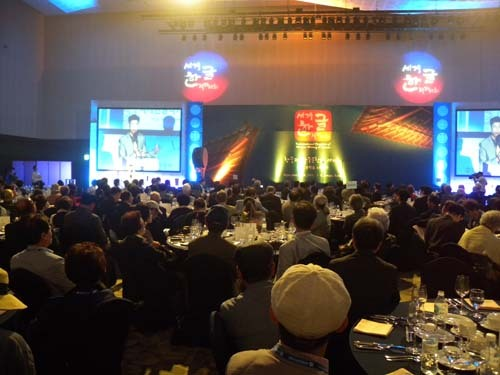  
개막행사장

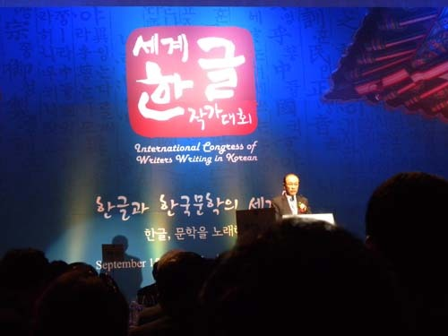  
축사중인 황우여 부총리

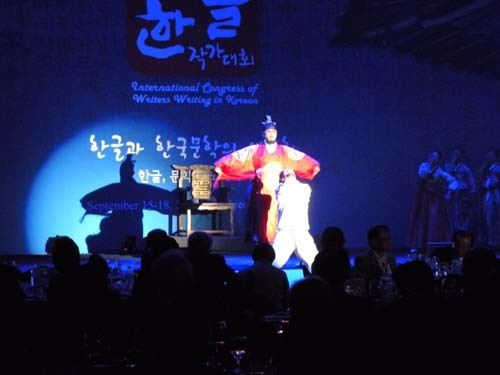  
개막 축하 공연 <용비어천가-하늘이 열리다>

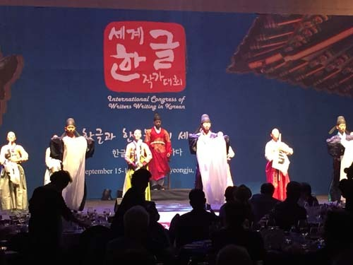  
개막 축하 공연 <용비어천가-하늘이 열리다>

  
강연하는 르 클레지오 선생

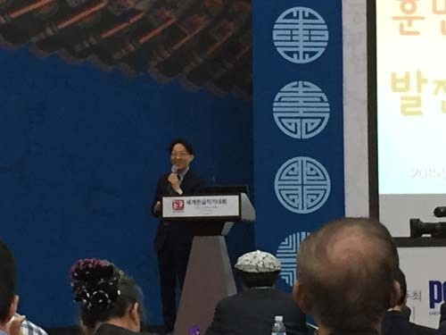  
강연을 하는 노마 히데키 교수

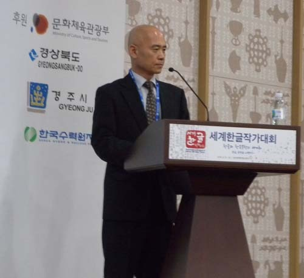  
주제발표회장에서

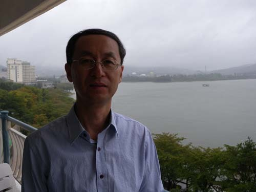  
토론을 맡은 흑룡강성 TV 방송국 부국장 리홍규 시인

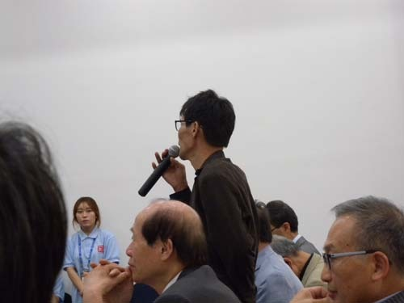  
토론을 하는 알마티의 최석 시인

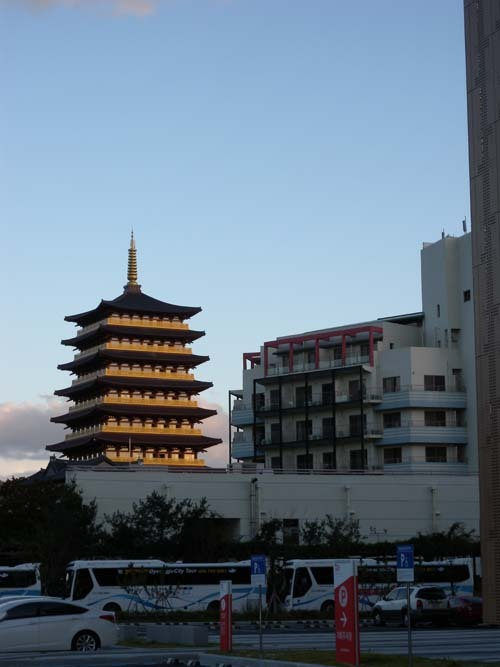  
대회장 인근의 풍경

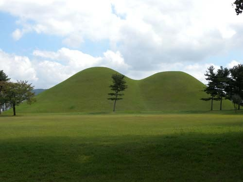  
포근함을 안겨주는 경주의 대능원

공유하기

게시글 관리

**백규서옥\_Blog ver.**

[저작자표시 비영리 변경금지
(새창열림)](https://creativecommons.org/licenses/by-nc-nd/4.0/deed.ko)