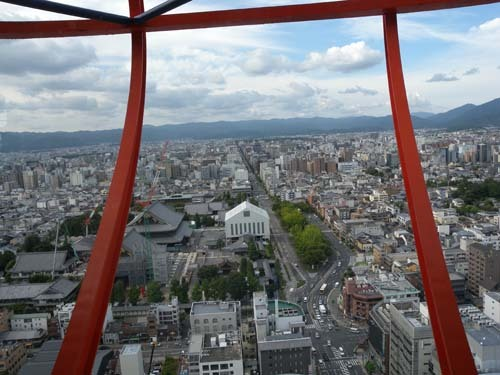
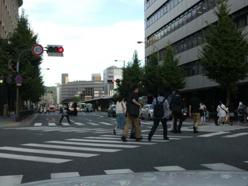
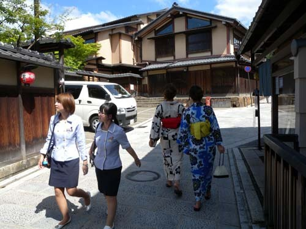
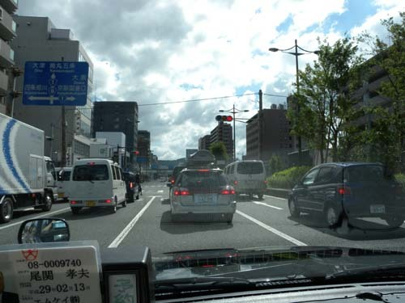
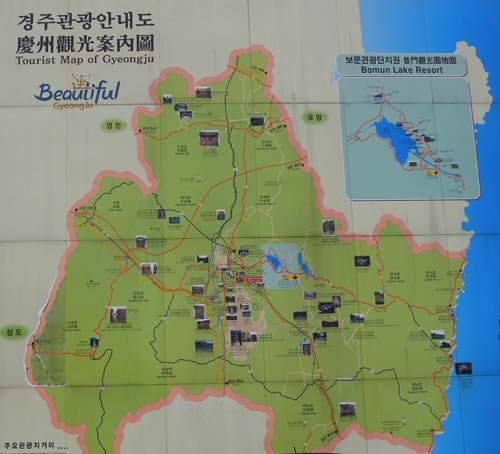
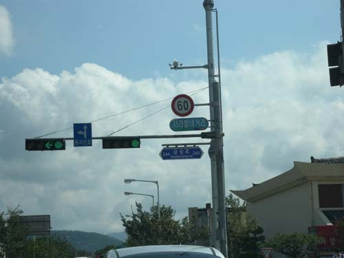

일본의 질서, 우리의 질서

지난여름

며칠 간 교토에 머물 기회가 있었다.

내게 가장 인상적인 것은

도처에 널린 유물과 유적이 아니었다.

크든 작든 도로에서 자동차 경적소리가 들리지 않았다는 사실,

대로에서든 후미진 골목에서든 사람들이 교통법규를 엄수한다는 사실,

길바닥에 꽁초 하나, 휴지조각 하나 떨어져 있지 않다는 사실이었다.

그리고

무수한 자전거들.

자전거를 통해 익히는 질서의식이 놀라웠다.

어둘 녘이면 주택가를 걸으며

고즈넉하다 못해 괴기스럽기까지 한 분위기를 맛보는 게

또 하나의 즐거움이었다.

오후 6시쯤 되었을까.

길을 걷다가 주택가에서 대로로 나오는 3~4m 폭의 자동차 통로를 만났고,

그곳에도 어김없이 건널목 표시와 신호기가 설치되어 있었다.

오가는 자동차는 없었고, 마침 중학생 정도의 남자 아이 하나가 걸어가고 있었다.

빨간 불이 들어오자 그는 망설임 없이 서는 것이었다.

한참동안 관찰해보니

회사원으로 보이는 중년 신사도, 할아버지도, 아주머니도

모두 신호에 복종하는 것이었다.

‘까짓것 두어 걸음이면 뛰어 건널만한 넓이에, 오가는 차도 없는데’

그러나 그들은 그 신호를 철저히 따르고 있었다!

교토에 머무는 동안

이동 수단은 주로 택시였다.

모든 운전기사들은 제복을 입고 있었고,

정확한 매뉴얼대로 승객 응대가 이루어지고 있었다.

택시 안은 철퍼덕 앉기가 미안할 정도로 청결했고,

신호나 법규를 위반하는 택시기사를 본 적이 없다.

기사는 뒷좌석을 권했지만, 나는 주로 앞자리에 앉아 도로 위의 차들을 살폈다.

슬쩍 유리를 내리고 담배꽁초를 길거리에 버리는 운전자를,

아무데서나 경적을 울려대는 운전자를,

툭하면 욕설을 퍼붓는 운전자를,

잽싸게 앞차를 추월하는 운전자를,

횡단보도에서 슬금슬금 앞으로 나아가는 운전자를,

신호가 바뀌기도 전에 튀어나가는 운전자를,

속도위반하는 운전자를,

어느 곳에서도 볼 수 없었다.

어느 날 오후

젊은 엄마가 아이 둘을 데리고 마트에서 나왔다.

마트 밖에는 자전거 주차장이 참하게 마련되어 있었다.

큰 아이는 다섯 살 정도, 작은 아이는 세 살 정도 되어 보였다.

주차장으로 나온 세 사람 모두 노란색 헬멧을 쓰고 있었다.

엄마의 자전거 앞 바구니엔 세 살짜리 아이가 담기고,

작은 자전거를 탄 큰 아이는 엄마 자전거를 뒤따라

건널목을 건너는 것이었다.

신호 시간이 충분하기도 했지만,

신호를 무시하고 달려 내빼는 자동차들은 아예 없었다.

모두들 다섯 살 어린애가 굴리는 페달을 대견스레 바라보며 기다리고 있었다.

모두가 참여한 ‘어린이 교육’의 현장이었다.

얼마 전 어느 날 어스름 녘

차를 몰고 경주에 들어섰다.

어쩌면 교토와 분위기가 비슷해서 놀라웠다.

보문단지로 가는 길엔 차도 많지 않았다.

여름철 막바지의 석양이 비낀 고도(古都)가 아름다웠다.

아, 우리도 이제 선진국으로 들어선 것일까?

그러나 착각도 잠시.

갑자기 고급 승용차 한 대가 ‘쌩!’하며 중앙선을 넘으며

내 차를 추월했다.

차도 없는데, 고지식하게 제한속력을 지키는 내 차가 너무 답답했으리라.

교차하는 차들이 없는 신호등 앞에서

불이 바뀌기만 기다리다가 깜빡 1~2초 출발이 늦었는데,

택시인지 자가용인지 ‘빵!’하고 어김없이 경적을 울렸다.

도로에는 여기저기 꽁초와 휴지들도 굴렀다.

운전자들이 유리를 내리고 버린 것들이리라.

아니나 다를까. 앞쪽 차량의 문이 열리더니

담배를 꼬나 문 손이 나오고, 꽁초와 담뱃재가 포물선을 그리며 떨어졌다.

‘혹시나’가 ‘역시나’로 바뀌는 순간이었다.

적지 않은 교육과 세뇌를 받았을

경주가 그럴진대,

나머지 지역들이야 불문가지 아닌가.

왠지 맘에 들지 않는 나라가 일본이다.

그럼에도 그들이 보여주는 선진의 모습이 부럽고,

사실 늘 마음에 걸린다.

우리가 그들을 추월하는 것은

그들의 장점을 모두 배운 다음에야 가능할 것인데,

그렇게 되기까지엔 매우 긴 시간이 걸릴 것이다.

그래서 지금 내 마음이 무겁고 슬프다.

  
교토 타워에서 내려다 본 시가지

  
교토 시내의 횡단보도

  
교토의 주택가 이면도로

  
교토의 큰 거리

  
경주 관광안내 지도

  
경주 신호등

공유하기

게시글 관리

**백규서옥\_Blog ver.**

[저작자표시 비영리 변경금지
(새창열림)](https://creativecommons.org/licenses/by-nc-nd/4.0/deed.ko)