세인트루이스(St. Louis)에서의 5박 6일

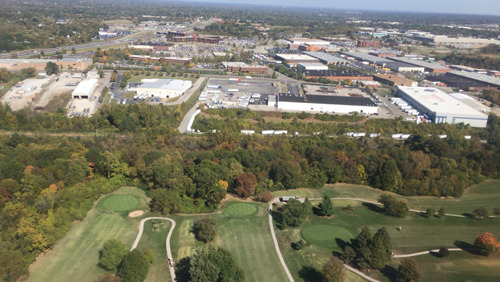  
비행기에서 내려다 본 세인트루이스 공항 인근

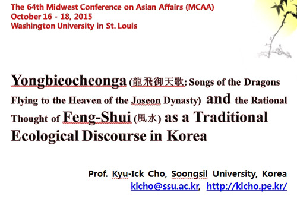  
발표문 ppt 일부

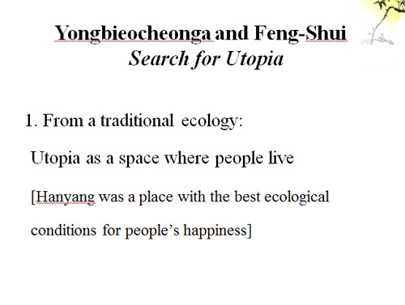  
발표문 ppt 일부

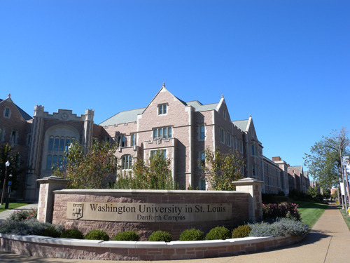  
워싱턴대학교 댄포스 캠퍼스 남쪽 입구

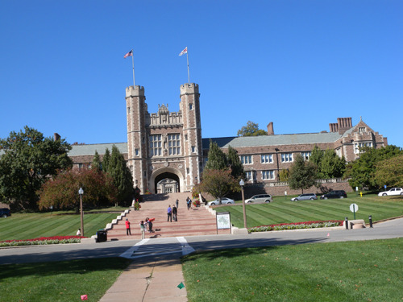  
브루킹스홀 쪽의 게이트

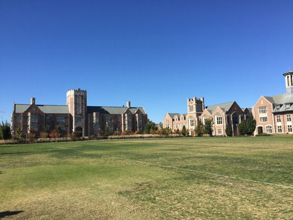  
캠퍼스 일부

작년에 신청했어야 하는데, 게으름을 부린 탓에 그만 올해 아시아학회(AAS: Association for Asian Studies) 참여의 기회를 놓치고 말았다. 올해 초반 부랴부랴 찾아낸 학술발표회가 바로 AAS의 중서부 지역 분회에서 열리는 MCAA(Midwest Conference on Asian Affairs). ‘미국 중부의 하버드’라 불리는 워싱턴대학교에서 열린다 하여 더 매력적이었다. 발표 및 참가 신청, 발표문 송부 및 심사, 숙소 및 항공편 예약 등 자잘한 절차들이 자못 번거로웠으나, 서양의 학자들을 만나 의견을 나누면서 새로운 기운을 받고 싶다는 욕구가 나를 움직인 것이 사실이었다. 그 과정에서 큰 학술발표회를 조직하고 움직이는 그들의 메커니즘을 배울 수도 있었고, 연락을 주고받는 과정에서 그들의 내면 또한 살짝 훔쳐볼 수 있었다. 무엇보다 내 호기심을 자극한 것은 아직 가보지 못한 세인트루이스와 워싱턴대학교였다.

멀었다. 비행기가 태평양 상공에 도달할 즈음에야 모니터에 뜨는 항로를 보며 멀다는 사실을 깨닫게 되었고, 약간의 후회가 생겨난 것도 사실이었다. 시카고의 오헤어(O’hare) 공항까지 꼬박 12시간, 오헤어에서 기다린 3시간, 오헤어에서 세인트루이스 공항까지 1시간 20분, 공항에서 호텔까지 30분 등 무려 17시간이나 걸렸으니!

시차 부적응으로 피곤한 몸을 끌고 다음 날의 발표(\*발표문은 백규서옥[http://kicho.pe.kr](http://kicho.pe.kr/) 의 ‘연구업적>논문>No.221’ 참조)를 포함, 꼬박 사흘간의 학술발표회 일정을 소화하게 되었다. 총 61개의 패널, 패널 당 4명의 발표였으니, 발표자만 해도 240명이 넘었다. 토론자, 진행자, 참관자까지 합치면 1,000명이 넘는 규모였다. 발표도, 발표에 대한 반응도 비교적 만족스러웠기 때문일까. 몸과 마음 상태는 크게 나쁘지 않았고, 무엇보다 워싱턴 대학의 이지은 교수와 전임강사로 있는 고인성 박사, 울산과기원의 이재연 교수 등을 만난 것은 피로를 가시게 한 청량제였다. 이지은 교수, 이재연 교수 등과의 자투리 시간을 이용한 대화는 무엇보다 유익했다. 발표장을 메운 외국의 학자들에게 조선의 건국서사시(foundational epic of Joseon Dynasty)를 소개하고, 그 밑바탕으로 작용한 ‘유토피아 찾기’로서의 풍수론을 전통 생태 담론적 차원에서 설명한 것은 아주 짜릿한 추억으로 남게 되었다.

학회 종료 후 하루 반 동안의 여유가 있었다. 워싱턴대학교 댄포스(Danforth) 캠퍼스의 구석구석, 밀드레드레인켐퍼 미술박물관(Midred Lane Kemper Art Museum), 미주리 역사박물관(Jefferson Memorial Missouri History Museum), 게이트웨이 아치(Gateway Arch) 등을 포함, 다운타운 몇 곳들을 도는 데 그쳤지만, 그간 서구 여러 나라의 도시들을 돌아보며 익힌 노하우(?) 덕분일까. 세인트루이스와 워싱턴대학교의 장점들을 순식간에 체감할 수 있었다.

1853년 윌리엄 그린리프 엘리엇(Willam Greenleaf Eliot)이 주도하여 엘리엇 세미너리(Eliot Seminary)를 세웠는데, 이 학교가 세인트루이스 워싱턴대학교로, 다시 워싱턴대학교로 확대ㆍ발전되었던 것이다. 그러나 미국 전역에 워싱턴의 이름을 딴 대학들이 늘어나자 다시 ‘세인트루이스의 워싱턴대학교(Washington University in St. Louis)’로 교명을 환원했다 한다. 댄포스 캠퍼스는 빅벤 대로(Big Bend Boulevard), 퐈리스트 팍 파크웨이(Forest Park Parkway), 스킹커 대로(Skinker Boulevard), 와이다운 대로(Wydown Boulevard) 등으로 둘러싸인 변형된 직사각형 모양으로 되어 있었는데, 중앙에서 동서로 가로지르는 포시쓰 대로(Forsyth Boulevard)가 캠퍼스를 남북으로 가르는 형국이었다.

멋진 캠퍼스였다. 어떤 건축양식을 본떴는지 알 수는 없었으나, 평탄한 대지에 늘어선 단정한 베이지색 톤의 건물들은 전체적으로 깔끔하고 따스해보였으며, 안으로 들어가니 철저히 인체공학에 맞추어 지은 듯 이동하기에 편했다. 거의 반반인 대학원과 학부 합쳐 1만 4천의 학생들과 3000여명이 넘는 교수진이 댄포스 캠퍼스(206,885평), 메디컬 캠퍼스ㆍ웨스트캠퍼스ㆍ노스캠퍼스(165.263평) 등에 둥지를 틀고 있었다. 이들 캠퍼스에 산재해 있는 14개의 도서관들엔 총 420만권의 도서가 소장되어 있었으며, 이 대학의 자랑인 밀드레드레인켐퍼 미술박물관도 미시시피강 서부 연안 최고(最古)의 역사와 아름다움을 자랑하고 있었다. 무엇보다 놀라운 건 교수진에 22명의 노벨상 수상자와 10명에 가까운 퓰리처 수상자들이 포진하고 있다는 사실. 미국 대학평가에서 늘 10위권(12~14위)을 유지하고 있는 최고 명문이라는 점도 놀라웠다.

학회 덕에 이 대학에서 종신 교수직을 받고 한국문학을 강의하고 있는 이지은 교수를 만날 수 있었다. 연세대학교에서 노문학을 전공하고 하바드에서 박사학위를 받은 이 교수는 이 대학교 인문대학(Arts & Sciences) 동아시아 언어문화학부(East Asian Languages and Cultures) 한국학과의 학과장이었다. 이 교수는 저서 <<Women Pre-Scripted: Forging Modern Roles through Korean Print (University of Hawai'i Press, 2015)>>를 비롯하여 많은 논문들을 발표했으며, ‘한국문명론(Korean Civilization)•근현대 한국문학(Literature of Modern and Contemporary Korea)•한국문학과 문화의 주제들: 젠더 구축하기(Topics in Korean Literature & Culture: Constructing Gender)•현대 한국인의 자아: 한국문학과 문화의 주제들(Contemporary Korean I: Topics in Korean Literature and Culture)•한국문학과 문화의 주제들(Topics in Korean Literature and Culture)’ 등의 강의를 통해 미국 학생들과 만나고 있었다. 이 교수와의 대화를 통해 미국 인문학계의 자세한 모습들을 들을 수 있었다. 함께 발표에 참여한 울산 과기원의 이재연 교수 또한 하바드와 시카고대학에서 공부한 한국문학 세계화의 주역이었다. 그들과의 만남을 통해 나를 비롯한 한국문학 전공자들이 앞으로 무엇에 주력해야 할지를 깨닫게 되었다. 아젠다(agenda)의 쉼 없는 발굴과 논리 구축을 통해 세계 학자들과 소통하는 일만이 우리의 낙후성을 탈피하는 유일한 출구임을 알게 된 것이다.

\*\*\*

귀국 날까지 짬을 내서 찾은 워싱턴대학교의 밀드레드레인켐퍼 미술박물관은 건물도 훌륭했지만, 마침 세계적 거장들의 작품들을 전시하고 있었다는 점에서 내 가슴을 뛰게 했다. 하루를 쉰 다음 찾은 미주리주 역사박물관과 게이트웨이아치는 미주리 주와 세인트루이스의 어제와 오늘을 한눈에 조망할 수 있게 했다는 점에서 또 다른 명소들이었다. 미주리 역사박물관은 제퍼슨(Thomas Jefferson) 대통령을 기념하는 의미도 갖고 있었다. 사실 제퍼슨 대통령이 프랑스로부터 미시시피강에서 로키산맥에 이르는 80만 평방 마일의 광대한 땅을 사들임으로써 미주리 주는 비로소 미국 땅이 되었고, 본격적인 번영이 시작된 것이다. 세인트루이스의 역사가 독립선언을 기점으로 시작된 미국의 역사보다 100년 이상이나 긴 것도 그 때문이다. 1673년 이 지역에 도착한 프랑스 탐험가들은 원주민이 살고 있던 이 땅을 접수하여 프랑스령으로 만들었고, 자신들의 왕 루이 14세의 이름을 따서 루이지애나(Louisiana)로 명명한 것. 3대 대통령 제퍼슨이 1803년 나폴레옹으로부터 이 땅을 매입하여 1804년 3월 10일 미합중국의 한 부분으로 공식화한 다음 1808년에 시의원단을 선출했고, 1809년에 정식 시로 등록한 것이다. 1904년의 국제무역박람회, 커피산업, 도시 확장 및 정비 등이 박물관 소장품의 대표적 컨셉들이었다. 사실 1904년의 국제무역박람회와 하계올림픽은 1896년에 세인트루이스를 덮친 허리케인의 후유증을 극복하기 위한 적극적 시도였는데, 역대 최악이었던 올림픽과 달리 박람회는 성공적이었다. 그 내용들이 박물관 중심의 전시물들을 통해 설명되고 있었다.

다양한 전시물들을 통해 커피 산업이 미주리의 중심에 자리 잡기까지의 과정을 보여준 부분이나 도시의 형성, 발전, 팽창을 보여주는 대형 사진들과 각종 생활사 자료들은 박물관을 매우 인상적인 공간으로 바꾸어 놓고 있었다. 그것들은 여타 국가나 지역의 박물관들과 비교하여 특별한 의미와 함께 차별성 또한 보여주고 있었다. 그곳을 찾은 모든 이들에게 ‘우리도 이런 역사박물관 하나쯤은 만들어야겠다’는 다짐을 하게 만드는 공간이었다.

박물관을 나와 들른 곳은 이 도시의 어느 곳에서도 보이는 게이트웨이 아치(Gateway Arch). 국립 제퍼슨 국토 확장 기념관(Jefferson National Expansion Memorial)을 장식하는 조형물이자 '게이트웨이 시티(Gateway City)'라는 세인트루이스의 별칭을 시각적으로 보여주는 랜드마크였다. 서부개척 시대, 서부로 넘어가는 관문이 바로 세인트루이스였고, 그 개척의 상징물이 바로 이것이었다. 1947년 핀란드 계 미국 건축가 에로 사리넨(Eero Saarinen)과 건축기사 한스카를 반델(Hannskarl Bandel)의 설계를 채택, 1963년 2월 12일 착공, 1965년 10월 28일 완공, 1967년 7월 24일 일반에 개방되었으니, 설계로부터 무려 20년이나 걸린 큰 공사였다. 전체 높이 192m의 무지개 형상 스테인리스강 구조물로서 남쪽과 북쪽 두 방향에서 엘리베이터 격인 트램(tram)을 타고 아치 꼭대기까지 올라가게 되어 있었다. 꼭대기의 좁고 긴 방에서 창문을 통해 미시시피강과 일리노이 평원, 세인트루이스 시내를 조망할 수 있도록 만들었고, 아치 밑으로는 웨스트워드 익스팬션 박물관(Museum of Westward Expansion)이 연결되었다.

세인트루이스는 도착부터 떠나는 날까지 평화와 안온함을 느끼게 했다. 그러나 조용한 가운데 안으로는 바글바글 끓어 넘치는 용광로처럼 분주하게 움직이고 있었다. 미국의 여느 도시들처럼, 짧지만 화려한 역사와 전통을 기반으로 아이디어와 활력이 맥박치고 있었다. 그 한 복판에서 세계의 인재들을 불러 모으는 곳이 바로 워싱턴대학교였다. 그러나, 어쩌랴! 5박6일 간의 짧은 일정 속에 바늘구멍으로 들여다 본 풍경. 그게 세인트루이스의 허상일까, 아니면 실상일까.

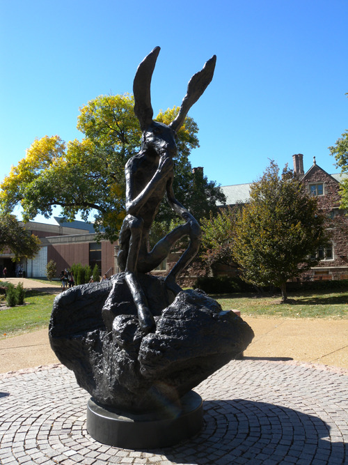  
Thinker on rock-Barry Flangan 작, 1997. 워싱턴대학교 교정

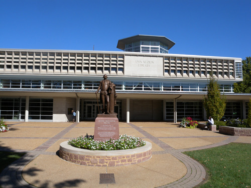  
John M. Olin Library

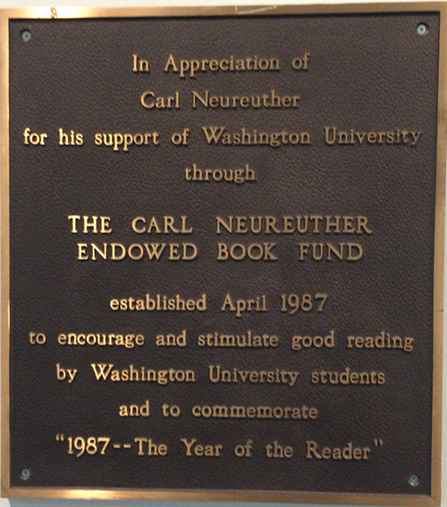  
 Carl Neureuther에 대한 감사 동판

  
도서관 서가

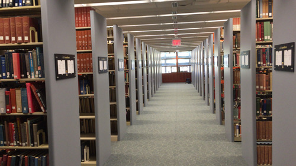  
도서관 서가

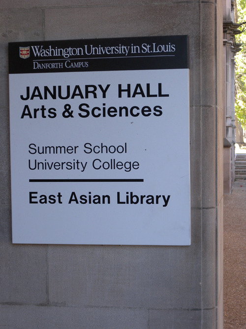  
동아시아 도서관

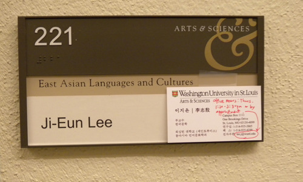  
인문대학 동아시아 언어문화학과 이지은 교수 연구실

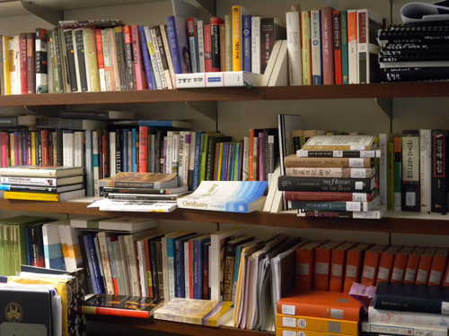  
이 교수 연구실의 서가

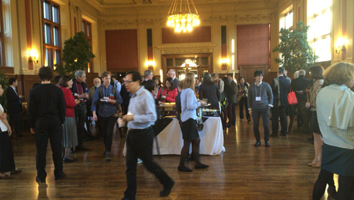  
MCAA 첫날 연회

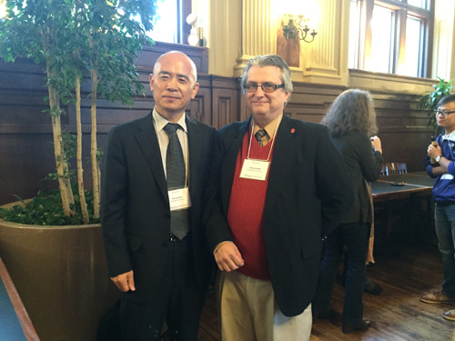  
학술발표회에서. 린덴우드 대학교 중국어학과 Brian Arendt 교수와 함께

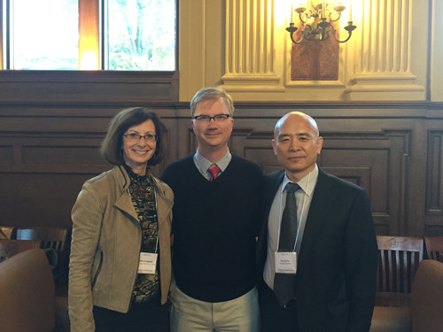  
동아시아학과의 Rebecca Copeland 교수(일본문학교수/동아시아학부 학부장),

Holden Thorp 박사(교무처장/학사부총장/리타 레비-몬탈시니 석좌교수)와 함께

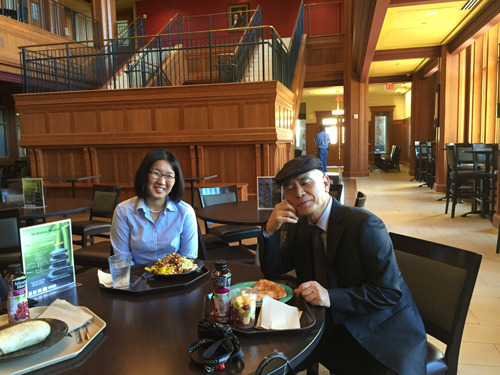  
이지은 교수와

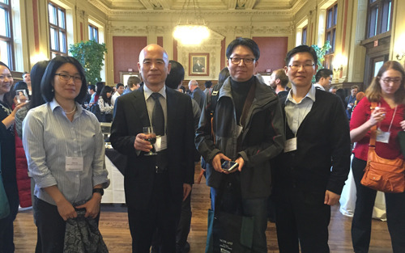  
연회장에서 이지은 교수, 이재연 교수, 고인성 교수 등과 함께

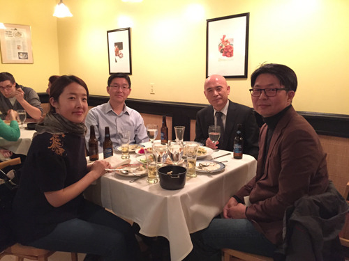  
저녁식사 자리에서 함께 한 한국학자들

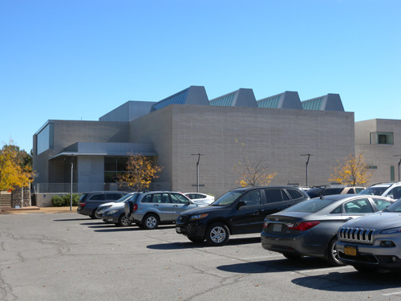  
밀드레드레인켐퍼 미술박물관

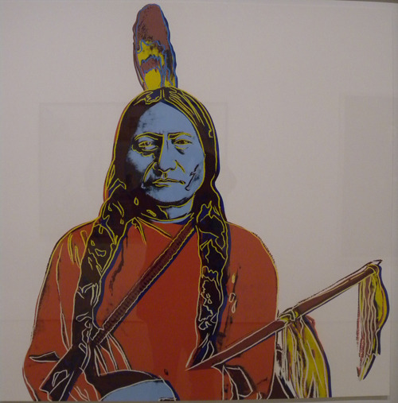  
미술박물관에서 만난 시팅불(Sitting Bull)[Andy Warhol 작]

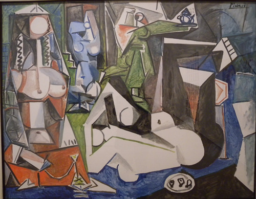  
피카소의 <알제리의 여인들(Women of Algiers)>

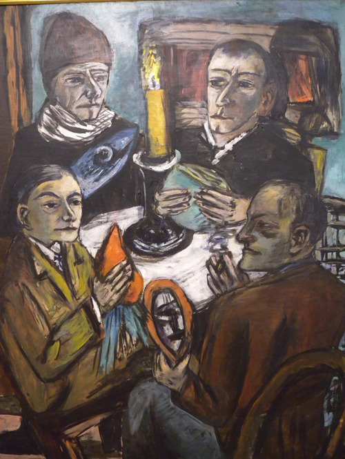  
Max Beckmann의 <Artists with vegetable>

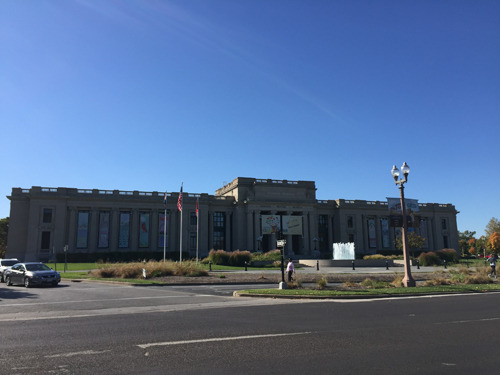  
미주리 역사박물관

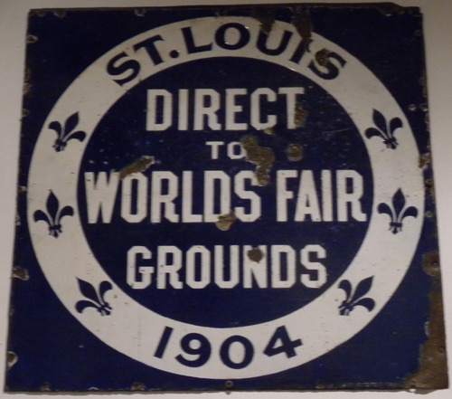  
미주리 역사박물관 소장 '세계무역박람회장 가는 길'

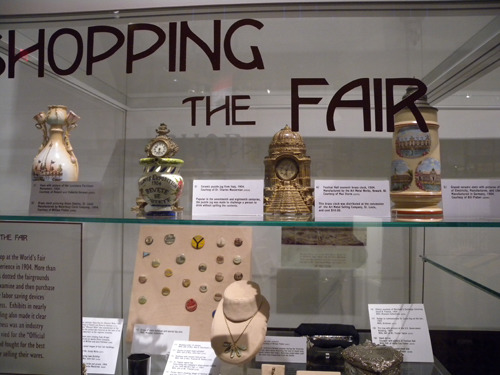  
역사박물관 전시품

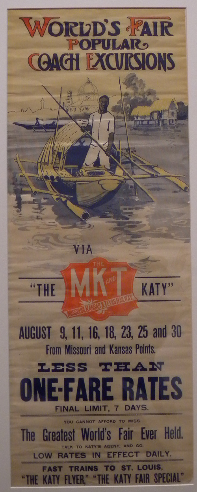  
역사박물관 소장 포스터

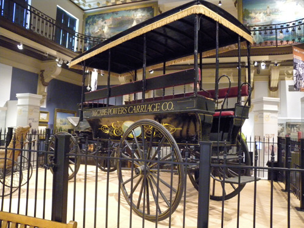  
역사박물관 소장 '수레'

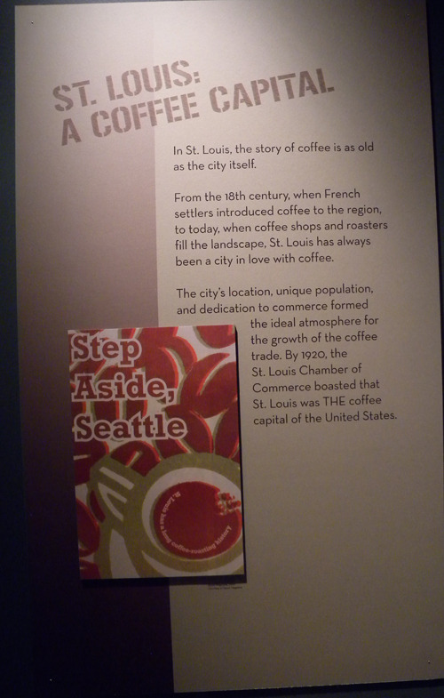  
커피산업에 대한 세인트 루이스의 자부심 "시애틀은 비켜 서세요!"

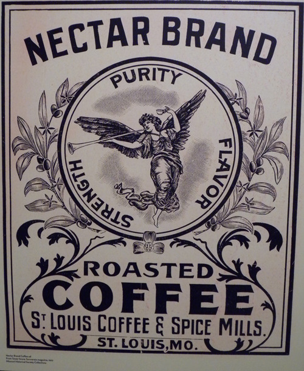  
그 당시 커피 브랜드의 하나

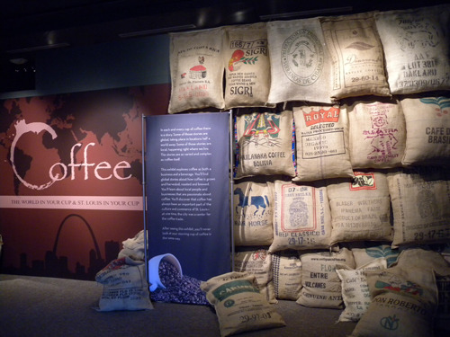  
세계 각국에서 수입되는 커피 원두들

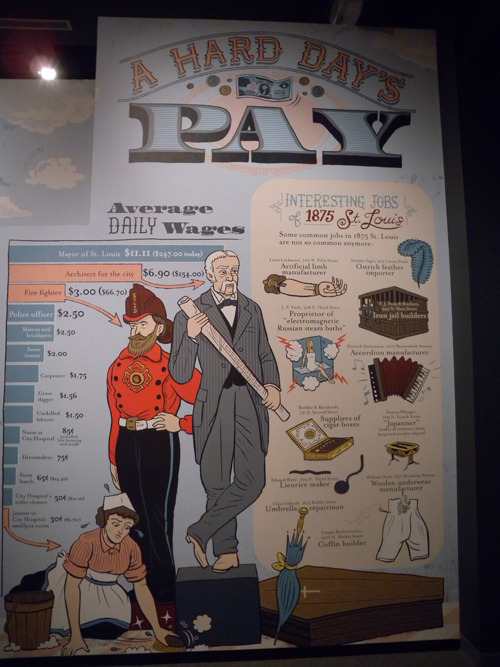  
어렵던 시절의 미주리주 주민들

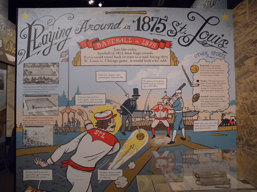  
당시 야구경기 모습.

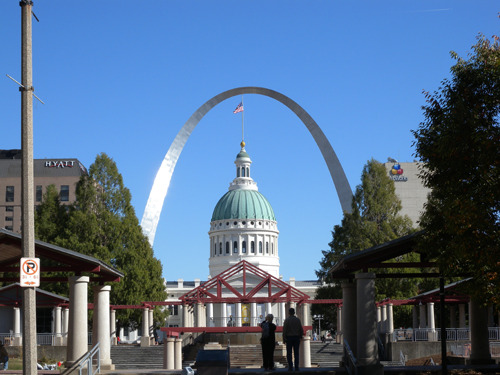  
게이트웨이 아치

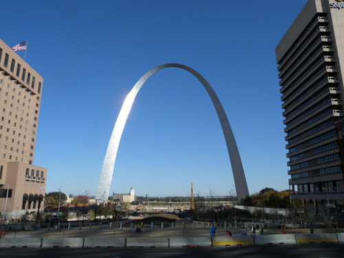  
게이트웨이 아치

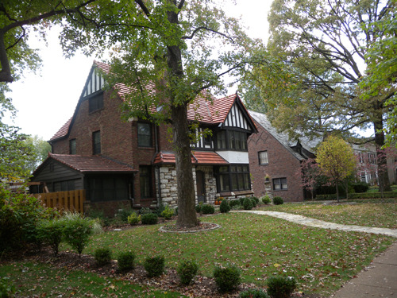  
Forest Park에서 흔하게 볼 수 있는 멋진 개인주택

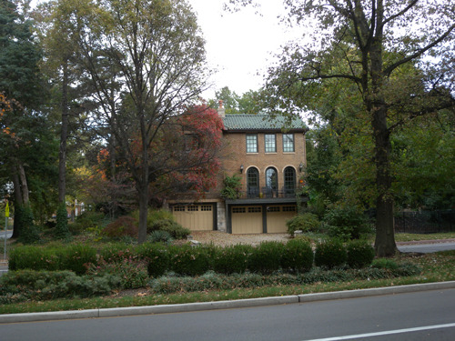  
Forest Park에서 흔하게 볼 수 있는 멋진 개인주택

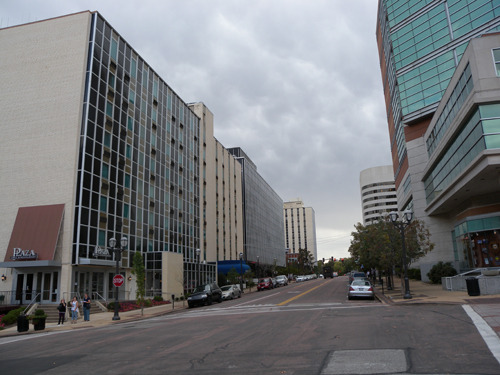  
세인트루이스 다운타운의 한가로운 모습

공유하기

게시글 관리

**백규서옥\_Blog ver.**

[저작자표시 비영리 변경금지
(새창열림)](https://creativecommons.org/licenses/by-nc-nd/4.0/deed.ko)