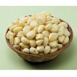

마늘 먹는 남자

세상에 별걸 다 연구하는 사람들이 있고, 그들이 분석해놓은 결과 또한 기가 막힌다.

우연히 웹서핑을 하다가 한 기사에 눈이 꽂혔다. ‘마늘 먹는 남자에게 여성이 더 매력을 느낀다’는 연구결과가 그것이다. 스코틀랜드 스털링대학과 체코 프라하대학 연구진의 공동연구 결과란다.

대상으로 선정된 남성 42명에게 차례로 마늘 실험을 해본 모양이다. 처음엔 마늘, 그것도 생마늘(!)을 섭취하게 하고, 다음엔 더 적은 양의 마늘가루를 섭취하게 하고, 그 다음엔 아예 마늘을 먹지 않게 한 다음 각각의 경우 겨드랑이에 패드를 붙여 12시간 동안 땀을 모아 여성 82명에게 냄새를 맡아보게 했다는 것이다.

그런데, 마늘을 섭취한 남성이 더 매력적이고 남자답고 상쾌한 향을 준다고 답했다는 것이다. 더 해괴한 것은 마늘 두 쪽을 섭취할 경우 별 차이가 없었던 반면, 네 쪽(마늘가루 12g)을 먹으면 여성의 호감도가 더 올라가는 것으로 나왔다는 사실. 연구진의 분석에 따르면, 마늘의 항균, 항바이러스 특성이 악취의 원인인 미생물의 농도를 약화해 겨드랑이 냄새를 더 달콤하게 한다는 것이었다. 더 이해할 수 없는 그들의 추론은 겨드랑이 냄새가 사람의 친밀성을 좌우하는 중요 인자라는 것, 여성이 마늘 먹는 남자를 선호하도록 진화했을 수 있다는 것 등이었다. 또한 마늘이 항생, 항바이러스, 항균 성분이 있기에 남성의 땀을 통해 섭취 여부를 알 수 있고 남성의 건강을 추측할 수 있다는 것이었다.

\*\*\*

마늘 좋다는 건 단군 할아버지를 낳아주신 웅녀 할머니의 이야기에서 이미 입증된 바이고, 수천 년 내려오면서 마늘 없이 살 수 없게 된 사람들이 바로 우리 한민족이다. 만약 이 연구결과가 타당하다면, 전 세계의 여성들은 벌써부터 한국 남자들에게 빠져 있었어야 하고, 지금 '농촌 총각 장가 보내기' 위해 동남아 나라들을 뒤지고 다니는 결혼정보회사들은 앞장 서서 총각들에게 '마늘 먹이기 운동'이라도 벌이고 있을지 모른다. 그런데, 현실은 과연 그런가. 근래 해외로 나가는 기회가 늘어나면서 ‘마늘냄새’ 때문에 스스로 갖게 되는 ‘자기 검열’의 콤플렉스 또한 적지 않다. ‘혹시 외국인들이 강한 마늘냄새로 나를 기피하지나 않을까?’, ‘오늘 무슨 모임이 있는데, 마늘 들어간 음식은 절대로 먹지 말아야지!’ 등등. 우리가 피할 수 없는 마늘 때문에 갖게 되는 불안감으로 전전긍긍하는 경우가 다반사다.

소싯적 언제던가.  한동안 마늘에 빠져 지낸 적이 있었다. 하도 오래된 일이라서 정확한 건 기억에 없지만. 건강 정보에 귀가 얇은 내가 방송에 나와 열변을 토하는 누군가를 보았던 것이다. 그가 말한 요점은 ‘누구나 아침 빈 속에 생마늘 3~4쪽을 생수와 함께 씹어 먹으면 어떤 병에도 걸리지 않는다’는 것이었다. ‘옳다구나!’ 쾌재를 부른 나는 즉시 실천에 옮겼다. 물론 아내와의 갈등도 동시에 시작되었고. 마늘을 먹는 본인이 자신의 냄새를 맡을 수 없다는 상식을 나는 그만 까맣게 모르고 있었던 것이다. 맵고 알싸한 생마늘을 생수와 함께 먹고 나니 식욕도 늘어나고 삶의 원기도 넘치는 것 같았다. 내게서 고약한 냄새가 나리라고는 꿈에도 생각지 못했던 것은 일종의 비극이었다. 날이 지나면서 나는 콧노래를 불렀으나, 아내는 점점 내 곁에서 멀어져 갔고, 가끔씩 내 연구실에 찾아오던 동료들의 발걸음도 뜸해졌다. 늘 내 코앞에까지 와서 무언가를 묻던 학생들의 발길도 드물어졌다. 그 뿐인가. 틈만 나면 내 무릎에 앉아 조잘대던 내 아이들도 자꾸만 일정한 거리를 두는 것이었다. 그러던 어느 날. 직장의 회식이 끝나고 2차 술자리로 몰려갔을 때였다. 다른 학과의 선배교수 한 사람이 맥주잔을 부딪치면서 슬쩍 묻는 것이었다. ‘조교수, 요즘 무슨 약을 드시오? 늘 활력이 넘쳐 보이니. 그런데 냄새가 좀 유쾌하지 못한 건 약간의 흠이라 할 수 있겠는데.’라는 그의 조심스런 말을 듣게 되었다. 집에 돌아와 아내에게 말하니, 이제야 승기를 잡았다는 듯 그녀는 언성을 높이며 ‘생마늘 절대 금지’의 팻말을 치켜드는 게 아닌가. 그러면서 마늘 많이 먹는 사람들 곁에 한 번 가보라고, 마늘 먹는 자신은 그 냄새를 맡을 수 없는 법이라고, 그녀는 나의 무책임과 미련함을 마구 성토하는 것이었다. 사실 선배교수의 말에서 ‘활력이 넘쳐 보인다’는 부분에 방점을 찍은 나는, ‘냄새가 좀 유쾌하지 못하다’는 부분은 아예 무시하려 했으나, 아내의 견해는 달랐다. ‘오죽하면 그 교수가 그렇게 말했겠느냐? 그러니 그 교수가 너무 고맙다.’는 것이 아내 주장의 요지였다.

그 다음날부터 냉장고 속의 생마늘이 모두 사라지고, ‘사람들이 내 곁에서 슬슬 사라진 것도 마늘때문인개벼~’라는 굼뜬 깨달음을 계기로 나는 결국 마늘을 끊게 되었다. 그 뒤로 다시 사람들은 내 곁에 오게 되었고, 결국 음식과 성공적인 사회생활 간의 밀접한 상관성도 깨닫게 되었다.

\*\*\*

그런 마늘을 많이 먹은 남성에게 여성들이 호감을 갖는다니! 내가 생마늘을 먹기시작한 날부터 내게서 멀어져 간 내 아내는 그럼 여성이 아니었단 말인가? 서양 사람들의 연구결과가 마늘 없이 못 사는 민족의 일원으로서 참 다행이란 생각이 들면서도, 그 결과의 타당성을 신뢰하지 못하는 것은 소싯적의 내 씁쓸한 경험 때문이다. 겨드랑이 냄새보다는 입에서 풍기는 냄새가 더 화급한 문제인 것을. 할 일 없으면 누워 낮잠들이나 잘 것이지, 연구치고는 참 해괴하지 않은가.

공유하기

게시글 관리

**백규서옥\_Blog ver.**

[저작자표시 비영리 변경금지
(새창열림)](https://creativecommons.org/licenses/by-nc-nd/4.0/deed.ko)