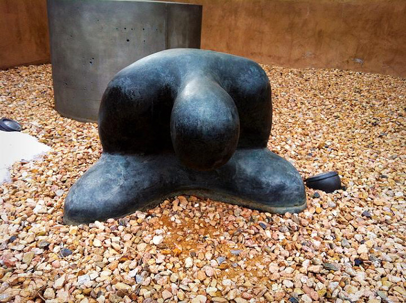

새해인사

-우리 모두 신선에 도전합시다!-

유쾌하고 슬기로운 원숭이를 떠올리며 병신년 새해 아침을 맞았습니다.

백규서옥을 찾아주시는 여러분 댁내 두루 무고하시고 행복하시길 빕니다.

지난해는 저 자신에게도, 나라에도, 제가 속해있는 공동체(가정ㆍ학교)에도 많은 일들이 있었습니다. 아마 여러분도 저처럼 많은 일들을 겪으셨으리라 생각합니다. 제 나이 또래에게는 즐거운 일과 궂은 일이 반반, 아니 궂은 일이 훨씬 더 많은 것 같습니다. 자녀들이 좋은 직장을 잡거나 좋은 배필을 만나 행복한 출발을 하는 일도 있겠습니다만, 연로하신 부모 세대의 잦은 병고(病苦)와 하세(下世) 등 슬픈 일들이 훨씬 더 자주 일어나는 것 같습니다. 그런 슬픈 일들은 이제 우리 역시 그로부터 멀지 않은 지점에 있음을 깨닫게 하는 이정표이기도 하고, 우리로 하여금 지나온 길과 걸어갈 길을 되짚어보게 하는 반성과 통찰의 자료이기도 하지요.

옛날의 현자들이 익혔다는 ‘신선술(神仙術)’이나 ‘우화등선(羽化登仙)’이란 말들을 아시지요? 중국 진나라 갈홍(葛洪)이란 사람의 <<포박자(抱朴子)>>란 책에 아주 구체적으로 설명되고 있습니다만. 저는 왜 옛날의 현자들이 ‘신선이 되고 싶어 했을까?/날개 돋친 신선이 되어 하늘로 오르고 싶어 했을까?’ 등에 대하여 요즘 들어 가끔 생각하게 되었습니다. 지금처럼 옛날에도 사람이 나이를 먹으면 늙고 아프기 마련이었겠지요. 변변한 약도 없던 시절, 자리보전하고 누워버리면 누가 돌봐줄 수 있었을까요? 그러니 그저 몸져누운 후를 대비하는 일이야말로 몸져눕기 전에 해야 할 일의 모두가 아니었을까요? 신선이 되는 일이야말로 최선의 길이었겠지요? 신선이 되어 하늘로 날아오르는 것의 의미는 무엇이며, 그렇게 되려면 어떻게 해야 했을까요? 우선 먹는 것을 절제하고 종국에는 곡기(穀氣)를 끊어 마냥 가벼워진 육신을 공기 속에 흩어버림으로써 존엄하게 일생을 마치는 ‘최고의 소망’이 아니었을까요?

그래서 저는 새해에 욕심을 줄여 몸무게를 가벼이 하는 일의 실습을 해보려 합니다. 물질적 욕망, 세상 권세욕 등을 버리면 몸무게를 줄일 수 있겠지요. 그건 세상사에 미련을 버리는 일이고 세상사에 미련을 버리면 좀 더 신선의 경지에 가까이 다가갈 수 있겠지요? 교회에서 운영하는 단식원에 가든, 절에 마련된 선방에 가든 ‘먹는 것’에서 해방되는 방법을 체험적으로 터득해보려는 것이지요. 그런 일을 자꾸 반복하다보면 종국엔 신선의 경지에 도달할 수 있지 않겠는지요?

‘참, 할 일 없으니 별 궁리를 다 하는구나!’라고 혀들을 차시겠지만, 온몸에 주렁주렁 주사바늘을 꽂은 채 눈만 멀뚱멀뚱 뜨고 계시는 주변의 어른들을 한 번 보시면, 생각이 달라지실 겁니다. 어떻게 살다가 어떻게 죽는 것이 인간의 존엄을 지키는 길인지 적절한 해답을 찾으실 수 있을 겁니다.

그 문제를 화두(話頭)로 삼아 한 해를 보내볼까 합니다. 어쩜 올해 연말쯤엔 그 해답의 윤곽 정도는 찾을 수 있으리라는 희망을 가져보기로 했습니다. 어쨌든 저는 병신년을 ‘욕심을 버리는’ 원년으로 만들고자 합니다. 함께 노력해보지 않으시려는지요?

제 생각에 동의하셔도 좋고 동의하지 않으셔도 좋습니다만, 건강관리에 최선은 다해주시기 바랍니다. 조물주의 허락 하에 부모님이 주신 육신과 정신을, 살아있는 한 잘 관리해야 하는 것은 우리 각자의 책임이라 생각합니다.

아무쪼록 올 한 해, 행복하게들 지내시기 바랍니다. 고맙습니다.

병신년 첫날 아침

백규 절하고 아룀

공유하기

게시글 관리

**백규서옥\_Blog ver.**

[저작자표시 비영리 변경금지
(새창열림)](https://creativecommons.org/licenses/by-nc-nd/4.0/deed.ko)