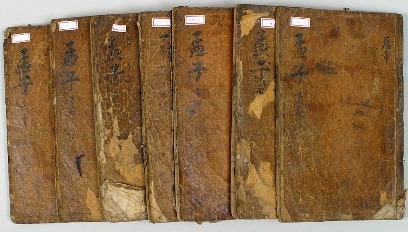

악마들과의 동거

어린이집 ‘아가 폭행사건’을 보며 악마의 이미지를 떠올린 것이 불과 몇 달 전이었다. 작은 천사들이 모여 꼬물대는 어린이집은 대한민국의 축소판이었다. 악마의 손에 나가떨어지는 아가를 보며, 지옥의 악마 하나가 운 좋게 사다리를 타고 천국에 올라가 악마 본연의 모습을 과시하는 광경을 상상했다.

얼마 전에 만난 ‘11세 소녀 감금ㆍ학대 사건’은 새삼 우리의 눈을 의심케 했다. 아버지가 방어능력 없는 어린 딸에게 가했다는 폭행과 학대는 엽기적이었다.

노인 학대와 살해의 주범은 자식들, 그것도 재산을 받을 만큼 받은 자식들이라는 것은 이미 천하공지의 사실이다. 죽인 애인의 시신을 토막 내어 호수에 버린 악마도, 남편을 플라스틱 통에 집어넣어 집안에 처박아 둔 악마도, 학생의 탈을 쓰고 떼로 몰려나가 교탁의 선생을 폭행하는 악마들도 보게 되었다.

언론의 눈에 잡힌 몇몇 사건들이 세상을 흔들어놓고 있던 와중에도 폭행과 살인을 일삼는 악마들은 곳곳에 넘쳐나고 있었다.

‘악마 바이러스’는 이미 세상에 퍼져 쉼 없이 자기 복제를 반복하고 있다. 갈수록 수법과 결과가 참혹하고 참담하다. 악마 바이러스들 가운데 돌연변이의 사이클로 들어가 변종 악마들로 재생되는 비중이 상당하다. 준동하는 악마들의 행태들. 그 모습들을 그려내기에 우리는 상상력의 빈곤을 절감한다.

 

세상 법의 한계 때문일까. 아니면 법을 집행한다는 사람들의 자질 부족 때문일까. 사람을 죽이고도 3~5년 징역형을 받았는데, 언론에선 ‘중형’이라 떠든다. ‘5년 동안 공짜로 주는 밥 얻어먹어가며 조용히 살다 나오는 것’이 ‘살인의 죗값’으로 충분하다는 걸까. 같은 시ㆍ공간에 살면서 법을 만드는 사람들이나 법조인들의 저울추와 장삼이사(張三李四)들의 상식이 그토록 다를 수 있을까. 사람의 목숨 값을 이토록 헐하게 만든 것은 과연 누구의 책임인가.

\*\*\*

기원전 4~3세기에 측은지심(惻隱之心)과 불인지심(不仁之心)을 말한 맹자(孟子)가 오히려 측은하게 생각되는 까닭은 무엇인가. 그는 ‘불쌍하게 여기는 마음’이 어짊의 극치라 했고, ‘차마 끔찍하게 할 수 없는’ 마음 때문에 인간은 본질적으로 착한 존재라 했다. 그가 살던 시절에도 악마가 들끓었음은 그의 말에 고스란히 드러난다. 어찌 그 때라고 지금과 달랐으랴. ‘차마 인간이라 할 수 없는 인간들’도 넘쳐 났으리라. 공자와 맹자가 인류의 도덕선생으로 좌정할 수 있었던 것도 그 때 이미 악마들이 준동하고 있었음을 웅변으로 증명하는 일이다.

과연 맹자는 인간에 대하여 ‘푸진 꿈을 갖고 있던’ 이상주의자라고 해야 할 것인가. 아니, 그 시절 그나마 그런 희망이라도 갖고 있지 않았다면 악마들과 함께 살고 있는 자신의 처지를 못 견뎌 했을 현실주의자였는지도 모른다. ‘인간이 본래 착한 존재’임을 강조하여 천하가 예(禮)로 돌아가기를 염원한 일이야말로 지나치게 순진한 발상이었다고 생각하는 나야말로 극도의 비관주의자, 혹은 염세주의자인가.

너도 나도 어느 순간 악마로 돌변할 수 있는 인자(因子)들을 본성으로 지니고 있는, ‘잠재적 악마’가 바로 인간임을 인정하고 스스로 경계하도록 하는 게 차라리 현명한 방도가 아니겠는가.

  
<<맹자>>

공유하기

게시글 관리

**백규서옥\_Blog ver.**

[저작자표시 비영리 변경금지
(새창열림)](https://creativecommons.org/licenses/by-nc-nd/4.0/deed.ko)