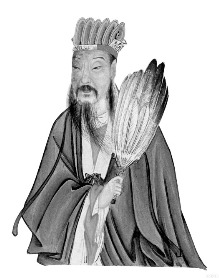
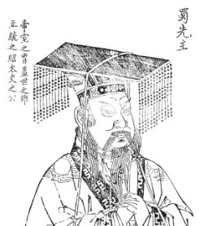

가짜 영웅 전성시대

‘모수자천(毛遂自薦)’이란 고사가 있다.

진(秦)에 포위된 조(趙)나라 왕이 합종을 위해 초(楚)나라 왕에게 평원군을 파견했을 때였다.

평원군은 모사와 책사들로 20명을 데리고 가려 했으나, 마지막 한 명이 모자랐다. 그 때 식객 중 모수란 자가 스스로 나섰고, 결국 그가 일을 성사시켰다는 내용이다. 처음 모수의 정체와 능력을 의심한 평원군과 모수 사이에 오간 대화가 바로 ‘낭중지추(囊中之錐)’다. 대저 어진 사람이란 주머니 속의 송곳 같아 가만히 있어도 드러나는 법인데, 식객으로 있던 3년 간 모수의 존재를 알지 못했다는 것이 평원군의 물음이었고, 그동안은 주머니 밖에 있었으니 이제 주머니 속에 넣어달라고 응수한 것이 모수의 답변이었다. 그래서 결국 모수는 공을 세웠고, 그로 인해 ‘어려울 때 스스로 나서서 일을 해결하려한다는’ 좋은 뜻으로 쓰여온 것이 '모수자천'이란 말이다. 그러나 지금은 ‘부끄러움을 모르고 스스로 나서려 한다’는 부정적인 말로 쓰이고 있다.

\*\*\*

너도 나도 민의를 받들어 나라를 경영해보겠노라 동분서주하고 있다. ‘모수자천’ 식으로 등장한 인물들의 ‘병아리 셈법’이 참말 가관이다. 땅 덩어리 크기가 능사는 아니겠지만, 우리나라는 미국 텍사스 주의 7분의 1, 캘리포니아 주의 4분의 1도 안 되는 작은 나라다. 이 작은 나라에 서너 명의 고만고만한 인물들(방송에서 하도 떠들어대니 새삼 나까지 손목 아프게 이들의 실명을 이곳에 기록할 필요는 없으리라)이 등장하여 돌아다니는 모습을 날마다 보고 있노라면, 기가 찰뿐이다.

이들이 갖고 있는 건 원대한 포부나 숭고한 뜻이 아니다. 내가 보기엔 당장 국민의 눈을 호려보자는 ‘고식지계(姑息之計)’가 전부인 듯하다. 누구의 말대로 ‘현대판 천명(天命)’이라 할 수 있는 민의(民意)를 왜곡하여 ‘새로운 지도자’를 참칭(僭稱)하는 중이라고나 할까. 시대를 읽는 눈이나 천하 질서의 재편을 노리는 전략이 있는 것도 아니요, 하다못해 우리 같은 장삼이사들의 아픔을 읽는 동정심을 갖고 있는 것도 아니다. 그러니 자신들만의 이익을 추구하는 소인배들의 아첨과 계략에 갇혀 옴짝달싹 못하는 ‘골목대장’에 지나지 못하는 존재들이 바로 이들 아닌가.

\*\*\*

제갈량(諸葛亮)은 천하를 세 부분으로 나누고, 자신의 주군인 유비로 하여금 그 한 나라를 차지하게 했다. 이른바 ‘천하삼분지계(天下三分之計)’가 그것이다.[[각주:1]](#footnote_487_1) 그도 궁극적으로는 천하 통일의 대업을 노렸겠지만, 그러기 위해서는 단계가 필요하다고 판단했을 터. 천시(天時)를 타고 난 조조, 지리(地利)를 차지한 손권과 달리 유비는 인화(人和)의 장점을 갖고 있다고 본 것이 제갈량의 생각이었다. 영웅이 되려면 천하를 호령할만한 권능을 지녀야 하고, 책사가 되려면 모름지기 주군의 장점을 꿰뚫어 보는 제갈량의 안목과 배포를 가져야 할 것이다. 이처럼 착안과 전략은 대국적이어야 한다. 그러나 그 실천은 작은 데서 시작해야 할 것이다.

백성들은 살려 달라 아우성치고 세계는 국익에 따라 혼란스럽게 요동치는데, 눈앞의 식어가는 잿밥에만 눈이 먼 술사(術士)들이 자신들의 암매한 주군을 모시고 조막만한 권력을 차지하겠노라 동분서주하는 것이 이 나라의 현실이다. 이번에야말로 천명이 자신들의 주군에 내려졌다고 믿는 것일까. 세속적 욕심 그득한 평원의 필부들을 영웅으로 둔갑시켜 내세운 채 만인의 눈을 속이려 하는 것도 그 때문이리라.

\*\*\*

지금 이 시대에 누가 영웅이란 말인가. 바야흐로 ‘가짜 영웅들의 전성시대’가 활짝 열리고 있다. 이 소극(笑劇)이 언제 어떻게  끝날지 두고 볼 일이다.

                                                        
                                                                          제갈량

  
유비

1. 혹자는 필자가 이곳에 언급한 제갈량의 '천하삼분지계'를 안철수의 신당 창당과 결부시키려 할지도 모르나, 단언컨대 그건 아니다. 이 점에 대해서는 새 글에서 다시 언급할 기회가 있을 것이다. .
   [[본문으로]](#footnote_link_487_1)

공유하기

게시글 관리

**백규서옥\_Blog ver.**

[저작자표시 비영리 변경금지
(새창열림)](https://creativecommons.org/licenses/by-nc-nd/4.0/deed.ko)