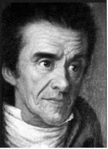

선생을 존경해야 나라가 산다!

그는 멀리 가는 내 차에 처음으로 동승했다.

묵직한 체구에서 울려나오는 저음으로

긴 교단 생활의 아픈 마음을 내게 덜어 건넸다.

무엇보다 교육계에 대한 걱정이 많았다.

정년을 3년 앞둔 그였다.

학생들이 도무지 말을 들어먹지 않아

마지막 3년을 어떻게 견뎌야 할지 모르겠다고 했다.

지금의 학생들, 무서운 게 없다고 했다.

언젠가 학생의 도가 지나쳐 뺨을 친 교사가 있었다 한다.

그런데, 학생 녀석도 달려들어 교사의 뺨을 쳤고,

결국 난투극이 벌어졌다 한다.

충격을 받은 그 교사, 결국 명퇴로 통한의 교단생활을 마무리하고 말았단다.

학생들이 잘못을 저질러 매 한 대 맞으면,

‘당연한 일이지!’가 지난 시절 한국인들의 반응이었다.

그러나 지금은 아니다.

쇼팽이 피아노 치듯 잘도 놀리는 손가락으로 스마트폰을 눌러

잽싸게 부모에 경찰에 신고하는 게 그들이란다.

‘나를 낳아 주신 분은 부모’지만,

‘나를 인간으로 만들어주신 분은 선생님’이라고 말하던 시절이 있었다.

지금은 ‘부모가 돈을 내서 먹여 살리는 존재’가 선생인 세상이다.

‘내 덕에 살아가는 존재’가 선생이라는 것이다.

툭하면 학부모가 찾아와 교사들의 멱살을 잡거나 뺨을 치고

뻔질나게 경찰차가 교문을 드나드는 것도 바로 그 때문이다.

‘돈 없고 빽 없는 놈은 국립사범대학에나 가야한다’는 말을

귀에 못이 박히도록 들었고,

가난에 찌들어 있던 나는 미련 없이 그곳으로 갔다.

들어가서 책으로나마 페스탈로치의 철학도 배웠고,

그의 철학과 삶을 통해 내 선택을 정당화 시키고자 노력도 했다.

고백하건대, 학교 시절 맘에 드는 선생님들은 거의 없었다.

괜찮은가 싶다가도 여지없이 ‘인간적인 면’을 드러내는 분들이 대부분이었다.

그래도 ‘선생님이니 존경하는 게 맞다’고 늘 나 자신을 눌렀다.

그 시대엔 누구나 그랬다.

‘선생도 역시 사람’이라는 것,

‘그래도 교직이 다른 직종보다는 수시로 잘못을 자책하게 하는 분야’라는 것,

‘그래서 교사는 결정적 흠결이 상대적으로 적을 가능성이 농후한 존재들’이라는 것.

이렇게 나는 나를 포함하여 선생들이 갖고 있는 ‘존재론적 진실’을 깨닫기까지

50년의 세월이 소요되었다.

정치인들과 정치인들 뺨치게 정치적인 교육감들이 표를 의식해서였을까.

이른바 ‘학생인권조례’라는 걸 만들어 학교를 해방구로 전락시켰다고들 한다.

집에서도 밥상머리 교육이 사라진지 오래다.

자식이 잘못 했을 때 꾸중하는 부모도 별로 없다.

사회에서 누군가 내 자식을 꾸짖을 때

그 어른을 탓할 뿐 자식을 꾸짖는 부모는 거의 없다.

가정교육을 제대로 받은 아이들이 많지 않은 것도 그 때문이다.

베이비부머.

6ㆍ25 직후부터 1960년대 초 사이에 출생한 사람들이다.

부모로부터 물려받은 전통사회의 의식을 지금의 그것으로 전환시킨 장본인들,

부모에게 효도하고 선생님을 존경해왔으면서 정작 자식들에게는

그걸 제대로 가르치지 못한 장본인들이다.

이들의 자식들이 자식들을 낳아 학교에 보내게까지 되었으니, 학교의 꼴은 불문가지다.

선생이 특정학생에게 언성만 높여도 부모로부터 득달같이 전화가 걸려오고,

심하면 찾아와 멱살잡이와 폭력이 이어지는 시절이다.

지금의 아이들은 무서운 것도, 존경할 대상도 없다.

부모들도 아이들에게 무서움과 존경을 가르치지 않는다.

요즘 부모들은 입만 열면 ‘아이들 기 죽이지 말라!’고 고함을 지른다,

그러나 ‘제멋대로 굴게 만드는 힘’이 ‘기’는 아니다.

기에는 정기(正氣/精氣)와 사기(邪氣)가 있다.

‘불의에 굴하지 않는 기개’, ‘바른 자세로 매진하는 기개’가 정기(正氣/精氣)요,

‘사람을 속이고 공동체를 교란시키며

제멋대로 구는, 삿된 기운’이 사기(邪氣)다.

요즘 부모들이 아이들의 기를 세우려 한다지만,

그 상당수의 경우는 삿된 기운일 뿐이다.

그래서 지금의 아이들은 또래들로부터 ‘왕따 되는 것’만 무서울 뿐,

도대체 무서운 게 없다.

잘못을 저질러도 부모가 나서서 감싸주고 경찰이 나서서 보호해주기 때문이다.

요즘 들어 군대에 십 수만 명의 ‘관심사병’이 상존(常存)하는 것 역시

이런 교육 때문이라고 주장하는 논리가 그럴 듯한 것도 그 때문이다.

결국 빗나간 자식사랑이 교육을 망치고, 군대를 망치고,

사회를 망치고, 나라까지 망치고 있는 것이다.

\*\*\*

아이들에게 ‘존경할만한 대상’, ‘무서운 대상’을 만들어줘야 한다.

선생님으로부터 꾸중 받고 전화를 걸어왔을 때 득달같이 학교로 찾아가

학생들이 보는 앞에서 선생님의 멱살을 잡지 말고,

머리가 땅에 닿도록 조아리며 ‘가정교육 부실’에 대해 사죄한 다음,

전화 걸어온 자식을 매섭게 꾸짖을 순 없을까.

제대로 된 교육은 그 지점부터 시작될 것이고,

이 사회와 국가는 그 지점부터 바로 잡힐 가능성이 보일 것이다.

이제 베이비부머들과 그 자식들은 ‘한참 빗나간 자식들’을 밥상머리로 끌어들여

‘무서운 대상’과 ‘존경할 대상’을 알게 해야 한다.

그 길만이 우리 모두가 사는 길이다.

  
페스탈로치

공유하기

게시글 관리

**백규서옥\_Blog ver.**

[저작자표시 비영리 변경금지
(새창열림)](https://creativecommons.org/licenses/by-nc-nd/4.0/deed.ko)