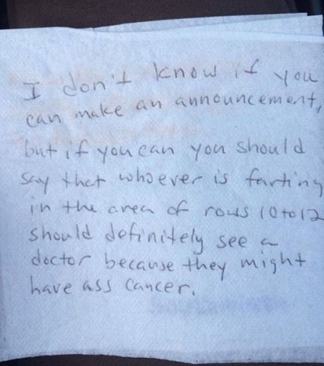

방귀쪽지

신문을 읽다가 모처럼 포복절도하고 말았다.

주변 누군가의 (소리 없는) 방귀로 인해 괴로움을 당하고 있던 비행기 안의 한 승객.

참지 못하고 냅킨에 적어 여승무원에게 기내방송을 요구했으나 결국 방송되지 않았고, 쪽지는 나중에 그 승무원의 아들에게 전해져 소셜 미디어에 공개된 모양이었다. 다음은 쪽지의 내용.

I don’t know if you can make an announcement, but if you can you should say that whoever is farting in the area of rows 10 to 12 should definitely see a doctor because they might have ass cancer.

이 문장을 번역하면 다음과 같다.

 “방송을 해주실 수 있을지 모르겠지만, 가능하시면 10열과 12열 구역에 있는 누군가 ‘똥꼬 암’에 걸렸을지도 모르니 (비행기에서 내린 뒤)반드시 의사를 찾아보라고 해 주세요.”

냅킨을 사용한 걸 보면, 아마 식사 시간 혹은 그 바로 뒤였으리라. 오죽 괴로웠으면 승무원에게 이런 냅킨 쪽지까지 보냈을까. 아마 그(그녀)도 설마 승무원이 그 쪽지를 기내방송으로 공개해 주리라 기대는 하지 않았을 것이다. 이미 여러 차례(?) 도둑 방귀를 뀌어댄 마당에, 기내방송을 한다고 '방귀 혐의자'가 선뜻 커밍아웃할 위인은 아니었을 것이기 때문이다.

그렇다면, 이 쪽지 작성자는 누구였을까. 비행기가 크냐 작으냐의 차이는 있겠지만, 10~12열 구역에 있는 사람들이래야 10명 내외였을 것이다. 분명 냄새는 풍겨나는데 ‘범죄자’^^가 누군지 모르니, 어쩌면 그 구역 사람들 모두 서로들을 ‘혐의자’로 의심하고 있었음에 틀림없다. 그러다가 그들 중 가장 비위가 약하거나 결벽증이 강한 사람이 이 쪽지를 작성했을 것이다. 방귀 냄새를 못 견뎌한 사람이거나, 자신은 분명 뀌지 않았는데 혐의자들 가운데 하나로 몰리는 것이 억울하고 걱정된, 이른바 ‘도덕적 결벽증’의 소유자였으리라. 분석심리학에서 일컫는 이른바 ‘자기방어기제(self-defence mechanism)’의 발로라고나 할까? 아니면, 더 적극적으로 ‘방귀 뀐 놈이 성낸’ 경우일 수도 있으리라.

\*\*\*

누가 되었든, 참 재미있는 일 아닌가. 오죽 독했으면, ‘똥꼬 암’에 걸렸을지도 모른다고 표현했을까?^^ 무엇보다 화장실을 지척에 두고도 ‘적진에 침투하여 화생방 작전하듯’ 그런 방귀를 좌석에서 몰래 풀어놓은 당사자의 ‘후안무치(厚顔無恥)’야말로 금메달감이라 아니 할 수 없을 터. 이 유머, 우울한 시점에 만난 한 잔의 탄산소다라 할 수 있으리라. 그의 증상이 부디 ‘똥꼬 암’이 아니었기를...

공유하기

게시글 관리

**백규서옥\_Blog ver.**

[저작자표시 비영리 변경금지
(새창열림)](https://creativecommons.org/licenses/by-nc-nd/4.0/deed.ko)