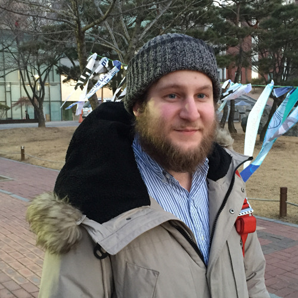
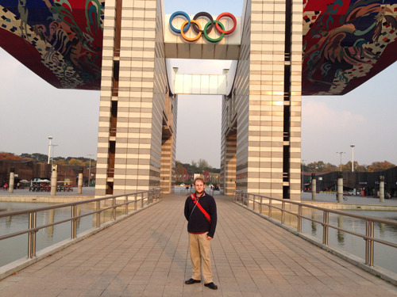
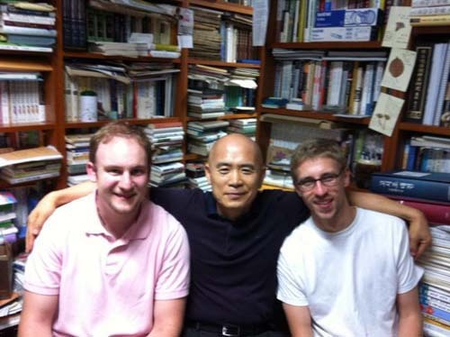
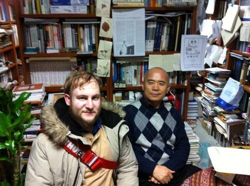
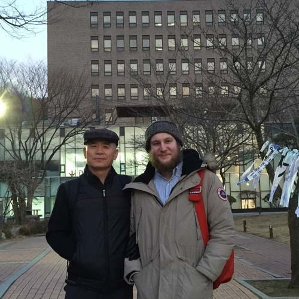
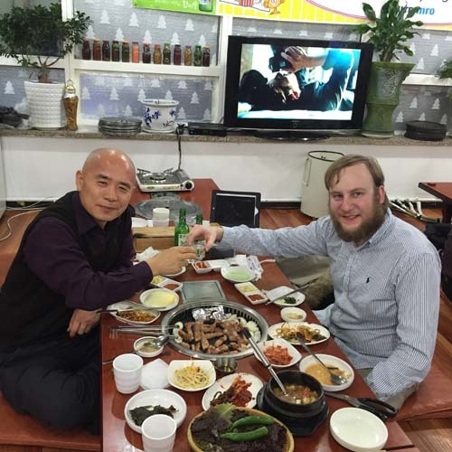
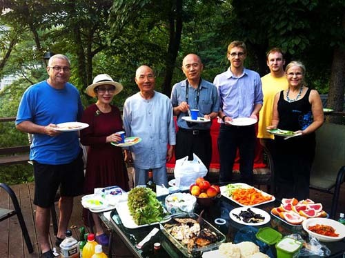

게리를 하늘나라로 보내며

잠자리에서 일어나 스마트 폰을 켠 게 불찰이었을까.

이메일 함에 레슬리(Lesley) 교수의 이름과 함께 떠오른

‘Very sad news’란 세 단어가

화살처럼 날아와 가슴에 꽂혔다.

게리(Gary Younger)가 죽었다는 소식이었다.[[각주:1]](#footnote_492_1)

그의 어머니와 함께 휴스턴에서 스틸워터로 돌아가던 중 교통사고로 죽었다는 것.

갑자기 캄캄해진 눈앞에서 추억의 필름 한 통이 스륵스륵 돌기 시작했다.

가도 가도 끝이 없던 오클라호마와 텍사스의 고속도로들.

주변의 경관들이 단조롭고 광활해서 짜증나던 곳.

풀을 뜯던 목장의 소들이 물끄러미 바라보며 되새김질에 몰두하던 곳.

사마귀 모양의 원유 채굴기들이 끄덕거리며 열심히 원유를 퍼내던 곳.

그런 한가한 도로에서 웬 교통사고?

있을 수 없는 일이고, 상상할 수 없는 일 아닌가.

오클라호마 주립대학(Oklahoma State University) 역사과.

2013년 풀브라이트 방문 연구원으로 한 학기를 지낸 곳이다.

그곳에서 박사과정을 이수하던 그를 만났다.

고등학교 교사를 몇 년 지낸 뒤 진학했기 때문일까. 나이가 들어보였다.

한국 현대사, 그 중에서도 한미외교사에 큰 관심을 갖고 있던 그였다.

자주 내 연구실을 찾아와 물었고,

우리는 꽤 긴 시간 한국의 역사와 정치에 관해 이야기를 나눴다.

한국 문제에 관한 논평을 내곤 하는 미국의 전문가들이 있었는데,

알고 보면 대부분 중국이나 일본통이었다.

가끔 ‘내가 너를 미국 최고의 한국 전문가로 만들어 주겠다!’는

가당찮은 너스레를 떤 것도 그 때문이었다.

귀국 무렵 그를 한국학중앙연구원의 ‘차세대 한국학자’ 프로그램에 지원하게 했고,

귀국 후 얼마 만에 한국에서 그를 만날 수 있었다.

한국에서 그는 열심이었다.

한국말도 열심히 배웠다.

연구기관과 도서관을 돌아다니며 자료도 열심히 수집했다.

내 말대로 몇 년 안에 ‘미국 내 최고의 한국 전문가’가 되려고 했던 것일까.

정말로 열심이었다.

술자리에선 미국인답지 않게 소주를 잘 마시고 삼겹살도 잘 씹었다.

‘1년 만에 한국사람 다 되었다’는 농에 식당 가득 파안대소를 터뜨리기도 했다.

그런데 오늘 아침, ‘하늘나라로 갔다’는 그의 부음을 받은 것이다.

그는 어디로 갔을까.

‘미국 내 최고의 한국 전문가’가 되려는 꿈을,

이승 아닌 어디서 펼치겠다는 것일까.

미국에서 박사학위를 받은 뒤 다시 한국으로 돌아와

‘박사 후 과정’을 하겠다는 그 계획을 어디 가서 이루겠다는 것일까.

어학능력도, 분석력도, 아시아 역사에 대한 지식도 출중한 그였다.

그래서 앞으로 10년. 아니 사실은 10년까지 갈 필요도 없을 그였다.

미국의 일본이나 중국 전문가들이 곁다리로 내 뱉는 한국 관련 논평들이 못마땅하여

그가 제대로 된 ‘한국 전문가’로 성장하기를 기원해온 나였다.

지금 30대 초반이니, 어쩜 40대 초반에는 미국의 실력 있는 한국 전문가로 성장하여

내 속을 후련하게 해줄 수 있었을 텐데...

그는 그렇게 가고 말았다.

흔적도 없이, 누구 말대로 ‘나 이제 갑니다’라는 말도 못한 채

그는 그렇게 가고 말았다.

지금 이 순간

죽음보다 ‘삶의 덧없음’이, ‘수포로 돌아간 삶의 계획’이,

‘아무 약속도 할 수 없는 공허함’이 두려운 것이다.

그가 가꾸어 온 꿈과 삶의 흔적들은 모두 어디로 날아간 것인가.

저 숲속의 늠름한 나무들은 못 된다 해도

하다못해 길 가의 못난 띠 풀로라도

하다못해 보이지 않는 메아리로라도

모습을 바꾸어 남아 있어야 할 것 아닌가.

그래야 잠시 고갤 숙여 내려다보면 보일 것이고

잠시 귀를 기울여 들어보면 들릴 것 아닌가.

그렇게도 열심히 꿈을 보듬어가며 살아온 인생인데...

게리여,

부디 이 땅의 하찮은 꿈 따윈 접어두고

그곳에 맞는 새 꿈을 가꾸며

행복한 삶을 누리시라!

머지않아 찾아갈 그대의 동료들을 위해

그대만의 멋진 영역을 잘 가꾸어 놓으시라!

2016. 1. 26.

게리 영거의 부음을 듣고

  
숭실대 교정에서

  
올림픽 공원에서

  
백규 연구실에서 게리와 세바스티안

  
백규 연구실에서

  
숭실대 교정에서

  
학교 앞 식당에서

  
선무치료학 전문가 이선옥 박사 및 이 박사의 지인들과 함께

1. \*레슬리 교수로부터 온 이메일의 번역문과 원문//
   조박사님께
   얼마 전부터 박사님께 편지를 쓰려고 마음먹고 있었는데, 이제 급한 일이 생겨 연락드리네요.
   오늘 아침 일찍 게리 영거와 그의 모친이 휴스턴에서 스틸워터로 오는 길에 자동차 사고로 죽었다는 끔찍한 뉴스를 접하게 되었어요. 자세한 건 모릅니다만, 저는 우리 학과에서 지금까지 가장 우수한 학생들 중의 하나를 잃었다는 사실에 비통해하고 있습니다. 그는 항상 명랑했고 열심히 공부했으며 자신의 공부에 관하여 열심히 말했답니다. 그래서 우리 모두는 그가 한국 역사의 뛰어난 학자가 될 것으로 확신하고 있었지요. 그는 또한 다른 사람들에게 매우 친절하고 너그러웠으며, 그래서 전 학과가 모두 슬픔에 빠져 있습니다. 저는 박사님께서도 그에 관하여 똑같은 느낌을 갖고 계시리라 믿어요. 특히 박사님과 그가 한국에서 얼마동안 함께 계시기도 했잖아요? 그는 박사님이 OSU를 방문해주신 점에 대하여 매우 고맙게 생각했어요.
   글쎄요. 유감스럽게도 제가 나쁜 소식을 전한 사람이 되었네요. 저는 박사님께 저의 위로를 보냅니다. 게리의 죽음이 박사님께도 굉장한 상실이겠지요.
   레슬리 림멜 드림
   Dear Dr. Cho,
   I've been meaning to write to you for some time, but now there is something else that is rather urgent. Earlier today I learned the horrible news that Gary Younger and his mother were killed in a car accident on their way to Stillwater from Houston. I don't know any details, and I am heartbroken about the loss of one of the best students we have ever had in our department. He was always so cheerful and eager to work and to talk about his work; we were all certain that he was going to be an outstanding historian of Korea. He was also so kind and generous to others, and the whole department is in mourning. I am sure that you felt the same way about him, especially as you and he spent time together in South Korea. He so appreciated your visit to OSU.
   Well, I am sorry to be the bringer of bad news. I send you my condolences; this must be a great loss to you, too.
   Sincerely,
   Lesley Rimmel
   [[본문으로]](#footnote_link_492_1)

공유하기

게시글 관리

**백규서옥\_Blog ver.**

[저작자표시 비영리 변경금지
(새창열림)](https://creativecommons.org/licenses/by-nc-nd/4.0/deed.ko)