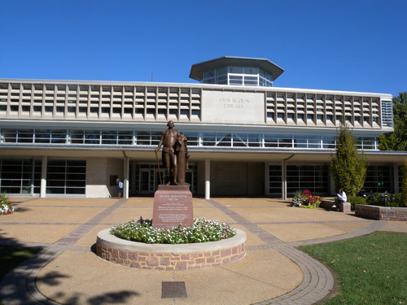
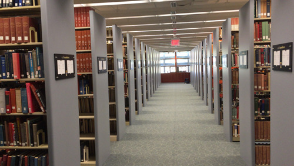
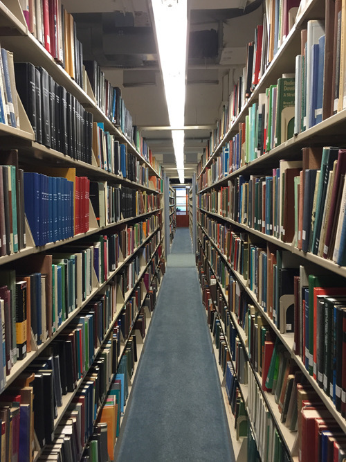
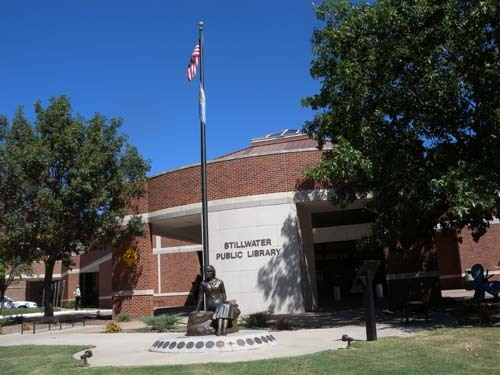
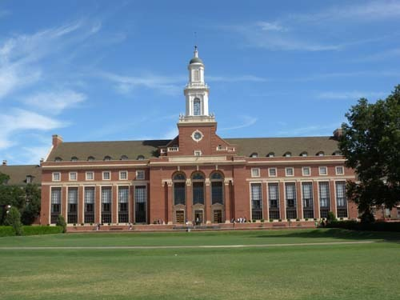
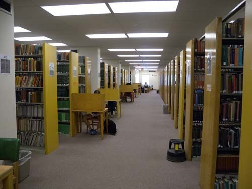
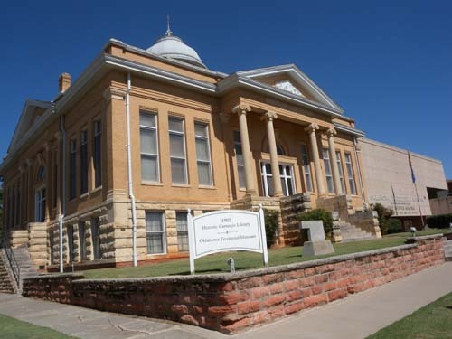

지금 한국의 대학들에 만연되고 있는 '반지성적 문화'가 어디 한 두 가지랴?

어느 학교라고 콕 집어 말하고 싶지 않고, 말할 필요도 없으리라. 모두 거기서 거기. ‘도낀 개낀’ ‘난형난제’, ‘도토리 키 재기’의 대학사회 아니더냐! 한 치 앞서 간들 무어 그리 나을 게 있고, 한 치 뒤쳐졌다고 무어 그리 못할 게 있을까?

한 달 전쯤인가. 서울의 어느 대학에서 공부하고 있는 대학원생 하나가 찾아와 자못 흥분된 어조로 내게 말했다.

“하루는 도서관에 들어가는데, 큰 덤프트럭 두 대가 도서관의 책을 그득하게 ‘때려 싣고’ 학교 밖으로 나가더군요. 궁금해서 직원에게 물어본즉 덤덤한 어조로 ‘보존서고에 있는 도서들을 폐기처분하는 중이라’고 하데요.”

그래. 제정신을 갖고서야 지금 이 시대 대한민국의 어느 대학에선들 ‘학자로’ 살아갈 수 있겠느냐? ‘집안이 좁으니 세간들 가운데 때가 묻은 것들을 골라 쓰레기장에 버리듯, 버리는 거겠지!’라고 대답하는 내 마음이 심히 불편했다.

#그 대학 교수로 있는 친구의 말. 며칠 전 논문을 쓰다가 급한 책이 있어 학교 도서관을 검색하니 보존서고에 소장되어 있더란다. 그러나 지금 정리 중이라 볼 수가 없다는 답변이 돌아왔다.  나중에 생각하니 그 '정리'라는 것이 '폐기물 처리'를 말했고, 미루어 짐작컨대 그 책들은 폐기도서 트럭에 실려 나간 게 분명했다. 하는 수 없이 그는 제자를 통해 이웃 학교의 도서관에서 다섯 권이나 되는 그 책(영인 자료 본)을 빌려다가 아예 복사ㆍ제본까지 해버렸단다. 대학생들은 잘 보지 않아 자리만 차지하는 책이니, 도서관 직원들도 버리고 싶었을 것이다. 만약 그런 (귀한) 책을 ‘폐지로 취급하여’ 버렸다면, 속된 말로 '참 망할 ××들'이라고 그 친구는 크게 흥분했다.

#꽤 오래 전이다. 이름뿐이었지만, 도서관의 무슨 위원이라 하여 1년에 한 번 정도 있는 회의에 나간 적이 있었다. 누군가 이제 IT 시대이니, 페이퍼 북은 줄이거나 없애고 e-book 체제로 가야 한다고 주장했다. 그렇지 않다고, 서양의 명문대학들은 미련해서 도서관에 페이퍼 북 채우는 노력을 기울이는 줄 아냐고 역설했으나, 역부족이었다. 하기야 엔지니어들이 대학의 수장이나 도서관의 책임자로 군림하는 시대이니, 그들에게 도서관의 의미를 묻는 것은 ‘우물에 가서 숭늉 찾는 격’일 것이다.

#내 연구실에는 출판사 사장들이나 영업사원들이 수시로 들른다. 아직은 제법 책을 사주기 때문일 것이다. 끙끙 무거운 책 짐을 들고 방문한 그들에게 ‘주로 인문학 도서들을 폐기처분하는’ 우리나라 대학 도서관의 만행^^을 말해줄 수가 없다. ‘앞으로 경기가 풀리면 출판시장도 좋아지지 않겠느냐?’는 입에 발린 위로의 말이나 뱉어낼 뿐, 축 쳐진 그들의 어깨를 받쳐 줄 희망적 언질을 건넬 방도가 없다. 내가 아무리 강심장이라 한들 힘들게 만든 책들이 소설책들처럼 잘 읽히지 않는다는 이유로 폐기처분된다는 말을 그들에게 어찌 해줄 수 있으랴.

\*\*\*

내게 미국 대학들의 가장 감명 깊은 공간은 도서관이었다. 교수도 학생도 실제적인 학구 활동은 그곳에서들 펼치고 있었다. 백발이 성성한 대학자 노교수를 만난 것도 숲처럼 빽빽한 서가들 사이에서였다. 적어도 내가 찾는 사람들은 늘 연구실 아니면 도서관에 있었다. 그런 도서관들에서 멀쩡한 도서들을 폐기하는 꼴을 보지 못했다. 공간이 충분한 점도 그 이유의 하나는 될 것이다. 그러나 그보다는 수백 년 그들을 지탱해온 ‘지성적 문화 풍토’를 누구도 거역하려 들지 않기 때문으로 보였다. 물론 그들에게도 공간의 문제가 없는 건 아니다. 그래서 상당수의 대학 도서관들에서는 ‘기프트 센터(gift center)’를 마련하고 서고에서 퇴출되는 책들을 ‘공짜에 가까운 가격으로’ 학생들이나 주민들에게 나누어 주고 있었다. 대학 도서관 뿐 아니라 지역의 공공도서관들도 마찬가지였다. 정기적으로 폐기 도서들을 주민들에게 나누어 주다시피하고 있었다. 책을 한 보따리씩 들고 나오며 함박웃음 짓는 그들이 부러웠다. 한없이 부러웠다. 아, 선진국이란 바로 이런 것이구나!

학문적 변화주기로 볼 때 인문학과 이공학이 다른 것은 분명하다. 실용적 도구학과 정신적 학문이 같을 수 없기 때문이다. 솔직히 대학의 본질에 대하여 다시 논하고 싶지 않은 것은 이미 이 땅에서 ‘본질적인 의미에서의 대학’이 사라졌기 때문이다. 형이하적 도구학 전공자들이 패권을 휘두르고, 나라 전체로도 지도적인 학자들이 모조리 사라진 형국이니, 지금의 대학들은 대학이 아니다. 대통령이 대학을 알 리 없고, 교육부 장관은 정권의 입맛에 맞춰 우왕좌왕하다가 정치판으로 복귀하면 그만이며, 교육 관료들은 잠시잠시 그런 장관의 손짓에 맞춰 춤추는 것으로 소임을 다한다고 생각하는 나라, ‘해외 유학 동안 열등생으로 지내다가 복귀하여 지배자 행세하는’(김종영, <<지배받는 지배자-미국유학과 한국 엘리트의 탄생->>, 돌베개, 2015, 참조.) ‘지적 사기꾼들’(어떤 인사의 말 인용)이 학문 권력을 독점하는 나라, 정치권과 학계를 부지런히 오가며 곡학아세(曲學阿世)해도 ‘대단한 학자’로 대접받는 나라가 바로 우리나라다. 하기야 스마트폰 하나만 가지면, 페이퍼 북 없이도 논문 한 편을 써내는 날이 조만간 올 것이라고 큰소리치는 인사가 내 주변에 있으니, 다시 무슨 말을 덧붙일 수 있으랴!ㅠㅠ

  
세인트루이스 소재 워싱턴대학교(Washington University, Saint Louis)의 John M. Olin Library

  
세인트루이스 소재 워싱턴대학교(Washington University, Saint Louis)의 John M. Olin Library 서가

  
세인트루이스 소재 워싱턴대학교(Washington University, Saint Louis)의 John M. Olin Library 서가

  
미국 스틸워터(Stillwater) 시립도서관

  
스틸워터 시립도서관에서 폐기도서들을 싼 값으로 주민들에게 나눠주는 모습

  
오클라호마주립대학(OSU)의 '에드몬 로우 라이브러리(Edmon Low Library)'

  
오클라호마주립대학(OSU) '에드몬 로우 라이브러리(Edmon Low Library)'의 서가

  
오클라호마주 거쓰리시티(Guthrie City)의 카네기 도서관  
(오클라호마 주에서 가장 먼저 세워졌음)

공유하기

게시글 관리

**백규서옥\_Blog ver.**

[저작자표시 비영리 변경금지
(새창열림)](https://creativecommons.org/licenses/by-nc-nd/4.0/deed.ko)