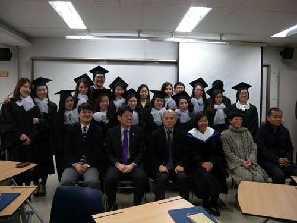
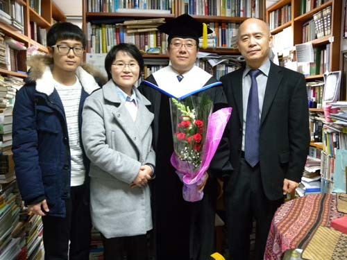
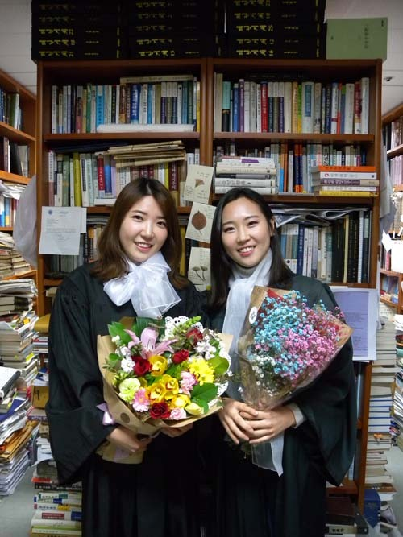
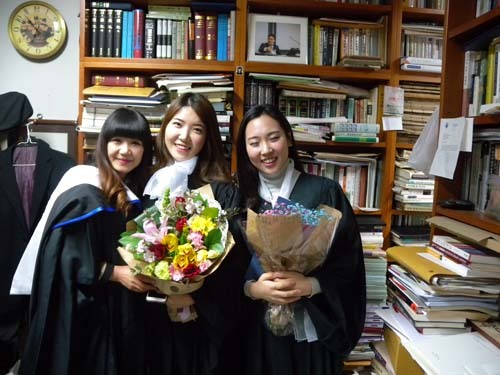
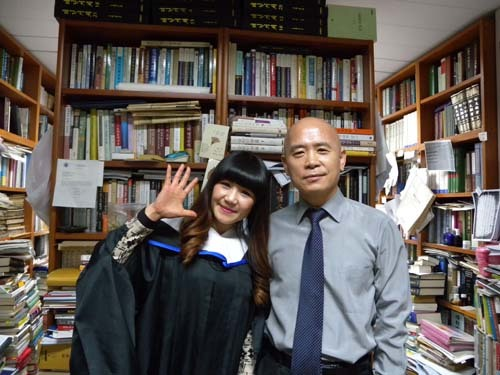

사랑하는 국문과 졸업생 여러분!

대학에 대한 기대와 젊음의 열정으로 반짝거리던 여러분의 새내기 시절이 엊그제인데, 벌써 사회로 나가는 문지방에 서 있음을 보고, 시간이 덧없다는 생각을 거듭 확인하게 됩니다. 오늘 여러분 앞에서 졸업 축하의 말씀을 전하는 기회가 내게 주어진 것도 교수님들 가운데 내가 맨 먼저 ‘시간의 무상함’을 절감하는 계절에 들어섰기 때문일 것입니다.

여러분을 보며 내가 대학을 졸업하던 때를 생각합니다. 우중충한 유신 말기의 냉기가 대지를 덮고 있던 때였습니다. 농사꾼의 아들로 태어난 내가 대학을 졸업한 뒤 어떻게 입신할 것인가 고민에 싸여 있던 시절이기도 합니다. 나는 기회 있을 때마다 ‘수렵 채취 시대-농경 시대-산업화 시대-정보화 시대-고도 지식정보화 시대’를 두루 거쳐 왔음을 우스갯소리로 내세우곤 합니다만, 사실 내가 당시 농경시대에서 산업화 시대로 넘어가는 과도기적 존재였던 것은 분명합니다.

세계사를 관찰할 때 내 세대 즉 한국의 베이비부머들만큼 다이내믹하고 극적인 삶을 살아온 사람들도 없는 것 같습니다. 6·25 전쟁이 끝난 1955년부터 1963년 사이에 출생한 사람들로서 고도 경제성장과 1997년 외환위기, 그리고 최근 글로벌 금융위기를 두루 경험한 세대이지요. 우리 세대 구성원들 사이엔 간혹 ‘금수저’도 있었지만, 내 주변의 모든 이들은 나와 같은 ‘흙수저’들 뿐이었습니다. 아무것도 쥐고 있지 않아 차라리 과감하게 ‘베팅해볼 수 있는’ 나 자신이고 우리였습니다.

내가 살아갈 수 있는 유일한 길은 '무모하다 싶을 정도로 대책 없는' 계획을 세운 뒤 한눈팔지 않고 밀고 나가는 것이었습니다. 인생이란 다시 올 수 없다는 절박감이야말로 '몸뚱이' 하나로 '도박판같은 세상'에 나서게 한 동력이었습니다. 어느 시대의 누구에게나 마찬가지이겠습니다만, 부모 형제가 뒷배를 보아줄 수 있는 사람들이 과연 얼마나 되겠습니까?

대략 20년 전쯤인가요. 차를 몰고 미국 모하비 사막( Mojave Desert)과 그 한 가운데 자리 잡고 있는 데쓰밸리(Death Valley)에서 아무도 없는 가운데 황혼을 만났던 때를 떠올려 봅니다. 그 때 느낀 막막함이야말로 ‘나를 위해 책임 져 줄 아무도 없다’는 실존적 자아인식으로 이어지는 두려움과 절망감 바로 그것이었습니다. "공자는 동산에 올라 노나라를 작게 여겼고 태산에 올라 천하를 작게 여겼다(孔子登東山而小魯 登太山而小天下)“는 말이 <<맹자>>에 나옵니다. 공자 역시 어떤 계기를 만나 현실과 이상 사이에 처한 자아를 인식했고, 그 진실에 대한 깨달음을 얻게 되었다는 말이겠지요.

저도 그랬습니다. 모하비 사막과 데쓰밸리에서 통곡이라도 하고 싶은 두려움과 외로움을 느꼈고, 그런 두려움과 외로움은 내 존재의 본질에 대한 깨달음으로 연결되었던 것입니다. 내가 기댈 곳은 아무데도 없다는 인식 위에서 강한 투지가 생겨났고, 그로부터 종이 위에 어설프지만 미래의 시간계획표를 그을 수 있게 되었습니다.

그 후로 나는 신입생들을 만날 때마다 시간계획의 중요성을 강조해왔습니다. 아마 여러분에게도 그런 권유를 했으리라 믿습니다. ‘하루, 한 달, 한 학기, 일 년, 십 년, 일생’ 단위의 시간계획을 짤 수 있어야 그나마 '모험 투성이'인 인생에서 패착의 가능성을 줄여준다는 사실을 모하비 사막 한 가운데서 깨쳤던 것입니다.

그렇다고 내가 매우 성공적인 삶을 살아왔다고 말하려는 것은 아닙니다. 암울하고 막막했던 내 젊은 시절, 흐릿하나마 어떤 가능성을 부여잡고 용기를 낸 덕분에 지금 여러분 같이 별처럼 빛나는 젊음들 앞에서 보잘 것 없는 내 인생의 경험이나마 전할 수 있는 기회를 갖게 된 점을 고맙게 여길 뿐입니다.

포스트모던 시대의 총아(寵兒)들인 여러분의 손에도 어떤 정해진 형태의 성공이 주어진 건 아닙니다. 안정된 직장이나 소시민적 행복이 지금 당장 가시화될 수 없을지도 모릅니다. 그러나 자신만의 나침반을 들고 광야에서 길을 찾는 개척자의 자세로 용감하게 저 문을 나서야 합니다. 지금까지 시간 계획을 하지 않았다면, 바로 지금부터 그 일을 시작해야 합니다. 눈앞에서 반짝이는 무궁한 가능성들을 촘촘하게 계획된 시간의 그물로 그들먹하게 건져 올려야 합니다.

외로움과 막막함의 한복판에 서 있는 여러분이 자신감만 갖는다면, 최후의 승리는 바로 여러분 자신의 것이 되리라 믿습니다. 모하비 사막을 돌아 수백 마리의 소떼들을 거느리고 돌아오는 여러분을 10년 혹은 20년 후에 다시 만날 수 있길 기대하며, 여러분의 행운을 빕니다.

고맙습니다.

2016. 1. 19.

국어국문학과 조규익 교수

  
졸업식을 마치고

졸업식 후 연구실로 찾아온 양훈식 박사 가족과 함께

  
졸업식 후 연구실로 찾아 온 임민주, 국미진

  
졸업식 후 연구실로 찾아온 고조, 국미진, 임민주

  
졸업식 후 연구실에서 고조와 함께

공유하기

게시글 관리

**백규서옥\_Blog ver.**

[저작자표시 비영리 변경금지
(새창열림)](https://creativecommons.org/licenses/by-nc-nd/4.0/deed.ko)