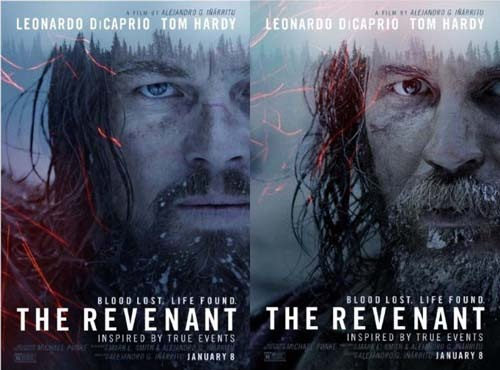
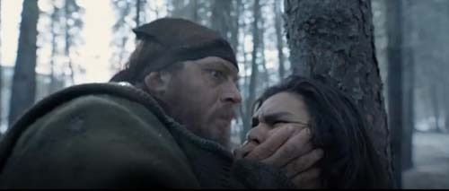
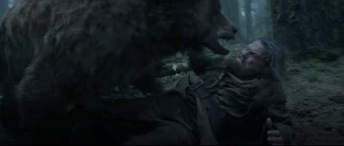
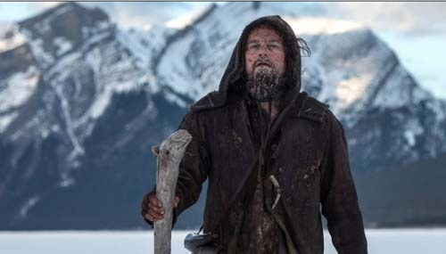
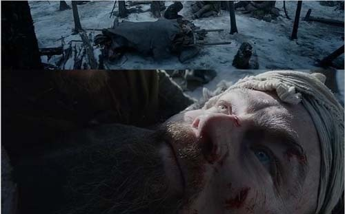
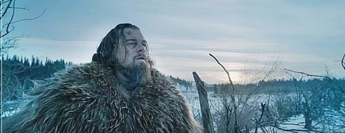

  
영화의 포스터

  
글래스의 아들을 죽이는 피츠제랄드

  
글래스를 덮친 갈색곰

죽음을 초극하게 하는 것은 뭘까?

-영화 <레버넌트Revenant>를 보고-

스티브 잡스가 그랬던가. ‘삶이 만든 최고의 발명품이 죽음’이라고! 처음엔 그저 천재적인 괴짜의 무책임한 발언 정도로 치부했다. 그러나 몇몇 친구들의 죽음, 사랑하는 제자들의 죽음, 집안 어른들의 죽음, 친구 부모들의 죽음, 직장 선배들의 죽음, 사회 저명인사들의 죽음 등을 거쳐, 최근 저세상으로 어머니를 보내드리면서 나는 드디어 어렴풋하나마 나름의 ‘사생관(死生觀)’을 갖게 되었다. 그리고 스티브 잡스의 그 말이 허언(虛言)이 아니었음을 깨닫게 되었다. 죽음의 엄혹한 관문을 통과하신 어머니의 표정이 그토록 평화롭고 행복해 보일 수가 없었다. 대답을 듣지 못할 줄 뻔히 아시면서도 어머니는 늘 ‘아프지 않게 죽을 순 없을까?’라고 내게 묻곤 하셨다. 저승의 관문을 통과하신 어머니의 얼굴을 뵈며 스티브 잡스의 말을 떠올린 것도 그 때문이다.

\*\*\*

어머니 소천 며칠 후 영화 <레버넌트>를 보았다. 사실 이 영화는 어머니 소천 훨씬 전부터 우리 사회에 화제를 일으키고 있었다. 주연인 레오나르도 디카프리오의 오스카상 수상 소식이 매스미디어들을 도배하다시피하고 있는데, 끝까지 모르쇠로 일관하기 어려웠다. 내 호기심을 자극하려고 그랬는가. 광고화면의 영화제목엔 ‘죽음에서 돌아온 자’라는 단어의 뜻까지 부기되어 있었다. 그래, 주인공 그는 어떤 표정으로 삶과 죽음을 넘나들었을까. 과연 그는 죽음을 초극했을까. 우리 주변에 널려 있는 ‘죽음’은 어떤 표정으로 삶과 대치하고 있는지 알아보고 싶었다. 휴 글래스의 가면을 쓴 디카프리오와 피츠 제랄드의 가면을 쓴 토머스 하디가 죽음을 놓고 벌이는 설원의 결투. 처절하게 아름답고 야만적인 자연 속에서 펼쳐지는 서사시의 처음과 끝을, 인생의 의미를 찾다가 실마리를 잃어버린 이쯤에서 잘근잘근 씹어보고 싶었다.

19세기 개척시대 미국의 맥박이 은막 가득 출렁였다. 누구의 손도 닿지 않은 대자연은 갈피갈피 시퍼런 산소를 내뿜고, 그 속을 누비며 욕망의 껍질들을 벗겨내는 모피 사냥꾼들은 일렁이는 물풀 속의 송사리들처럼 가냘펐다. 사랑하는 인디언 여인은 글래스에게 혼혈의 아들을 남겨주었고, 그 세 사람을 엮는 접착제는 가슴 저릿한 사랑과 부성애였다. 더운 침을 질질 흘리며 덮어 누르는 갈색곰(grizzly bear)과의 사투에서 살아나오게 한 힘도 바로 그 부성애였을 것이고, 죽음보다 더 깊은 상처에서 벌떡 일어나게 한 복수심도 그 근원은 부성애였을 것이다. 현존하는 사랑을 삭제해버린 불구대천의 피츠 제랄드. 그를 죽여야 아들에 대한 사랑의 부채를 갚을 수 있다고 생각했을 것이다. 더운 김을 눈 쌓인 대지에 불어내는 그의 야성(野性)도, 인디언들의 추적을 피해 칼날처럼 저미는 급류의 한기에 몸을 맡기고 떠내려가는 초월적 강인함도 아들에 대한 사랑과 의무감으로부터 나온 것이었으리라.

사랑과 복수. 무엇이 되었건 그 끝은 죽음이다. 레마르크 원작의 소설이자 영화인 <사랑할 때와 죽을 때>에서는 사랑에 대한 대립어로서의 죽음을 훌륭하게 보여준다. 죽음이 없다면 사랑의 찬란함을 부각시킬 방도가 없었을 것이다. 그러나 복수는 더 극적이고 원시적인 죽음의 근원이다. 복수는 더 큰 복수를 부르고, 그 악순환은 대개 죽음에 의해 마무리된다.

눈 쌓인 광야에 선혈을 뿌리며 서로의 목숨을 노리는 두 사나이. 두 사람이 안고 뒹구는 모습에서 풍겨나는 분위기야 말로 그 갈색곰의 무자비한 폭력성과 등가적인 그 무엇이다. ‘사랑하는 내 아들을 죽였으니, 너는 반드시 내 손에 죽어야 한다’는 지극히 단순하고 명쾌한 논리를 그는 몸으로 실천했을 뿐이다. 피츠 제랄드가 몇 마디 변명으로 응수해보지만, 이미 대자연의 한 부분으로 동화된 그들에게 무슨 꼼수나 변명이 필요할까. 피츠 제랄드를 죽이고 눈밭에 뻗어버린 그는 무슨 생각을 했을까. 아마 ‘다 이루었다!’였으리라. 굳이 십자가에 매달려 수난을 받은 예수님의 말씀이었음을 확인할 필요까지도 없을 것이다. 악한 원수를 징치하여 (아들에 대한) 사랑을 이룬 행위와, ‘원수를 사랑하라’시며 자신의 몸을 죽임으로써 (인류에 대한) 사랑을 이룬 행위는 분명 정반대이나, 극과 극은 통한다고 하지 않던가. 하늘을 찌르는 침엽수림을 드나들며 ‘복수를 통한 사랑의 구현’,  그 서사를 완성해간 영화 속의 주연과 조연. 그들은 정녕 대자연의 존재원리를 완성시킨 두 마리의 짐승들이었다. 산 자도 죽은 자도 그 순간만큼은 죽음을 초극한 대자연의 소품들이었다. 그래서 이 영화, 얼마간 세월이 흐른 뒤 한 번 더 보고 곱씹어볼 가치가 있다고들 하는 것이리라.

  
복수에 나선 글래스

  
눈밭에 누워 복수를 꿈꾸는 글래스

  
복수의 화신, 글래스

  
피츠 제랄드 역의 톰 하디

  
주연 레오나르도 디카프리오

공유하기

게시글 관리

**백규서옥\_Blog ver.**

[저작자표시 비영리 변경금지
(새창열림)](https://creativecommons.org/licenses/by-nc-nd/4.0/deed.ko)