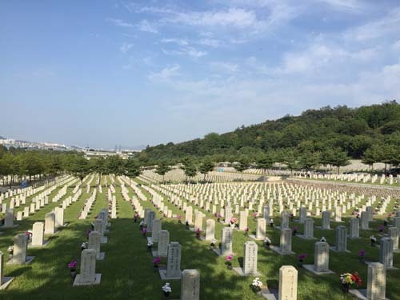
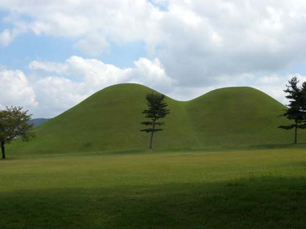
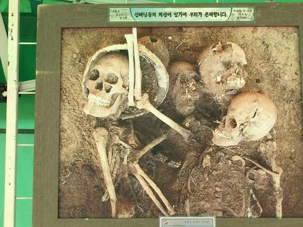

죽음

나는 살아오면서 적지 않은 죽음들을 보았다. 어렸을 적 툭하면 생겨나곤 하던 동네 상가(喪家)엔 내 또래 아이들과 달리 나는 가장 먼저 달려갔다. 어른들의 눈총을 받으면서도 열린 대문 한켠에 서서 시신이 놓인 안방을 훔쳐보곤 했다. 내가 관심을 갖고 있던 것은 사람의 죽은 모습보다 살아남은 여인들(할머니/어머니/아주머니들)이 흘리는 눈물과 곡성(哭聲), 그리고 그것들이 어울려 만들어지던 슬픔이 내 가슴을 저미기 때문이었다. 왠지 그것들은 한동안 비틀거릴 정도로 내 마음을 적시곤 했다. 초등학교 학동에 불과한 나였지만, 우리나라 여인들이 참으로 ‘잘도 운다’는 깨달음을 갖게 된 것은 그런 고향동네의 상가들에서였다. 그런 울음들을 통해 나는 어려서부터 죽음의 비극성을 체득하게 되었다.

20년 전의 아버지에 이어 최근 어머니까지 세상을 뜨셨다. 황망 중에 맞은 아버지의 마지막은 참으로 순식간이었다. 아무런 말씀도 표정도 남기지 못하셨고, 나는 두려움에 아버지의 표정을 확인할 엄두도 나지 않았다. 그러나 어머니의 마지막은 달랐다. 동생의 연락을 받고 전력질주하여 도착해 보니 아직 의식의 끝을 잡고 계셨다. ‘어머니, 제가 왔어요!’ 하고 부르자, 잠시 눈을 뜨시더니 가녀린 미소를 보여주시곤 다시 감으셨다. 그로부터 잠시 후 가슴 위쪽으로 그륵그륵 숨이 차 오르는가 싶었는데, 어느 순간 조용해지셨다. ‘어머닌 이제 가셨어!’라고 의사인 동생이 약간 건조한 목소리로 진단을 내렸다. 이마를 만졌는데, 아직 온기가 느껴졌다. 그 온기가 계속 남아 있었으면 했으나, 볼에서 느껴진 냉기가 순식간에 이마로 올라왔다. 몇 년 만에 참으로 편안한 어머니의 표정을 뵐 수 있었다. ‘죽음은 삶이 만든 최고의 발명품’이란 스티브 잡스의 말이 옳았음을 비로소 확인하게 되었다. 어머니는 떠나시면서 ‘얘야, 죽음을 두려워 마라. 삶의 괴로움을 일순간에 없애주는 죽음이 얼마나 고마우냐!’라는 말씀을 표정으로 보여주셨다. 고단한 하루 일과를 마치고 편안한 표정으로 잠자리에 드는 것처럼, 고단했던 삶과 병고(病苦)의 마지막 구간이 마무리되는 곳에 편안하고 행복한 죽음이 기다리고 있음을 어머니의 마지막으로부터 깨닫게 되었다. 죽음은 비극적인 게 아니라 ‘편안해지는 것’이었다.

자연의 이법에 따라 앓다가 세상을 하직하는 죽음 말고, 요즘은 TV나 인터넷으로 중계되는 죽음들이 너무 많다. 전장이나 테러의 현장에서 수십, 수백 명이 한꺼번에 몰살되는 죽음들은 너무 엄청나니 아예 거론을 말기로 하자. 길 가다가 째려본다고 멀쩡한 사람을 패 죽이는 사건, 돈을 빼앗기 위해 모르는 사람을 죽이는 사건, 말을 안 듣는다고 아가들을 패 죽이는 사건, 원치 않는 출산이라고 돌도 안 된 아가를 떨어뜨리거나 입을 막아 죽이는 사건, 의붓자식이 밉다는 이유로 추운 날 발가벗겨 화장실에 가두고 고문하여 죽이는 사건, 친자식을 굶기고 때려 죽여 암매장하는 사건, 잔소리한다고 노부모를 때려죽이는 사건, 작은 일들로 감정이 상해 음료수에 독극물을 넣어 여러 사람을 한꺼번에 죽이는 사건, 맘에 안 든다고 ‘왕따’시켜온 친구를 결국 패 죽이는 사건, 꾼 돈을 갚으라는 성화에 빚쟁이를 유인하여 죽이는 사건, 고분고분하지 않거나 결별을 선언하는 애인을 잔인하게 죽이는 사건⋯. 이런 말도 안되는 죽음은 그야말로 재앙이다. 그러나 자연의 원리에 따라 삶을 마치고 맞이하는 죽음은 인간이 거쳐야 할 또 하나의 관문일 뿐이다. 그 관문을 통과하면서 겪는 실존적 고통을 어떻게 극복하게 할 수 있으며, 그게 불가능하다면 경감이라도 시켜줄 것인가. 그거야말로 실존적 인간의 마지막을 위해 현대과학이 베풀어야 할 최고의 자비일 수 있지 않을까.  

새 삶의 숫자만큼이나 많은 죽음들이 매일매일 우리네 주변을 배회한다. 우리 모두 지금 ‘살아가지만’ 사실은 ‘죽어갈’ 뿐이다. 먼저 가고 늦게 갈 뿐 종착역은 죽음이다. 가수 이애란은 <백세인생>을 통해 죽기 싫은 인간의 본능을 노래했지만, 누군들 죽음을 피할 수 있으랴. 피할 수 없으면, 삶의 괴로움을 직시하고 죽음에 대한 생각을 바꿔야 하리라. 그래서 이제 매일매일 열심히 ‘죽어갈’ 일이다.

공유하기

게시글 관리

**백규서옥\_Blog ver.**

[저작자표시 비영리 변경금지
(새창열림)](https://creativecommons.org/licenses/by-nc-nd/4.0/deed.ko)