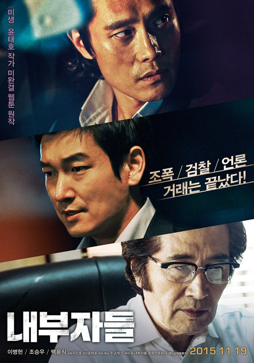
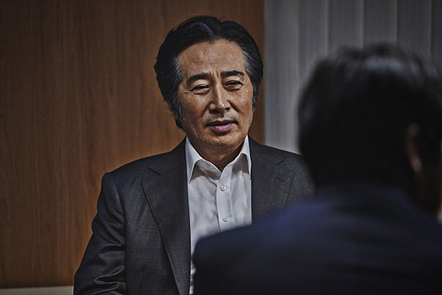
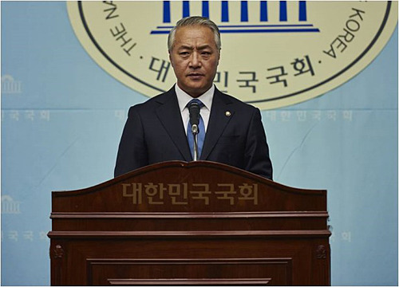
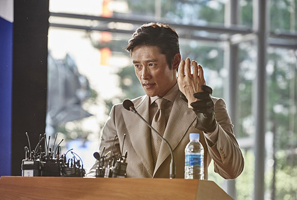

  
영화 <내부자들>의 포스터

  
논설주간 이강희

내부자들의 파티

모처럼 한 건 올렸다. 은근히 보고팠던 영화 <내부자들>을 ‘친견’한 것이다. 비록 답답한 아파트 거실에서이지만, 모처럼 엔딩 타이틀이 뜰 때까지 졸지 않았다. 배우들의 미친 연기, 충격적인 장면들이 내내 나를 ‘쫄게’ 했다. 아, 언제부터 우리가 이런 배우들을 갖고 있었던가? 도끼로 찍히고 톱에 썰려 나뒹구는 손목, 튀는 피, 빙빙 돌려 뽑은 의수(義手)로 상대의 눈앞에 종주먹을 들이대는 안상구(이병헌 분) 눈동자의 살기, 뜨거운 피를 얼려버리는 저음의 협박, 갈가리 찢기는 영혼...상대 심장의 생명 에너지를 느글느글 뽑아가는 논설주간 이강희(백윤식 분)는 아예 ‘사이킥 뱀파이어(Psychic Vampire)’였다!

그러나 스토리는 뻔했다. 재벌ㆍ정치인ㆍ법조인ㆍ언론인ㆍ정치깡패 등등, 참으로 휘황찬란하지만 식상한 스타일의 내부자들이었다. 은밀하게 우리나라를 휘어잡고 있는 그들. 그들만의 리그에서 벌이는 배신과 복수극이 ‘기똥차게’리얼해서 오히려 미학적었다. 사실 미학이 아름다움의 원리만은 아니다. 아름다움을 뒤틀면 추함이 된다. ‘추한 아름다움’ 즉 ‘추미(醜美)’가 엄연한 미적 범주의 하나로 정착된 건 꽤 오래 전의 일이다.

부와 권력으로 옹골차게 짜인 최상층부 리그의 행태가 늘 궁금했다. 세계는 세계 나름대로, 나라는 나라 나름대로, 대학은 대학 나름대로 내부자들의 리그가 움직여 나가는 건 아닐까? 궁금증은 상상의 원동력. 상상력은 그럴 듯한 가설을 만들어낸다. 그들이 늘 그러리란 가설을 내가 만들어 갖고 있는 것도 바로 그런 이유에서다. 법과 정의는 교과서에나 나오는 것이고, 세상을 돌리는 힘은 으레 내부자들의 스크럼에서 나오는 법. 제법 멋진 가설을 만들 수 있었던 건 연구실에 처박혀 읽히지 않는 논문이나 ‘줄창’ 써온 내겐 ‘식은 죽 먹기’라고나 할까.

그럴 듯한 글줄로 장삼이사들의 여론을 움직이고 뒷거래의 판을 짜는 논설주간, 뒷거래의 주역인 유력 대통령 후보와 재벌 회장. 이들이 만든 리그에 참여하려 애쓰다 버려지는 정치깡패와 ‘족보 없는’ 검사의 복수극. 이 영화를 보고나서야 내 가설이 그럴 듯했음을 알았다. 물론 내가 논설주간이나 유력 대통령 후보, 혹은 재벌회장 중의 하나가 되거나, 하다못해 족보 없는 검사 우장훈 아니면 정치깡패 안상구라도 되어야 내 논문의 그 가설은 완벽한 결론으로 마무리될 수 있을 텐데. 멋진 원작, 멋진 각색, 멋진 캐스팅, 멋진 연기... 이제 바야흐로 ‘더러운 세상’ 비판도 예술의 반열에 오를 수 있게 된 것이다.

\*\*\*

덤으로, 우스갯소리 하나.

주고받는 비자금을 매개로 권력을 설계하며 검은 거래의 현장에 모인 그들은 늘 애국과 정의를 농하곤 했다. 죽이거나 병신을 만들어버리는 복수극 또한 ‘또 다른 정의’를 그들 식으로 패러프레이즈(paraphrase)한 데 지나지 않았다. 검은 거래에 복수가 따르는 것은 희랍 시대 이래 연극의 정석 아닌가. 그러니 그런 것들 쯤이야 내 논문 속에서는 스테레오 타입(stereo type)에 불과할 뿐이다.

그보다 내 눈을 비비게 한 건 그들의 파티 현장이었다. 술상 뒤편으로 발가벗고 늘어선 팔등신 미녀들. 마찬가지로 벌거벗은 채 그녀들을 골라 앉힌 뒤 곧추세운 ‘거시기’로 폭탄주를 제조하며 미쳐가는 그들. 아, 두어 해 전 법무부 고위관리 아무개로 인해 세상에 까발려진 ‘성 접대’의 현장이 바로 그거였다! 벌거벗은 그들 사이사이에 발가벗은 여인들을 하나씩 끼워 앉히고 술을 마시며 고담준론(?)을 토해내는 그들의 모습을 보며 문득 옛날 책에 나오는 ‘좌우보처(左右補處)’를 떠올렸으니, 나도 참 못 말리는 거시기임에 틀림없으리라.

성종 때 대학자 성현(成俔)의 <<용재총화(慵齋叢話)>>에 나오는 일화다. 새로 과거에 급제하여 삼관(三館)에 들어가는 자가 고참 관리들을 위해 열곤 했던 신고식이 ‘허참면신지례(許參免新之禮)’였다. 그 중 ‘신참에 대한 행패’로 치면 예문관(藝文館)의 파티가 가장 심했다. 처음으로 직위를 받고 베푸는 연석을 허참(許參), 50일이 지나 베푸는 연석을 면신(免新), 그 중간에 베푸는 연석을 중일연(中日宴)이라 했다. 춘추관과 여러 겸관(兼官)들을 청해 연석을 즐기고 한밤중에 파한 뒤 손님들이 돌아가면 그 때서야 본 공연(?)은 시작되었다. ‘선생들’을 맞아 베푸는 연석인즉 상관장(上官長)이 곡좌(曲坐)하고 봉교(奉敎) 이하 모든 관리들은 각각 기생 하나씩 끼고 앉는데, 그걸 ‘좌우보처’라 한다는 것. 원래 사찰의 극락전에 봉안된 ‘아미타 삼존도’에서 아미타불의 좌우에 관세음보살과 대세지보살이 배치되는 그것이 ‘좌우보처’였다. 그들만의 파티에서 ‘좌우보처’가 이루어지고 난 뒤 아래로부터 위로 술을 부어 돌리고 차례로 일어나 춤추되, 혼자 추면 벌주를 먹였던 모양이다. 새벽이 되어 상관장이 주석에서 일어나면 모든 사람은 박수하며 흔들고 춤추며 <한림별곡>을 부르는데, 매미 울음소리 같이 맑은 노래 사이에 개구리 들끓는 듯한 소리를 섞어 시끄럽게 놀다가 날이 새면 헤어진다는 내용이 바로 그것이었다.

술에 취한 뒤 무슨 난장판이 벌어졌을지는 독자 여러분이 상상하실 일이다. 묘하게도 그 ‘좌우보처’의 광경이 영화 속 파티와 오버랩되었으니, ‘내부자들의 파티’야말로 예나 지금이나 변함없는 ‘그들만의 일상’ 아닐까.

  
대통령 후보 장필우

검사 우장훈과 정치깡패 안상구

  
안상구

\*이 글은 <<인문시보>> 12호(숭실대학교 인문대학/2016. 4. 15.)에 실려 있습니다.

공유하기

게시글 관리

**백규서옥\_Blog ver.**

[저작자표시 비영리 변경금지
(새창열림)](https://creativecommons.org/licenses/by-nc-nd/4.0/deed.ko)