### 고서(古書)의 마력(魔力), 인산(印山) 박순호 선생의 힘!

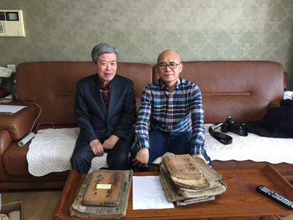

선생 댁 거실에서

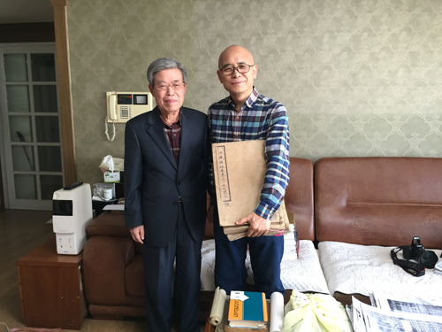

선생댁 거실에서

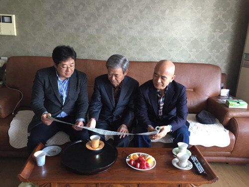

선생댁 거실에서 양훈식, 선생, 백규

### 인터넷 서핑 중 소설가 김주영 선생의 글(<훔친 책 몰래 보관하기>)을 접했다. 책배 곯으며 고생해온 그분의 어린 시절이 어쩜 그리도 나와 똑 같을까? 놀라운 일이었다. 고희를 훨씬 넘기신 그 분과 나의 시차를 생각하며, 내가 겪은 ‘책 굶주림’이야말로 세대를 초월하는 비극이었을지도 모른다는 결론을 내리게 되었다. 그러나 불행히도(?) 내게는 그 분이 고백한 ‘책 도둑’의 과거는 없으니, 책에 관한 절실함에서 내가 몇 수 정도 뒤진다고 할 수 있으리라.

### 

### 그 때문인가. 나는 지금도 책에 관해서라면 사족을 못 쓴다. 아직도 ‘책배 곯던 시절의 궁핍함’에서 벗어나지 못한 상태인 것이다. 책에 관한 이야기만 나오면 귀가 쫑긋해지고, 지방에 가서도 그곳 대학 도서관의 장서나 혹시 있을지도 모르는 고서점의 서가가 무척 궁금해진다. 해외에 나가서도 서점들이나 대학 도서관에서 눈에 번쩍 불이 나는 경험을 하는 건 마찬가지다. 늘 지방의 고서점과 고서 탐색 대열에서 만난 몇몇 동지들이 눈에 어른거리기도 하고, 그런 이유로 훌쩍 지방행에 나서는 경우도 더러 있다. 가끔은 꼭꼭 숨겨놓은 ‘몇 권의 고서들’을 어루만지면서 한 자 한 자 써나간 책 주인의 정성을 느껴보기도 한다.

### 

### 사실 고서이든 신간이든 내겐 모두 보물이다. 잘 만들어진 신간은 독서인들의 사랑을 받으며 세월이 흐르면 고서가 될 것이고, 후손들도 나처럼 그 책들을 어루만지며 깊은 상념에 빠져들 것이다. 그래서 나는 사랑하는 학생들에게 내가 지은 책들은 아낌없이 나눠주지만, 내가 마음먹고 사 모은 남의 책들은 선뜻 주지 못한다. 그런 마음과 자세로 40여년의 세월을 버텨오는 중이다. 그러다가 뵙게 된 분이 원광대 명예교수이신 인산(印山) 박순호 선생이다.

### 

### 대학원 재학 시절, 거질(巨帙)로 영인 출간된 <<한글 필사본 고소설 자료총서>>를 보며 인산 선생의 자료실이 궁금했고, 후학들에 대한 칭찬에 엄격하시던 나손 선생조차 인산 선생에 대해서만큼은 찬사를 아끼지 않으시는 이유 또한 늘 궁금했다. 풀리지 않는 궁금증을 안고 부초처럼 강호를 떠돌다가 21세기에 들어서고 나서야 선생을 면전에서 뵙게 된 것이다. <거창가>에 빠져 지내던 무렵 당신이 소장하고 계시던 이본들을 수차에 걸쳐 보내주셨고, 그 덕에 저서 <<봉건시대 민중의 저항과 고발문학 거창가>>는 크게 부끄럽지 않은 모습을 갖추게 되었다. 그 후로도 가끔씩 몸소 전화를 주시며 새로운 자료에 갈급하던 내게 중요한 귀띔과 격려를 건네곤 하셨다. 직접 찾아뵙고 자료를 받겠노라는 내 간청을 ‘바쁜 데 그럴 필요 없다’고 번번이 단칼에 자르시며 우편이나 인편을 통해 보내주시는 것이었다. 그저 감사의 편지나 전화로, 출간된 책이나 논문으로, 송구스런 마음을 표할 뿐이었다.

### 

### 언젠가 인편에 보내주신 <궁즁도회가>를 분석하여 <<국어국문학>>(157호)에 발표했는데, 그것을 보시고 매우 기뻐하시며 전화를 주신 기억은 아직도 생생하다. 그 후 보내주신 10여 종의 <한양가> 이본들을 나와 내 문하생 5명이 함께 달려들어 분석ㆍ연구하여 공저 <<박순호 소장본 한양가 연구>>(한국문예연구소 학술총서 43/조규익ㆍ정영문ㆍ김성훈ㆍ서지원ㆍ윤세형ㆍ양훈식/학고방)를 출간했다. 그 직전에는 연구소 주최로 “한국문예에 반영된 서울의 형상”이란 주제의 전국 학술발표대회를 갖고, 그 자리에 인산 선생을 모셔 “고문헌 탐색의 길에 만난 <한양가>”라는 발제 강연을 부탁드리기도 했다. 극도로 가난하던 어린 시절을 회상하시면서 울컥 눈물을 삼키시던 선생의 당시 모습이 내 마음에도 충격으로 다가와 눈시울이 뜨거워진 것은 선생의 가난과 내 가난이 순간적으로 오버랩 되었기 때문이다.

### 

### 선생은 최근 많은 자료들을 한글박물관을 비롯한 공공기관에 넘기심으로써, 좀 더 많은 학자들이 자유롭게 볼 수 있도록 해야 한다는 평소의 도타운 뜻을 실현하실 수 있게 되었다. 그러나 아직도 엄청난 자료들이 서고에 그득하시니, 그 점이야말로 민속학자와 서지학자로서 학계에 기여해 오신 선생의 생애가 남들이 추종하기 어려운 넓이와 깊이를 갖추고 계시다는 방증이 아닌가.

### 

### 최근 찾아뵙기를 간청하여 처음으로 허락을 받았고, 차를 몰고 내려 가 뵌 것이 지난 주말이다. 도착해보니, 놀랍도록 해박하시며 열정적인 ‘신선’ 한 분이 값으로 따질 수 없는 책들의 숲에 조용히 앉아 계셨다! 선생의 장서들 가운데 가장 애착을 갖고 계신 고려조의 불서(佛書) 세 권을 황감한 마음으로 친견했고, 보물급의 회화작품들로 오랜만에 안구(眼球)를 세정(洗淨)할 수 있었으며, 각종 필사본들과 두루마리 가사들에 손때를 묻혀보는 호사도 누렸다. 그보다 감격스러운 사실은 선생께서 몸소 귀한 자료들을 한 보따리나 챙겨 주신 점이다. 물론 그거야말로 내 둔한 머리로는 해결하기 어려운 숙제이자 마음의 짐이지만, 어쩌랴. 학자라는 타이틀을 붙이고 다니면서 달라붙어 씨름해야 할 ‘화두(話頭)’ 한 자락 없다면, 그 또한 한심한 일 아닌가. 갑자기 부자가 된 기분을 갖게 된 것도 그 때문이었다.

### 

### 사실 나로서는 선생의 깊은 마음을 이해할 수 없다. 과연 나라면 고색창연한 옛 문헌들을 자식에겐들 선뜻 맡길 수 있을까. 일생 손때 묻혀가며 애장해오시던 필사본들을 연구 자료로 기꺼이 내어주시는 선생의 깊은 뜻은 무엇이며, 나는 그 뜻을 어떻게 감당할 수 있을 것인가. 텍스트로부터 의미를 찾아내고 해석하는 작업 못지않게 난해한 또 다른 과제까지 안게 된 것이다. 그 옛날 누군가가 힘들여 써놓은 것들이 수백 년 풍우(風雨)와 수화(水火)의 고비들을 넘은 뒤 불쏘시개나 벽지, 아니면 종이공예의 재료로 망가지지 않은 채 학자들의 손에 오롯이 들어오게 된 것은 과연 누구의 공인가. 선생으로부터 자료를 받아 석ㆍ박사논문과 저서를 쓴 수십 명의 학인들은 말할 것도 없고, 영인으로 발간된 자료들로부터 혜택을 받은 수백, 수천 명의 학인들을 생각하면, 선생이야말로 우리나라 국문학계를 실질적으로 견인해 오신 주인공 아닌가.

### 

### 아직도 유년 시절의 ‘책 굶주림’을 해결하지 못한 내 입장에서 스러지지 않는 ‘책 욕심’은 ‘땅보다 두껍다’. 게다가 그 ‘외경(畏敬)’^^의 영역인 고서에까지 욕심을 내게 되었으니, 욕망의 끝을 헤아리기 어려운 게 사실인 모양이다. 누구는 ‘최신판으로 활자화된 자료를 갖고 논문 쓰는 학자들이 대부분인 우리 학계가 한심할 정도로 천박하다’고 개탄한다. 원본의 글자를 잘못 읽어 오류를 범한 책들이 부지기수임을 감안하면, 그런 비판도 아주 근거 없는 건 아니다. 사실 원본을 최신 활자로 정확하게 옮겨주기라도 한다면, 비록 소수만이 원본을 접할지언정 그나마 학계의 장래를 위해 다행한 일 아닌가. 이처럼 국문학계를 천박성의 나락에서 건져 주신 셈이니, 선생의 걸어오신 생애와 이루신 업적이 더욱 빛나고 그 빛은 앞으로도 영속되리라 느껴지는 순간이다.

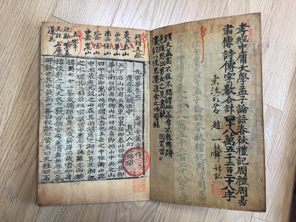

<<구운몽>>

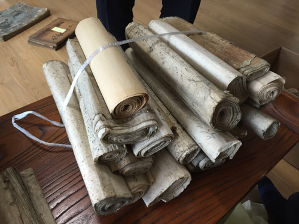

두루마리 규방가사들

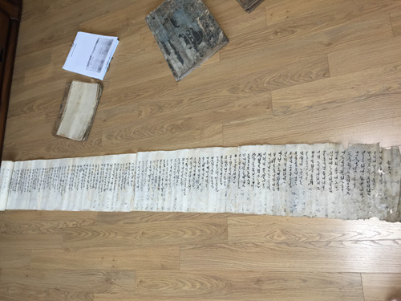

두루마리를 펼친 가사작품

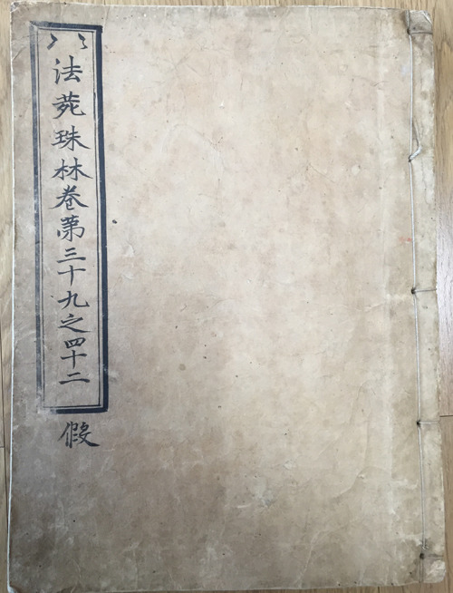

한국에서 가장 오래 전에 간행된 것으로 추정되는 불서

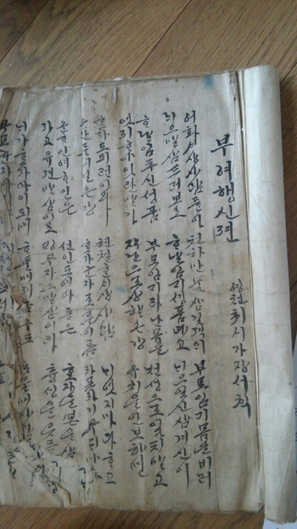

규방가사 <부여행신젼>

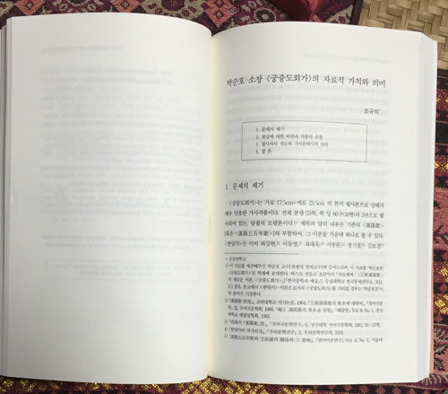

<궁즁도회가> 연구논문

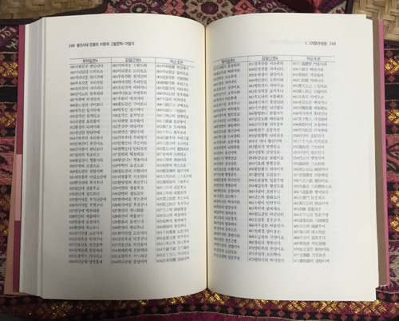

박순호 본 <거창가> 소개부분

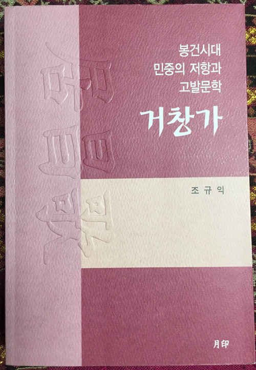

<<거창가>>

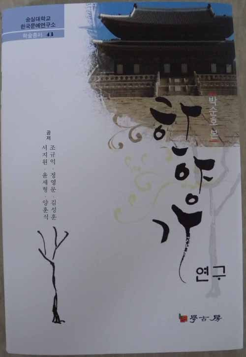

<<한양가 연구>>

공유하기

게시글 관리

**백규서옥\_Blog ver.**

[저작자표시 비영리 변경금지
(새창열림)](https://creativecommons.org/licenses/by-nc-nd/4.0/deed.ko)