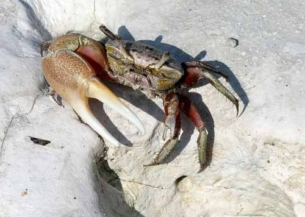
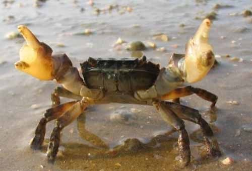
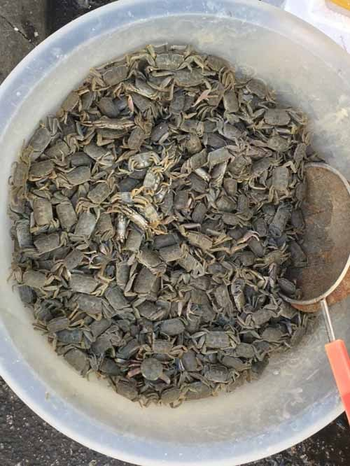
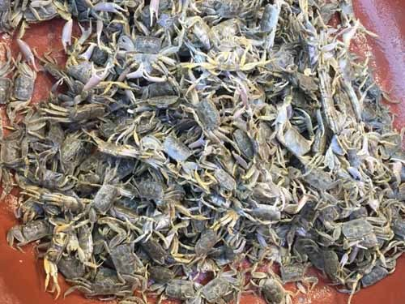
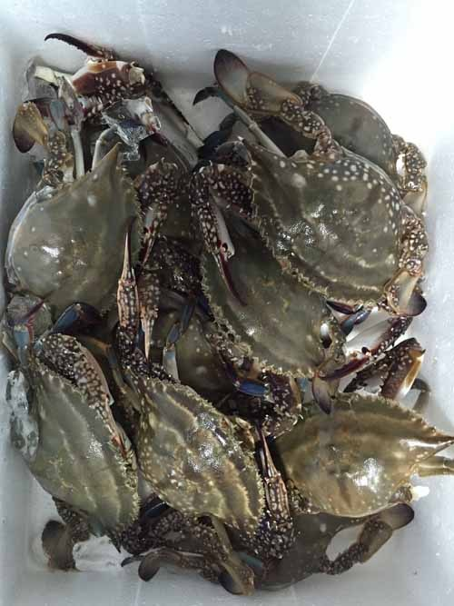
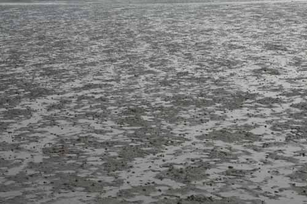
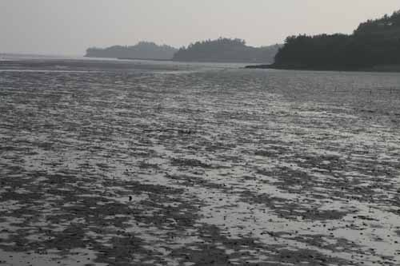

  
황발이

  
화난 게

  
칠게

  
칠게

‘딱지를 까고 잘도 먹는구나!’

충남 서해안의 한 한촌(寒村)이 내 고향이다. 지금은 사라졌지만, 기름진 갯벌이 질펀하게 펼쳐진 시절도 있었다. 그런데 그곳은 작고 큰 게들의 천국이었다. 그럴 듯한 꽃게는 아니지만, ‘사시랭이ㆍ능정이ㆍ쇠발이ㆍ황발이ㆍ달랑게ㆍ돌짱이’ 등 작지만 먹음직한 게들이었다. 전라도와 경기도 해안 지역 사람들을 만나면 통하는 게 있다. ‘갯벌에서 나오는 해산물의 추억’을 공유하고 있다는 사실이다. 그래서 나는 경기도, 충청남도, 전라남북도 서해안 지역을 특별히 ‘동일한 게 섭식(攝食) 문화권’이라고 부른다.

‘마파람에 게 눈 감추듯 한다’는 속담이 있다. 마파람은 습한 기운을 머금은 남풍이니, 곧 비가 내릴 것이라는 예고이기도 하다. 게들은 몸의 염도를 유지해야 살 수 있다. 비에 소금기가 씻겨 내려가면 안 될 일. 그러니 갯벌 표면으로 올라와 부지런히 먹을 것을 찾던 게들도 비가 온다는 ‘남풍의 경고’에 바짝 긴장하고, 자신들의 집으로 돌아갈 채비를 해야 할 것 아닌가. 자신들의 집이래야 갯벌에 뚫어놓은 작은 구멍이 고작인데, 그곳으로 들어가기 위해서는 곧추 세웠던 ‘잠망경’을 접어야 하리라. 그래서 마파람이 불면 게들은 치켜세웠던 자신들의 눈을 접고는 냉큼 집으로 몸들을 숨기는 것이다. 흔히 배고픈 사람이 ‘허겁지겁 밥을 퍼먹는 모습’이나 관리들이 나랏돈 집어삼키는 것을 이렇게 표현했다. 무언가를 순식간에 흔적도 없이 집어삼키는 모습을 이렇게 그려낸 것이니, 우리 옛 어른들의 눈썰미가 이처럼 매서웠다.

도시 사람들도 ‘마파람에 게 눈 감추듯 한다’는 속담을 그럭저럭 들어서 알고는 있다. 그러나 시골 출신이든 도시 사람들이든 ‘딱지를 까고 잘도 먹는다’는 말은 대부분 모른다. 속담사전들을 들춰봐도 없다. 그러나 내 고향에서는 흔히 통용되어 왔고, 특히 돌아가신 내 어머니는 ‘마파람에 게 눈 감추듯 한다’는 속담 대신 이 말을 자주 쓰셨다. 어머니를 비롯한 고향의 어른들은 ‘게 잡이 선수들’이셨다. 그럴 듯한 물고기를 잡을만한 곳도 아니었으니, 그나마 그런 게들을 잡아다 없는 반찬을 보충하셨을 것이다.

짜디짠 김치와 엄지손가락만한 게 여라믄 마리가 반찬의 전부인 경우가 대부분이었다. 어릴 적엔 딱지와 발을 뗄 것도 없이 통째로 ‘으드득’ 씹어 먹으며, 속으로 ‘참 맛도 더럽게 없다’는 불평을 하곤 했는데, 요즈음은 그 맛이 몹시도 그리워지는 이유를 알 수 없다. 얼마 전 동네 시장에 나갔다가 ‘억지를 부려’ 옛날의 그 게들과 비스름한 것들을 한 보시기 사온 적이 있다. 간장에 절였다가 끼니 때 식탁에 꺼내놓고 옛날처럼 ‘으드득’ 씹어 먹으니, 아내의 눈치가 심상치 않았다. 며칠 잘 먹다가 아내의 눈치가 심각하게 바뀌는 걸 보곤 냉큼 ‘게에 대한 추억과 미련’을 접고 말았다.

왜 ‘딱지를 까고 잘도 먹는구나!’가 게로부터 온 말일까. 우리 고향 어른들은 게를 잡으며 게의 해부학적ㆍ생리학적 구조를 잘도 파악하신 것 같다. 나도 어릴 적 게를 가만히 관찰해본 적이 있다. 게들은 두 개의 큰 집게를 갖고 있다. 우리가 손으로 물건을 집거나, 싸움할 때 상대방에게 주먹질을 하듯이 그들은 집게로 물건을 잡거나 적을 물기도 한다. 나머지 발들은 이동할 때 사용한다. 잘 아시다시피 게들이 드넓은 갯벌에 올라와 식사를 하거나 해바라기를 하는 모습은 참으로 장관이다. 해바라기 할 때는 움직이지 않지만, 그 외의 시간에는 늘 부지런히 꼼지락거린다. 어릴 적에 그들을 자세히 살펴보니, 갯벌에서 무언가를 집게로 ‘집어 올려’ (육안으로는 잘 구분되지 않는)  작은 입으로 나르는 것이었다. 말하자면 그들만의 (맛있는) 식사를 하는 것이었다. 지금 생각하면, 갯벌에 살고 있는 플랑크톤이나 물고기의 사체 등으로부터 분리된 유기물들을 집어먹고 있었으리라. 당시 어린 나이였지만, 그걸 보면서 나는 참으로 답답함을 느꼈다. 저렇게 눈에 보이지도 않는 무언가를 집게로 잡아 어느 세월에 그 큰 배를 채운단 말인가. 차라리 (게의) 딱지를 까고 갯벌에 널린 먹이를 집어넣으면 순식간에 배를 채울 수 있을 것 아닌가. 당시 나는 게들을 보며 늘 이런 생각에 잠기곤 했다. 그래, 저 굶주린 게들은 현미경으로 보아야 겨우 보일만한 유기물들을 하루 종일, 아니 일생동안 집게로 들어 올려 입으로 운반하며 생명을 유지해온 것이었다! 그런데, 어른들은 바로 내 마음을 미리 알아채신 것처럼 ‘딱지를 까고 잘도 먹는구나!’라는 속담을 만들어 쓰고 계셨던 것이다. 

\*\*\*

매스미디어들은 하루도 빠짐없이 공직자들이나 기업가들의 부정과 부패 소식을 토해낸다. 눈 먼 돈이 널려 있는데, 어찌 가만히 보고만 있겠는가. 나랏돈이 내 돈이요, 회사 금고 안의 돈도 내 것인데, 안 먹으면 멍청이란 말일까. 갯벌에 널린 눈 먼 유기물들은 온통 게들의 먹이다. 그러나 게들은 욕심 내지 않고 그 둔탁한 집게로 한 알 한 알 조심스레 들어 올려 먹을 뿐이다. ‘딱지를 까고’ 먹으면 순식간에 배불리 먹을 수 있다는 사실을 그들이라고 모르진 않을 터. 그럼에도 불구하고 게들은 ‘딱지를 까고’ 먹지는 않는다. ‘딱지를 까고 먹는 행위’가 죽음임을 알기 때문에, 욕심을 부리지 않는 것이다. 그런데, 사람들은 으레 ‘눈 먼 돈’을 보면 ‘딱지를 까고’ 덤벼든다. 그러다가 걸려서 사회적 생명이 끊어지는 경우가 한 둘이 아니다. 그렇게 보면 인간은 ‘게만도 못한’ 존재임이 분명하다. 다함없는 헛된 욕망이 그렇게 만든 것이다. 이제 공직자들이나 기업가들은 (딱지 깐) 게 사진을 집무실에 걸어놓고 다음과 같이 외치면서 아침저녁으로 경배(敬拜)할 일이다.

“저는 오늘도 딱지를 까고 먹지 않겠습니다!”(출근 시의 구호)

“저는 오늘도 (다행히) 딱지를 까고 먹지 않았습니다! 고맙습니다, 게님!”(퇴근 시의 구호)

  
꽃게

  
게들의 천국(신안군 증도)

  
게들의 천국(신안군 증도)

공유하기

게시글 관리

**백규서옥\_Blog ver.**

[저작자표시 비영리 변경금지
(새창열림)](https://creativecommons.org/licenses/by-nc-nd/4.0/deed.ko)