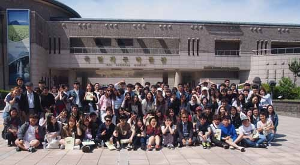  
제주박물관에서

아, 제주!

모처럼의 제주행이었다. 몇 년 째 중국인들이 제주를 접수한다고 난리를 쳐도 ‘오불관언(吾不關焉)’인 나였다. 그러나 학생들의 답사에는 동행할 수밖에 없었다. 당장 끝내야 할 일들이 산적해 있었지만, 학생들에게 현장강의 좀 해달라는 학생회장의 부탁을 거절할 강심장은 아니기 때문이었다.

제주는 얼핏 보기에도 포화상태였다. 하늘에는 육지를 오고 가는 양 방향으로 늘 비행기가 떠 있었다. 들리는 말로는 5분 만에 한 대씩 뜨고 내린다니, 혼잡의 극치랄까. 전엔 공항 문을 나서기 무섭게 팜나무와 야자수가 내 눈을 번쩍 뜨게 만들었으나, 이젠 그들도 어깨를 축 늘어뜨린 채 암담한 체념의 한숨만 내뿜을 뿐이었다. 사람들은 말라버린 이파리들을 처리할 의욕마저 상실한 듯 공항청사 주변의 녹색은 많이 낡아 있었다. 형형색색의 자동차들, 육중한 관광버스들이 넘쳐났고, 그들이 방출하는 매연과 분주함의 독기가 제주의 인상을 시들게 했다. 참, 그동안 많이도 망가졌구나!

국립박물관 전시 유물들. 참으로 곱고 아름다워서 가슴이 따스해졌다. 갤러리 1~6, 특별전시실 등, 차분히 느끼기엔 숨이 벅찰 만큼 넓은 공간들이었다. 특별 전시되고 있는 고산리 신석기 유물들이 눈길을 사로잡았다. 석기와 토기, 각종 생활사 자료들, 유배 지식인들의 유물 등등 어느 지역의 박물관보다 옹골찬 컬렉션이었다. 구석기, 신석기, 청동기, 철기 등으로 이어져 나온 삶의 모습이야 여기라고 다를 순 없을 터. 박물관이 내 상상력의 샘터임을 여기서도 재확인한다. 유약 아닌 원시인들이 뿜어낸 입김과 손때가 토기들의 안팎에 칠해져 있지 않은가. CD에 새겨진 것처럼 토기의 물결무늬엔 그들의 노랫소리 또한 새겨져 있었다. 그들의 손때를 보며 그들의 노랫소리를 듣는 것보다 더 소중한 체험이 어디에 있을까. 안타깝지만, 쌍쌍이 어울려 재잘거리는 젊음들의 뜨거운 가슴으로 어찌 수만 년 전 유물에서 사람의 온기를 느낄 수 있으랴.

삼성혈의 강의에서 학생들에게 제주의 키워드를 말해줬다. 신화, 무속, 해녀, 4ㆍ3과 향토문학 등을 제주라는 고운 보자기로 감싸 젊음들의 가슴에 넣어주고 싶었다. 우주창세의 과정을 보여준 설문대할망 신화, 독립된 나라를 세워 영속시키고 싶었던 ‘삼성(三姓)’의 탐라건국신화, 무조(巫祖)의 내력을 읊어나간 무속 본풀이들, 부자간 쟁투의 현실을 통해 권력의 속성을 보여준 ｢김녕괴내깃당본풀이｣ 등. 육지에서 들어보지 못한 신화들의 성지가 제주임을 알려주고 싶었다. 그러나 결론은 늘 ‘현실’이었다. 주도권 다툼, 더 많이 갖기 경쟁, 사랑과 미움 등등... 그래서 나는 ‘신화란 상상된 현실’이며 ‘현실이란 가시적으로 구현된 신화’임을 강조했다. 부모로부터 내쳐졌던 괴내깃또가 군사를 이끌고 아버지를 치러 왔을 때, 그는 어떤 말을 건넸을까. 아들 신검에게 권력을 빼앗긴 견훤, 아들 방원에게 패배한 이성계, 평생 일군 부를 아들에게 빼앗긴 재벌 등등. 현실은 신화의 연속일 뿐이다. ‘허황된 과거의 이야기가 아니라 인간의 오래된 꿈이자 정신의 모습이고 현재 인간의 모습까지 직관적으로 보여주는 언술’이 신화라는 캠벨(Joseph Campbell)의 말도 있지 않은가.

애월의 밤. 마늘밭 가의 숙소 공터에서 우리의 젊은 풍물패들은 제주의 밤을 마구 두들기고 깨트렸다. 마늘밭 한 평에 250만원이나 한다는, 지상의 현실과는 상관없는 꿈의 난장을 벌인 것이다. 일찍이 잠자리에 들었을 애월의 제주인들은 어디선가 나타난 ‘젊은 무리들’의 춤과 소리에 놀라 깨어나기도 했을 것이다. 하늘 끝 바다 끝까지 닿을 진동의 힘은 잠든 세상을 무력하게 했다. 상큼 짭짜름한 갯물 내음은 창틈으로 스며들어와 뒤척이는 잠자리를 더욱 뒤숭숭하게 만들었고, 퉁탕거리며 계단을 오르내리는 젊음의 열기까지 합세해 대책 없는 불면의 밤은 한없이 길기만 했다.

돌문화공원에서 만난 설문대할망의 꿈. 그녀는 무슨 배짱으로 5백이나 되는 아들들을 낳아 놓았던 것일까. 어찌하여 무지막지한 돌을 가지고 이 아름다운 섬을 만들려고 했을까. ‘180만 년 전 신생대의 화산활동이 이 섬을 이토록 오묘하게 만들었다’는 설명이야말로 너무 단순하여 재미가 없었던 것일까. 태초의 제주에서 설설 뛰던 불꽃들과, 세월이 흐른 뒤 식은 불꽃 사이를 조심조심 뛰어 놀았을 온갖 짐승들과, 불꽃이 만든 흙과 짐승들을 재료로 삶을 이어 나온 인간들의 지혜를 함께 버무려 생각하기로 하자. ‘형이하(形而下)’의 물질에만 정신이 팔린 인간의 어리석음을 질타하기 위해 설문대할망은 이 땅에 강림하신 것 아닌가. 세상을 낳은, 위대한 지모신(地母神). 오랜 세월 제주를 감싸온 그녀의 오지랖 안을 뒤지니 텅 빈 동공뿐이었다. 뱀이나 매미가 벗어놓은 허물을 보며 무엇을 상상하는가. 빠져나간 몸들의 건강한 환락을 상상하는가. 아니다. 무수한 삶의 재생과 반복을 보여주는 증거가 바로 허물이다. 그러니 피가 돌지 않는다 하여, 기름기가 빠져 있다하여 그 허물들을 짓밟는 일은 옳지 못하다. 이 땅에 남겨진 허물이 없다면, 우리의 미래도 없는 법. 신화를 사랑하자. 그 옛날 그 분들의 현실과 꿈을 오롯이 갈무리하여 오늘날의 우리에게 전해주고, 우리의 끝없는 미래를 상상할 수 있게 하지 않는가. 삶이 어찌 ‘오늘의 우리만으로’ 끝나는 일이랴. 오로지 ‘지금을 살기 위해, 지금의 나만을 위해’ 세상은 존재한다고 믿는, 우리들의 어리석음을 깨우치기 위해 신화는 존재하는 것 아닌가. 언제나 되어야 우리는 아득한 후손들을 위해 어금니를 꽉 깨물며 현재의 내 아픔을 참아낼 수 있게 될까.

‘4ㆍ3 평화기념관’은 우리의 어제와 오늘, 그리고 내일이 분노와 부끄러움이 뒤엉겨 분출의 시기만 기다리는 잠재적 활화산 혹은 휴화산의 분화구였다. 몇몇 인간들의 욕망과 착오가 빚어낸 오욕의 역사였다. 처음은 이랬을 것이다. ‘그래, 이 복잡한 시국에 그들 몇을 죽인 것에 대해 사과하는 귀찮음을 감내할 필요가 있는가. 그럴 듯한 이유와 명분을 내걸고 눈을 부릅뜨면 그대로 진정될 것인데. 이 외딴 섬에서 힘없는 사람 몇몇을 죽여 봤자 무슨 일이 일어날 것인가.’라고. 그렇게 끝이 나리라 착각했을 것이다. 역사의 고비마다 늘 그랬다. 하늘같은 인간의 목숨을 앗아가고도 뻔뻔함과 물리력만으로 모면할 수 있으리라 믿어온, 우리의 어리석음이었다. 그러나 그게 어찌 그렇게 마무리될 수 있는 일인가.  '이성이 세계를 지배하며 세계사도 이성적으로 진행되었다'는 헤겔 식 ‘역사의 이성’을 우리가 믿는다면, 최소한 잘못된 계산을 그대로 넘길 순 없는 법. 3~4만 명 이상의 목숨을 앗아가고도 지금껏 쉬쉬하는 ‘권력의 속성’을 민초들은 아무리 세월이 흐른다 해도 이해할 수 없는 것이다. 뒤엉긴 시신들의 사진 앞에 몇몇 젊음은 얼어붙은 듯 서 있었다. 그리고 자신들의 깨달음을 문장으로 남기고 있었다. 그러나 비리와 부조리의 현장이 어찌 이곳뿐이랴.

해녀들은 아직도 살아 있었다. 물 깊은 바닥에서 건져 올린 소라며 전복이 꿈틀거리는 좌판. 그 좌판 언저리엔 가쁜 숨을 모아 만들어낸 ‘숨비 소리’가 맴돌고 있었다. 값을 깎아보려는 사람들에게 핀잔을 건네는 할머니 해녀의 마음을 읽을 수 있었고, 그 마음은 ‘해녀박물관’에 역사로 남아 이들의 미래를 보여주고 있었다. 설문대할망에서 시작된 제주 여성들의 기운이 해녀들에게 고스란히 투영된 것이나 아닐까. 호흡이 허락되는 그 짧은 순간에 단단히 뿌리박힌 소라와 전복을 따내야 하는 건 ‘생존경쟁 원리의 극적인 현시’ 아닌가. 그 힘이 지금 남자들을 능가하는 한국 여성들의 힘으로 현실화하고 있는 것 아닌가.

제주는 아직 살아 있었다. 그러나 많이 망가져 있는 것도 사실인 듯 했다. 몸이 망가지면 마음도 온전치 못한 법. ‘이제 제주를 떠나고 싶다’는, 한 제주친구의 음울한 말을 공항에서 전화로 듣게 되었다. 물론 ‘제주의, 제주인의 프라이드를 이제 거의 상실한 상태’라는 그의 말이 육지인인 내게 아직은 생소했다. 제주의 하늘과 바다는 여전히 푸르렀고, 바람결 또한 싱그러웠기 때문이다. 해녀들이 물질해온 ‘갯것들’도 상큼하고 달았다. 새 공항이 생기고, 자동차들이 내뿜는 매연만 줄인다면, 아니 무엇보다 인간의 마음속에 똬리를 틀고 있는 욕망의 부피만 줄인다면, 설문대할망과 함께 제주는 영원할 것이다.

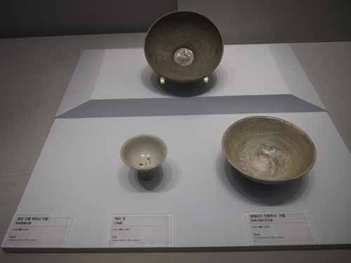  
고려조의 청자, 조선조의 백자, 분청사기 등

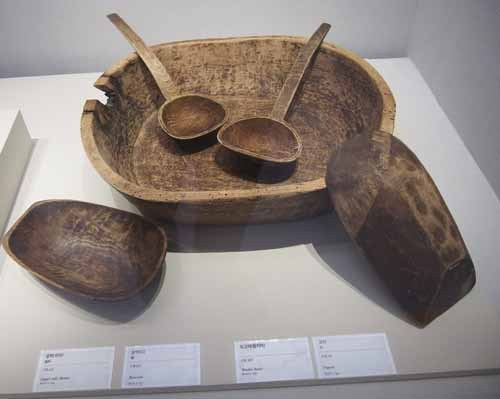  
근대 제주의 '곰박(석자), 솔박(되), 도고리(함지박), 국자' 등

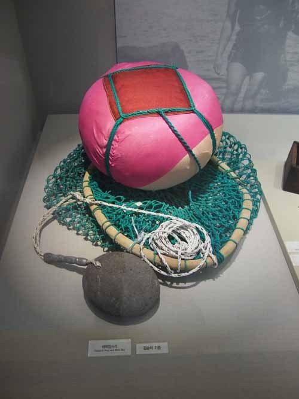  
물질의 도구인 태왁망사리

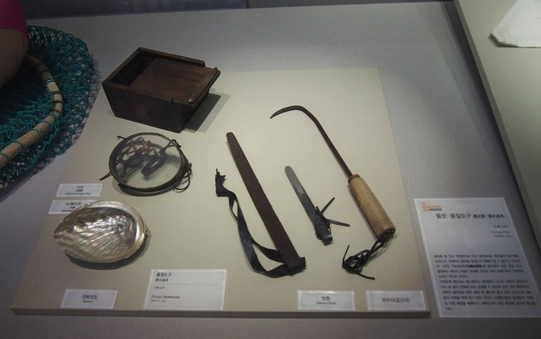  
해녀물질의 도구들

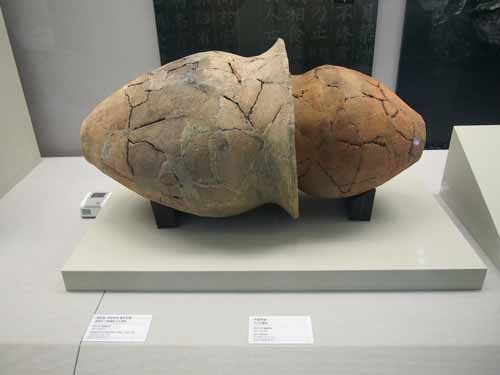  
용담동 무덤 유적에서 출토된 '이음독널'

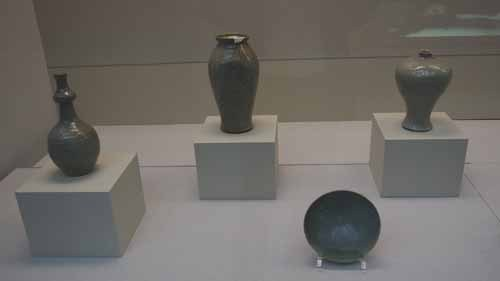  
각종 청자들

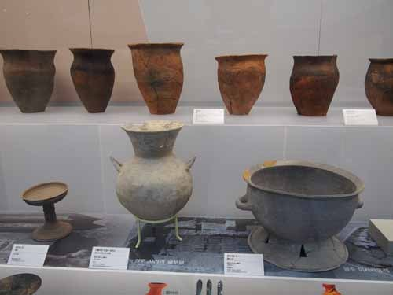  
원삼국시대의 각종 토기들

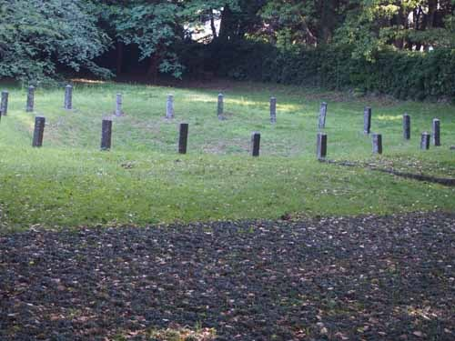  
삼성혈

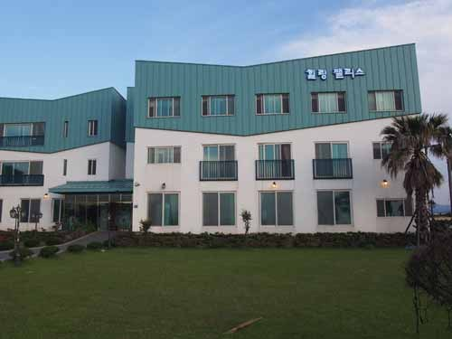  
애월의 멋진 숙소(힐링팰리스)

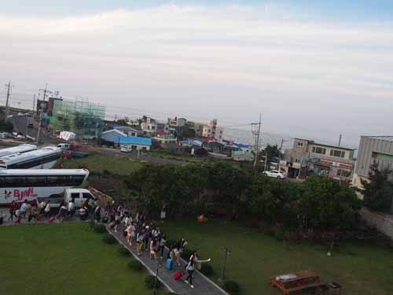  
차에서 내리는 학생들

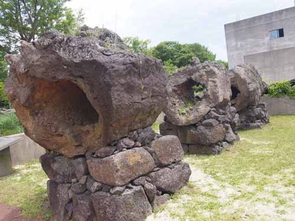  
돌문화공원에서 만난 '나무가 빠져나간 화산석'

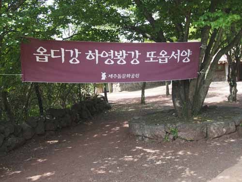  
무슨 뜻인지 아시나요? '어서 오세요 많이 반가워요 또 오세요!'랍니다.

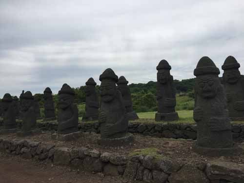  
돌문화공원 밖에서 만난 하르방님들

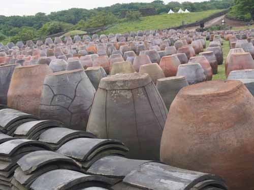  
돌문화공원 밖에서 만난 제주의 옹기 및 기와들

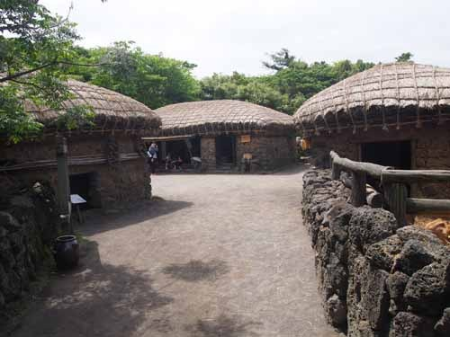  
민속마을에서 만난 제주의 옛집들

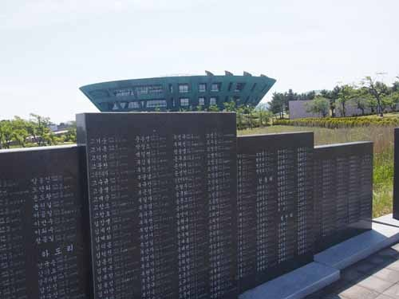  
제주 4ㆍ3 평화기념관

 

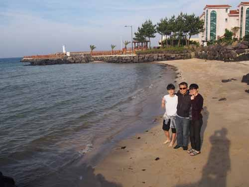  
멋진 조화(이경재 교수와 학생들, 그리고 하늘과 바다)

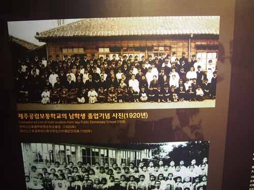  
해녀박물관에서 만난 '빛 바랜 기념사진들

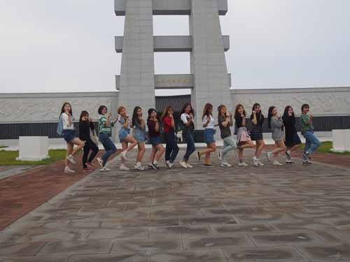  
해녀박물관 밖에서 포즈를 취한 아름다운 여학생들

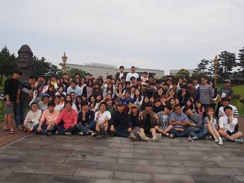  
해녀박물관을 떠나며

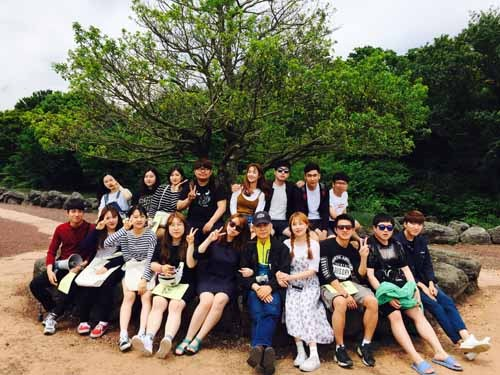  
돌문화공원 밖에서, 선남선녀들

공유하기

게시글 관리

**백규서옥\_Blog ver.**

[저작자표시 비영리 변경금지
(새창열림)](https://creativecommons.org/licenses/by-nc-nd/4.0/deed.ko)