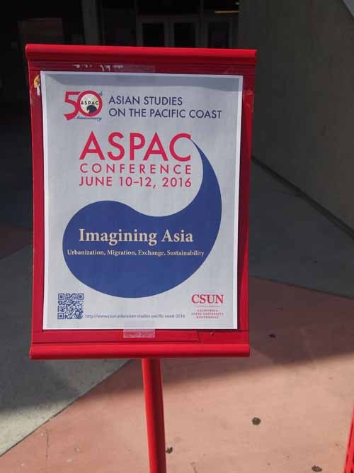  
앙증스런 대회 입간판

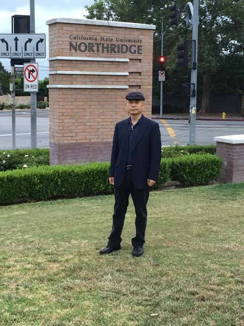  
CSUN 입구에서

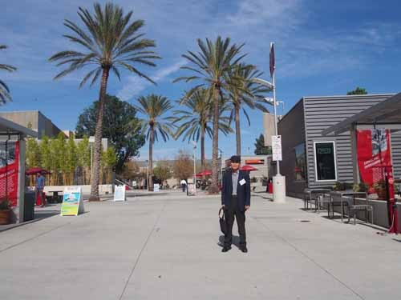  
학술대회장에 들어서며

LA, 그 바벨탑의 체험

-2016 ASPAC 참가기-

지난 달 10일-12일(미국 날짜). 2016 ASPAC(Asian Studies on the Pacific Coast) 학술대회 참석 차 LA 인근의 캘리포니아 주립대학 노스리지 캠퍼스(CSUN: California State University, Northridge)에 다녀왔다. 가도 가도 끝이 없는 넓은 캠퍼스에 갖가지 사막 식물들이 삶의 원기를 방출하는 곳. 주렁주렁 노랑 오렌지들이 캠퍼스 도처에 향을 내뿜고, 하늘에 닿을 듯한 야자수들이 가로수로 늘어서 있는 곳이었다. 사람 사는 세상 이면의 문제들이야 그곳이라고 없을까만, 외관만으로는 말 그대로 ‘에콜라지컬 유토피아(ecological utopia)’였다. 캠퍼스 전체가 식물원에 가까운 컨셉이었지만, 학술행사가 열린 ‘이스트 컨퍼런스 센터(East Conference Center)’ 앞의 ‘버태니컬 가든(botanical garden)’은 특별한 공간이었다. 이번 행사는 그 숲 한 가운데서 미국인들과 아시아인들이 함께 어울린 ‘학술의 난장’이었다.

‘캠퍼스 하우징’의 한 복판에서 인도의 젊은 인류학자 프라빈 박사(Dr. Pravin S. Khandagale/School of Hyderabad, India)를 룸메이트로 만났고, 또 다른 인도의 법학자 쿠마르 교수(Dr. Saroj Kumar Dhal/Symbiosis International University, India)와 중국학자 왕 교수(Dr. Wang Wuyun/Gifu City Women’s College, Japan), 호주 학자 앤드류 선생(Andrew De Lisle/PhD Candidate/School of Culture, History and Language, College of Asia and the Pacific) 등 무수한 외국학자들을 같은 공간에서 패널리스트이자 청중으로 만났다. 유럽계 미국인들, 아시아계 미국인들, 아시아인들이 두루 섞여 이루어진, 그들 말로 ‘한시적인 용광로(a temporary melting pot)’였다. 한국어, 중국어, 일본어, 베트남어, 태국어, 인도어 등으로 각자의 모국어는 달랐으나, 발표장이나 식당에서는 순식간에 영어로 바뀌어 나오는 특이한 공간이었다. 그 가운데서도 룸메이트 프라빈과 하우스메이트 쿠마르의 ‘인도 영어(Indian English)’는 얼마나 특이한가. 그들의 영어에 적응되기까지 몇 시간은 그들의 말을 제대로 알아들을 수 없어서 답답했다. 내가 듣기에 자기들끼리 주고받는 인도 말과 영어 사이에 별 차이가 없었다. 사람들이 인디언 잉글리쉬(Indian English)를 대표적인 혼합영어(pidgin English)로 부르는 이유를 알 수 있었다. 물론 ‘콩글리쉬(Korean English)’보다야 소통의 면에서 훨씬 나은 건 사실이지만.

‘와스프(WASP: White Anglo-Saxon Protestant, 즉 미국 사회를 지배하는 백인 중에서 특히 잉글랜드 출신의 영국계, 기독교 중 신교도에 모두 해당하는 사람)’나 그에 근접하는 백인들이 주류사회의 정점을 형성하는 미국사회에서 그 주류사회의 오만(pride)과 유색 이민자들의 영어 콤플렉스(inferiority complex with English)가 ‘언어(영어) 제국주의(linguistic imperialism)국가 미국의 두드러진 표지(標識)’이자 이민자들에겐 ‘넘을 수 없는 장벽’이라는 점, 이창래 작품(Native Speaker)의 주제를 이루는 주인공의 깨달음도 결국은 이런 장벽을 피하고자 한 지점에서 얻게 되었다는 점 등이 내 발표의 핵심이었다.

작품의 주인공이 뉴욕이나 LA를 로마에 이은 바벨탑으로 규정한 것도 그 도시들이 ‘신의 뜻을 받아 지은’ 이상적 공간은 아니라는 점, 그래서 그런 도시들의 마이너리티들은 결국 ‘썩은 내 나는’ 콤플렉스를 청산하지 못한 채 좌절할 수밖에 없다는 점 등을 아프게 확인한 것이 이창래의 본뜻이었으리라. 이민자 자녀들에게 영어를 가르치는 주류 출신 아내 릴리아가 이민자들의 모국어로 하나하나 그들의 이름을 불러주는 모습을 보며 비로소 자신의 정체성을 확인한다는 작품의 결말도 알고 보면 ‘긴 좌절과 방황을 거친’ 주인공의 현실적 타협의 소산에 불과한 것 아닌가. 어차피 ‘영어가 모국어 아닌’ 이민자들이 주류사회의 일원이 될 수 없는 상황은 바뀌지 않을 것이고, 그 옛날 바빌론처럼 이 새로운 바벨탑들이 무너질 가능성 또한 없을 것이다. 소설이 현실을 오롯이 담아내는 그릇임을 인정하면서도 결말은 얼마간 이상이나 추상일 수밖에 없는 것도 현실의 벽을 깨기가 ‘현실적으로’ 어렵기 때문이리라. 그래서 ‘다양한 인종들의 용광로(melting pot)가 지금의 미국인데, 당신의 그런 부정적인 결론은 비현실적이거나 부정확하다고 보지 않는가’라는 백인 학자의 질문에, ‘사실 내가 비관주의자일지는 모르지만, 멜팅팟은 비현실적 상징(idealistic symbol)이거나 현실을 호도하기 위한 은유(metaphor for glossing over the reality)에 지나지 않는다고 생각한다’는 답변으로 응수할 수밖에 없었던 것이다.

발표 마지막 날. 만찬장에서 만난 인도계 미국 노학자 람 교수(Dr. Ram M. Roy/Emeritus Professor of International Relations & Political Science, College of Social and Behavioral Sciences, Cal. State Univeristy, Northridge)의 초대로 몇몇 학자들과 함께 그의 집을 방문하면서 나는 내 말이 맞았음을 절감하게 되었다. ‘저택’의 범주에 든다고 할 수는 없었으나, 산 중턱에 우뚝 서있는 그의 붉은 색 2층 벽돌집은 여러 가지 의미를 함축하고 있었다. 20대 후반부터 이 대학에서 강의를 시작하여 지금까지 50년이 훨씬 넘는 경력을 쌓은 그였다. 이른 나이에 풀브라이트(Fulbright)의 지원을 받아 미국으로 올 수 있었다는 무용담(?)과 함께, 은퇴를 했지만 아직도 학교의 중심 건물에 독자 연구실을 부여받을 정도로 영향력이 있다는 점을 ‘푼수 없이’ 되뇌는 그를 보며, 이민생활 50년에 LA 인근 산록(山麓)의 붉은 벽돌집 한 채로 현시(顯示)되어 있는 ‘아메리칸 드림’을 우리에게 보여주고 싶은 그의 콤플렉스를 헤아리게 된 것이다. 그런 마음을 간파하고 나니 얼마간 처연해짐을 금할 수 없었다. 미국 지식사회에서 그 세월을 살아왔으면서도 그의 영어에서 느껴지는 인도인의 혀 놀림(Indian tongue)은 어쩔 수 없음을, 주방의 미니바에 즐비하게 세워놓은 와인 병들을 따서 권하는 그의 호기 너머에 잠재된 외로움의 흔적은 지울 수 없음을 나는 그만 알아채게 된 것이다. 발코니 건너 편 겹겹의 산맥 넘어 태평양으로 스러져가는 석양이 80대 노인의 깊은 주름에 반사되어 수심과 외로움으로 드러나고 있음을 알아챈 건 아마도 일행 중 나뿐이었으리라!

그랬다. 미국에 자리 잡은 아시아계 이민자들의 삶은 ‘아메리칸 드림을 성취한 자들과 그렇지 못한 자들’로 나뉘는 것 같았다. 아메리칸 드림이야 ‘어떻게 정의하는가’에 따라 달라지겠지만, 전자(아메리칸 드림의 성취)는 원천적으로 불가능하다는 게 내 생각이다. 젊어서 ‘뭣 같이 벌어놓은’ 재산에 기대어 ‘힘 빠진 노년기’를 그나마 불편 없이 보내는 게 미국에 자리 잡은 그들의 꿈이라면 할 말은 없다. 우리 몇 사람을 강권하여 자신의 집으로 끌고 간 람 교수. 어쩌면 그는 ‘붉은 벽돌집’을 통해 아메리칸 드림의 성취 여부를 우리로부터 직접 확인받고 싶었는지 모를 일이다. ‘당신은 아메리칸 드림의 가장 성공적인 성취 사례’임을 그의 면전에서 거듭거듭 강조할 수밖에 없었던 것도 바로 그　때문이었다.

\*\*\*

그곳 사람들은 ‘씨-선(CSUN: California State University, Northridge)’으로 부르며, 이 대학을 사랑했다. 노스리지는 도산 안창호 선생이 일찍이 자리 잡은 곳이고, 그 분의 따님인 안수산 여사가 일생을 사시다 돌아가신 곳이기도 하다. 그 때문인가. 이곳 주민들 가운데는 한국계가 가장 많았다. 우리 가족이 안수산 여사를 방문, 그 분의 팔순 생신연에 참여한 1999년 1월은 우리가 인근의 UCLA에 머문지 1년이 넘어가던 때였다. 벌써 18년 전의 일. 아름답게 채색해놓았던 당시의 추억은 세월의 모진 풍우에 빛이 바랬고, 곱게 웃으시던 안수산 여사의 표정도 가뭇없이 사라져 버린 그곳에서 아시아계 이민자들의 슬픈 한계를 재확인하게 된 마음이 자못 착잡할 따름이었다.

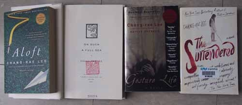  
이창래의 작품들

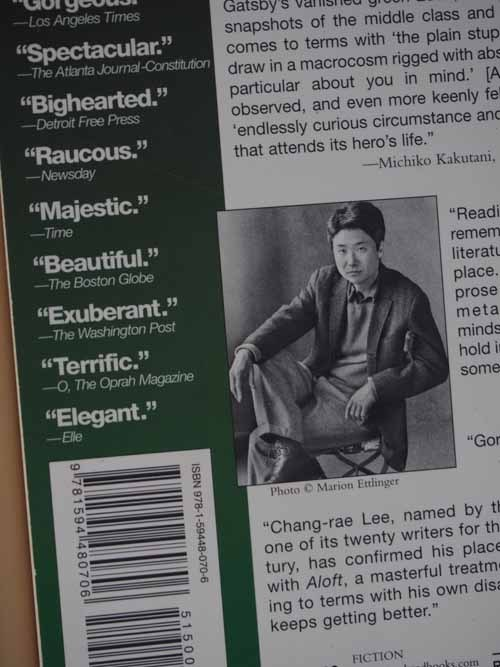  
이창래에 대한 언론의 관심들

  
학술대회가 열린 East Conference Center

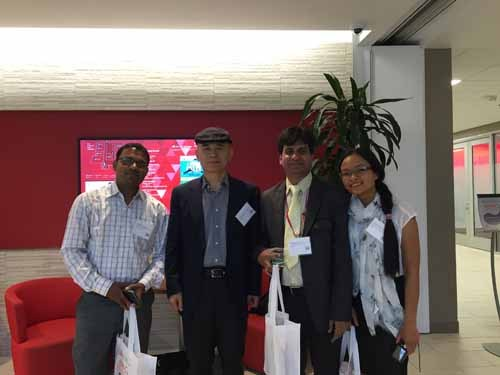  
첫날 발표 후 프라빈 박사(인도), 필자, 쿠마르 박사(인도), 치앤타이 교수(태국)

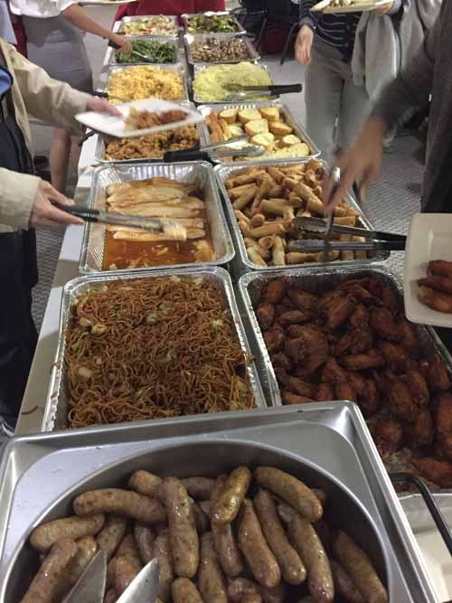  
점심 뷔페

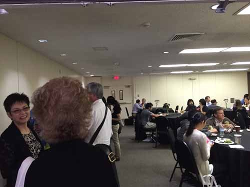  
점심식사 광경

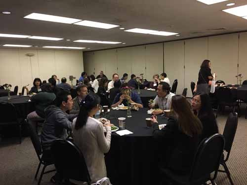  
점심시간에 담소하는 각국 학자들

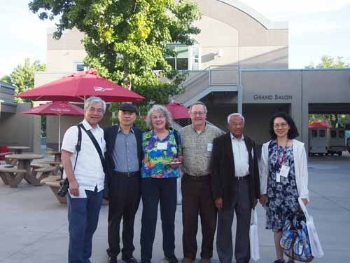  
이틀째 발표가 끝난 뒤 행사장 밖에서

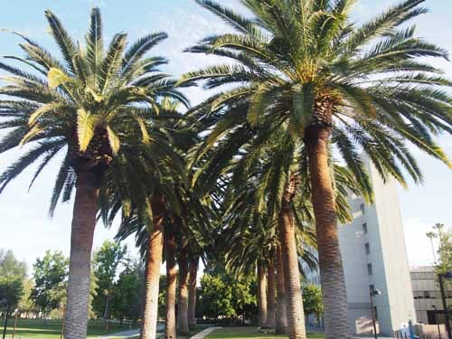  
야자수 무성한 CSUN 캠퍼스의 모습

  
캠퍼스에서 맛난 걸 요구하는 청설모(?)

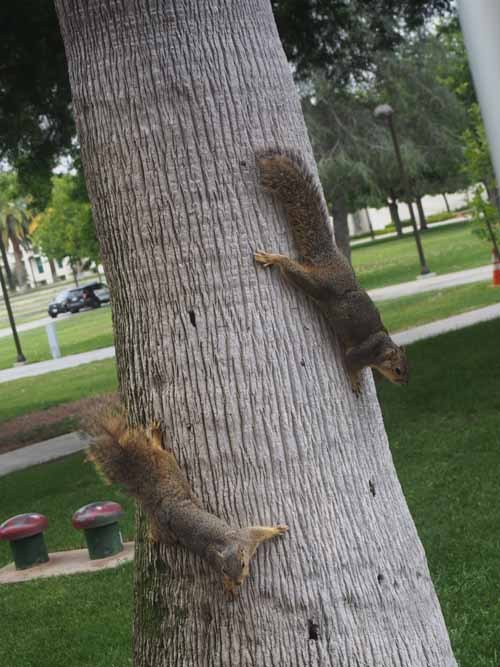  
먹을 것을 주지 않자 혹시나 하는 마음에 눈앞에서 재주를 보여주는 부부

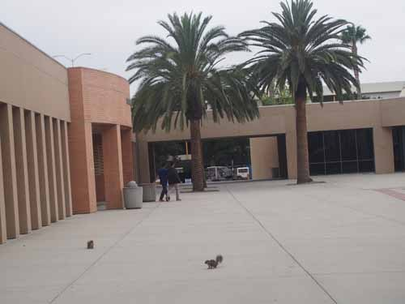  
인간과 동식물의 공존

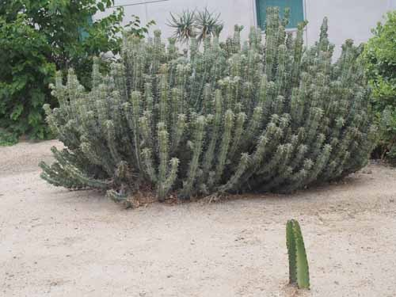  
선인장

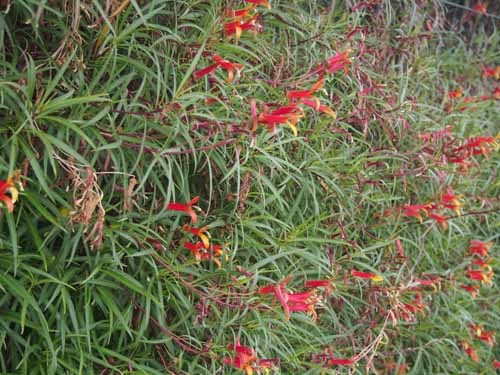  
이름모를 풀꽃

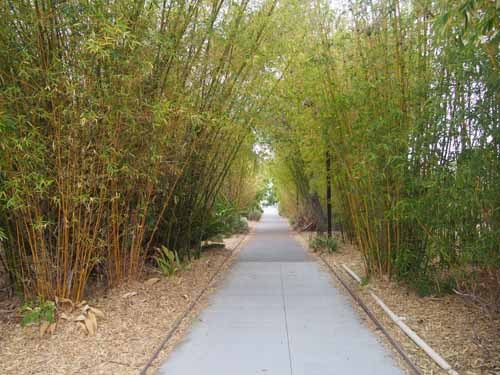  
대나무 숲길

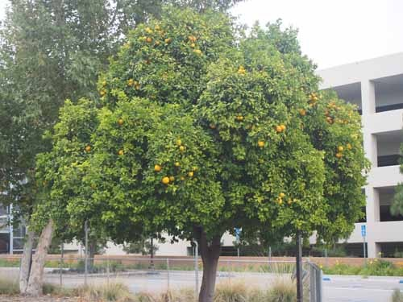  
오렌지향은 바람에 날리고...

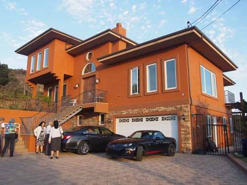  
초대받아 간 람 박사의 자택

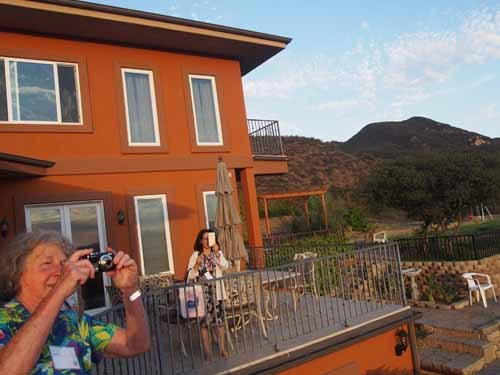  
람 박사 자택 발코니에서 석양을 담기에 바쁜 손님들

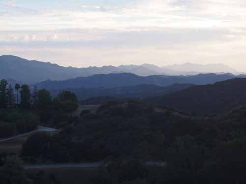  
람 박사 자택에서 바라본 태평양 연안의 연봉들

  
와인 시중을 들고 있는 람 박사

  
람 박사 자택에서 내다 본 석양

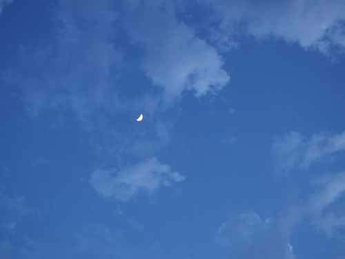  
밤 하늘, 그리고 달...

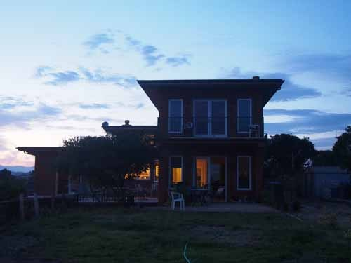  
람 박사 자택의 야경

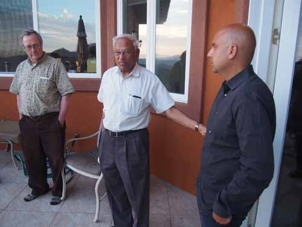  
람 박사의 아끼는 아들 소개

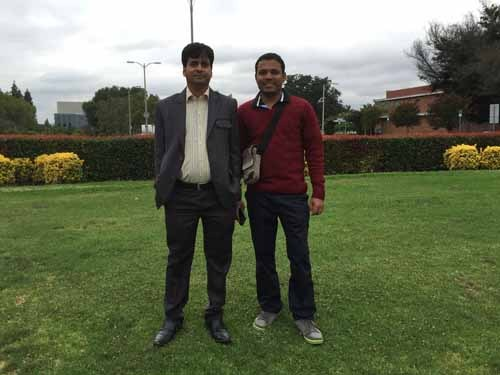  
인도의 두뇌 쿠마르 교수와 프라빈 박사

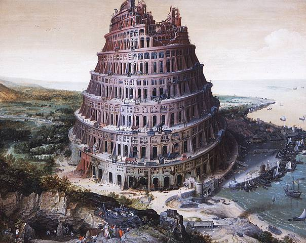  
벨기에 화가 뤼카스 판 팔켄보르흐(Lucas van Valckenborch)가 1568년에 그린 바벨탑(Tower of Bable)

공유하기

게시글 관리

**백규서옥\_Blog ver.**

[저작자표시 비영리 변경금지
(새창열림)](https://creativecommons.org/licenses/by-nc-nd/4.0/deed.ko)