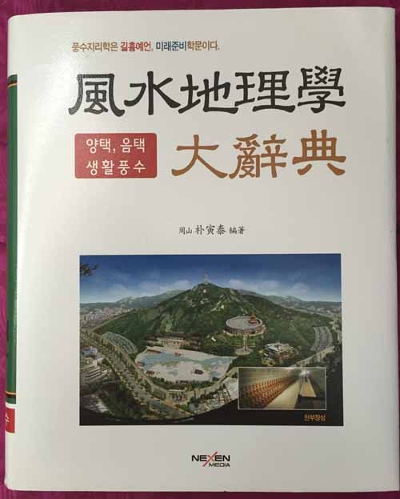
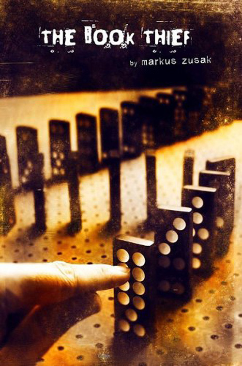
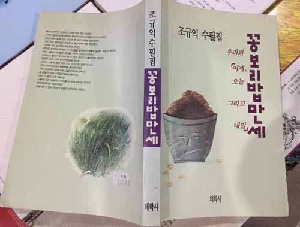
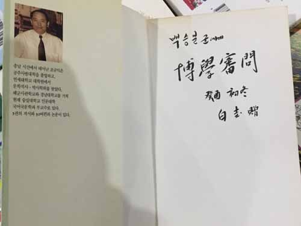

책 도둑

최근 긴요한 책 한 권을 샀다. 한 달 평균 두어 번씩 여러 권의 책들을 사지만, 이처럼 긴요한 책은 ‘모처럼’이다. 고전 자료들을 읽다가 풍수지리학 용어만 나오면 그 난해함에 의욕이 다운되곤 하던 터. 먼 지방의 서점에서 그에 관한 사전을 팔고 있었다. 대금을 지불한지 하루 만에 책이 배달되어 왔다. 만져보고 넘겨보니 좋았다. 알아야 할 것들이 빠짐없어 좋았다. 늙은 아빠, 늦둥이 어루만지듯 그 무거운 걸 집으로 들고 가서도 사랑스러워했다.

집에서 다시 학교로 옮겨 놓은 지 이틀. 그만 책이 사라졌다. 누군가 집어간 것이다. 가슴이 텅 비는 느낌이었다. 삼엄한 경비 시스템! 엘리베이터 앞엔 카메라, 문에는 세콤이란 게 걸려 있는데... 누구였을까. 내가 방심한 채 문을 열어놓는 순간들을 되짚어 보았다. 가끔 화장실에 다녀오는 5분, 세면실에 가서 설거지하는 5~10분이 전부인데. 그렇다면 그는 그 틈을 노린 것일까. 출입문 바로 앞의 티테이블에 그 책은 놓여 있었다. 사실 가끔씩 걱정이 되기도 했다. 내가 이 책을 사랑하면 남들도 사랑할 수 있을 텐데, 괜찮을까? 그 걱정이 현실화된 것이었다. 열린 문으로 한 발짝만 들여놓으면 책을 안을 수 있었다. 그러니 누굴 원망하랴? 내가 바보였다.

의심하지 않기로 했다. 나만큼 누군가도 그 책의 의미를 알고 있었다는 점에 안도하기로 했다. 그저 정가보다 몇 푼 낮춰 팔아버릴 ‘책장사’만 아니라면 다행이리라. 불현 듯 ‘책 도둑(The Book Thief)’이란 소설이 생각났다. 영화로도 나왔으니, 책은 꽤 많이 팔렸을 것이다. 마커스 주삭(Markus Zusak)의 작품. 2005년에 첫 출간되었고, 브라이언 퍼시벌(Brian Percival) 감독의 영화는 2013년에 나왔다. 세상에! 도둑을 이토록 아름답게 그려낸 예술이 있을까. 나찌 치하 독일에서 남동생과 함께 입양된 소녀 리젤의 이야기다. 동생은 죽고, 숨어 지내던 유대인 청년 맥스와 교감하며 이야기는 전개된다. 고립된 맥스에게 책을 구해다 주고 세상일을 들려주는 리젤. 그러니 그 책 도둑은 더 이상 도둑이 아니다. 책은 영혼이고 도둑은 영혼의 소유자 혹은 매개자일 뿐. ‘훔친 책을 읽는 책 도둑’은 아름다운 연금술사다. 도둑질을 통해 세상 사람들의 영혼을 정화시키고, 그들을 전혀 다른 모습으로 바꿔놓지 않는가. 내 책을 가져간 이가 눈꼽 만큼이라도 ‘책 도둑’만 같다면야 얼마나 좋을까.

책이 짐이어서 아무도 책을 원하지 않는 줄로만 알았다. 책을 내도 가까운 사람들에게 쉽사리 증정 못하는 이유다. 그래서 주기 전에 ‘조심스레’ 묻곤 한다. “책 한 권을 냈는데, 혹시 한 부 증정해도 될까요?”라고. 혹시 “고맙지만, 필요 없어요!”란 대답이 나올까 두려워 ‘조심스레’ 묻곤 한다. 매몰찬 거절을 받아본 적은 없지만, 표정에서 나는 상대방의 마음들을 읽는다. “아, 또 귀찮은 짐이 하나 생겼구나!”라는 '말 없는 말'을. 그래서 그간 연구실 문을 활짝 열어젖히고 지냈는지 모른다. ‘그냥 집어가라 한들 누가 집어갈 것이냐, 이 무거운 짐들을’이란 심정으로...

두어 해 전 어떤 교수가 전화를 걸어왔다. “연구실을 정리하는데, 조 교수님의 책이 하나 나왔어요. 그냥 버릴까 하다가, 돌려드리는 것이 좋을 것 같아서 전화 드리는 겁니다.” 무언가가 뒷머리를 땅 치고 갔다. “그럼 학과 사무실로 보내주세요.” 간신히 대답한 뒤 한 시간 가량 그대로 앉아 있었다. 잠시 후 처음의 야속했던 마음은 고마움으로 변했다. 내게 연락도 없이 폐기처분했다면, 쓰레기장에서 중고서적상으로 넘어가 뭇 사람들의 손때나 묻히는 광경이 우연히 내 눈에 뜨였다면... 아찔해지는 순간이었다.

아픈 추억 하나 더. 지난봄의 일이다. 완주군청에서 특강을 하게 되었다. 완주군과 합작으로 삼례에 ‘책 마을’을 꾸미고 있던 호산방 박대헌 사장의 부탁이었다. 책들의 계곡에서 그와 환담을 나누는데, 작업 중이던 직원 한 사람이 눈에 익은 책 한 권을 골라 내 눈 앞에 디밀었다. “교수님이 사인하신 책이네요!” 내 첫 수필집(<<꽁보리밥 만세>>)이었다. 그는 호의라고 생각했을 것이다. 그러나 나는 눈을 가리고 말았다. 숭실에서의 병아리 교수 시절. 눈에 뜨이는 몇몇 학생들이 있었다. 증정 대상은 그 가운데 한 녀석이었다. “책이란 원래 그런 거예요!” 내 표정을 살피던 박 사장의 위로 멘트였다. “그렇겠지요!” 나도 맞장구를 쳤다. 그러나 가슴은 내내 아려왔다. 어쭙잖은 책들의 저자가 받을만한 마음의 상처였다.

\*\*\*

방금, 내 연락을 받은 서점에서 다시 보낸 그 사전을 받았다. “누군가 집어갔어요!”라고, 어제 그 서점 주인에게 전화하자, “그 책 좋은 줄 아는 사람이군요. 재고는 있어요!” 라고 껄껄 웃으며 대꾸하고는 득달같이 보낸 것이다. 다시 받은 책은 누군가 집어간 그 책보다 가벼웠다. 몇 줌의 영혼이 빠져나갔기 때문이리라. 그래도 텅 빈 가슴의 한 구석이나마 채울 수 있게 되었으니, 얼마나 다행인가.

공유하기

게시글 관리

**백규서옥\_Blog ver.**

[저작자표시 비영리 변경금지
(새창열림)](https://creativecommons.org/licenses/by-nc-nd/4.0/deed.ko)