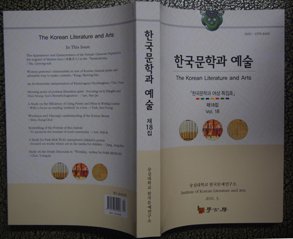
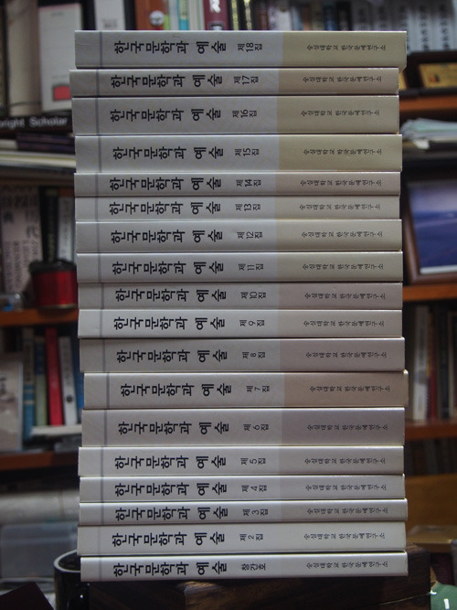

<<한국문학과 예술>>을 사랑하시는 학문동지 여러분께  
  
  
그간 댁내 두루 무고하셨는지요?  
근래 경험하지 못했던 더위와 싸우시며 연구에 몰두하시느라 고생들이 많으시리라 생각합니다. 그래도 말복만 지나면 시원해지겠지요?  
저는 한국문학과예술연구소(구 한국문예연구소)의 소장을 맡고 있는 조규익입니다. 늘 논문투고를 간청하는 메일만 드렸으나, 오늘은 좀 가벼운 마음으로 기분 좋은 말씀을 드릴 수 있을 것 같습니다. 저희 연구소에서 발간하는 <<한국문학과 예술>>이 이번에 ‘등재학술지’로 승격되었습니다. 등재후보학술지로 1년을 지낸 뒤에 받아든 ‘계속평가’의 결과라서 좀 얼떨떨하긴 합니다만. 제대로 하라는 채찍으로 알고, 무겁게 받아들이기로 했습니다. 무엇보다 학문동지 여러분께서 좋은 논문도 주시고 기꺼이 심사도 맡아주시는 등 음으로 양으로 도와주신 덕택이라 생각하고, 깊이 감사드립니다.   
  
저희 연구소는 ‘문학과 예술의 융합’을 모토로 2006년 4월에 출범했고, 2008년 3월에 학술지를 창간하여 올해 7월말로 18집이 나왔습니다. 현재는 매년 3회(3월말/7월말/11월말) 발간하고 있으며, 조만간 4회로 늘려볼까 계획 중입니다. 모두 짐작들 하시겠지만, 연구소 10년 세월이 평탄치만은 않았습니다. 돈 벌어오는 연구소에게만 공간과 예산을 지원해주는 것이 대학의 연구소 정책이니, 현재는 한 뼘의 공간도 한 푼의 예산도 없습니다. 그러나 조만간 좋아지리라는 희망으로 ‘고난의 행군’을 이어나가는 중입니다. 희망을 현실로 만들기 위해 필사적으로 노력하겠습니다.  
  
학문동지 여러분께 맨 처음으로 이 소식을 알려드리는 것은 저희 연구소를 더욱 사랑해 주시기를 간청하기 위해서입니다. 저희를 믿고 여러분의 좋은 논문을 기꺼이 맡겨 주시는 일, 저희들의 심사요청이나 토론요청을 기꺼이 수락해 주시는 일, 정기 학술대회에 좋은 발표를 해주시고 참석하시어 경청 해주시는 일, 저희 학술지에 실린 논문들을 많이 거론해주시고 인용해 주시는 일 등입니다. 무리한 부탁을 드리는 것 같습니다만, 여러분께서 적극 도와주셔야 저희 연구소와 학술지가 지속적으로 발전할 수 있으리라 봅니다.   
인문학의 쇠락을 절감하면서, ‘솟아날 구멍’을 찾아보고자 한 것이 원래 제가 연구소를 만든 목표이기도 합니다. 우리가 힘만 합친다면, 괜찮은 길을 찾을 수 있으리라 봅니다. 함께 노력해 보십시다.   
  
여러분의 도움 덕택에 좋은 소식 전해드릴 수 있게 된 점, 거듭 감사드립니다. 앞으로도 ‘내 연구소려니’ 생각하시며 많은 도움 주시기 바랍니다. 무엇보다 잘못 하는 점이 발견되면, 가차 없이 꾸짖어 주시기 바랍니다. 우선 조만간 나가게 될 논문공모에 많이 응해 주시고, 올해 안에 갖게 될 하반기 학술대회장에서 여러분을 많이 뵈올 수 있길 기대하며 부실한 인사의 말씀을 줄이고자 합니다. 고맙습니다.  
  
2016. 8. 3.  
  
한국문학과예술연구소 소장   조규익 드림

공유하기

게시글 관리

**백규서옥\_Blog ver.**

[저작자표시 비영리 변경금지
(새창열림)](https://creativecommons.org/licenses/by-nc-nd/4.0/deed.ko)