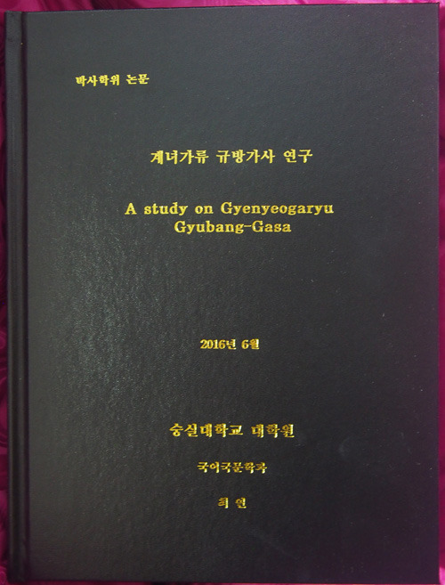
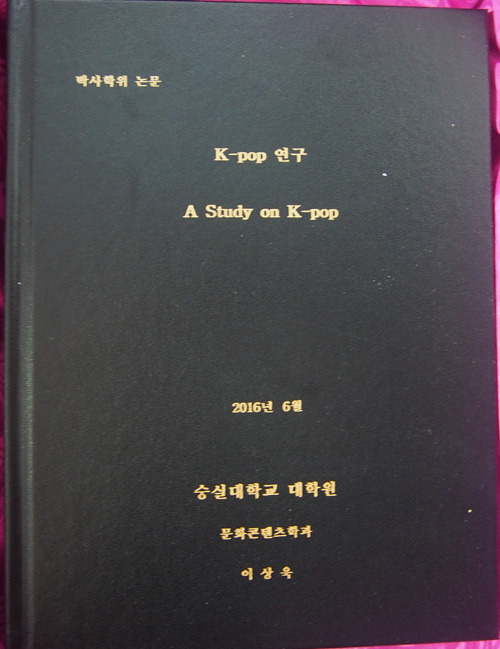
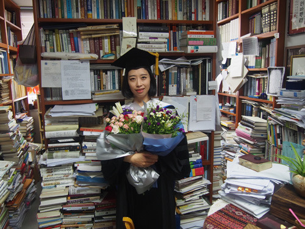
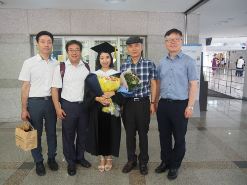

박사학위를 받은 두 제자를 보며

박사학위만 받으면 그럴 듯한 자리를 차지하던 시절이 있었다. 그 시절 박사학위는 사람까지 달라보이게 만드는 힘이 있었다. 박사학위는 아무나 받을 수 없다는 인식 때문이었을까. 세상사람들은 박사학위를 받은 사람을 외경(畏敬)의 눈으로 바라보곤 했다. 박사학위 수여식은 ‘긴 가방끈’의 종착역이었으며, 상아탑 안에서의 연찬(硏鑽)을 종결하는 표지가 바로 박사학위였다. 세상 사람들이 박사학위를 존경하니, 박사학위를 받은 사람들은 함부로 행동하지 못했다. 박사학위가 인간의 원초적 욕망을 지긋이 눌러주는 역할을 했던 것이다.

지방 소도시의 어느 대학에서 있었던 일 하나. 당시 그 도시엔 작은 대학 둘이 있었다. 둘 중 큰 대학의 학장이 그 도시의 유일한 박사였다. 대학의 졸업식이나 특별한 행사가 있는 날이면, 그는 집에서 가운과 박사모를 착용한 채 휘적휘적 걸어서 학교 혹은 행사장까지 나가곤 했다고 한다. 그 스스로 자신의 박사학위가 얼마나 자랑스러웠겠으며, 그곳 사람들은 그가 얼마나 존경스러웠을까.

‘구제(舊制) 박사 시대’가 오래 지속되면서, 박사학위는 그야말로 학문의 완성자에게 주어지는 완장 같은 역할을 했다. 정말로 아무나 받을 수 없는 게 당시의 박사학위였다. 그러나 언제부턴가 명분과 이념을 중시하는 시대정신이 무너져 가면서 그 자리를 실용과 실리가 메우기 시작했고, 박사학위의 의미 또한 묘하게 바뀌기 시작했다. 가끔은 약간 우스운 인사들이 박사학위를 받는 일이 생기기도 했고, 박사학위가 돈으로 거래된다는 소문들이 심심치 않게 돌기도 했다. 구제 박사의 ‘구제(舊制)’가 ‘구제(救濟)’로 희화화되기 시작한 것도, 가짜박사가 등장하기 시작한 것도 바로 그 시절부터였다.

서양에서 받아들인 제도이겠지만, 우리 사회에도 신제박사가 등장했다. 박사과정을 이수하고 자격시험과 논문만 통과되면 누구나 박사를 받을 수 있는 시대로 접어든 건 일종의 혁명이었다. 박사모의 아우라가 바람처럼 사라지고, 근엄한 박사가운의 신비로움은 거추장스러움으로 전락했다.

바야흐로 박사가 넘쳐나는 세상이다. 한참 전에 '도나 개나 모두 박사 되는’ 세상에 살게 되었다고 도 넘은 탄식을 내뱉던 구제박사 한 분을 만난 적도 있다. 권위와 우상이 파괴된 ‘보통인들의 사회’이자 ‘대중 사회’가 그에게는 바로 ‘도나 개나 모두 박사’인 세상으로 비쳐진 모양이었다. 물론 제대로 된 박사가 드문 세상, 표절박사들이 고위직에 앉아 거들먹거리는 세상, 우리가 지금 그런 세상에 살고 있는 것도 사실은 사실이다.

\*\*\*

오늘, 내 제자 둘이 박사학위를 받았다. 경제적으로 풍족하지 못한 가운데 열정 하나로 힘겹게 박사학위를 받은 그들을 힘 빠지게 하려고 이런 말을 하는 건 아니다. 옛날의 박사학위는 값이 나갔는데, 지금의 박사학위는 그렇지 못함을 말하려는 것은 더더욱 아니다. 옛날은 옛날대로, 지금은 지금대로 ‘박사모를 쓰는 일’은 쉽지 않다. 사실 신제박사 초창기에는 박사학위를 받고나서 크게 앓아눕는 인사들이 많았고, 박사학위를 받자마자 유명을 달리하는 사람도 심심치 않게 나왔으며, 심지어 학위수여식장에 가기 직전 삶을 마감한 분들도 더러 있었다. 박사학위가 통과된 뒤 혹은 박사학위를 받은 뒤 한동안 앓아눕는 사례를 지금도 자주 목격한다. 예나 지금이나 박사학위 공부가 쉽지 않다는 방증이리라.

최연 박사는 중국 산동성 옌타이에 있는 노동대학교(魯東大學校) 교수다. 2012년 과정을 시작한 두 학기 만에 아이를 출산했고, 첫 돌도 안 된 아기를 떼어놓고 돌아와 박사공부를 이어온 ‘입지전적’ 여성학자다. 3년 만에 박사학위를 따낸 저력의 근원은 과연 어디에 있을까. 뛰어난 천품이나 자질이 1차적 요인이었겠지만, 아가와 떨어져 지낼 수밖에 없는 현실을 인정하고 그 기간을 최소화하기 위해 분투노력한 ‘지극한 모정’이야말로 결정적 요인이었으리라. 한국에서 살아온 우리도 재미없고 어렵게 여기는 ‘계녀가류 규방가사’를 ‘이쁜 아가 옷 누비듯’ 한 땀 한 땀 떠 내려 간 작업이 바로 그의 논문이다. 시간·공간의식이나 에코 페미니즘의 시각으로 꽉 막힌 규방에서의 한심함을 정연한 담론으로 승화시킨 그 옛날 여성들의 삶을 잘도 요리하여 먹음직스런 모습으로 세상에 내놓은 것이다. 최 박사는 조만간 출간될 그의 책 머리말에서 계녀가류 규방가사에 대한 깨달음을 다음과 같이 술회했다.

“계녀가류 규방가사를 공부하면서 놀라운 깨달음이 왔다. 사실 ‘여성 억압적 담론’의 계녀가류 규방가사로부터 시대정신과 어긋나는 따분함을 느끼고 떠나는 사람들이 대부분이지만, 한 꼭지 두 꼭지 작품들을 읽어나가면서, 마냥 따분한 이야기들의 반복만은 아니라는 생각이 들었다. 나름대로 하나의 구조 안에 공존하는 표층성과 이면성을 해석해낼 수 있었던 것이다. 특별히 여성들에게만 엄혹한 잣대가 적용되던 암흑시대에 여성들이 살아남기 위한 돌파구는 무엇이었을까. 이면적 의미를 역으로 마련해 놓은 그 시대 여성들의 지혜가 바로 생존을 위한 돌파구였고, 의도하지 않고도 오늘날의 ‘여성시대’를 마련하게 된 그 시대 여성들의 역사적 혜안이었다. 작품들에서 공간이나 시간의식, 생태여성주의 등을 읽어낸 것도 바로 그런 깨달음의 결과였다. 남성들의 기세가 등등하지만, 결국 그들도 언젠가는 남성과 동등한 여성 고유의 역할을 인정하게 되리라는 믿음 아래 인고(忍苦)의 세월을 견디며 살아나온 건 아닐까.”

그의 깨달음이 명료하여 나는 일단 마음을 놓을 수 있었다. 그 시대 여성들에 대한 동정이나 공감 없이 이런 논리가 가능할 수 없음을 잘 알고 있기에 더욱 그랬다. 그 정도의 결심과 노력을 지속한다면, 조만간 학자의 반열에 오를 수 있으리라는 믿음이 생겼던 것이다.

2002년 강의실에서 만난 학부 초년생 이상욱(무늬상점 대표)의 반전(反轉)과 발전(發展)은 내 자긍심의 바탕이다. 학부 초기 술에 찌들어 지내던 그였다. 그러나 단 한 번의 꾸짖음과 결심으로 학구(學究)에 몰두하면서 보여준 변신은 참으로 인상적이었다. 내 강의와 논저들을 통해 노래문학으로 보아야 하는 고전시가의 본질을 잘도 캐치하여 오늘날의 케이팝(k-pop)으로 연결시킨 그는 얼마나 명민한가!

그는 싱어송라이터(singer-song writer)로서 음반도 여러 장 냈고, 음악시장의 한 부분을 담당하게 되었으니, 그의 미래는 참으로 밝다. 사실 케이팝이 세계 음악 시장의 ‘핫한’ 이슈로 떠올라 있긴 하지만, 현상에만 열광할 뿐 그 미학적 근원에 대해서는 대체로 무지한 것이 우리의 한계였다. 조만간 출간될 그의 책 머리말 가운데 한 부분을 보자.

“'우리의 가맥(歌脈)은 단 한순간도 끊어진 적이 없다.'

철부지 학부생 시절, 스승인 조규익 교수님께서 해주신 말씀이다. 별 생각 없이 흘려버릴 수도 있었을 것이다. 그런데 이런 생각이 들었다. ‘옛 노래와 지금 노래가 이렇게나 다른데 무슨 말인가? 둘 사이에 연결고리가 있다는 말인가?’ 나의 연구는 아마 그때부터 시작되었는지도 모른다. 겉모습만을 가지고 성급한 판단을 내려서는 안 될 일이다. 조금만 주의 깊게 들여다보면 대상의 진짜 모습을 알 수 있기 때문이다. 왕조나 국가가 바뀌었다하여, 전쟁이 일어났다하여, 심지어 국권을 빼앗겼다하여 한 민족의 노래 문화가 한순간 단절되거나 송두리째 바뀔 수는 없는 일이다. 한국 노래는 아주 먼 옛날부터 지금까지 끊임없이 변화하며 이어졌다. K-pop에서 전통의 요소와 외래의 요소를 동시에 발견할 수 있는 것도 바로 이 때문이다.

이 책은 K-pop을 통해 엿볼 수 있는 한국 노래의 지속과 변이의 양상, 미학 등에 대한 연구서이다. 아울러, 음악 산업의 현장에서 내가 직접 경험한 것들을 정리한 실무 보고서이기도 하다.”

그렇다. 내 말을 흘려듣지 않고 결국 박사논문으로까지 승화시킨 사례로는 그가 유일하다. 옛 노래문학으로부터 흘러오는 전통을 인식하며, 스스로 노래를 만들고 부르는 일을 업으로까지 삼고 있으니, 그가 내 학문적 자부심의 바탕이 되어 준 것은 분명하다. 융합과 통섭이 시대정신으로 정착한 지금, 반려자의 전공이자 주업인 디자인과 그의 노래가 시너지를 발휘하게 될 것임은 자명하다. 그의 시대가 꽃피어나길 기다리고 있는 것도 바로 그 때문이다.

\*\*\*

누구는 ‘주마가편(走馬加鞭)하라’ 했고, ‘미운 자식에겐 떡 하나 주고, 이쁜 자식에겐 매 한 대 안기라’는 옛말도 있다. 그러나 옛 말들이 반드시 맞는 것은 아니다. 달리는 말에 채찍을 더하면 그냥 쓰러질 수도 있다. ‘매 한 대’ 보다 ‘떡 하나’가 젊은이들에게 오히려 도움 되는 시대가 바로 지금이다. 시대의 변화를 인지하지 못하고 옛 어른들의 말씀을 묵수(墨守)하는 것은 지혜가 아니다. 술이부작(述而不作)보다 온고지신(溫故知新)을 삶의 지표로 삼아야 한다는 내 철학을 바탕으로 오늘 학위를 받은 두 제자들의 단점 대신 장점을 들어 보인 것은 바로 그 때문이다. 그러니 당사자들이나, 이 글을 읽으시는 강호제현은 부디 양찰(諒察)하시기 바란다. 

백규 연구실에서

xml:namespace prefix = "o" /

                                선배들, 지도교수와 함께

공유하기

게시글 관리

**백규서옥\_Blog ver.**

[저작자표시 비영리 변경금지
(새창열림)](https://creativecommons.org/licenses/by-nc-nd/4.0/deed.ko)