삼례 책 마을을 다녀와서

책이 없어 곤궁하던 어린 시절부터 책이 넘쳐나는 지금까지 책과 뗄 수 없는 것이 내 삶이다. 남의 책들을 사 읽고 모으며, 가끔은 책을 펴내는 게 내 일 중의 큰 부분이기 때문이다. 내가 막 학계로 진출하던 1980년대부터 최근까지 30여 년 동안 우리 사회엔 책이 넘쳐나게 되었다. 지식인들의 수와 지식정보의 양이 폭발적으로 늘어나면서, 지식정보의 유통과 저장을 위해 책의 효용가치는 절대적이었다. 책 하나 펴내지 못하면 행세를 하지 못하던 시절도 있었다. 그러나 세월은 마구 변하여 모든 지식정보는 디지털의 공간으로 이동함으로써 이제 크고 무거운 책이 거추장스런 시대가 된 것이다. 어린 아이부터 할아버지까지 하루 24시간을 구부정하게 스마트폰만 들여다 보는 시절이다. 종이 위의 깨알 활자들이 어찌 이들에게 매력적일 수가 있겠는가.

누구의 한탄대로, 한국의 대학가에서 서점이 사라졌다. 책이 빠져나간 공간을 옷 가게, 음식점, 술집, 커피 집 등이 파고들었다. 가끔씩 커피 집 창문으로 책을 읽거나 컴퓨터 작업 하는 사람들이 보이긴 하나, 손가락으로 헤아릴 정도. 대다수는 잡담을 나누거나 스마트폰에 빠져 있다. 대학에서 책이 썰물처럼 빠져나가자, 지성의 샘도 말라버린 것이다.

대학의 권력도 대부분 힘 있는 이공계가 잡고 있다. 총장도 보직교수들도(그 가운데 도서관장도) 책이 무언지 모르는 시대가 되었으니, 어린 학생들 탓만 할 수는 없다. 도서관의 장서를 전자책으로 대체할 수 있다고 믿는 사람들이 권력을 잡고 있으니, 도서관에서 값나가는 인문서적들이 차떼기로 퇴출되는 것이 하나도 이상하지 않은 시대다. 이렇게 반학문적, 반지성적 만행들이 수시로 나타나는 현장이 대학이다. 그래서 종이책만이 책임을 믿으며 대학인으로 살아가기가 참으로 면구스럽다. 책을 알고 사랑하는 사람들, 종이책을 찾는 사람들이 바야흐로 멸종을 눈앞에 둔 천연기념물이 된 것이다.

이런 시대에 완주군 삼례읍은 특이하고 고결한 고장이다. 아주 오래된 비료창고를 문화공간으로 변모시키고 각박한 삶에 지성의 문채(文采)를 입힌, 이 고장 사람들의 지혜가 참으로 소중하다. 2016년 8월 29일은 이 땅에 타오를지도 모를 ‘대한민국 판 르네상스’가 바로 이 고장에서 점화된, 역사적인 날이다. 책을 잃어버려 마음도 희망도 잃어버린 대한민국에 갈 길을 제시한 등대로 우뚝 선 날이다.

이 날 몇몇 지인들과 책 마을 개관식에 참석했다. 시가지에 들어서자 “삼례는 책이다!”라는 현수막이 수줍은 듯 조그맣게 매달려 있었다. 삼례성당 좌측 창고에는 ‘책 박물관’이, 박물관 건너편에는 목공학교가 가동 중이었다. 이 부분이 책 마을의 중심이었다. 박물관은 아동도서와 교과서, 만화 등 2~3개 주제의 상설전시와 매년 1~2회의 기획전이 열리게 되는 공간이었다. 박물관 건너편의 ‘김상림 목공소’도 책 마을의 전통성을 보태주는 좋은 공간이었다. 전통 목공의 도구들을 살펴볼 수 있고, 목수들의 작업을 보고 배울 수 있는 곳. 그곳 역시 멋진 공간이었다. 박물관에서 나와 삼례역 방향으로 걸어가니 북하우스, 한국학 아카이브, 북갤러리 등 세 동의 건물이 눈 앞에 나타났다. 북하우스는 고서점과 헌책방, 북카페로 구성되었고, 한국학 아카이브에는 각종 연구 자료들이 비치되어 있으며, 북갤러리에는 전시실과 강연실이 마련되어 있었다. 북하우스로 들어가니 ‘고서점 호산방’이란 이름 아래 한국학 관련 고서, 신문, 잡지, 사진, 음반자료, 중국ㆍ일본ㆍ서양 관련 고서 등이 비치되어 있고, ‘책마을 헌책방’의 1층에는 아동도서와 향토문화 관련 도서 등이, 2층에는 인문도서들이 비치되어, 총 10만권의 ‘빛나는 책들’이 손님들을 기다리고 있었다. 헌책방의 1층 한쪽에 카페가 마련되어 독서와 휴식을 즐길 수 있도록 만들어져 있기도 했다.

“책은 위대한 천재가 인류에게 남겨준 유산이다. 그것은 대물림하여 아직 태어나지 않은 자손들에게 주는 선물로서 한 세대에서 다른 세대로 전달된다.” 책에 관한 에디슨의 명언이다. 이제 위대한 천재들이 만든 책들이 이곳으로 모일 것이다. 그리고 그것들은 대물림되어 다음 세대, 그 다음 세대로 이어지겠지. ‘망아지가 태어나면 제주로 보내고, 사람은 서울로 보내라’는 속담이 있듯 조만간 ‘책도 사람도 삼례로 보내라’는 새로운 속담이 나올 날이 머지않았다. 삼례는 책의 메카로 변신할 것이며, 대한민국 정신사의 핵심적 지위를 차지하게 되는 것도 그리 오랜 시간이 필요하지 않을 것이다. 이제 현명한 부모라면, 아이들 손을 잡고 삼례 책 마을에 가서 잠시라고 느긋하게 시간을 보내볼 일이다. 책의 의미와 책의 일생을 보고 보여주면서 말이다.

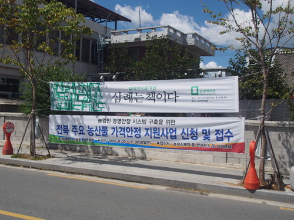

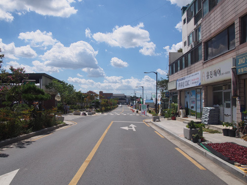

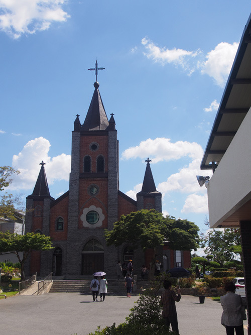

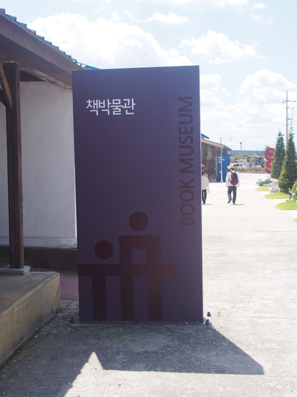

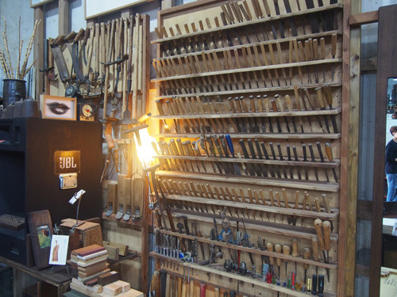

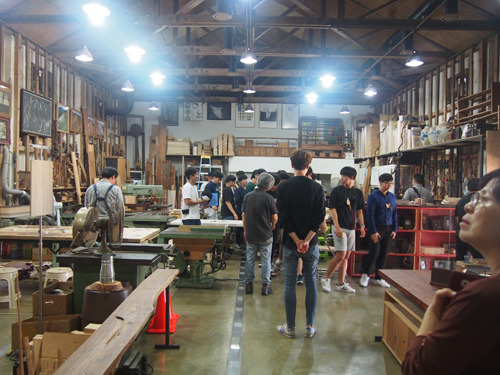

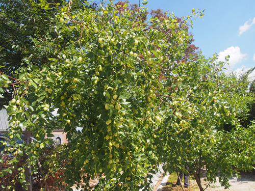

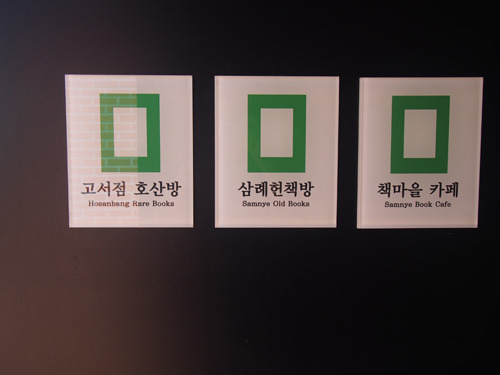

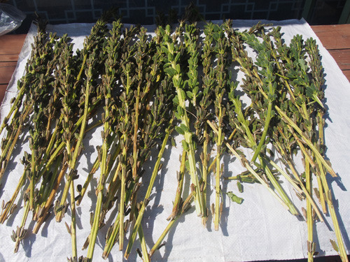

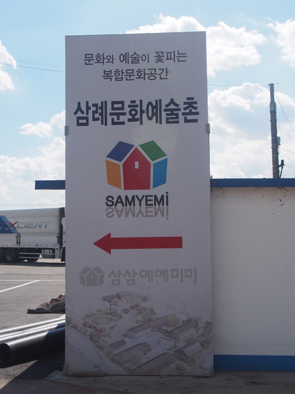

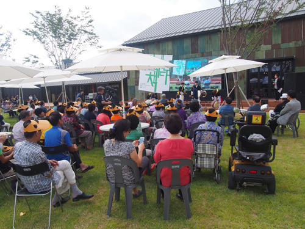

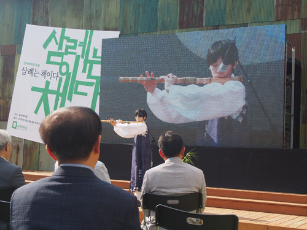

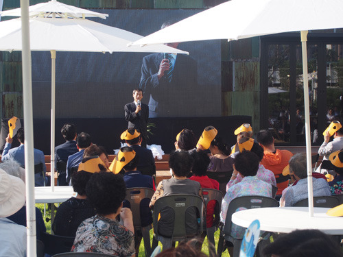

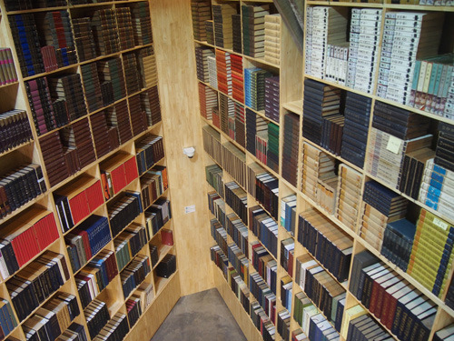

공유하기

게시글 관리

**백규서옥\_Blog ver.**

[저작자표시 비영리 변경금지
(새창열림)](https://creativecommons.org/licenses/by-nc-nd/4.0/deed.ko)