남도에서 만난 무서운 선비, 금남 최부 선생

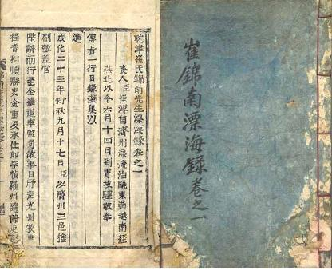  
<<최금남표해록>>

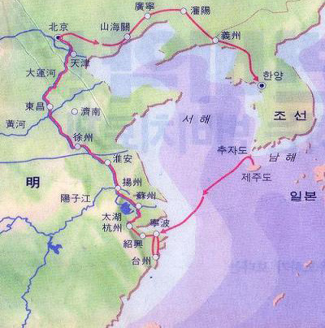  
최부 선생의 표류 및 귀환 노정

신춘호(한중연행노정답사연구회 회장) 박사로부터 금남 최부(崔溥, 1454~1504) 선생(이하 ‘선생’으로 약칭)의 자취를 찾아 나선다는 연락이 왔다. 오랜만에 가슴이 뛰었다. 파릇파릇하던 시절, <<금남선생 표해록>>을 읽고 언젠가는 그 길을 밟아보리라 마음먹고 있었다. 그 열기는 아직도 식지 않았는데, 흘러간 세월이 벌써 수십 년이다! 끔찍한 표해(漂海)의 노정은 뒤로 미루고, 선생의 고향인 남도에서 그 분의 뜨거운 자취를 느껴보기로 했다.

9월 3일 토요일. 추석맞이 벌초 행렬로 고속도로는 만원이었고, 들판의 벼는 누렇게 익는 중이었다. 답사 참가자 12명을 태운 버스가 1차로 선 곳은 광주 광산구의 무양서원(武陽書院). 고려 인종 때의 어의(御醫) 최사전(崔思全)을 주벽으로, 후손인 선생을 비롯하여 최윤덕(崔允德)ㆍ유희춘(柳希春)ㆍ나덕헌(羅德憲) 등이 배향되어 있었다. 탐진 최씨 문중이 전국 유림들의 호응을 얻어 1927년 건립, 매년 음력 9월 6일에 제향을 올리는 곳이었다. 유생들이 공부하던 이택당(以澤堂) 좌우로 합의문(合義門)과 합인문(合仁門)이, 문을 열고 들어가자 그 안쪽에 낙호재(樂乎齋)와 성지재(誠之齋)가 좌우로 서 있었으며, 몇 계단 위에 무양사(武陽祠)가 높직이 앉아 있었다. 90년 세월의 흔적이 느껴지지 않을 만큼 서원 전체가 단정했다.

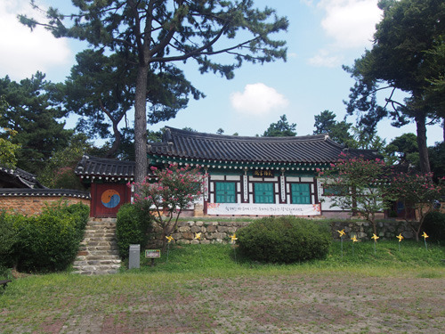  
입구에서 올려다 본 무양서원

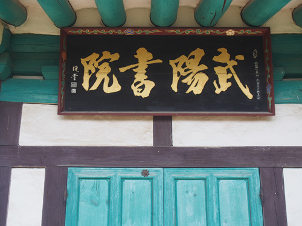  
무양서원 현판

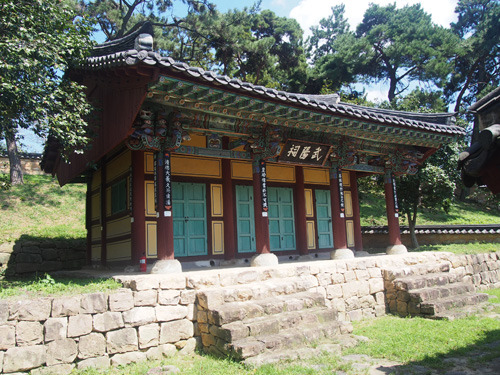  
무양사

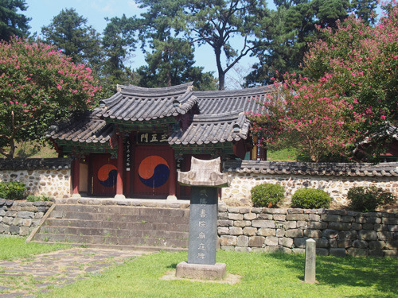  
무양서원 묘정

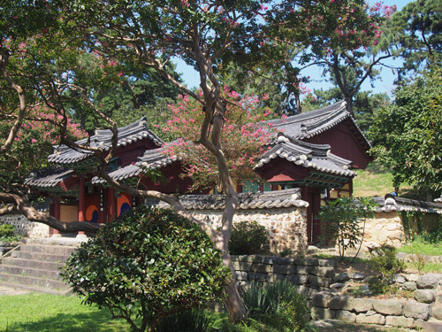  
측면에서 올려다 본 무양서원

거기서 30여분을 달려 도착한 곳이 나주목 관아(금성관). 아직도 발굴과 복원이 진행되고 있었지만, 목사골 나주의 위용과 분위기는 당시의 모습인 듯 고풍스러웠다. 그로부터 멀지 않은 동강면 인동리 성지마을이 바로 선생의 탄생지였으나, 시간 상 돌아올 때 들르기로 했다. 선생을 배향한 강진의 강덕사(康德祠, 강진군 향토문화유산 14호/군동면 라천리 1044)에서 ‘탐진 최씨 청년 화수회’ 최윤영 회장이 우리를 기다리고 있기 때문이었다. 1966년 창건된 강덕사에는 고려 인종(1122-1146) 때 왕을 호종하여 이자겸의 난을 좌절시키고 나라를 보존시킨 어의 최사전을 주벽으로, 선생과 함께 최표ㆍ최극충 선생 등을 배향하고 있었다.

그곳을 떠난 우리는 어둠이 깔린 해남 시내에 입성, 해남관광호텔에 여장을 풀었다.

 

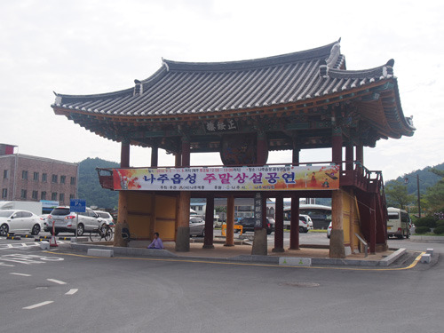  
나주목 정수루(正綏樓)

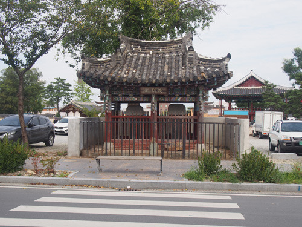  
나주목 의열각(義烈閣)

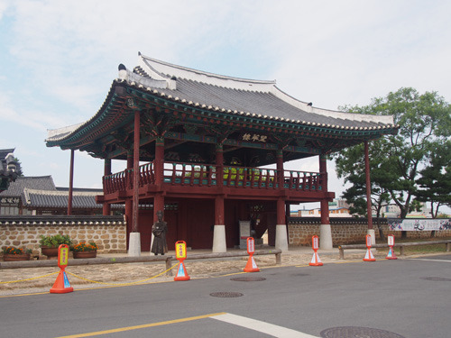  
나주목 망화루(望華樓)(금성관의 가장 바깥에 있는 세 칸 규모의 2층 문루)

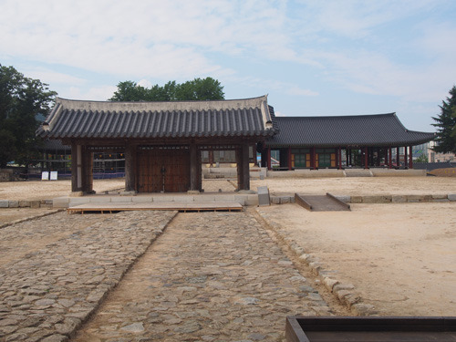  
나주목 금성관의 내삼문

  
나주목 금성관(주로 사신을 접대하던 곳)

  
나주목 금성관의 외삼문과 내삼문 중간쯤 우측 성벽 옆의 각종 송덕비들

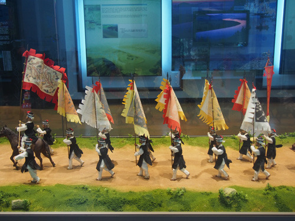  
나주목사 행렬행차

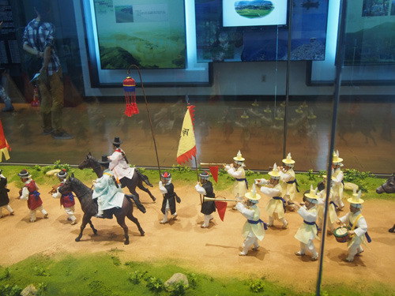  
나주목사 행렬 행차

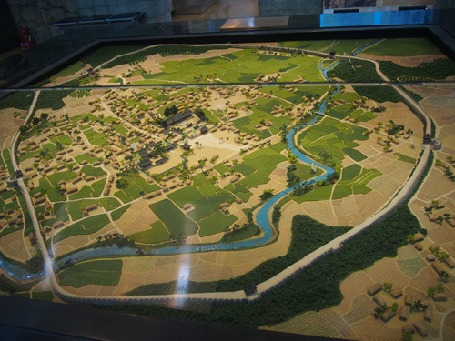  
나주목 행정 관할도

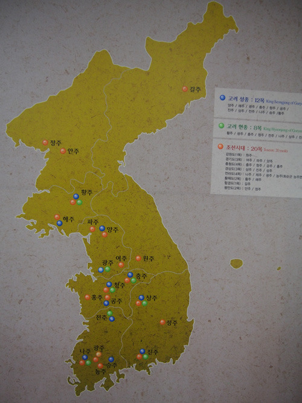  
조선시대 20목 분포도

  

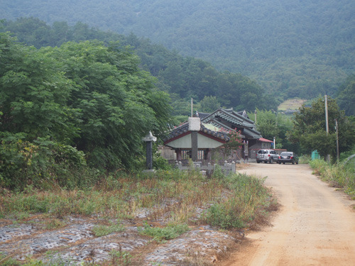  
입구에서 보이는 강덕사

  
강덕사 대문

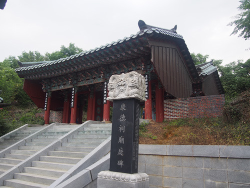  
강덕사 묘정비

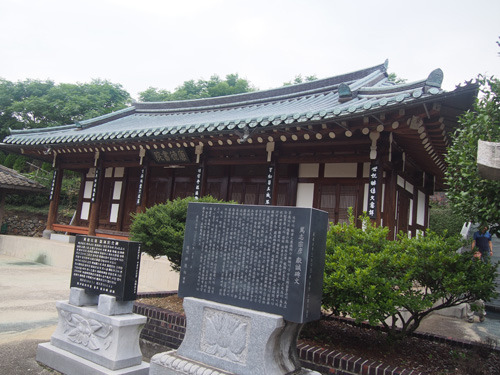  
강덕서원 뜰

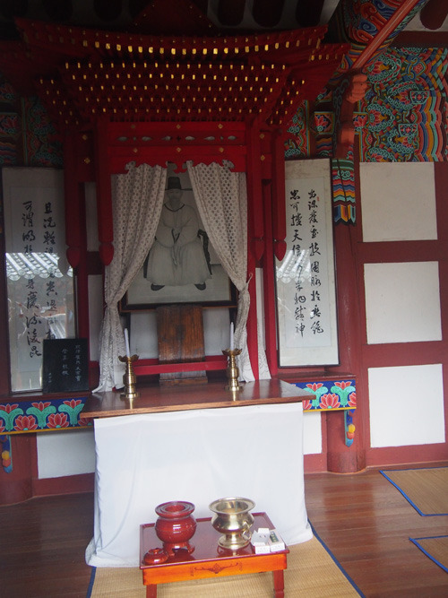  
강덕사 주벽 최사전의 영정과 위패

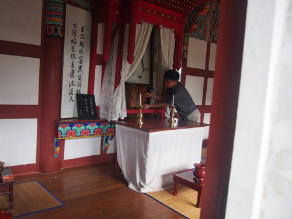  
강덕사 주벽 최사전의 영정과 위패

]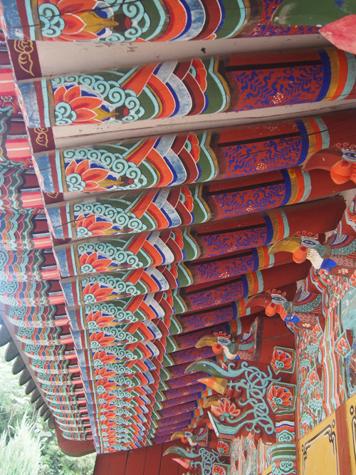  
강덕사의 아름다운 단청

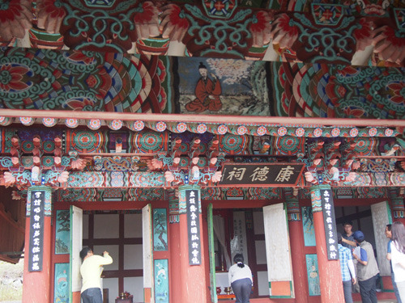  
  
강덕사 앞면

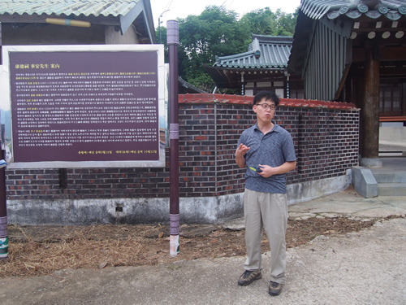   
강덕사와 탐진 최씨 문중에 대하여 설명하는 후손 최윤영 선생(미래상사 대표)

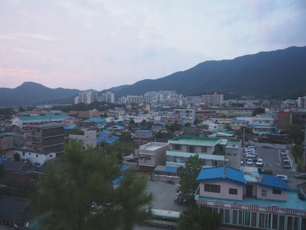

관광호텔 밖으로 내다보이는 어둘녘의 해남읍

9월 4일. 아침 일찍 숙소를 나선 답사단은 해남향교를 찾아 전교인 임기주 선생으로부터 설명을 듣고 정위인 문선왕의 위패를 친견하는 영광을 누리기도 했다. 공식적으로는 고려 충렬왕 때 창건된 것으로 추정하나, 바다를 건너 온 공자의 위패를 모신 시기를 기준으로 우리나라 최초라 하는 강화도의 교동향교보다 이곳이 먼저라는 것이 그 분의 흥미로운 주장이었다. 해남향교에 대한 자부심의 표현일 뿐 ‘최초’가 중요한 것은 아니리라. 이 향교도 해남정씨와 결혼한 뒤 해남에 정착하여 관서재(官書齋)를 열고 후학을 기른 선생의 활동영역들 가운데 하나였을 것이다. 선생을 비롯하여 외손자 유희춘(柳希春)과, 윤효정(尹孝貞)ㆍ임우리(林遇利)ㆍ 유계린(柳桂隣) 등을 해남유학의 핵심으로 꼽는 것도 그 때문일 것이다.

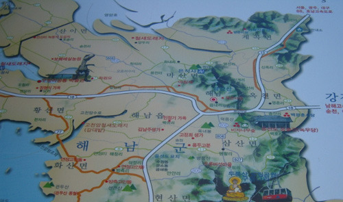  
해남군 지도

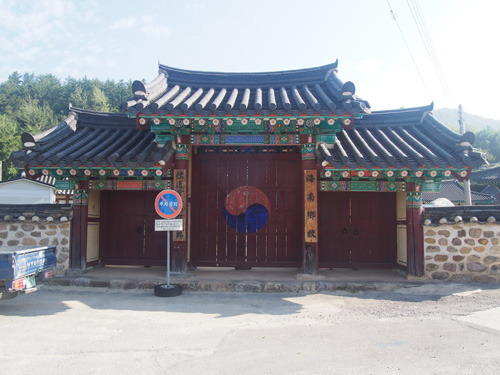  
해남향교

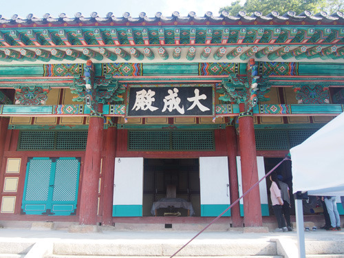  
해남향교 대성전

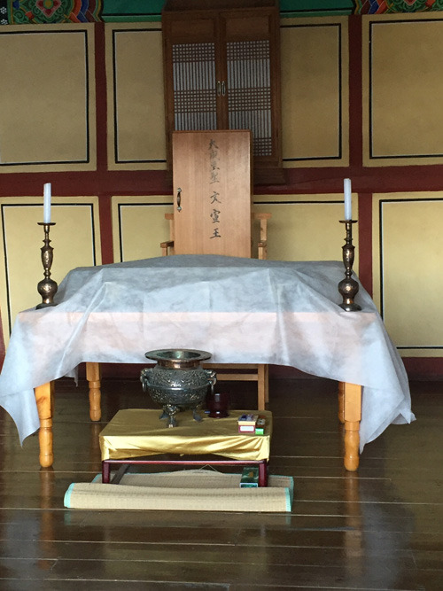  
해남향교 주벽인 공자의 위패를 모신 자리

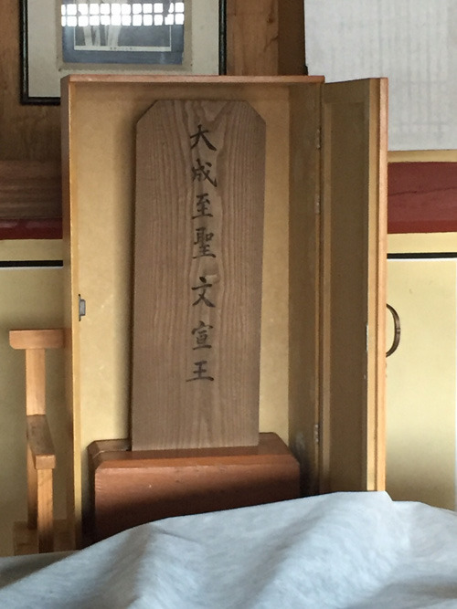  
해남향교 공자(대성지성 문선왕)의 위패

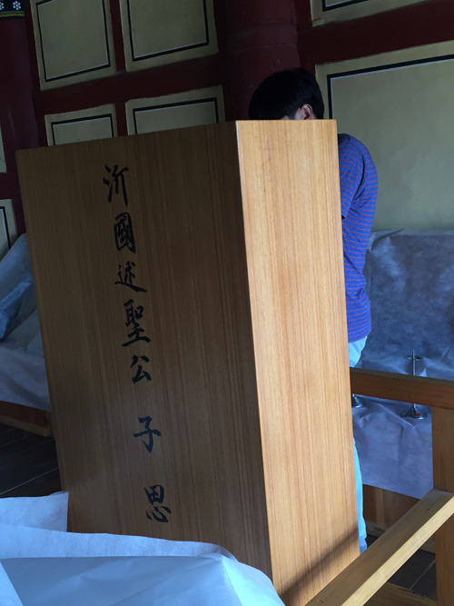  
해남향교에 모신 기국술성공 자사의 위패

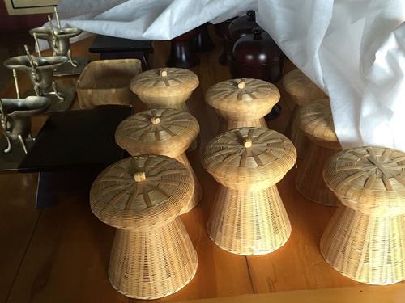  
해남향교의 각종 제기들

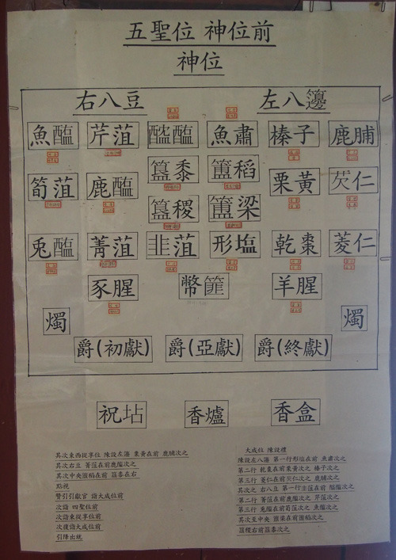  
해남향교 진설도

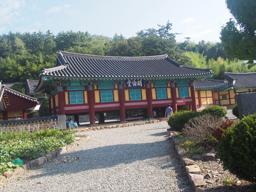  
해남향교 명륜당

  
해남향교 장서각

향교를 뒤로 하고 달려간 곳은 해촌서원(海村書院). 거울 같은 금강골 저수지를 내려다보는, 서원의 단아한 자태가 돋보였다. 선생과 함께 임억령(林億齡), 유희춘, 윤구(尹衢), 윤선도(尹善道), 박백응(朴伯凝) 등 이 지역의 6현이 배향되어 있었다. 효종 3년(1632) 임억령 선생이 처음으로 배향되었고 1922년 박백응 선생이 마지막으로 배향되었으니, 여섯 분이 배향되기까지 무려 290년이 걸린 것이다. 여기서도 금남 선생이 으뜸으로 모셔지고 있음은 그 분의 강학비(講學碑)가 우뚝 솟아 있는 점으로 알 수 있었다.

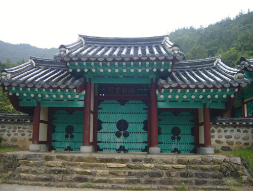  
해촌서원

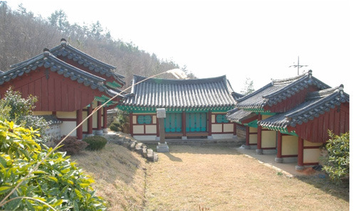  
해촌서원

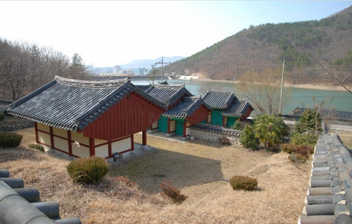  
해촌서원과 금강골 저수지

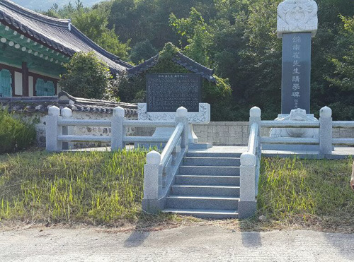  
해촌서원의 최부선생 강학비

  
해촌서원의 최부 선생 강학비

해촌서원을 뒤로 하고 달려간 곳이 송나라가 해로를 통해 고려 땅에 처음으로 닿았다는 관두량(關頭梁). 중국과의 국제적 무역항이자 제주도와의 교역항이었다. 송나라의 사신들도, 상인들도 모두 이곳을 통해 들어왔으니, 당시 이곳의 번화함은 짐작되고도 남음이 있었다. 선생이 제주목사 허희(許熙)와 함께 성종 18년(1487) 11월 11일 관두량에 도착해 다음날 제주로 가는 배를 탄 곳도 바로 이곳이었다. 질펀하게 넓은 바다가 고요하니, 당시에는 국제 무역항으로 손색이 없었으리라. 지금은 방조제로 막혀 그 옛날 배가 닿고 떠나던 포구는 마을과 논으로 바뀌었고 민물과 바닷물이 교차하는 내륙의 수면 위로는 하얀 전어들이 뛰고 있었다. 관동리 주민회관에서 만난 마을 어른들 몇 분이 구전해오는 마을의 역사를 조심스레 들려 줄 뿐 이곳에 남아있을 선생의 행적을 알아낼 재간은 아예 없었다.

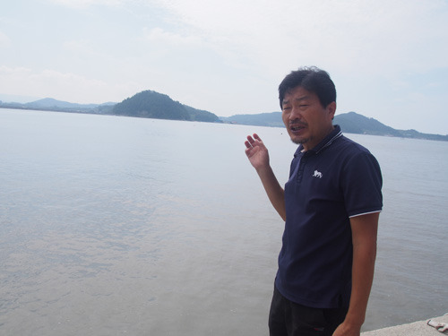  
관두량 포구와 이를 설명하는 신춘호 박사

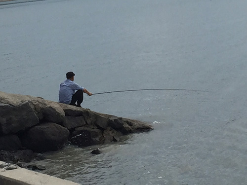  
포구의 한켠에서 낚싯대를 드리운 강태공

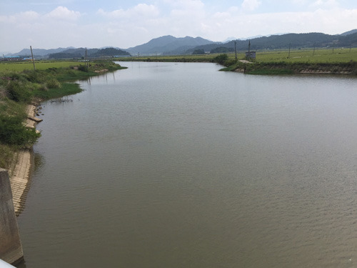  
관두량 방조제 안쪽의 내륙 수로

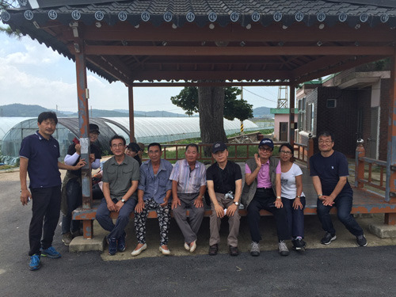  
관동리에서 만난 어르신들과 함께

관두량을 떠나 백포리의 윤두서 고택과 녹우당(고산 윤선도 고택)을 들러 무안 지역으로 이동, 금남 선생의 묘소를 찾았다. 무안군 몽탄면 이산리. 이른바 ‘늘어지 마을’의 양지바른 산록이었다. 선생 부부는 부모 묘소 아래에 자리잡고 앉아 굽이도는 영산강을 내려다보고 있었다. 마침 초가을의 햇살이 내려 쪼이는 명당의 음택이 아름답고 평화로웠다. 선생께 하직인사를 올린 뒤 한참을 달려 나주군 동강면 인동리 성지촌에 있다는 선생의 생가 터에 도착했다. 조심조심 마을길을 달려 막다른 곳에 도착, 촌가의 담장 옆을 통해 올라가니 생가 터임을 알려주는 비석 하나만 달랑 서 있을 뿐, 관리되고 있다는 흔적은 찾아 볼 수 없었다. 나주의 한촌에서 태어나 온갖 풍상을 겪다가 인근 무안에 묻힌 선생. 그 분의 일생은 당시 중세 조선의 정치적 격랑을 거슬러 가다가 불행하게 삶을 마친, 사림파 문인의 전형을 보여주지 않는가. 선생의 무덤과 생가 터는 차로 달려 30여분 거리였다. 그 거리는 삶과 죽음의 거리, 아니 시종일관 생사가 교차하던 선생의 일생이었다. 과연 선생의 삶을 어떻게 해석해야 할까.

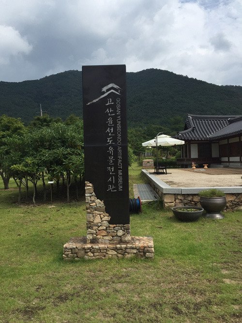  
녹우당의 고산 윤선도 유물 전시관

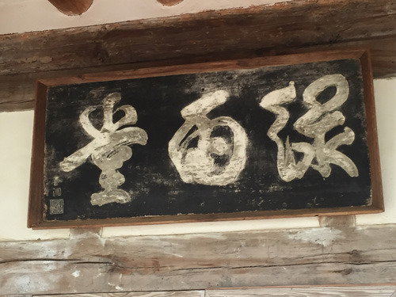  
녹우당 현판

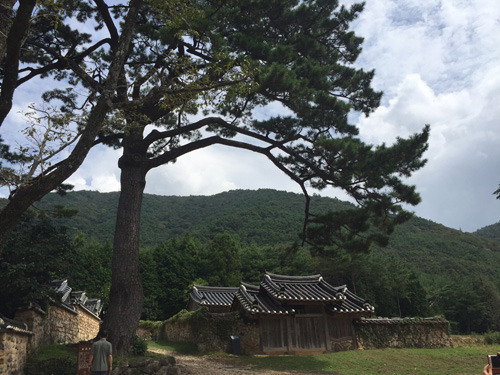  
고산 윤선도 선생 사당

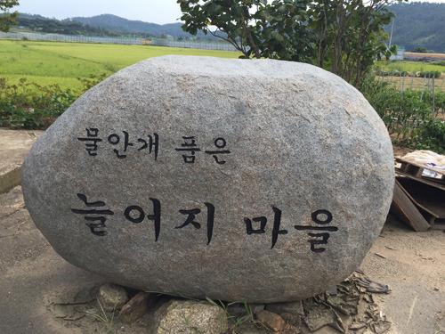  
금남 선생 묘소가 있는 '늘어지 마을' 표석

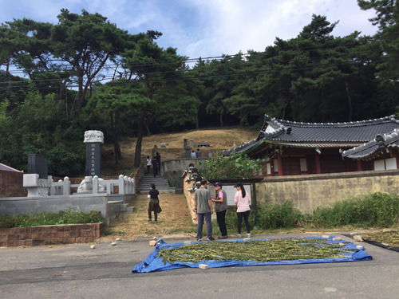  
금남 선생 부자묘 입구

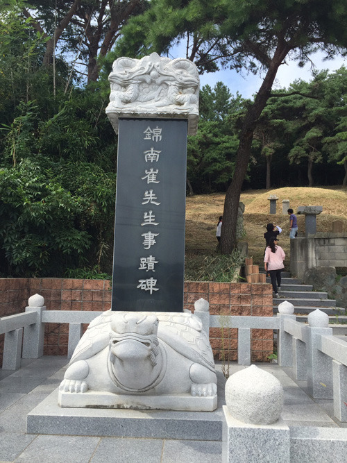  
금남 선생 사적비

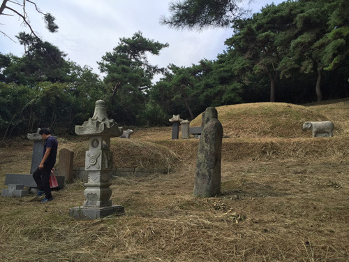  
금남 선생 묘소

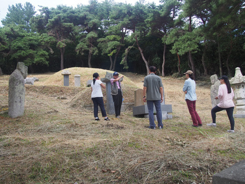  
금남 선생 묘소에서

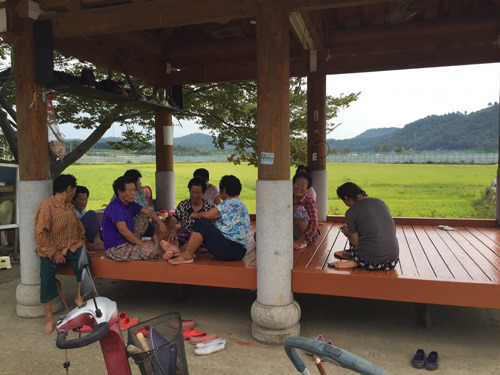  
늘어지 마을의 아주머니들

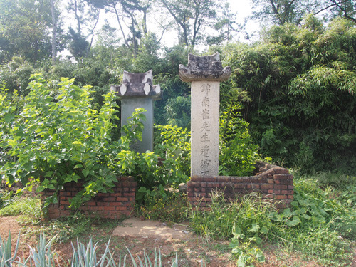  
금남 선생 생가터 비석

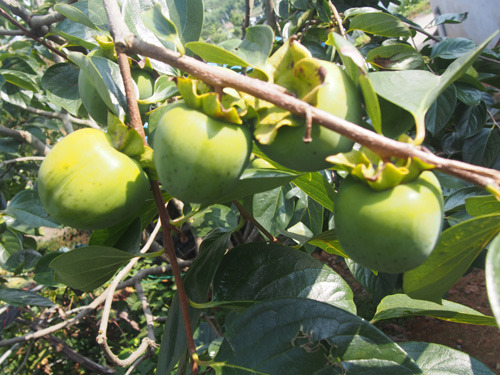  
금남 선생 생가터 앞에 열린 감

\*\*\*

금남 선생은 점필재 김종직(金宗直)의 문하로 분류되는 인물이었다. 초창기 조선조의 사림파는 ‘유교의 원리주의자들’이었다. 결국 훈구파를 누르고 노론을 형성하여 망할 때까지 조선조를 끌고 나간 사림파. 서슬 퍼런 선비정신으로 몸과 마음을 다져나간 인물들이었다. 제주에서 부친의 부음을 받고 상복으로 갈아입은 후 바다에 표류하는 동안 단 한 번도 편한 옷으로 갈아입지 않았던 선생. 북경에 호송되어 황제에게 사은하게 되었을 때도 친상을 당한 자식으로서의 예가 아님을 내세우며 옷 갈아입기를 거부하다가, 결국은 강요에 의해 잠시 길복(吉服)으로 갈아입은 선생이었다.

선생은 귀환 후에도 왕명으로 8일 만에 표해록을 작성하는 저력을 보였다. 그런 다음 즉시 내려가 상주로서의 임무를 다하면서 왕명으로 중국에서 목격한 수차(水車)를 제작하기도 했다. 1년 후 모친마저 세상을 떠나면서 선생은 4년 동안이나 복을 입게 된 것이다. 탈상 후 선생을 아끼던 성종이 벼슬을 내리려 하자 사간원과 사헌부의 신료들이 들고 일어났다. 부친상을 당한 자식의 예를 지키지 않았다는 것. 표류한 뒤 중국에서 많은 시문을 지은 것, 비록 왕명에 의한 일이긴 하지만 즉시 빈소로 달려가지 않고 여러 날 서울에 머물면서 표류기를 쓰거나 사람들을 만나면서 애통함이 없었다는 등의 이유로 벼슬을 주어서는 안 된다고 왕에게 대들었으니... 당시의 젊은 신료들 또한 선생과 같은 류의 무서운 ‘원리주의자’들이었다.

그러나 성종이 일찍 하세하고 연산군이 등장하면서 일어난 무오사화의 와중에 점필재의 문하라는 이유로 함경도 단천으로 유배되었고, 그 6년 뒤 갑자사화의 불길을 피하지 못한 채 끔찍한 참형을 받고 효수까지 당했다. 51세의 창창한 나이로, 파란 많은 삶을 마무리하게 된 것이다.

아름다운 남도의 이곳저곳에 남아 빛을 발하고 있는 선생의 자취는 인간의 본질과 삶의 가치를 깨닫게 만드는 교과서였다. 조만간 ‘제주-중국-조선’으로 이어지는 선생의 행적을 다시 밟아볼 필요성을 절감한 것도 바로 그 때문이었다. 그 때가 마냥 기다려지는 지금이다.

공유하기

게시글 관리

**백규서옥\_Blog ver.**

[저작자표시 비영리 변경금지
(새창열림)](https://creativecommons.org/licenses/by-nc-nd/4.0/deed.ko)