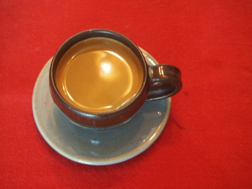

“쓴물이나 한 잔 허세!”

몇 년이나 지났을까. 일이 있어 고향에 갔다가 친구의 사무실에 들렀다. 누군가와 통화를 하던 그가 마무리 멘트로 던진 말이 매우 인상적이었다.

“시일 내로 쓴물이나 한 잔 허세!”

‘쓴물’이라? 잠시 갸우뚱했다. 그러나 그게 바로 ‘커피’를 뜻한다는 사실을 깨닫곤, 무릎을 쳤다. 그 날부터 아침마다 쓰디쓴 에스프레소 한 잔을 마시면서 그가 깨우쳐 준 ‘쓴 물’의 다의성(多義性)과 함축성을 곱씹기 시작했다. 최근 설탕과 프림을 듬뿍 넣은 우리네 ‘막대커피’의 우수성(?)을 서양인들도 인정하기 시작했다지만, 사실 커피의 매력은 ‘쓴 맛’에 있다. 요즘 젊은이들, 특히 젊은 여성들은 양동이만한 커피 잔을 안고 다니는 게 일종의 패션처럼 되어 있다. 대부분 나로선 이름도 외우기 힘든 달달한 커피 일색이다. 그러니 요즘 젊은 친구들, 쓴물의 철학적 원리나 약리(藥理)를 알 리가 없다.

공자는 “좋은 약은 입에 쓰나 병에 좋고, 충언은 귀에 거슬리나 행동에 이롭다(良藥苦於口나 而利於病이요. 忠言逆於耳나 而利於行)"고 말씀하셨다. 내 경험상 익모초 달인 물을 비롯, 전통사회의 약들은 으레 몸서리쳐질 정도로 쓴 것들뿐이었다. 현대인들의 병 가운데 상당수가 당분의 과다섭취에서 비롯된다는 것도 상식이다. 요즘 대부분의 약은 달콤한 설탕을 겉에 바른 ‘당의정(糖衣錠)’ 형태로 되어 있는데, 그렇게 해서라도 쓴 약은 먹여야 할 것이다. 그러나 그것 역시 ‘달면 삼키고 쓰면 뱉는’ 인간의 본능적 기호(嗜好)를 역으로 잘 보여주는 경우 아닌가.

쓴물과 비슷한 표현에 ‘쓴잔’이 있고, 그것을 한자어 ‘고배(苦杯)’로 쓴다. 어떤 시도가 실패할 경우 ‘고배를 마셨다’고들 한다. 그러나 ‘쓴물’ 혹은 ‘쓴잔’과 ‘고배’가 항상 같은 의미범주인 것은 아니다. 인류사 최고의 극적인 쓴물은 성서에서 발견된다. <<신약성서>> ｢마태복음｣ 26장 39절(“조금 나아가사 얼굴을 땅에 대시고 엎드려 기도하여 이르시되 내 아버지여 만일 할 만하시거든 이 잔을 내게서 지나가게 하옵소서. 그러나 나의 원대로 마옵시고 아버지의 원대로 하옵소서.”)의 ‘잔’은 그야말로 지극한 의미의 ‘쓴잔’이다. 인간의 형상으로 태어나신 예수가 인간의 한계를 벗어나는 마지막 관문에서 당하신 온갖 모욕과 고통을 함축적으로 표현한 것이 바로 이 말 속의 ‘쓴잔’ 아니겠는가. 따라서 그 경우의 ‘잔’은 패배의 그것이 아니라 승리자가 되기 위한 통과(의례)적 고통으로 보는 것이 옳다. 승리를 쟁취하기 위해 넘어야 할 산이 바로 쓴맛이다.

‘와신상담(臥薪嘗膽)’이란 성어도 있다. 춘추시대 마지막 패권을 다투던 오나라 부차와 월나라 구천에 관한 고사다. 치고받고 싸워오던 과정에서 위기를 모면한 월왕 구천이 다시 월나라로 돌아와 곁에 쓸개를 놔두고 항상 그 ‘쓴맛’을 보며 회계산의 치욕을 상기하다가 결국 패권을 차지했다는 것이니, 쓴맛이야말로 승리를 위해 필수적인 약이라 할 수 있지 않겠는가.

승리의 환희보다 패배의 고통을 훨씬 자주 경험하는 게 인간의 삶이다. 패배의 고통을 겪지 않은 승리는 큰 의미가 없다. ‘승승장구(乘勝長驅)’하는 사람들을 주변에서 자주 목격한다. 그러나, 그것은 남의 입장에서 보는 현상일 뿐이다. 우리가 몰라서 그렇지 그들의 삶도 알고 보면 ‘성공과 실패’(혹은 ‘승리와 패배’)가 반반, 아니 성공보다 실패가 훨씬 많았을 것이다. 우리는 그저 남의 성공만 볼 뿐, 실패는 알아보려 하지 않는다. 실패 속에 고심참담하던 그들의 모습은 아예 보려하지 않는다. 남의 화려한 성공만을 보고 부러워하는 게 장삼이사들의 보편적인 심성이기 때문이다.

“쓴물이나 한 잔 허세!”

내 친구의 허허로운 이 말 속에는, 성공을 소망하며 오늘을 성실하게 살고자하는 장삼이사의 철학이 들어있다. 툭하면 성공의 문턱에서 좌절하는 그들, 아니 우리들. 늘 실패를 맛보면서도 내일은 성공하고 싶다는 소망을 버리지 않고 있기에 우리네 필부필부들은 쓴 커피 한 잔을 마시면서 새로운 도전의 결기를 다지는 게 아닌가.

공유하기

게시글 관리

**백규서옥\_Blog ver.**

[저작자표시 비영리 변경금지
(새창열림)](https://creativecommons.org/licenses/by-nc-nd/4.0/deed.ko)