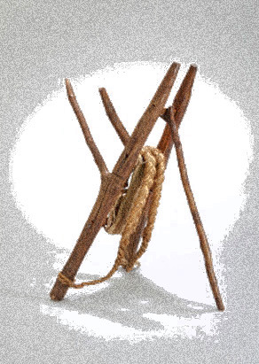
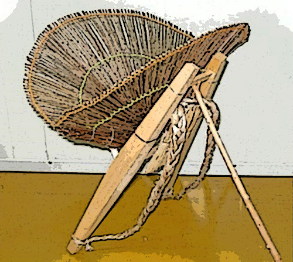

아버지의 지게

xml:namespace prefix = "o" / 

연구실과 강의실을 왕복하는 일상. 그 단조로움을 깨는 유일한 즐거움은 수영이었다. 거의 매일 한 시간 정도 물에 들어가 숨차게 땀을 빼고 나면 온몸이 가뿐했다. 쉼 없이 30차 왕복하면 36~40분이 소요되는 25m 레인에서 가당치 않게 대양의 돌고래들을 꿈꾸곤 했다. 가끔씩 어깨에 통증이 느껴졌지만, 그럴수록 더 열심히 하면 대개 며칠 지나지 않아 가라 앉곤 했다.

두어 달 전. 갑자기 욕심이 생겼다. 36분에서 30분으로! ‘기록단축’의 헛된 욕망에 사로잡혔던 것. 팔을 최대로 뻗어 큰 원을 그리며 스트록(stroke)의 소요시간을 줄이고자 했다. 서너 바퀴째 왼쪽 어깨에서 우두둑 하는 소리가 들렸다. 하룻밤을 자고 나니 어깨에 통증이 느껴졌다. 그래서 며칠간 ‘미친 듯이’ 팔을 휘둘렀다. ‘수영으로 생긴 통증은 수영으로 극복해야 한다’는 개똥철학을 실천이라도 하려는 듯.

초년 교수 시절, 따르던 영문과 원로교수가 계셨다. 심장병으로 투병하시던 분이었다. 하루는 내게 “이제부턴 어그레시브하게(aggressively) 살아야겠어요!” 자신감에 넘치는 그 분의 어투가 참으로 비장하면서도 아름다웠다. 그로부터 한 달쯤 후 영안실에서 그 분의 영정을 마주하게 되었다.

이를 악문 수영이 지속되면서, 극복되기는커녕 통증은 점점 더 묘하게 바뀌어갔다. 한 주일이 지나 ‘이건 아닌데?’ 하며 병원을 찾았다. 사진을 찍어보니 ‘어깨 근육 파열’이었다. 의사로부터 수영금지의 선고를 받고는 '어깨 근육 재생'이라는 지난(至難)하고 지루한 공정(工程)에 돌입했다. 어깨가 아프고 보니 참으로 행동에 제약이 많다. 나도 모르게 ‘아악!’하는 외마디 소리를 지르는 순간들도 적지 않다. 자동차를 몰고 다니며 작은 볼트 하나만 빠져도 차가 덜컥 서지 않던가. ‘어깨 하나쯤이야!’라면서, 어깨 치료를 받고 있는 친구들을 대수롭지 않게 바라보던 나였다. 만각(晩覺)이었다.

아픈 어깨를 어루만지는 동안, 또 하나의 깨달음이 찾아왔다. 아버지였다. 평생 지게를 지고 사시던 내 아버지와 고향동네의 많은 ‘아버지들’이었다. 산 같은 나뭇짐을, 바위덩어리 같은 벼 가마니들을, 끙끙 짊어지고 다니시던 아버지들. 그 분들의 어깨는 어떠셨을까? 툭하면 수술을 했다며 고통을 호소하는 요즘 친구들의 그 ‘회전근개골’이란 말을 당시의 그 분들은 알고나 계셨을까? 농사일의 80%는 지게질인데, 그 분들의 어깨는 철골로 만들어졌단 말인가. 지게에 얹힌 삶의 무게는 과연 어떠셨을까. 저 육중한 쇳덩어리 크레인인들 몇 년이나 지탱할 수 있을까. 아마 단 몇 년 지나면 고장으로 폐기되기 일쑤이리라. 그러니 '아버지 어깨'의 위대함을 어찌 말로 표현할 수 있으랴.

고작 수영이나 ‘즐기다가’ 어깨 근육 파열로 끙끙대면서 비로소 ‘아버지의 지게’를 떠올렸으니. ‘사람의 자식’으로서 낯을 들기가 민망한 나날이다.

공유하기

게시글 관리

**백규서옥\_Blog ver.**

[저작자표시 비영리 변경금지
(새창열림)](https://creativecommons.org/licenses/by-nc-nd/4.0/deed.ko)