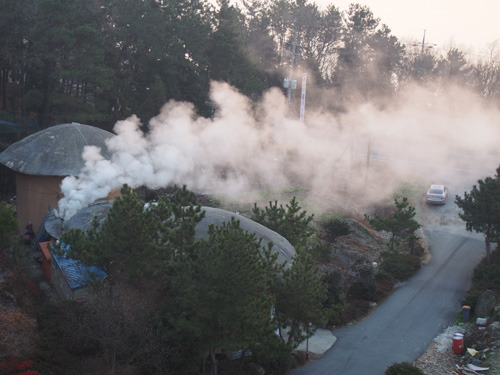

새해를 맞으며

2016년 12월 31일 득량만에서의 해넘이

2017년 1월 1일 득량만에서의 해맞이

                                                  2017년 1월 1일 득량만에서 만난, 추억의 아침 연기

1990년대 초쯤일까요. 복거일의 소설 <<역사 속의 나그네>>를 읽고 나서, 한동안 타임머신을 저 자신의 화두(話頭)로 틀어쥐고 지낸 적이 있습니다. 불혹에 접어들면서 시간의 위력을 깨닫게 되었고, 시간의 손아귀로부터 벗어나려는 욕망이 제 내면을 야금야금 먹어 들어오기 시작한 시점이었지요. 그로부터 참 오랜 세월이 흐른 지금에서야 그 욕망이 망상(妄想)의 근원이었음을 깨닫게 되었습니다. 역사 속의 모든 호걸들도 그저 ‘(역사를) 앞사람으로부터 받아서 뒷사람에게 이어주는’ 고리에 불과하다는 진리. 바로 그 진리란 특별한 공부 아닌 나이가 알려주는 자연법칙이라는 점을 절감하게 된 것이지요. 비로소 철이 들었다고나 할까요?

'작비금시(昨非今是)'! 요즘 연말연시만 되면 누구나 한 번씩 인용하곤 하는 <귀거래사(歸去來辭)>의 명구이지요. 고백하건대, ‘길을 잃고 헤맸으나 아직 멀어지진 않았으니/지금이 옳고 지난날이 잘못이었음을 깨닫게 되었다(實迷塗其未遠 覺今是而昨非)’는 도연명의 깨달음에 힘입어, 나와 조상의 지난날들을 찾아 헤매다가 많은 시간들을 잃어버리고 말았습니다. 옛날의 어떤 점들이 잘못 되었고, 지금은 어떤 점이 옳거나 나아졌는지, 참으로 궁금하지만 시간은 아무것도 해명해 주지 않았습니다. 그러다가 그저 주어지는 모든 것들을 감수(甘受)하는 것이 현명하다는 손쉬운 타성에 푹 젖어들고 말았습니다.

작년에는 참 일들이 많았습니다. 그 중에서도 어머니의 소천을 통해 죽음의 의미와 가족관계의 허망함을 깨달았고, 가까운 사람들의 아픔을 통해 치열한 삶과 성취보다 건강이 우선한다는 사실을 깨달았습니다. ‘사람이 만일 온 천하를 얻고도 제 목숨을 잃으면 무엇이 유익하리오?’라는 예수의 말씀(마태복음 16장 26절)을 다시 한 번 확인한 셈입니다.

가치와 중요성은 객관성을 바탕으로 하는 개념들일까요? 아니면 지극히 주관적인 개념들일까요? 가치가 있어서 중요한 것일까요? 아니면 중요하기 때문에 가치가 있는 것일까요? 참 풀기 어려운 문제입니다. 모두에게 가치 있는, 아니 모두가 가치 있다고 생각하는 일들을 소중히 여기며 살아가는 일이 그리 쉽지는 않은 것 같습니다. 서로 물고 뜯으며 적개심의 소용돌이에 휩쓸려 지내온 지난해를 생각합니다. 그리고 그런 미움이 더욱더 크게 증폭될 올해를 걱정합니다. 이제 좀 편안한 마음으로 지내고 싶은데, 다시 어느 편에 서서 불편한 마음으로 누군가(들)를 미워하게 될 것이 뻔한 2017년이 두렵습니다.

반복하건대, 손에 잡히지 않는 타임머신을 타고서라도 과거로 돌아가서, 그 당시 정의와 최선을 행했다고 자부하는 호걸들을 만나고 싶었습니다. 왜 우리는 새해만 되면 지난 시간대의 자신을 후회스런 눈빛으로 바라봐야 하는지, 그들의 말을 듣고 판단할 수 있을 거라 생각했기 때문입니다. 올 한 해, 저는 그저 크게 후회하지 않을 만큼만 살아가렵니다. 좀 더 따스한 눈빛으로 주변 사람들의 아픔을 다독일 수 있었으면 더욱 좋겠습니다. 하지도 못할 일들을 하겠노라 떠벌이게 될 정치인들을 미움 아닌 연민으로 바라볼 여유와 폭을 갖도록 노력하겠습니다. 올해 여러분들에게 신의 가호와 축복이 함께 하시길 빕니다.

새해 벽두에

백규 드림

공유하기

게시글 관리

**백규서옥\_Blog ver.**

[저작자표시 비영리 변경금지
(새창열림)](https://creativecommons.org/licenses/by-nc-nd/4.0/deed.ko)