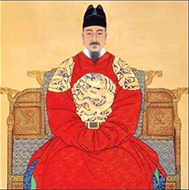
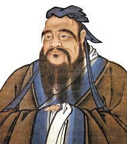

나이타령

-정치인들에게-

  
세종대왕

 

 

세종 18년(1436) 3월 26일의 일이다. 당시 판중추원사를 지내던 허조(許稠)가 벼슬에서 물러나고자 했다.

 

중추원은 왕명의 출납(出納)이나 병기(兵器)ㆍ군정(軍政)ㆍ숙위(宿衛) 등 임금 주변에서 군무나 경비를 담당하던 핵심 부서였고, 판중추원사는 정2품의 고위직이었다. 조선조 18개 품계 가운데 정1품, 종1품 다음의 세 번째로 높은, 오늘날로 치면 장ㆍ차관이나 도지사급에 해당하는 직급이었으니, 권세 또한 막강했을 것이다.(그는 좌보궐로 조선조의 벼슬을 시작하여 좌의정 영춘추관사에 이르기까지 문ㆍ무의 요직들을 두루 역임했다.)

 

고려 우왕 때 과거에 급제하여 벼슬길에 오른 그는 조선조에 들어와 국방은 물론 조선조 예악정치(禮樂政治)의 발판을 마련한 인물이었다. 태종 때는 명나라 사행 길에 서장관으로도 참여하여 국제적인 안목까지 갖추게 되었으니, 핵심 요직에서 조선왕조의 토대를 굳건히 하고 중세적 질서를 확립하는데 결정적으로 기여한 인물이었다. 조선조 건국과 함께 나라의 기틀을 마련하는 데 기여해 오다가, 연부역강(年富力强)한 ‘마흔아홉’에 세종의 치세를 맞이한 그의 기세는 대단했을 것이다.

 

그러던 그가 세종 조에 들어와 20년 가까이 활약한 뒤 67세에 이르자 왕에게 치사(致仕)를 요청한 것이다. 그 시대로 보면 고령이었고, 세종은 39세의 팔팔한 청춘이었다. 그가 요청한 사직의 이유는 다음과 같았다.

 

1. 종척(宗戚)도 아니고, 훈벌(勳閥)도 아니며, 공의(公議) 또한 호의적이지 않다.

2. 평소의 질병으로 근력은 쇠약하고 피곤하여 걷기가 힘들 뿐 아니라, 정신이 없어져서 앞뒤를 기억하지 못한다.

육체적ㆍ정신적 노화현상을 밝힌 2는 지극히 평범하여 누구나 수긍할 만 하다. 그러나 임금의 친척도 아니고 공신의 후예도 아니라는 점과 함께 ‘공의가 호의적이지 않다’는 1의 이유는 요즘에 비추어 보아도 참으로 의미심장하다. 임금은 다음과 같은 내용으로 그가 밝힌 사의를 반려한다.

 

1. 나이는 높으나, 눈과 귀는 밝고 자세하며 근력은 아직 편안하고 튼튼하다.

2. 만년(晩年)을 온전하게 하여 공명(功名)을 보전하고자 하는 점은 이해할 수 있다.

3. 그러나 좋은 계책을 내고 큰일을 결정할 때 임금인 내가 누구를 의지할 것인가?

4. 몸을 보전하고자 하는 것과 나라의 임무를 맡는 것 중 무엇이 더 중한가?

5. 그래서 사직을 윤허할 수 없다.

 

그로부터 3년 후인 70에 사망한 것을 보면, 실제로 그는 그 때쯤 심각한 건강상의 문제를 겪고 있었으리라. 그런데 허조가 사직의 결정적 이유로 제시한 1은 무엇이었을까. 원문(“猶竊殊寵, 私自未安, 公議何如?”)을 ‘(임금의)특별한 사랑을 독차지함이 스스로 편안치 않은데, 사람들의 뒷말은 어떻겠습니까?’로 풀어도 좋으리라. 말하자면 나이를 먹어서까지 임금의 총애를 독점하는 그에 대한 ‘뒷담화’들이 많았던 모양이고, 사실 그로서는 육체적인 질병보다 그것들이 더 괴로웠을 것이다. 그리하여 67세에 사직소를 올린 것이다. 그러나 세종은 학문이나 경륜의 면에서 누구보다 뛰어난 그를 물러나게 할 수 없었다. 39세의 왕이 보기에 67세의 원훈대신(元勳大臣)은 나라의 믿을만한 기둥이었으리라. 패기 하나 믿고 경륜의 노년을 업신여기는 젊은 친구들이 미덥지 않았을 것이다. 그래서 왕은 극구 떠나가려는 허조를 붙들어 앉힌 것이나 아닐까.

 

\*\*\*

이와 관련, 요즘 벌어지는 ‘선출직 65세 정년론(停年論)’은 매우 흥미로우면서도 개운치 않다. 그 문제를 제기한 표창원 의원은 현재 51세이니, 14~5년 후인 그의 65세에도 그런 주장을 할 수 있을지 알 수는 없으나, ‘친문’으로 분류되고 있는 그가 반기문 전 유엔총장을 견제하고 문재인 전 의원을 돕기 위해 이런 논의를 제기했다고 보는 항간의 풍문도 있다. 그러나 정작 그가 도우려는 문재인 전 의원이 올해로 64세임을 감안하면, 그런 항간의 의혹이 정확한 것 같지는 않다.

 

사실 그가 언급한 65세가 은퇴하기에 적절한 나이임에는 나도 전적으로 공감한다. 표 의원의 전직이 대학교수임을 감안하면, 아마도 대학교원들의 정년을 쉽게 떠올렸을 것이다. 나 역시 65세가 되면 미련 없이 강호로 들어가 ‘조월경운(釣月耕雲)’하며 남은 삶을 엮어가려 한다.

 

그런데, 지금이 어느 때인가. 이른바 ‘100세 시대’다. 가끔 동네 사우나에서 70대 어른을 한 분 만난다. 구릿빛 몸매와 울퉁불퉁한 근육을 자랑하며 나보고 ‘근육운동’을 권하시는 분이다. 근육질의 70대와 선병질(腺病質)의 20대가 공존하며 경쟁하는 것이 오늘날의 특징이다. ‘가스통’으로 불리는 부정적 노인들도 있지만, 지혜와 경륜을 갖춘 어른들도 적지 않다. 단순히 육체 나이를 들이대며 은퇴를 강요하는 것은 구시대의 사고방식이다. 바람직한 희망과 목표를 갖고 노력하는 경우에만, 젊음은 사람들에게 믿음을 준다. 아무런 공부나 대책도 없이 성질 부룩거리고, 막말이나 해대는 것을 젊음의 특권이라 여긴다면, 그건 나라와 민족에게 재앙이다. 그런 젊음에게 어떻게 나라를 맡길 수 있단 말인가.

 

최근 저잣거리에 나와서 표를 구걸하는 인물들을 하나하나 뜯어보라. 괜찮아 보이는 인물들은 잘 알려지지 않아 당선의 가능성이 없고, 제법 지지율이 높은 인물들은 대부분 경륜이나 식견이 매우 모자라 믿음을 주지 않으며, 심지어 인간성이 ‘개차반으로 보이는’ 경우까지 있어 걱정이다. 거기에다 나이의 잣대를 들이대어 그나마 잘라 버린다면, 도대체 ‘경륜 있는 지도자’를 어디서 구한단 말인가.

  
공자

 

공자는 “後生可畏, 焉知來者之不如今也? 四十五十而無聞焉”이라 했다. "후생이 두렵나니 어떻게 미래의 그들이 오늘날의 우리만 못할 줄로 알겠는가? 사오십 세가 되어도 명성이 없다면 이 역시 두려워할 게 못 된다."고 번역되는 이 말에는 크게 두 가지의 뜻이 들어 있다. ‘나이 먹었다고 젊은이들을 무시하지 말라’는 것이 그 하나요, ‘40, 50이 되어 제대로 된 명성을 얻지 못하면 그 젊음도 별 볼 일 없다’는 것이 그 둘일 것이다.

 

첫 번째는 당연함에서 재론의 여지가 없으나, 두 번째는 요즈음의 현상과 매우 깊은 관련을 갖는다. 40이나 50이 되어, 아니 그 이전에라도 ‘뜨는’ 인사들은 부지기수다. 그런데, ‘무엇으로’ 뜨느냐가 문제다. 막말로 젊은이들의 감성을 자극하여(그들을 속여서) 뜨는 것도 공자의 이른바 ‘명성[聞]’이라 할 수 있는가. 교묘한 심리적 사술(邪術), 이른바 ‘포퓰리즘’으로 유권자들을 속여서 뜨는 것도 그 명성의 범주에 속하는가. 자기편에 선 사람들을 조종하여 상대편에 대한 증오의 감정을 갖도록 함으로써 뜨는 것도 그 명성의 범주에 속하는가. 공자가 말씀하는 문(聞)이란 ‘군자로서의 소문’이고, 군자란 도와 덕에 바탕한 ‘훌륭한 인간상’이라면, 무엇으로 떠야 하는지는 불문가지(不問可知)라 할 수 있을 것이다.  

 

‘몇 살 넘은 자들은 물러서라’고 목소리를 높이며, 이제 ‘50대가 깃발을 들어야 한다’고 주장하는 발언들은  대부분 육체나 물질의 허상에 잡혀 있는 자들의 텅빈 구호일 뿐이다. 세상을 경영할만한 덕과 방책을 갖추고 있기만 하다면, 지금 그들이 몰아내고자 하는 연령대의 인물들을 지도자로 뽑는 데 무슨 문제가 있으며, 20대나 30대인들 무슨 문제란 말인가. 설마 표 의원이 자신의 나이를 염두에 두고, 그런 말을 한 것은 아니리라. 그러나 때가 때인지라, 그런 말 자체가 예사로이 들리지 않는 것은 오늘날 지식사회의 의식이 지나치게 표피적이고 사려 깊지 못한 데서 오는 불안감 때문이다.

 

이른바 정치인들이여, 쓸데없는 말로 가뜩이나 경조부박(輕佻浮薄)한 이 사회를 흔들지 마라! 한 마디 말이라도 아끼고 좋은 일들을 더 많이 실천함으로써, 방황하는 젊음들을 제대로 이끄는 ‘삶의 푯대’가 되어 달라! ‘나이 타령’같은 요설(妖說) 말고, 제대로 된 담론(談論)으로 우리 사회의 품위를 한 단계 높여달라!

공유하기

게시글 관리

**백규서옥\_Blog ver.**

[저작자표시 비영리 변경금지
(새창열림)](https://creativecommons.org/licenses/by-nc-nd/4.0/deed.ko)