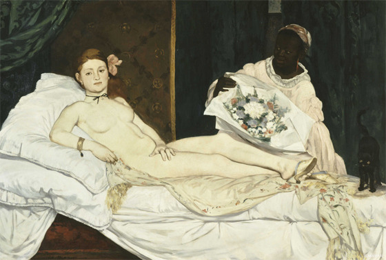

정치와 예술의 금도(襟度)

-표창원 의원께-

 

xml:namespace prefix = o /  
                          에두아르 마네-올랭피아- 1863년

 

의정활동에 얼마나 노고가 많으신지요?

국회의원이 되시기 전, 경찰대 교수이자 프로파일러로서 늘 주요 사건이 터질 때마다 큰 방송들의 뉴스에 단골로 등장하시어 조언을 하시던 의원님의 모습이 뇌리에 남아 있습니다. 당시 저는 그런 사건들을 접하면서, 늘 ‘저렇게 탁월한 전문가들 10명만 있다면 우리나라가 많이 좋아질 수도 있을 텐데!’ 라는 비원(悲願)아닌 비원을 갖기도 했었습니다. ‘조만간 좀 더 큰일을 하는 직책으로 발탁될 수도 있겠구나!’라고 짐작하던 차, 아니나 다를까 문재인 당시 더불어민주당 대표가 발 빠르게 나서서 의원님을 영입했지요. 제 취향이 아닌 정당으로 영입되어 가시는 모습을 보며 일말의 서운함은 있었지만, ‘우리나라 정당 특히 야당의 격이 약간은 높아질 수도 있겠구나!’라는 기대를 갖게 된 것이 사실입니다.

 

아시다시피 현직 대통령이 탄핵을 당해 수족이 모두 잘린 지금은 참 묘한 시점입니다. 판을 한 번 들여다볼까요? 집권당으로서는 살아있는 것 자체가 죄라 할 만큼 절망과 수치 속에 숨죽이고 있는 반면, ‘다음 대통령은 따 놓은 당상’이라는 확실한 승리의 아지랑이에 휩싸여 있는 쪽이 더불어민주당이지요. 여당이나 대통령의 입장에서야 입이 천 개라 한들 무슨 변명을 할 수 있을까요? 기라성 같은 율사들을 쓰러져 있는 대통령 앞에 대항마로 포진시켜 놓았지만, 무슨 수로 사방에서 쏟아지는 화살들을 막아내어 국면을 반전시킬 수 있을까요?

 

‘사면초가(四面楚歌)’라는 고사성어를 아시지요? 천하장사인 초나라의 항우(項羽)와 필부출신의 한나라 유방(劉邦)이 쟁패하던 상황이었지요. 항우에게 다가오는 운명의 날. 날랜 장수 범증(范增)마저 떠나고 동쪽으로 밀려가던 중 해하(垓下)에서 한나라 명장 한신(韓信)에게 포위되었지요. 그러던 어느 날 밤, 사방에서 들려오는 구슬픈 초나라 노래. 한신이 항복한 초나라 병사들로 하여금 고향의 노래를 부르게 한 것이지요. 그 상황에 절망한 항우는 결국 오강(烏江)으로 뛰어들어 자결하고 말았다는 옛 이야기 말입니다. 국민들의 분노를 등에 업은 야당의 공격에 지리멸렬해 있는 여당이 바로 운명의 날을 향해 가는 항우 군의 모습이라 할까요?

 

상승과 하강이 이처럼 극명하게 대조되는 상황을 우리 현대 정치사에서 찾아볼 수 있을까요? 물론 상승하다가 어느 시점부터 하강의 국면으로 접어들기도 하고, 그 반대로 하강하다가 상승하게 되는 것은 세상의 다반사(茶飯事)라 할 수 있겠지요. 그러나 극적인 사변(事變)이나 외적인 충격이 있지 않고서야 바야흐로 방향을 잡은 국면이나 추세가 시간을 앞당겨 바뀌긴 어렵지요. 음양(陰陽)이 교차하는 것은 세상사의 이법이고, 제 아무리 날고 기는 영웅호걸이라 해도 그런 음양의 추세를 갑자기 뒤집기는 불가능한 게 우주의 이법이기도 하지요.

 

그런 점에서 본다면, 문재인 전 대표를 비롯한 야당의 잠룡군(潛龍群)에서 차기 대통령이 나오는 것은 불문가지(不問可知)일 겁니다. 말하자면, 야당 특히 더불어민주당은 지금 희색(喜色)을 억누르며 표정관리하기 어렵고, 혹시나 이 흐름이 바뀔세라 시간의 더딤을 한탄하고 있을 겁니다. 할 수만 있다면 저도 그간 절치부심(切齒腐心)하며 때를 기다려온 야당에게 기회가 주어지는 것이 역사의 순리라 생각하고 있습니다.  

 

그런데, 이게 무슨 날벼락 같은 일인지요? 이런 ‘꽃놀이 판’에서 자중자애(自重自愛)해야 한다는 것은 요즘 똘똘한 초등생들도 아는 행동수칙 아닌가요? 이제 열매를 손에 쥐었다고 방심한 것일까요? 열매를 딴 뒤에 벌어질 논공행상을 대비한 것일까요? ‘대통령 탄핵 청문회에서 공을 세우지 못했으니, 이런 공이라도 세워야 하는 것 아닌가?’라는 조급한 영웅심이 발휘된 것일까요?

 

‘국회 건물 안에서 펼친 대통령 나체화 전시회’라는 전대미문의 사건을 접하며 참으로 기가 막히고 부끄러워 이틀 연속 혀만 차고 있는 중입니다. 저는 평생 문학을 공부하며 예술 쪽도 곁눈질을 해왔습니다만, 그걸 만들어놓고 ‘예술의 자유, 창작의 자유’ 운운하시는 모습을 보며, ‘소가 웃다가 코뚜레 부러지는 일’이 바로 여기서 재현되고 있음을 알게 되었습니다. 항상 예술이 대중의 미학을 선도한다고는 하나, 저같이 우매한 민중에게 그것도 예술임을 강변하려 한다면, 솔직히 번지수를 잘못 잡아도 한참 잘못 잡은 것이지요. 무엇보다 그걸 국회로 끌고 와서 난장을 벌인 장본인이 좋아하던 표 의원님이었다니!

 

우리 현대사의 고비를 목격하고 느끼며 나이를 먹어 온 베이비부머 세대의 일원으로서, 저는 지금 벌어지고 있는 ‘어처구니없는 상황’을 어떻게 이해하고 해석해야 하는가에 대하여 심한 내면의 혼란을 경험하고 있는 중입니다. ‘정치 풍자와 예술을 가장한 폭력행위’까지 국회의사당에서 스스럼없이 자행되는 모습을 목격하면서, 이제까지 제가 공부해온 미학의 상식과 바탕이 송두리째 부정되는 현장을 두 눈으로 똑똑히 확인하고 있는 중입니다.

 

풍자나 은유가 필요하거나 힘을 발휘하는 것은 ‘정치권력의 폭압으로 민중이 할 말을 하지 못할 때’ 뿐입니다. 입 달린 사람이면 누구나 대통령을 욕하는 지금, ‘풍자예술’을 통해 달리 무슨 말을 더 할 수 있다는 건지요?

 

사실 예술에 대한 해석이나 미학에 대한 논의도 보편적 상식을 바탕으로 해야 하는 것이지요. 현 대통령의 얼굴과 150여년 전 마네의 작품을 합성하여 만든 작품 아닌 작품으로 무언가를 말하려 했다면, 그 자체가 ‘풍자예술’의 범주에 들어갈 수 없을 뿐 아니라, 단순한 분풀이 이상의 의미도 없는 일입니다.

 

의원님의 판단착오로 가능했던 그런 행사가 정치적으로 누구에게 손해이고 누구에게 이득인지 따지고 싶지 않습니다. 다만, 우리 시대 정치인들의 의식수준이 매우 저급하고, 행동거지 또한 너무 경망하다는 점을 확인하게 된 점이 개탄스러울 뿐입니다. 정치인이기에 앞서 멋진 지식인이자 유능한 전문가로 알아 왔던 의원님이 그 동네에 들어간 이후 그렇게 ‘표변’했는지, 참으로 안타까울 뿐입니다. 의원님을 거울로 삼아 언행에 신중을 기해야겠다고 우리 스스로 다짐할 수만 있다면, 이번의 사건이 그리 나쁜 일만은 아니었다는 점은 그나마 다행이라고 생각합니다. 혹시 중언부언(重言復言)한 제 말씀이 부디 의원님께 불쾌감을 드리지 않았으면 좋겠습니다. 끝까지 읽어 주셔서 고맙습니다.

공유하기

게시글 관리

**백규서옥\_Blog ver.**

[저작자표시 비영리 변경금지
(새창열림)](https://creativecommons.org/licenses/by-nc-nd/4.0/deed.ko)