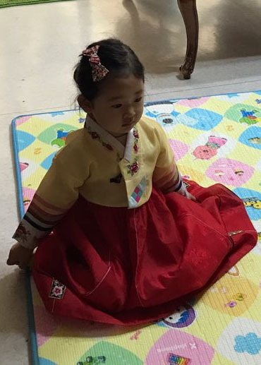

어수선한 새해를 맞으며

 

 

 

정유년이 밝았다.

닭의 해라지만, 첫날 새벽에도 상서로운 닭의 울음소리를 듣지는 못했다.

 

TV를 켜기가 무섭게 ‘보기 싫은 얼굴들’이 화면 가득 밀려온다.

이른바 ‘국정농단’의 세력이 밉지만, 권력을 좇는 부나비 군상(群像)도 밉상이긴 마찬가지다. 세상은 어떻게 돌아가도 국민들의 눈만 속이면 그만이라는 모양새들이다. 누구를 뽑아도 ‘그놈이 그놈’이라지만, 안 뽑을 수도 없으니 고민이다.

 

몇몇 부나비들의 현란한 춤에 민초들은 마음 둘 곳이 없고, 언론 매체들은 칠팔월 각다귀들처럼 날뛴다. 물 건너에서는 전대미문의 ‘듣보잡’이 등장하여 ‘조자룡 헌 칼 쓰듯’ 대권을 휘두를 태세이고, 휴전선 이북에서는 막 되먹은 애송이 하나가 위험한 칼춤을 추고 있으며, ‘깡패국가’ 중국과 ‘왜구 나라’ 일본은 역사의 수레바퀴를 되돌리려 길길이 날뛰고 있다. 이 판에 우리만 좁디좁은 한반도 남쪽에서 ‘굿판 아닌 굿판’을 벌이는 중이다. 굿판의 끝이 어떨지 뻔히 보이는데도 아랑곳하지 않고, 요란한 작두춤 속에 환호작약 시끄럽다.

 

젊은이들에겐 힘 쓸 만한 일자리가 없고, 일찌감치 일자리를 잃은 ‘젊은 노인들’은 한숨 속에 시간만 죽인다. 지식인을 자처하는 자들은 일신 편한 것만 도모하고, 돈 있는 자들은 긁어모으느라 여념이 없다. 젖도 안 떨어진 피붙이에게 금 수저 물려주기 바쁘고, 부와 권력 허세 속에 날 새는 줄 모른다.

 

사람을 키우지 못한 죄, 제대로 사람을 키우는 일이 무엇인지 알지 못한 죄, 좋은 싹들을 모조리 경쟁으로만 내 몰아 온 죄, 잘 하는 자와 훌륭한 자를 존경하지 않고 줄줄이 매장시켜 온 죄, 감당도 못할 자리에서 시위소찬(尸位素餐)만 즐겨온 죄, 코드 맞는 자들끼리 동아리를 만들어 권력과 이익을 독점해 온 죄, 오늘만 살고 내일은 생각하지 않으려는 이기적 탐욕죄...

 

돌아가는 형세가 어찌 올해라고 나아질 수 있을까.

누군가 ‘닭의 모가지를 비틀어도 새벽은 온다’고 했지만,

어제와 같은 오늘이라면, 그 오늘이 무슨 의미가 있으리?

그 오늘이 좀 더 나은 내일을 잉태하지 못한다면,

오늘로 이어진 어제의 그 아수라장을

무슨 수로 견뎌낼 것인가.

 

지금은 난국.

정유년은 어쩌면 그 난국의 시작일 수 있다.

임진왜란의 어리석음을 반복한 통절의 ‘정유재란’을 기억하는가.

부나비들에게 깨달음을 기대하는 건, 부질없는 일일까.

유황불이 몸을 태워 역한 냄새를 뿜어내면 모두가 괴롭다.

나라의 내일을 위해, 후손을 위해,

제 몸들을 스스로 파묻어, 모두를 살려야 할 때다.

공유하기

게시글 관리

**백규서옥\_Blog ver.**

[저작자표시 비영리 변경금지
(새창열림)](https://creativecommons.org/licenses/by-nc-nd/4.0/deed.ko)