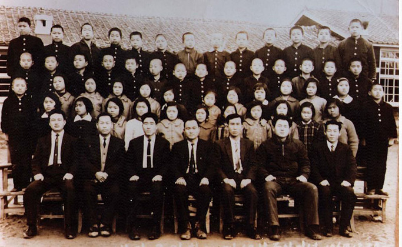
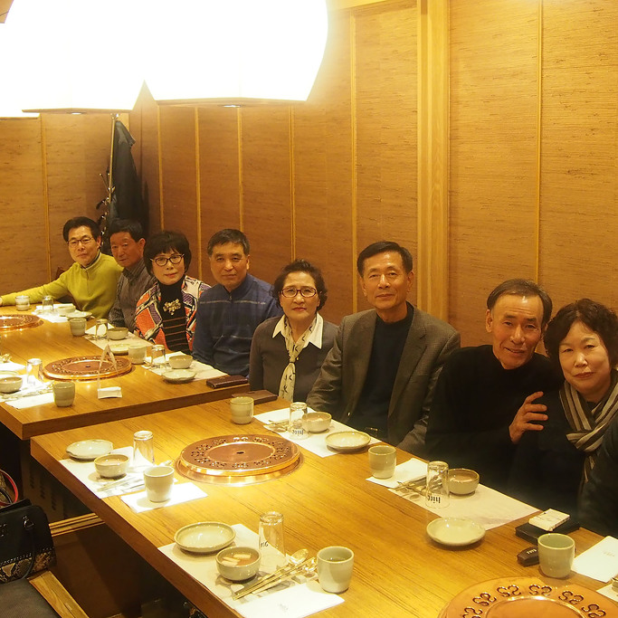
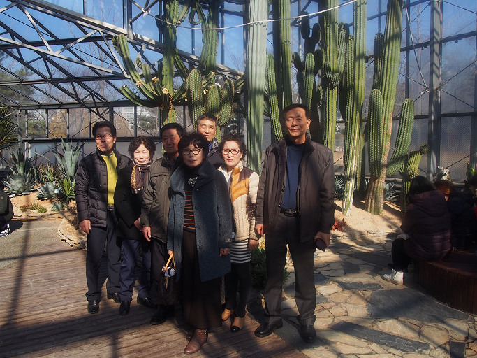

50년이 한 나절이라?

 

 

초등학교 동기 박병철(교안유아교육협회 회장)이

일산에서 ‘번개’를 때리고,^^ ‘당연 참석 1번’으로 나를 지목했다.

지면이나 SNS를 제외하곤 초등학교 졸업 후 한 번도 만나지 못한 그와 그들이었다.

막판에 지방 행사핑계를 대고 불참을 통보하니, 몹시 낙담하는 그였다.

그 후 며칠 동안 마음에 갈등이 일었다.

50년 세월의 격랑을 무난히 넘어, 나는 그들과 해후할 수 있을까?

 

지방에서의 이른 아침 출발은 무리였지만, 가기로 했다.

숨차게 달려가니 일산 중심가의 한식집에 몇몇 동무들이 모여 있었다.

아, 50년 전 그들의 해맑은 표정이었다!

얼굴 한 복판에 남아 있는 추억의 모습들.

이름을 부르니 대답이 돌아왔다.

그로부터 그 시절의 이야기들이 누에고치의 실처럼 술술 풀려나왔다.

영민한 그들의 기억력에 잠자던 내 기억의 창고가 드디어 빗장을 푼 것이다.

 

흘러간 50년이 겨우 한 나절이었다!

그간 나는 무얼 찾아 어디를 헤매고 있었을까.

삶의 파도를 넘으며 많이 지워지긴 했지만,

희미하게나마 어둡던 시절의 개구진 흔적들이 얼굴 한 복판엔 남아있었다.

돈을 많이 번 친구도, 자식들을 잘 둔 친구도,

사회적으로 성공한 친구도, 그저 매일매일 즐겁게 살아가는 친구도 있었다.

그런 지금의 얼굴들은 잠시 벗어둔 채

마주 보고 착하게 웃으니 좋았다.

서로 확인하는 것이 ‘초심(初心)’이고 동심이었다.

 

세월이 험악하여

‘만인 대 만인의 투쟁’이 벌어지고 있는 지금.

따지고 드는 ‘옳고 그름의 논쟁’ 속에

배려와 사랑이 사라져 버린 시절 아닌가.

그러나,

해맑았던 어린 시절의 추억이

누구에겐들 없으랴.

헐벗음과 굶주림의 트라우마에서 자유롭지 못한

베이비부머 세대의 중심에 서 있는 우리다.

남들이야 알아주든 말든

그런 시절에도 웃음을 잃지 않던 우리였기에

지금 이 순간의 행복도 누릴 수 있는 것 아닐까.

 

집으로 돌아가는 그들의 등짝에

서해의 낙조가 따스하게 비쳐

행복해 보였다.

그들은 오늘 가졌던 만남의 추억을

삶의 에너지로 바꾸어 자신들의 내면에 가득 충전했으리라.

그 에너지가 소모되고 나면

누군가가 나서서 또 한 번의 ‘번개’를 때리겠지.

번개를 때리고 맞으며

이 모진 세태를 견뎌내는 지혜를 키우리라.

그 지혜가 모여

살벌하고 위험하며 앞이 보이지 않는 나라의 어려움도 다독여 나갈 것이다.

동무들 만세!!!

  
그 시절의 내가 대체 어디에 서 있단 말인가.ㅠㅠ

  
취하기 전에 한 컷!

  
주명문-김영도-박병철, 그리고 싱싱한 선인장들

  
주명문-김희순-김영일-조정임-김영도-조순옥-박병철, 선인장같은 그대들!

공유하기

게시글 관리

**백규서옥\_Blog ver.**

[저작자표시 비영리 변경금지
(새창열림)](https://creativecommons.org/licenses/by-nc-nd/4.0/deed.ko)