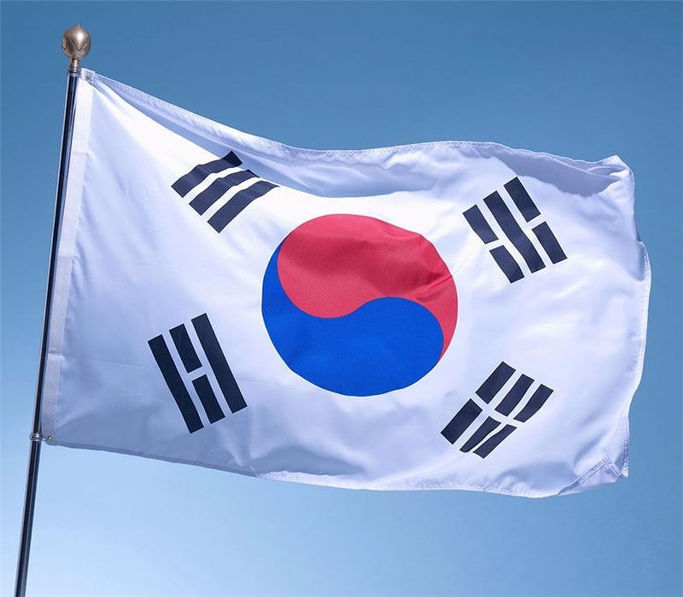
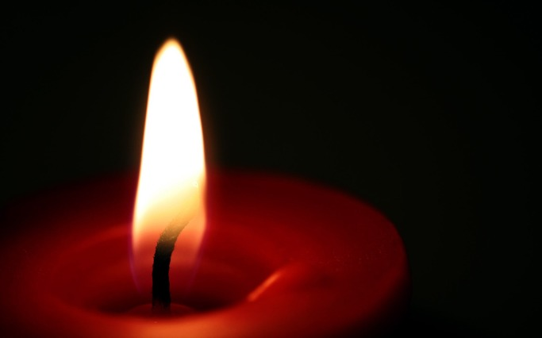

이제 태극기와 촛불을 내려놓을 때다!

 

 

오늘, 3•1절이다.

 

식민제국주의의 대표적인 ‘깡패국가’ 일본으로부터 벗어나고자 온 민족이 들고 일어난 날 아닌가. 바로 오늘, 국민 전체가 촛불 부대와 태극기 부대로 나뉘어 ‘광장의 결투’를 벌인단다.

 

좌•우로 갈려 피 터지게 싸우던 70여 년 전 우리의 모습을 재현하려는 모양이다. 이른바 ‘대권주자들’이 대열의 앞장에서 선동하는 모습이 그야말로 가관이다. 사람들의 마음을 다독이는 대신 선동의 칼을 휘둘러 표를 얻어 보려는 저들의 무책임이 가증스럽다. 저런 사람들이 국민과 국가를 대표하겠다니, 이 민족의 불행을 어떻게 말로 표현할까.

 

존경하는 역사철학자 카(E.H.Carr)는 그의 명저 <<역사란 무엇인가?>>에서 “역사란 과거와 현재의 끊임없는 대화”라고 말했다. 왜 우리는 역사로부터 교훈을 얻지 못하는가. 바로 과거를 잊어버리거나, 아예 떠올리려 하지 않기 때문이다. 과거의 사실들과 대화하려 하지 않기 때문이다. 불과 70년 전의 일인데, 우리는 우리의 ‘지나간 우행(愚行)’에 대하여 모르쇠로 일관한다. 그러니, 똑 같은 어리석음을 되풀이하면서도 부끄러워하지 않는다.

 

이제, 이쯤 멈추어야 한다. 촛불은 끄고, 태극기는 고이 접어 잠시 상자에 모셔 두어야 한다. 헌법재판소의 판결을 기다리며, 우리 모두 성찰의 시간을 갖기로 하자!

 

시작이야 어떠했건, 지금 이 순간은 촛불과 태극기 모두 독선과 아집의 표상일 뿐이다. 독선과 아집은 시간 앞에 무력하다. 잠시 내면을 관조하고 나면 언제 그랬었냐 싶게 독선과 아집은 해 뜬 후의 이슬처럼 사라질 것이다. 시간 앞에 영속되는 건 없다. 잠시 숨을 고르고 서로에 대한 증오를 삭여보자.

 

제발, 이제 치고 받는 싸움일랑 그치고 심판의 깃발에 따르기로 하자!!!

공유하기

게시글 관리

**백규서옥\_Blog ver.**

[저작자표시 비영리 변경금지
(새창열림)](https://creativecommons.org/licenses/by-nc-nd/4.0/deed.ko)