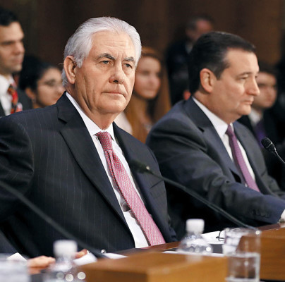

어리석은 대한민국 외교부

강대국들 사이에 끼여 굴욕을 당해 온 역사가 참으로 길다.

21세기 초반에 들어와서도 상황이 호전되기는커녕 악화 일로를 걷고 있다.

이른바 ‘정치를 한다’는 자들의 ‘전략 없음, 소신 없음, 센스 없음’ 때문이다.

대통령이란 자가 ‘뻘짓’을 하다가 쫓겨나 국가를 누란(累卵)의 위기에 몰아넣은 지 몇 달.

그 공백을 장관과 관료들이라도 메워가며 급한 불은 꺼야 할 것 아닌가.

최근 미국의 국무장관이 다녀갔다.

한탄스러운 일이지만, 미국과 중국만큼 우리 생사문제의 키를 쥐고 있는 강대국이 있는가.

그리고 미 국무부 만큼 우리 이해관계의 키를 쥐고 있는 부서가 있는가.

그 장관이 와서 우리의 정부 요인들과 첫 대면을 했는데, 공식적인 회담만 하고 만찬을 하지 않았다는 보도가 있었다. 더욱 가관인 것은 우리나라에서는 ‘미국의 장관이 거절했다’하고, 그 쪽에서는 ‘한국에서 제의조차 없었다’고 밝힌 점이다. 둘 다 맞기도 하고, 둘 다 틀리기도 할 것이다. 아마 우리 쪽에서는 슬쩍 지나가는 말로 “저녁 한 번 하실래요?”라는 제의 겸 인사치레의 말을 건넸을 것이고, 그것을 ‘만찬 제의’라고 생각했을 것이다. 그러나 미국 쪽에서는 그것을 공식 의전절차 아닌 가벼운 인사치레 정도로 여겼을 것이다.

참으로 우려스런 일이 이어서 벌어졌다. 엊그제 미 국무장관은 ‘일본은 가장 중요한 동맹국이고, 한국은 중요한 파트너’라고 말했다 한다. 미국과 유럽인들이 일본을 중시하고 좋아한다는 것은 오래 전부터 나 같은 민초도 느껴서 알고 있는 일이다. 그러나 공식적인 자리에서 그들 장관의 입으로 이런 말을 내뱉게 해야 하는가? 그들 마음속으로야 무슨 생각을 하든 나로서는 알 수도 없고, 알고 싶지도 않다. 그러나 그런 내심이 공식적인 멘트로 나온 원인은 아무리 생각해도 이해할 수 없다. 보라, 지금 벌어지고 있는 '북한의 핵 장난’이 우리로서는 초미(焦眉)의 급한 불 아닌가.

‘일본에서 잘 대접 받았으나, 한국에서는 제의조차 없었다’는 그 저녁 한 끼 때문에, 틸러슨 장관의 그 말이 나왔으리라 믿고 싶진 않다. 그러나 세상사 작으면 작은 대로, 크면 큰 대로 모든 일은 사람의 기분에서 출발한다는 것이 그동안의 내 경험이다. 저녁 한 끼 대접하는 것이 무에 그리 어렵더란 말이냐? 상대방이 예의상 사양한다 하여 ‘그럼, 잘 됐네. 돈 굳었네!’라고 쾌재를 부르며 물러섰더란 말이냐? 운동장만큼 큰 회담 테이블에서 핑퐁처럼 주고받는 말들은 그야말로 ‘외교적 언사들’일 뿐이다. ‘진짜 협상은 밥상머리에서 이루어진다’는 상식 만 외교부 당국자들이 알고 있었어도 이런 바보 같은 짓은 저지르지 않았으리라. 그들은 대통령이 없다고 자신들의 일을 그렇게 대충대충 해치운 것일까.

외교부 당국자들이여! 1950년 1월 10일 미 국무 장관 애치슨이 무슨 짓을 했는지 알고나 있는가. 미국의 태평양 방위선이 ‘알래스카-일본-오키나와-필리핀 선’임을 대외적으로 천명해버린 것이다. 이른바 ‘애치슨 라인’. 북한이 오판하여 6•25를 일으킨 결정적 계기였다. 한국이 미국의 태평양 방위권에서 제외되었으니, 안심하고 침공한 것이다.

그 애치슨과 지금의 틸러슨이 무슨 차이가 있는가. 똑 같은 미국 국무장관이고 똑 같이 일본을 좋아하되, 한국에 대해서는 ‘있으면 좋고, 없어도 그만’의 입장을 가진 사람들이다. 그저 ‘밥 한 그릇 함께 먹는 것’이 세계사를 논하는데 무슨 문제가 있느냐고 반문하려는가? 지금의 한국이 ‘가장 중요한 동맹’ 아닌 ‘중요한 파트너’란 말을 잘 해석해 보라. 만약 그들이 선택의 기로에 선다면, ‘버릴 수 있는 대상’으로 추락할 수도 있다는 속뜻이 숨어 있음을 모른다면, 외교부 당국자들은 당장 옷을 벗어야 한다. 그러면서도 찔리는 바는 있었는지, 외교부에서는 “의미 부여할 내용 아냐”라고 확대해석을 경계했다 한다. 가관이다.

 

큰 불은 작은 불씨에서 시작되고, 제방의 붕괴는 실낱같은 누수에서 시작되는 법이다. 미국 새 행정부의 국무장관이 중요한 사명을 갖고 동북아를 순방하는데, 우리 국익을 지키기 위한 밥상머리 협상조차 성사시키지 못한 외교부 장관은 당장 물러나야 한다. 그러지 않아도 쫓겨난 대통령의 가장 큰 오점이 인사의 난맥이었는데, 외교부에서 그 실체를 확인하는 순간이다.

 

제발, 정신들 좀 바짝 차려 달라.

공유하기

게시글 관리

**백규서옥\_Blog ver.**

[저작자표시 비영리 변경금지
(새창열림)](https://creativecommons.org/licenses/by-nc-nd/4.0/deed.ko)