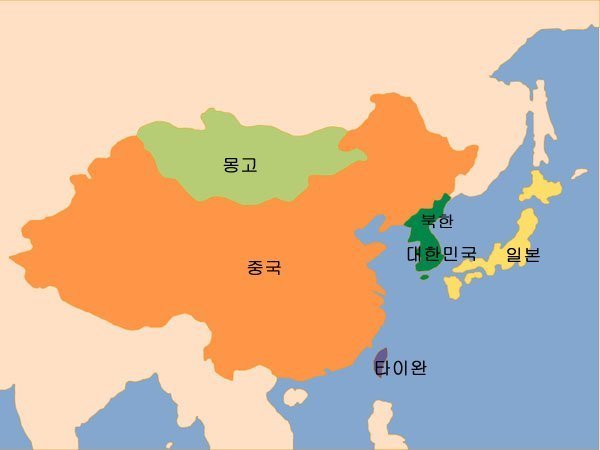

황교안 대통령 권한대행님께

 

 

탄핵 소추가 의결되면서부터 대통령의 권한을 대행하시느라 고생이 많으시리라 생각합니다. 정상적인 국정수행에 대해서도 비판과 비난이 난무하고, 일부 정치세력들의 무리한 딴죽걸기 또한 없지 않다는 점에서 쉽지 않은 나날이시겠지요. 그러나 비록 한시적인 ‘대행’이라 할지라도, 국가원수로서 하셔야 할 일은 해야 한다고 봅니다. 

 

어제 미국의 매티스 국방장관은 상원 세출위원회 국방소위 청문회에서 ‘중국이 주변 국가를 조공국가 대하듯이 한다’고 비판했습니다. 그 말을 듣는 순간 두 가지 상념이 떠올랐습니다. 미국의 집권세력이 비로소 ‘동북아의 정치•외교적 상황에 대한 역사적 이해’를 갖기 시작했다는 점, 상대적으로 역사와 현실의 상관관계에 무지하거나 무관심한 우리의 현주소를 내 스스로 아프게 파악했다는 점 등입니다.  

 

우리는 왜 중국의 ‘시대착오적 패권주의의 악행(惡行)’을 두 눈 멀뚱멀뚱 뜨고 바라보기만 해야 할까요? ‘패권국가’란 쉽게 말하여 ‘깡패국가’란 뜻일텐데요. 한낮의 대로 위에서 깡패에게 얻어맞으며 똑 같이 깡패처럼 대응할 필요는 없다 해도, 논리 정연한 꾸지람 한 번 건네지 못하는 현실이 통분하여 일개 민초인 저로서는 편안히 잠을 이룰 수가 없습니다.  

중국의 시진핑 주석은 세계를 향해서 입을 열 때마다 ‘화평(和平)’을 말하고, 미국의 보호무역을 비판해 오고 있습니다. 그러나 그것들은 모두 ‘거짓구호’에 불과하고, 실제로는 그 반대의 ‘뻘짓들’을 자행하고 있습니다. 흡사 범죄자들이 문서의 증거를 남기지 않기 위해 ‘귓속말’로 속닥거리듯, 자국의 모든 분야 일꾼들에게 ‘한국을 응징하라’는 구두지령을 내린 바 있고, 일당독재의 나라답게 그 명령을 받아 기계처럼 움직이는 중국 사람들입니다.  

 

‘공자와 맹자를 낳은 나라’라고 믿어오던 중국과 ‘전쟁 없이 살기 위해’ 굴욕에 가까운 저자세 외교로 중세 이래 근대까지 정체성을 근근히 유지해 온 우리민족입니다. 그로부터 무려 2세기 가까운 세월이 흐른 지금에도 그런 불평등의 관계를 떠올리게 되는 것은 오랜 역사의 관성(慣性) 때문일까요? 아니면 힘의 불균형을 바탕으로 한 ‘현실의 부조리’ 때문일까요? 지금 벌어지고 있는 중국의 패권주의적 행동(즉 ‘깡패 짓’)을 놓고 볼 때, 시진핑이 말한 ‘화평굴기(和平崛起)’란 '근대 이전 중화제국의 재건 혹은 회복’을 염원하는 몽상(夢想)이라 할 수 있을텐데 말입니다. 

이 부조리한 현실의 본질을 저 같이 하찮은 민초도 잘 알고 있는데, 하물며 국가원수이신 황 대행님께서야 오죽하시겠습니까? 그런데, 미국의 국방장관이 먼저 이런 문제를 아프게 지적하고 말았습니다. 그 지적을 시대와 역사에 둔감한 중국의 지도부가 어떻게 받아들일지 알 수는 없지만, 저는 한편으로 ‘사이다처럼’ 통쾌하면서도, 다른 한편으로는 몹시 부끄러웠습니다. 그 말은 먼저 우리 국가원수의 입에서 점잖으면서도 조리있게 표출되었어야 합니다. 혹시 그 언급이 음으로 양으로 매티스 장관과의 교감 하에 생긴 일인가요? 그렇다면 우리 입장에서는 의도치 않게 <<삼국지>>에서 왕윤이 ‘여포를 시켜 동탁을 죽인 것’ 같은, 일종의 ‘차도살인(借刀殺人)’의 효과를 보게 되는 것이고, 그렇다면 그것은 더더욱 떳떳치 못한 일입니다. 

 

자, 이쯤 해서 제 의견을 말씀드리겠습니다. 중국이 부끄러움을 모르는 얼굴로 ‘우리는 아무 짓도 하지 않았다’고 발뺌해도, 사태는 백일하에 드러났을 뿐 아니라 이미 되돌릴 수 없는 지경으로까지 나아갔습니다. 어쩌면 지금 양국 정부가 출구를 찾기 위한 물밑 교섭을 진행하고 있을지는 모르겠습니다만, 분노와 무력감에 빠져있는 국민들을 위하고 비정상적인 중국 지도층의 사고를 바로잡기 위해서라도 국가원수인 대행께서 즉시 나서셔야 합니다. 약간 늦은 감은 있지만, 지금이라도 중국의 지도부와 우리 국민들을 상대로 담화문이라도 발표하셔야 합니다. 매티스 장관이 말한 중국의 '패권국가적 태도'는 대행께서 지적하셔야 할 내용의 핵심입니다. '우리가 이젠 당신들의 조공국이 아니라는 것, 이제부터는 화평과 선린우호의 태도로 살아가야 한다는 것, 조속히 정상국가로 돌아오길 기다린다는 것' 등을 조용하지만 엄숙한 어조로 중국에 요구해야 할 것입니다. 그리고 중국의 비이성적 태도로 상처를 입은 우리 국민들에게는 '순리로 그들을 설득하는 동안 국가의 힘을 동원하여 민생을 안정시킬 것이니, 잠시 정부를 믿고 인내해 달라'는 당부를 건네는 것이 옳습니다. 대외적인 식견이나 국제적인 감각을 갖춘 대선 후보가 한 사람도 보이지 않는 현실이 무엇보다 답답한 요즈음입니다. 그러니 중국이 좋아할 '우물 안 개구리'가 새 대통령으로 등장하기 전에 저들을 향해 분명한 입장을 밝혀 두셔야 합니다.      

‘덩치만 크고 속이 좁은’ 이웃을 달래기가 생각보다 쉽지 않다는 점은 역사나 그동안의 경험으로 익히 알고 있습니다. 그럼에도 우리가 당당하게 대응해야 하는 것은 자손만대 저 나라와 이웃으로 살아가야 하기 때문입니다. 지금 우리가 숙이고 들어가는 것은 ‘하지하책(下之下策)’도 되지 못하는 어리석음입니다. 그들이 ‘말도 안 되는 행패’를 부리고 있는 점에 대하여 지금 온 국민이 공분하고 있습니다. 이 문제보다 더 중한 국사가 어디에 있을 것이며, 이 문제의 해결보다 더 큰 국가원수의 책무가 어디에 있겠습니까? 소수의 정파나 인사들을 제외한 모든 국민이 뒤에서 응원을 보내고 있으니, 대행께서는 부디 힘과 용기를 내시기 바랍니다.

공유하기

게시글 관리

**백규서옥\_Blog ver.**

[저작자표시 비영리 변경금지
(새창열림)](https://creativecommons.org/licenses/by-nc-nd/4.0/deed.ko)