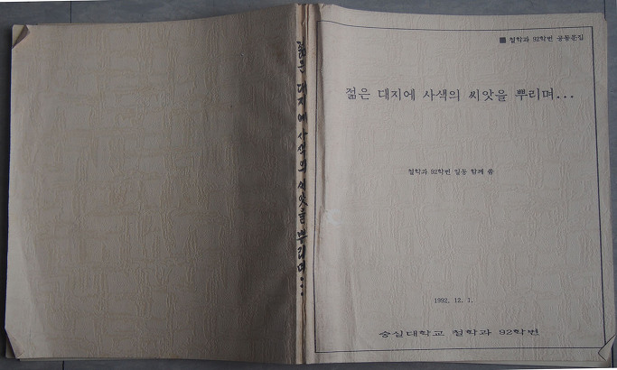
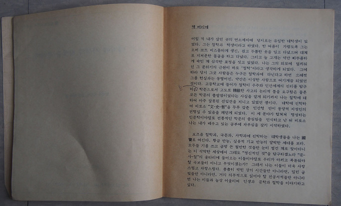
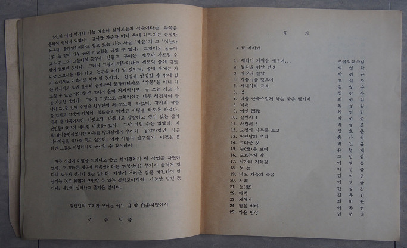
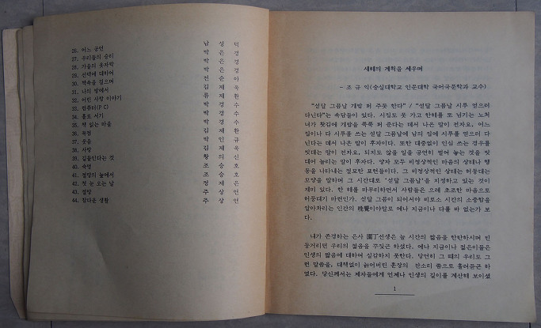
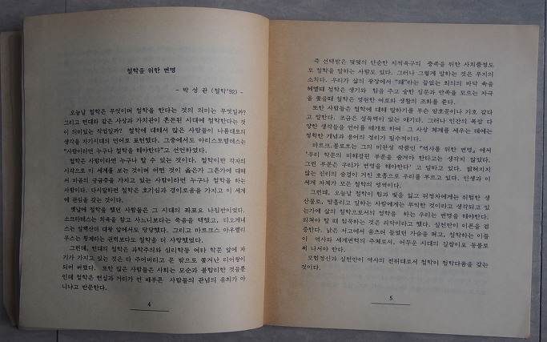

갑작스런 시간여행

요즘 따라 이른 새벽에 눈이 떠진다.

잠들기 전에 마무리하려고 가져 온 원고를 가방에서 꺼내지도 않은 채 잠들었을 때, 서재 어딘가에 있을 책을 찾아야겠다고 마음먹고 왔으면서도 늘 그러하듯 ‘무책임하게 내일 아침으로 미루고’ 잠들었을 때, 더욱 그렇다.

새벽 3시나 넘었을 무렵. 서재로 넘어가 책장을 짚어가던 중, 웬 작고 허름한 책자 하나가 손에 잡혔다. “젊은 대지에 사색의 씨앗을 뿌리며...”라는 그럴싸한 제목과 “철학과 92학번 일동 함께 씀/1992. 12. 1.”이 명기된 수제(手製) 소책자였다. 순간 25년 전으로의 시간 여행이 시작되었다.

1992년은 숭실 부임 5년째인 병아리 교수 시절이었다. 필수 과목 교양국어와 작문을 국문과 교수와 강사들이 전담하던 당시였다. 그 해 2학기에 나는 철학과 1학년생들의 작문을 맡고 있었다. 참 해맑고 순수한 그들이 좋았다. 철학과 학생들이어서 그랬을까. 글쓰기의 요령도 척척 터득해 나갔다. 말을 걸어도 요즘 학생들처럼 쭈뼛거리지 않았던 것 같다. 자신들의 삶과 공부에 대한 자신감을 갖고 있어서였을까.

학기 내내 써온 글들을 발표하고 비평하게 하니, 그들의 글과 말이 일취월장했다. 전공과목보다도 가르치는 재미가 쏠쏠했다. 그래서 한 발 더 나아가 수필 한 두 편씩을 쓰게 했다. 그 글들 또한 재미있었다. 그냥 묻어버리기 아까워서 한데 묶었고, 한 부씩 나눠 가졌다. 그로부터 25년 동안 내 기억 속에서 감쪽같이 사라져 버렸다가 지금 ‘뿅!’하고 내 눈앞에 나타난 것이다.

멋쩍은 일이지만, 내 과거에 대하여 감동한 건 처음이다. 그래서 종이 한 장 버리지 못할 때가 많다. 숨 쉬기 어려워질 때마다 몇 아름씩 내보내긴 하지만, 가슴이 미어지는 건 어쩔 수 없다. 그런데, 이 책자는 고맙게도 살아남아 있었다. 혹시 모르니, 내 머리말과 권두수필(<새해의 계획을 세우며...>)을 이곳에 옮겨 놓기로 한다.

책머리에

어릴 적 내가 살던 곳의 면소재지에 당시로서는 유일한 대학생이 있었다. 그는 철학과에 다닌다고 하였다. 한 여름이 가깝도록 그는 오버코트 비스름하게 생긴, 검고 두툼한 옷을 입고 다녀서인지, 대체로 지저분한 몰골을 면치 못했다. 그리고 늘 고개는 약간 삐뚜름하게 숙인 채 자못 심각한 표정을 짓고 있기 일쑤였다. 나는 그의 외모에 덮씌워진 그 분위기의 근원이 바로 ‘철학’이라고 생각하게 되었다. 당연히 당시 그곳 사람들도 누구든 철학과에 다닌다고 하면 으레 현실과는 동떨어졌거나 약간은 이상한 사람으로 여겼다.

고등학교에 들어가서야 철학이 우주와 인간세계의 진리를 탐구하는 학문으로서 고도로 정치(精緻)한 사고와 논리적 틀을 요구하는 학문임을 알게 되었다. 따라서 그것이 모든 학문의 출발점이기도 했음을 알게 되기까지 나는 철학에 대하여 아주 잘못된 생각을 갖고 있었던 셈이다.

대학에 진학하여 비로소 ‘문-사-철’을 두루 갖춘 인간 형 만이 지성인의 전형일 수 있음도 알게 되었다. 이 세 분야가 합쳐져 형성하는 인문학이야말로 전통 학문의 중심임을 인식하고 난 뒤 비로소 나는 내가 배우고 있는 공부에 자부심을 갖기 시작했다.

요즈음 철학과, 국문과, 사학과에 진학하는 대학생들을 나는 국보(國寶)로 여긴다. 황금 만능, 실용적 기교 만능의 얄팍한 세태를 보라. 모두들 기를 쓰고 금방 돈 될 만한 것들만 찾아다니는 이 삭막한 세상에서 그래도 ‘정신적인 것’을 탐구하겠노라 ‘문사철’의 울타리에 들어오는 이들이야말로 우리가 아끼고 북돋워야 할 국보들이 아니고 무엇이겠는가. 그래서 나는 이들이 더욱 사랑스럽고 자랑스럽다. 촘촘히 박힌 강의 시간들만 아니라면, 밀린 글 빚들만 아니라면, 거의 의무적으로 읽어야 할 전공서적들만 아니라면, 나는 이들과 늘상 어울리며 인생과 문학과 철학을 이야기하고 싶다.

우연히 이번 학기에 나는 애송이 철학도들과 작문이라는 과목을 통하여 만나게 되었다. 글이란 가슴과 머리 속에 파도치는 순정한 욕구의 흘러넘침이라고 믿고 있는 나로서는 사실 ‘작문’의 그 ‘짓는다’(作)는 말을 매우 싫어한다. 그럼에도 불구하고 나는 그저 그들에게 문장을 ‘만들고, 꾸미는’ 재주나 가르칠 수밖에 없었던 것이다. 그러나 그들이 대학이라는 제도의 틀에 갇힌 이상 보고서를 내야하고 논문을 써야 할 것이며, 졸업 후에는 자기 소개서도 이력서도 써야 할 것이다. 현실을 인정할 수밖에 없는 처지이고 보면 단순히 손재주에 불과하더라도 ‘작문’을 아니 가르칠 수 없는 터이렷다? 그래서 울며 겨자 먹기로 글 쓰는 기교만을 가르쳐온 것이다.

그러나 그것으로 그치기에는 너무 허전하여 끝나기 2, 3주 전에 수필을 한두 편씩 써 오도록 하였다. 각자의 작품을 읽히고, 동료들로 하여금 비평하게 하였다. 비록 덜 다듬어지긴 하였으되, 나름대로 발랄하고 생기 있는 삶의 편린들이었으며 예리한 비평들이었다. 그냥 버릴 수 없었다. 비록 잠시 동안이었지만 아늑한 강의실에서 우리가 공감했던 작은 이야기들을 하나로 묶고 싶었다. 아마 다른 친구들도 이것을 읽는다면, 그들 또한 마찬가지로 공감할 수 있으리라.

자주 싱겁게 이빨을 드러내고 웃는 최지환이가 이 작업을 자원하였다. 그 깡마른 체구에 킥복싱이라는 엄청난 무기가 숨겨져 있다니, 도무지 믿기지 않는 일이다. 이렇게 어려운 일을 자진하여 맡는다는 것도 이해(利害)에 초연할 수 있는 철학도이기에 가능한 일일 것이다. 대단히 상쾌하고 즐거운 일이다.

임신년의 꼬리가 보이는 어느 날 밤 백규서옥(白圭書屋)에서

조규익 씀

\*\*\*\*\*\*\*\*\*\*\*\*\*\*\*\*\*\*\*\*\*\*\*

새해의 계획을 세우며

“섣달 그믐날 개밥 퍼 주듯 한다”, “섣달 그믐날 시루 얻으러 다닌다”는 속담들이 있다. 시집도 못 가고 한 해를 또 넘기는 노처녀가 홧김에 개밥을 푹푹 퍼 준다는 데서 나온 말이 전자요, 어느 집이나 다 시루를 쓰는 섣달 그믐날에 남의 집에 시루를 얻으러 다닌다는 데서 나온 말이 후자다. 또한 대중없이 인심 쓰는 경우를 빗대는 말이 전자요, 되지도 않을 일을 공연히 벌여 놓는 것을 빗대어 놀리는 말이 후자다. 양자 모두 비정상적인 마음의 상태나 행동을 나타내는 절묘한 표현들이다. 그 비정상적인 상태는 허둥대는 모양을 말하며 그 시간대로 ‘섣달 그믐날’을 지정하고 있는 것이 재미있다. 한 해를 마무리하면서 사람들은 으레 초조한 마음으로 허둥대기 마련인가. 섣달 그믐날이 되어서야 비로소 시간의 소중함을 알아차리는 인간의 만각(晩覺)이야말로 예나 지금이나 다를 바 없는가 보다.

내가 고등학교 시절 존경하던 은사 원정(園丁) 선생은 늘 시간의 짧음을 한탄하시며 빈둥거리던 우리의 젊음을 꾸짖곤 하셨다. 예나 지금이나 젊은이들은 인생의 짧음에 대하여 실감하지 못한다. 당연히 그 때의 우리도 그런 말씀을, 대책 없이 늙어버린 훈장의 잔소리 쯤으로 흘려듣곤 하였다. 당신께서는 제자들에게 언제나 인생의 길이를 계산해 보이셨다. 여기서 인생의 길이란 물리적 시간 혹은 생물학적 수명을 말하는 것은 아니다. 적어도 동물과 구별되는 정신적 존재로서의 인간이 가치를 창조하고, 비록 하잘 것 없다 해도 나름대로의 기념비를 세우는 데 사용할 수 있는 시간의 길이를 뜻한다. 물론 억지를 쓰자면 자식들을 남기는 것도 하나의 훌륭한 기념비가 아니냐고 강변할 수는 있을 것이다. 그러나 그 일이야 누군들 못하랴. 일생 동안 이룬 일이 그것뿐이라면, 너무 허무하지 않겠는가.

한 인간의 수명을 어림잡아 70이라 하자. 20까지는 아직 경제적으로나 정신적으로 독립하지 못한 채 부모에게 의지해 살아가는 기간이고, 60에서 70까지의 10년 역시 삶의 현장으로부터 은퇴하여 죽음을 준비하는 기간이니 70의 수명에서 30을 빼면 40년 정도가 독립적인 자기의식을 기반으로 가치 창조를 향해 뛸 수 있는 시간이다. 그러나 이 가운데서 반 정도는 잠 자는 시간이니 이것을 빼면 20년이 남는다. 그것뿐이랴. 밥 먹는 시간, 변소 가는 시간, 남을 물고 헐뜯으며 쓸 데 없이 낭비하는 시간 등이 줄잡아도 하루의 삼분지일은 될 것이니 이것을 빼면 겨우 13년 정도 남게 된다. 다시 말하여 우리가 가치 창조를 위해 쓸 수 있는 시간, 우리의 삶에서 정채(精彩) 있는 시간이 우리의 일생 중 겨우 10년 남짓밖에는 안 된다는 것이다. 그러니 우리가 살고 있는 매 순간이 너무도 소중하지 않은가. 벽시계의 초침은 종착역을 향해 숨 막히게 재깍거리는데 아직도 눈앞의 캔버스에는 밑그림조차 그리지 못하고 있다. 무슨 기념비를 세울 것인가에 대하여 생각도 못해 본 채 끝내버리는 것이 우리 장삼이사들의 삶이라고 체념해야 할 것인지.

열두 해 만에 찾아 온 원숭이가 기엄기엄 고개 마루를 넘으려 한다. 지난 섣달 그믐날에 밤을 밝히며 긁적거려 두었던 새해의 계획표가 뽀얀 먼지만 뒤집어 쓴 채 널브러져 있는 것이 올해라고 다를 리 없다. 기어코 고놈의 기념비라는 것을 윤곽만이라도 잡아 볼 게라고 설치던 정초의 오연한 패기는 칠팔월 땡볕에 엿가락 늘어지듯 우습게 되어 버렸고, 아득한 피로만이 백중사리 밀물 마냥 밀려든다. 괜히 마음으로만 바쁠 뿐 무엇 하나 손에 잡히지 않는 것이다. 그래서 옛 어른들도 이 때 쯤에는 큰 욕심 부리지 않고 화롯불 옆에서 책을 읽거나 세한도(歲寒圖)를 치면서 마음들을 가다듬은 게 아니었을까? 아니면 그렇게 책을 읽거나 화폭을 어루만지며 묵은해를 돌이켜 보고 새해로 넘어가기 위한 원기를 모은 것은 아니었을까?

섣달 그믐날, 한 해의 계획을 점검하며 흡족해 하는 이가 그 얼마이겠는가. 아마 대개는 이것들을 다음 해로 넘겨야 하는 마음 무거움을 경험하는 경우가 태반이 넘을 것이다. 조율만 계속하다가 제대로 된 연주 한 번 해보지 못하고 마는 이야기 속의 주인공처럼, 나 역시 계획과 다짐은 수없이 하면서 정작 실행은 못하고 말지도 모른다. 10년 남짓 허여된 가치 창조의 시간대를 헛되이 까먹으면서도 결국 그 기념비의 내용이 무엇인지 깨닫지 못하고 말지도 모른다. 그러니 계획을 세운다는 일이 무의미하거나 허망할 수도 있다. 그러나 그렇게 될 것이 뻔하다 해도 내가 살아 있는 한 어찌 계획 없이 새해를 맞을 수 있으랴! 도로 굴러 내려올 줄을 알면서도 산꼭대기로 돌을 굴려 올리는 일을 계속할 수밖에 없던, 신화 속의 시지프스처럼 나 역시 그럴 수밖에 없는 것은 내가 분명 살아 있는 존재이기 때문이다.

지금 나는 세밑의 피곤한 몸을 추스르며 다시 먼지나 뽀얗게 뒤집어 쓸 것이 뻔한 새해 계획표를 끄적거리는 중이다.

공유하기

게시글 관리

**백규서옥\_Blog ver.**

[저작자표시 비영리 변경금지
(새창열림)](https://creativecommons.org/licenses/by-nc-nd/4.0/deed.ko)